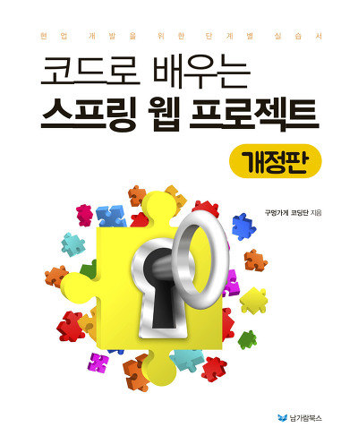

# Today I Learned(TIL)
> 오늘 배운, 알게 된, 학습한 내용을 정리해두는 저장소  
> 이해한 만큼만 직접 작성하다.

## 강의내용정리

* [자바 프로그래밍 입문 강좌 - 강의내용정리]()

## Books 책내용정리

<table text-align="center">
    <tr>
        <td width="30%">
        <a href="index/spring/guguSpring.md"></img></a>
* [코드로 배우는 스프링 웹 프젝(개정판))](index/spring/guguSpring.md)
        </td>
        <td width="30%">
        </td>
    </tr>
</table>

