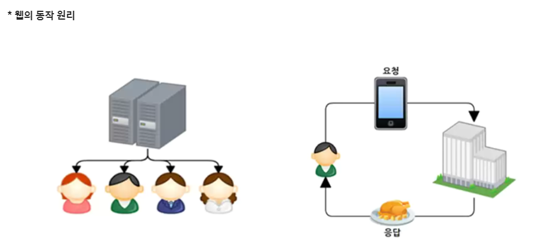

# 1교시

## 수업은 어떻게 진행되는가?

### JSP - Product, Book 쇼핑몰을 만들어보면서 JSP 기능 및 CRUD 익히기

### SPRING1 : Book 게시판 만들어보기

### SPRING2 : 스프링 프레임워크를 사용하기 위한 설정, CRUD 및 다양한 기술들 알아보기

## 공부는 어떻게 하나요?

### 반복은 학습의 기본

1. 수업
2. 예제 및 실습
3. 연습문제 및 실습
4. 응용 및 시간투자
    - 기능을 추가해보고 활용해보기

**※ 추구하는 목표 달성**

- 계획성을 갖고 실천하기

> **노력을 이기는 재능은 없고, 노력을 외면하는 결과도 없다.** - 이창호
> 

## 인터페이스 - 참조받아서 사용

결합도를 낮추기 위해서 사용

일종의 추상 클래스지만, 추상화 정도가 높아서 오직 **추상 메서드와 상수만**을 멤버로 가질 수 있다.

1. 대규모 프로젝트 개발 시 일관되고 정형화된 개발을 위한 표준화가 가능합니다.
2. 클래스의 작성과 인터페이스의 구현을 동시에 진행할 수 있으므로, 개발 시간을 단축할 수 있습니다.
3. 클래스와 클래스 간의 관계를 인터페이스로 연결하면, 클래스마다 독립적인 프로그래밍이 가능합니다.

## 컬렉션 프레임워크

### Set - HashSet

- **무지개 색깔의 구슬이 들어있는 구슬주머니(로또 추첨기라고 보면 된다.)**
- 중복 값을 허용하지 않고, 값 자체가 Key의 역할을 한다.
- 순서가 없다.
- **while(hasNext())** : 구슬 주머니에 손을 집어넣는 행위

### Map - HashMap

- Key, value
- ex) 306호에 속해있는 나자신

### List - ArrayList

- 출석부

## MVC패턴

### 컨트롤러

- 페이지 정보를 리턴
- 클라이언트로부터 들어온 요청을 해석하고, 적절한 서비스나 비즈니스 로직을 호출하여 응답을 생성합니다.

### 서비스

- 비즈니스 로직(Java 소스) 담당
- 주처리 기능

### DAO

- DB연결
- 데이터 담당

### DB

- 데이터베이스를 저장하는 역할

⇒ MVC 패턴을 이용한 프로그래밍 구조를 반드시 알아두어야 한다.

## 웹과 JSP 프로그래밍 이해하기

세션, 쿠키, 보안, 네트워크에 대해서 알아야 함

메모리는 자바 영역에서 자동으로 처리해줌



# 2교시

## 가장 널리 쓰이는 웹서버

- 아파치 톰캣

## 정적 웹 페이지 vs 동적 웹 페이지

### 정적 웹 페이지 : html , css, javascript, 미디어파일, 문서

### 동적 웹 페이지 : jsp, php, asp

## JSP의 특징

- JSP는 서블릿 기술의 확장
    - 내가 작성한 JSP 코드가 자바코드로 해석된 후 리로딩되면서 반영됨
- JSP는 유지 관리가 용이
- JSP는 빠른 개발이 가능
- JSP로 개발하면 코드 길이를 줄일 수 있음

## JSP 페이지의 처리과정


## JSP 생명 주기

- JSP 요청 ⇒ 번역 ⇒ 컴파일 ⇒ 로딩 및 초기화 ⇒ 실행 ⇒ 소멸


## JSP 개발 환경

- 자바 개발환경 : JDK
- 웹서버 : 톰캣
- 통합 개발 환경 : 이클립스

## JRE와 JDK 차이

*Java로 프로그램을 직접 개발하려면 JDK가 필요하고 Java로 만들어진 프로그램을 실행시키려면 JRE가 필요합니다.*

**JRE** : 개발 환경만 제공, 개발 도구가 없다.

**JDK** : 개발 환경 + 개발 도구

## 이클립스 환경설정 순서

한글깨짐방지을 위한 **인코딩(UTF-8) 설정** → **폰트 변경** → **JDK 변경** → **톰캣 설정**


프로젝트를 생성하면 젤 처음 루트는 프로젝트명으로 시작함

## 컨텍스트 PATH 변경


웹서버가 사용하는 포트 번호는 80포트로 정해져 있으며 **URL에서 HTTP 프로토콜로 접속 시 포트번호를 생략하면 자동으로 80포트로 인식**하므로 80포트를 생략할 수 있다. 80포트 이외의 포트 번호를 웹서버에 할당했을 때는 반드시 URL에 명시해주어야 정상으로 접속된다.

보통 프로젝트 규모가 클 경우 시작되는 시간이 오래 걸리므로 여유있게 **TIMEOUTS은 120초(2분)로 변경해준다.**

- 타임아웃은 서버가 시작될 때 몇 초 내에 시작이 안 되면 시작 실패라고 간주하므로 넉넉하게 2분으로 설정해주는거다.


웹 경로는 톰캣이 실행되는 웹 루트 디렉터리를 말한다. 이클립스에서 프로젝트에 톰캣을 연동하면 `/프로젝트 이름` 형식을 기본값으로 연동된다. 대부분의 웹사이트는 `/` 경로부터 시작하므로 `/프로젝트 이름` 웹 경로를 최상위 경로인 `/`로 변경해준다.

# 3교시


## webContent와 WEB-INF 차이점

- **webContent** : 정적으로 관리해야 할 요소들만 넣으면 됨
    - 브라우저를 통해서 접근 가능한 리소스들(미디어파일들, CSS파일)
    - 웹 애플리케이션의 컨텍스트 루트 디렉토리에 해당
- **WEB-INF** : 동적으로 처리하는 페이지들을 넣어두면 됨
    - 브라우저를 통해서 접근이 불가능한 웹 애플리케이션 핵심정보들을 포함하고 있음

**모델1 방식** : JSP 파일

**모델2 방식** : JSP 파일 + 서블릿

**N-TIER구조** : 스프링 MVC

## 스크립트 태그

### 선언 태그


- 해당 JSP 페이지의 모든 스크립트 태그가 참조할 수 있는 **전역변수**가 된다.
    - 해당 JSP 페이지의 어느 위치에서도 참조할 수 있다.
- 각 행은 반드시 세미콜론으로 끝나야 한다.

### 주석 태그


- HTML 주석을 사용하면 그 안에 포함된 표현문 태그와 스크립틀릿 태그가 모두 컴파일된다.
- JSP 주석일 경우 주석문 안에 포함된 코드를 모두 무시한다.

### 스크립트릿 태그


- 이 태그에 선언된 변수는 **지역변수**가 되므로 스크립틀릿 태그 내에서만 사용할 수 있다.
- 스크립틀릿 태그 내의 마지막 행은 반드시 세미콜론으로 종료해야 한다.

### 표현식 태그


- 모든 자바 코드의 값은 문자열로 변환되어 웹 브라우저에 출력된다.
    - 기본 데이터 타입은 `toString()` 을 통해 출력된다.

### 실습예제01 - [scripting.jsp] 소스

```html
<%@ page language="java" contentType="text/html; charset=UTF-8"
    pageEncoding="UTF-8"%>
<!DOCTYPE html>
<html>
<head>
<meta charset="UTF-8">
<title>Insert title here</title>
</head>
<body>
	<%!
		// 선언문 태그를 사용하여 자바 변수와 메소드 정의
		int count = 3;
	
		String makeItLower(String data) {
			return data.toLowerCase();
		}
	%>
	<%
		// 스크립트릿 태그로 자바 로직 코드 작성
		for(int i = 1; i <= count; i++) {
			out.println("Java Server pages " + i + "<br/>");
		}
	%>
	<!-- 표현문 태그로 선언문의 메소드를 호출하여 문자열 형태로 출력 -->
	<%= makeItLower("Hello World!") %>
</body>
</html>
```

### 실행결과


## [index.jsp] 소스

```html
<%@ page language="java" contentType="text/html; charset=UTF-8"
    pageEncoding="UTF-8"%>
<!DOCTYPE html>
<html class="no-js" lang="zxx">

<head>
    <meta charset="utf-8" />
    <meta http-equiv="x-ua-compatible" content="ie=edge" />
    <title>ClassiGrids - Classified Ads and Listing Website Template.</title>
    <meta name="description" content="" />
    <meta name="viewport" content="width=device-width, initial-scale=1" />
    <link rel="shortcut icon" type="image/x-icon" href="/resources/assets/images/favicon.svg" />

    <link
        href="https://fonts.googleapis.com/css2?family=Jost:ital,wght@0,100;0,200;0,300;0,400;0,500;0,600;0,700;0,800;0,900;1,100;1,200;1,300;1,400;1,500;1,600;1,700;1,800;1,900&display=swap"
        rel="stylesheet">
    <link href="https://fonts.googleapis.com/css2?family=Lato&display=swap" rel="stylesheet">

    <link rel="stylesheet" href="/resources/assets/css/bootstrap.min.css" />
    <link rel="stylesheet" href="/resources/assets/css/LineIcons.2.0.css" />
    <link rel="stylesheet" href="/resources/assets/css/animate.css" />
    <link rel="stylesheet" href="/resources/assets/css/tiny-slider.css" />
    <link rel="stylesheet" href="/resources/assets/css/glightbox.min.css" />
    <link rel="stylesheet" href="/resources/assets/css/main.css" />

</head>

<body>
    <div class="preloader">
        <div class="preloader-inner">
            <div class="preloader-icon">
                <span></span>
                <span></span>
            </div>
        </div>
    </div>

	<section class="hero-area overlay">
		<div class="container">
            <div class="row">
				<div class="col-lg-10 offset-lg-1 col-md-12 col-12">
                    <div class="hero-text text-center">
						<div class="">
                            <h2 class="wow fadeInUp" data-wow-delay=".3s">대덕인재개발원 JSP</h2>
							<p class="wow fadeInUp" data-wow-delay=".5s">ch01 - ch18장까지 공부하면서 JSP에 대해서 자세하게 알아봅시다</p>
                        </div>
                    </div>
                </div>
			</div>
		</div>
	</section>

    <!-- Start Categories Area -->
    <section class="categories">
        <div class="container">
            <div class="cat-inner">
                <div class="row">
                    <div class="col-12 p-0">
                        <div class="category-slider">
                            <a href="category.html" class="single-cat">
                                <div class="icon">
                                    
                                </div>
                                <h3>ch01</h3>
                                <h5 class="total">0</h5>
                            </a>
                        </div>
                    </div>
                </div>
            </div>
        </div>
    </section>

    <section class="items-grid section custom-padding">
        <div class="container">
            <div class="row">
                <div class="col-12">
                    <div class="section-title">
                        <h2 class="wow fadeInUp" data-wow-delay=".4s">INDEX</h2>
                    </div>
                </div>
            </div>
            <div class="single-head">
                <div class="row">
                    <div class="col-lg-4 col-md-6 col-12">
                        <!-- Start Single Grid -->
                        <div class="single-grid wow fadeInUp" data-wow-delay=".4s">
                            <div class="image">
                                <a href="item-details.html" class="thumbnail"></a>
                                <div class="author">
                                    <div class="author-image">
                                        <a href="javascript:void(0)">
                                            <span>DDIT</span></a>
                                    </div>
                                </div>
                                <p class="item-position"><i class="lni lni-bolt"></i> CH01</p>
                            </div>
                            <div class="content">
                                <div class="top-content">
                                    <a href="javascript:void(0)" class="tag">CH01</a>
                                    <h3 class="title">
                                        <a href="item-details.html">Ch01. JSP 개요</a>
                                    </h3>
                                    <p class="update-time">welcome.jsp</p>
                                </div>
                                <div class="bottom-content">
                                    <button class="btn btn-primary">더보기</button>
                                </div>
                            </div>
                        </div>
                    </div>

                </div>
            </div>
        </div>
    </section>

    <footer class="footer">
        <div class="footer-bottom">
            <div class="container">
                <div class="inner">
                    <div class="row">
                        <div class="col-12">
                            <div class="content">
                                <p class="copyright-text">대덕인재개발원 JSP</a>
                                </p>
                            </div>
                        </div>
                    </div>
                </div>
            </div>
        </div>
    </footer>

    <a href="#" class="scroll-top btn-hover">
        <i class="lni lni-chevron-up"></i>
    </a>

    <script src="/resources/assets/js/bootstrap.min.js"></script>
    <script src="/resources/assets/js/wow.min.js"></script>
    <script src="/resources/assets/js/tiny-slider.js"></script>
    <script src="/resources/assets/js/main.js"></script>
    <script type="text/javascript">
        tns({
            container: '.category-slider',
            items: 3,
            slideBy: 'page',
            autoplay: false,
            mouseDrag: true,
            gutter: 0,
            nav: false,
            controls: true,
            controlsText: ['<i class="lni lni-chevron-left"></i>', '<i class="lni lni-chevron-right"></i>'],
            responsive: {
                0: {
                    items: 1,
                },
                540: {
                    items: 2,
                },
                768: {
                    items: 4,
                },
                992: {
                    items: 5,
                },
                1170: {
                    items: 6,
                }
            }
        });
    </script>
</body>

</html>
```

## 실행결과


# 4교시

## [IndexVO.java] 소스

```java
package kr.or.ddit.index;

import java.util.List;

public class IndexVO {
	private String chapter;
	private String title;
	private String chapterMoveUrl;
	private List<String> sourceList;
	
	public String getChapter() {
		return chapter;
	}
	
	public void setChapter(String chapter) {
		this.chapter = chapter;
	}
	
	public String getTitle() {
		return title;
	}
	
	public void setTitle(String title) {
		this.title = title;
	}
	
	public String getChapterMoveUrl() {
		return chapterMoveUrl;
	}
	
	public void setChapterMoveUrl(String chapterMoveUrl) {
		this.chapterMoveUrl = chapterMoveUrl;
	}
	
	public List<String> getSourceList() {
		return sourceList;
	}
	
	public void setSourceList(List<String> sourceList) {
		this.sourceList = sourceList;
	}
}
```

## [IndexRepository.java] 소스

```java
package kr.or.ddit.index;

import java.util.ArrayList;
import java.util.List;

public class IndexRepository {
	private List<IndexVO> indexList = new ArrayList<IndexVO>();
	
	private static IndexRepository instance = null;
	
	// 싱글톤 패턴 적용
	public static IndexRepository getInstance() {
		if(instance == null) {
			instance = new IndexRepository();
		}
		return instance;
	}
	
	private IndexRepository() {
		// 챕터 정보들
		String[] chapters = {
				"CH01", "CH02", "CH03", "CH04", "CH05", "CH06", "CH07",
				"CH08", "CH10", "CH11", "CH12", "CH13", "CH14", "CH17"
		};
		
		// 각 챕터의 제목들
		String[] titles = {
				"CH01. JSP 개요",
				"CH02. 스크립트 태그",
				"CH03. 디렉티브 태그",
				"CH04. 액션태그",
				"CH05. 내장객체",
				"CH06. 폼 테크",
				"CH07. 파일 업로드",
				"CH08. 유효성 검사",
				"CH10. 시큐리티",
				"CH11. 예외처리",
				"CH12. 필터",
				"CH13. 세션",
				"CH14. 쿠키",
				"CH17. 태그 라이브러리"
		};
		
		// 각 챕터의 이동 URL
		String[] chapterMoveUrls = {
				"/welcome.jsp"
				, "/ch02/scripting.jsp"
				, "/ch03/"
				, "/ch04/"
				, "/ch05/"
				, "/ch06/"
				, "/ch07/"
				, "/ch08/"
				, "/ch10/"
				, "/ch11/"
				, "/ch12/"
				, "/ch13/"
				, "/ch14/"
				, "/ch17/"
		};
		
		// 각 챕터의 소스 파일명들
		String[][] sourceArr = {
				{						// ch01				
					"welcome.jsp"
				},
				{						// ch02				
					"scripting.jsp",
					"declaration01.jsp"
				},
				{						// ch03				
					""
				},
				{						// ch04				
					""
				},
				{						// ch05				
					""
				},
				{						// ch06				
					""
				},
				{						// ch07				
					""
				},
				{						// ch08				
					""
				},
				{						// ch10				
					""
				},
				{						// ch11				
					""
				},
				{						// ch12				
					""
				},
				{						// ch13				
					""
				},
				{						// ch14				
					""
				},
				{						// ch17				
					""
				},
		};
		
		// 최종 indexList에 추가
		for(int i = 0; i < chapters.length; i++) {
			IndexVO IndexVO = new IndexVO();
			IndexVO.setChapter(chapters[i]);
			IndexVO.setTitle(titles[i]);
			IndexVO.setChapterMoveUrl(chapterMoveUrls[i]);
			
			List<String> sourceList = new ArrayList<String>();
			for(int j = 0; j < sourceArr[i].length; j++) {
				sourceList.add(sourceArr[i][j]);
			}
			IndexVO.setSourceList(sourceList);
			indexList.add(IndexVO);
		}
	}
	
	public List<IndexVO> getIndexList() {
		return indexList;
	}
}
```

## [index.jsp] 소스

```html
<%@page import="kr.or.ddit.index.IndexVO"%>
<%@page import="java.util.List"%>
<%@page import="kr.or.ddit.index.IndexRepository"%>
<%@ page language="java" contentType="text/html; charset=UTF-8"
    pageEncoding="UTF-8"%>
<!DOCTYPE html>
<html class="no-js" lang="zxx">

<head>
    <meta charset="utf-8" />
    <meta http-equiv="x-ua-compatible" content="ie=edge" />
    <title>ClassiGrids - Classified Ads and Listing Website Template.</title>
    <meta name="description" content="" />
    <meta name="viewport" content="width=device-width, initial-scale=1" />
    <link rel="shortcut icon" type="image/x-icon" href="/resources/assets/images/favicon.svg" />

    <link
        href="https://fonts.googleapis.com/css2?family=Jost:ital,wght@0,100;0,200;0,300;0,400;0,500;0,600;0,700;0,800;0,900;1,100;1,200;1,300;1,400;1,500;1,600;1,700;1,800;1,900&display=swap"
        rel="stylesheet">
    <link href="https://fonts.googleapis.com/css2?family=Lato&display=swap" rel="stylesheet">

    <link rel="stylesheet" href="/resources/assets/css/bootstrap.min.css" />
    <link rel="stylesheet" href="/resources/assets/css/LineIcons.2.0.css" />
    <link rel="stylesheet" href="/resources/assets/css/animate.css" />
    <link rel="stylesheet" href="/resources/assets/css/tiny-slider.css" />
    <link rel="stylesheet" href="/resources/assets/css/glightbox.min.css" />
    <link rel="stylesheet" href="/resources/assets/css/main.css" />

</head>

<body>
	<%
		// 싱글톤 패턴 적용
		IndexRepository dao = IndexRepository.getInstance();
		List<IndexVO> indexList = dao.getIndexList();
	%>

    <div class="preloader">
        <div class="preloader-inner">
            <div class="preloader-icon">
                <span></span>
                <span></span>
            </div>
        </div>
    </div>

	<section class="hero-area overlay">
		<div class="container">
            <div class="row">
				<div class="col-lg-10 offset-lg-1 col-md-12 col-12">
                    <div class="hero-text text-center">
						<div class="">
                            <h2 class="wow fadeInUp" data-wow-delay=".3s">대덕인재개발원 JSP</h2>
							<p class="wow fadeInUp" data-wow-delay=".5s">ch01 - ch18장까지 공부하면서 JSP에 대해서 자세하게 알아봅시다</p>
                        </div>
                    </div>
                </div>
			</div>
		</div>
	</section>

    <section class="categories">
        <div class="container">
            <div class="cat-inner">
                <div class="row">
                    <div class="col-12 p-0">
                        <div class="category-slider">
                    	<%
                    		for(int i = 0; i < indexList.size(); i++) {
                    			IndexVO index = indexList.get(i);
                    	%>
                            <a href="category.html" class="single-cat">
                                <div class="icon">
                                    
                                </div>
                                <h3><%=index.getChapter() %></h3>
                                <h5 class="total"><%=index.getSourceList().size() %></h5>
                            </a>
                    	<%
                    		}
                    	%>
                        </div>
                    </div>
                </div>
            </div>
        </div>
    </section>

    <section class="items-grid section custom-padding">
        <div class="container">
            <div class="row">
                <div class="col-12">
                    <div class="section-title">
                        <h2 class="wow fadeInUp" data-wow-delay=".4s">INDEX</h2>
                    </div>
                </div>
            </div>
            <div class="single-head">
                <div class="row">
                	<%
                		for(int i = 0; i < indexList.size(); i++) {
                			IndexVO index = indexList.get(i);
                	%>

                    <div class="col-lg-4 col-md-6 col-12">
                        <!-- Start Single Grid -->
                        <div class="single-grid wow fadeInUp" data-wow-delay=".4s">
                            <div class="image">
                                <a href="item-details.html" class="thumbnail"></a>
                                <div class="author">
                                    <div class="author-image">
                                        <a href="javascript:void(0)">
                                            <span>DDIT</span></a>
                                    </div>
                                </div>
                                <p class="item-position"><i class="lni lni-bolt"></i><%=index.getChapter() %></p>
                            </div>
                            <div class="content">
                                <div class="top-content">
                                    <a href="javascript:void(0)" class="tag"><%=index.getChapter() %></a>
                                    <h3 class="title">
                                        <a href="item-details.html"><%=index.getTitle() %></a>
                                    </h3>
                                    <%
                                    	for(int j = 0; j < index.getSourceList().size(); j++) {
                                    		String sourcePage = index.getSourceList().get(j);
                                    %>
                                    <p class="update-time"><%= sourcePage %></p>
                                    <%
                                    	}
                                    %>
                                </div>
                                <div class="bottom-content">
                                    <button class="btn btn-primary" 
                                    onclick="javascript:location.href='<%= request.getContextPath() + index.getChapterMoveUrl() %>'">더보기</button>
                                </div>
                            </div>
                        </div>
                    </div>
                	<%
                		}
                	%>
                </div>
            </div>
        </div>
    </section>

    <footer class="footer">
        <div class="footer-bottom">
            <div class="container">
                <div class="inner">
                    <div class="row">
                        <div class="col-12">
                            <div class="content">
                                <p class="copyright-text">대덕인재개발원 JSP</a>
                                </p>
                            </div>
                        </div>
                    </div>
                </div>
            </div>
        </div>
    </footer>

    <a href="#" class="scroll-top btn-hover">
        <i class="lni lni-chevron-up"></i>
    </a>

    <script src="/resources/assets/js/bootstrap.min.js"></script>
    <script src="/resources/assets/js/wow.min.js"></script>
    <script src="/resources/assets/js/tiny-slider.js"></script>
    <script src="/resources/assets/js/main.js"></script>
    <script type="text/javascript">
        tns({
            container: '.category-slider',
            items: 3,
            slideBy: 'page',
            autoplay: false,
            mouseDrag: true,
            gutter: 0,
            nav: false,
            controls: true,
            controlsText: ['<i class="lni lni-chevron-left"></i>', '<i class="lni lni-chevron-right"></i>'],
            responsive: {
                0: {
                    items: 1,
                },
                540: {
                    items: 2,
                },
                768: {
                    items: 4,
                },
                992: {
                    items: 5,
                },
                1170: {
                    items: 6,
                }
            }
        });
    </script>
</body>

</html>
```

## 실행화면


### [뒤로 가기](index.md)