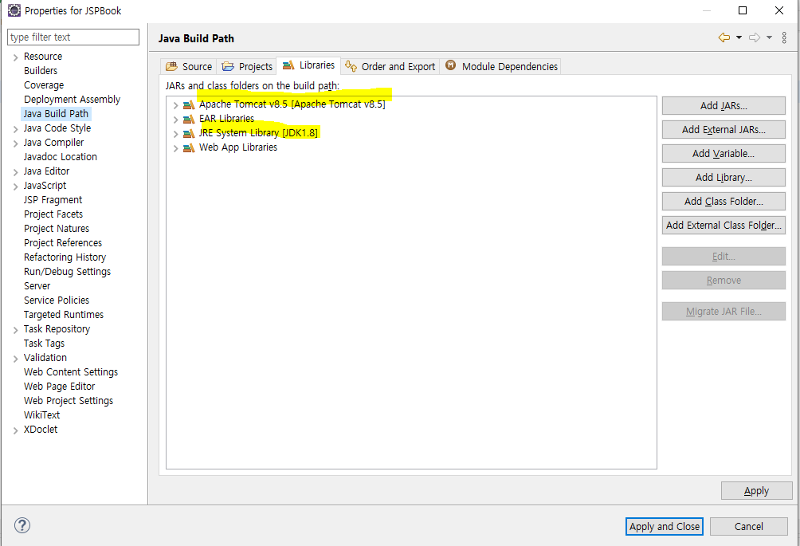

# 1교시

`Alt + Enter` : 프로젝트 기본 환경설정 메뉴가 열림

## 프로젝트 환경 설정 관련

### `Java Build Path` 설정

- JDK 1.8 체크
- 톰캣 8.5 체크
- 메이븐 - 스프링에서 설정



### `Deployment Assembly` 설정

- 메이븐 내용이 추가되어있는지 확인


### `Java Compiler` 설정

- 자바 1.8인지 확인


### `Project Facets` 설정

- 서블릿 버전이 3.1버전인지 확인
- JDK 버전이 1.8인지 확인
- Java 클릭 → `Runtimes탭`에서 `Apache Tomcat 8.5` 체크되어있는지 확인


### ※ 위 설정대로 했는데도 JSP파일에서 빨간줄 오류가 생기면 `Project → Clean`해주면 됨

## 프로젝트 설정


### [box.jsp] 소스 - 각 챕터에 사용할 템플릿

```html
<%@ page language="java" contentType="text/html; charset=UTF-8"
    pageEncoding="UTF-8"%>
<!DOCTYPE html>
<html class="no-js" lang="zxx">
<head>
    <meta charset="utf-8" />
    <meta http-equiv="x-ua-compatible" content="ie=edge" />
    <title>About Us - ClassiGrids Classified Ads and Listing Website Template</title>
    <meta name="description" content="" />
    <meta name="viewport" content="width=device-width, initial-scale=1" />
    <link rel="shortcut icon" type="image/x-icon" href="/resources/assets/images/favicon.svg" />

    <link
        href="https://fonts.googleapis.com/css2?family=Jost:ital,wght@0,100;0,200;0,300;0,400;0,500;0,600;0,700;0,800;0,900;1,100;1,200;1,300;1,400;1,500;1,600;1,700;1,800;1,900&display=swap"
        rel="stylesheet">
    <link href="https://fonts.googleapis.com/css2?family=Lato&display=swap" rel="stylesheet">

    <!-- ========================= CSS here ========================= -->
    <link rel="stylesheet" href="/resources/assets/css/bootstrap.min.css" />
    <link rel="stylesheet" href="/resources/assets/css/LineIcons.2.0.css" />
    <link rel="stylesheet" href="/resources/assets/css/animate.css" />
    <link rel="stylesheet" href="/resources/assets/css/tiny-slider.css" />
    <link rel="stylesheet" href="/resources/assets/css/glightbox.min.css" />
    <link rel="stylesheet" href="/resources/assets/css/main.css" />

</head>

<body>
    <!-- Preloader -->
    <div class="preloader">
        <div class="preloader-inner">
            <div class="preloader-icon">
                <span></span>
                <span></span>
            </div>
        </div>
    </div>

    <div class="breadcrumbs" style="padding-top:40px;">
        <div class="container">
            <div class="row align-items-center">
                <div class="col-lg-6 col-md-6 col-12">
                    <div class="breadcrumbs-content">
                        <h1 class="page-title">JSP 개요</h1>
                    </div>
                </div>
                <div class="col-lg-6 col-md-6 col-12">
                    <ul class="breadcrumb-nav">
                        <li><a href="index.html">INDEX</a></li>
                        <li>CH01</li>
                    </ul>
                </div>
            </div>
        </div>
    </div>

    <section class="about-us section">
        <div class="container">
            <div class="row align-items-center justify-content-center">
                <div class="col-lg-12 col-md-12 col-12">
                    <div class="content-left wow fadeInLeft" data-wow-delay=".3s">
                    
                    </div>
                </div>
            </div>
        </div>
    </section>

    <footer class="footer">
        <div class="footer-bottom">
            <div class="container">
                <div class="inner">
                    <div class="row">
                        <div class="col-12">
                            <div class="content">
                                <p class="copyright-text">대덕인재개발원 JSP</a>
                                </p>
                            </div>
                        </div>
                    </div>
                </div>
            </div>
        </div>
    </footer>

    <a href="#" class="scroll-top btn-hover">
        <i class="lni lni-chevron-up"></i>
    </a>

    <script src="/resources/assets/js/bootstrap.min.js"></script>
    <script src="/resources/assets/js/wow.min.js"></script>
    <script src="/resources/assets/js/tiny-slider.js"></script>
    <script src="/resources/assets/js/glightbox.min.js"></script>
    <script src="/resources/assets/js/count-up.min.js"></script>
    <script src="/resources/assets/js/main.js"></script>
    <script type="text/javascript">
        tns({
            container: '.client-logo-carousel',
            slideBy: 'page',
            autoplay: true,
            autoplayButtonOutput: false,
            mouseDrag: true,
            gutter: 15,
            nav: false,
            controls: false,
            responsive: {
                0: {
                    items: 1,
                },
                540: {
                    items: 3,
                },
                768: {
                    items: 4,
                },
                992: {
                    items: 4,
                },
                1170: {
                    items: 6,
                }
            }
        });
    </script>
</body>

</html>
```

### box.jsp에 있는 내용을 ch02폴더 안에 있는 jsp로 옮기기

### [declaration01.jsp] 소스

```html
<%@ page language="java" contentType="text/html; charset=UTF-8"
    pageEncoding="UTF-8"%>
<!DOCTYPE html>
<html class="no-js" lang="zxx">
<head>
    <meta charset="utf-8" />
    <meta http-equiv="x-ua-compatible" content="ie=edge" />
    <title>About Us - ClassiGrids Classified Ads and Listing Website Template</title>
    <meta name="description" content="" />
    <meta name="viewport" content="width=device-width, initial-scale=1" />
    <link rel="shortcut icon" type="image/x-icon" href="assets/images/favicon.svg" />
    <link href="https://fonts.googleapis.com/css2?family=Jost:ital,wght@0,100;0,200;0,300;0,400;0,500;0,600;0,700;0,800;0,900;1,100;1,200;1,300;1,400;1,500;1,600;1,700;1,800;1,900&display=swap" rel="stylesheet">
    <link href="https://fonts.googleapis.com/css2?family=Lato&display=swap" rel="stylesheet">
    <link rel="stylesheet" href="/resources/assets/css/bootstrap.min.css" />
    <link rel="stylesheet" href="/resources/assets/css/LineIcons.2.0.css" />
    <link rel="stylesheet" href="/resources/assets/css/animate.css" />
    <link rel="stylesheet" href="/resources/assets/css/tiny-slider.css" />
    <link rel="stylesheet" href="/resources/assets/css/glightbox.min.css" />
    <link rel="stylesheet" href="/resources/assets/css/main.css" />
</head>

<body>
    <div class="preloader">
        <div class="preloader-inner">
            <div class="preloader-icon">
                <span></span>
                <span></span>
            </div>
        </div>
    </div>

    <div class="breadcrumbs" style="padding-top:40px;">
        <div class="container">
            <div class="row align-items-center">
                <div class="col-lg-6 col-md-6 col-12">
                    <div class="breadcrumbs-content">
                        <h1 class="page-title">스크립트 태그</h1>
                    </div>
                </div>
                <div class="col-lg-6 col-md-6 col-12">
                    <ul class="breadcrumb-nav">
                        <li><a href="index.html">INDEX</a></li>
                        <li>CH02</li>
                    </ul>
                </div>
            </div>
        </div>
    </div>

    <section class="about-us section">
        <div class="container">
            <div class="row align-items-center justify-content-center">
                <div class="col-lg-12 col-md-12 col-12">
                    <div class="content-left wow fadeInLeft" data-wow-delay=".3s">
						<%!
							// 선언문 태그는 변수나 메소드 등을 선언하는 태그
							// 선언문 태그로 선언된 변수는 서블릿 프로그램으올 변역될 때 클래스 수준의 멤버 변수가
							// 되므로 전역변수로 사용된다.
							
							// 변수 data에 50을 저장하도록 선언문 태그를 선언
							int data = 50;
						%>
						<%
							// out 내장 객체의 println() 메소드를 이용하여 내용을 출력하도록
							// 스크립틀릿 태그를 작성
							// 변수 data는 선언문 태그에 선언된 전역변수 값 50에 해당함
							out.println("Value of the variable is : " + data);
						%>
                    </div>
                </div>
            </div>
        </div>
    </section>

    <footer class="footer">
        <div class="footer-bottom">
            <div class="container">
                <div class="inner">
                    <div class="row">
                        <div class="col-12">
                            <div class="content">
                                <p class="copyright-text">대덕인재개발원 JSP</a>
                                </p>
                            </div>
                        </div>
                    </div>
                </div>
            </div>
        </div>
        <!-- End Footer Middle -->
    </footer>

    <a href="#" class="scroll-top btn-hover">
        <i class="lni lni-chevron-up"></i>
    </a>

    <script src="/resources/assets/js/bootstrap.min.js"></script>
    <script src="/resources/assets/js/wow.min.js"></script>
    <script src="/resources/assets/js/tiny-slider.js"></script>
    <script src="/resources/assets/js/glightbox.min.js"></script>
    <script src="/resources/assets/js/count-up.min.js"></script>
    <script src="/resources/assets/js/main.js"></script>
    <script type="text/javascript">
        tns({
            container: '.client-logo-carousel',
            slideBy: 'page',
            autoplay: true,
            autoplayButtonOutput: false,
            mouseDrag: true,
            gutter: 15,
            nav: false,
            controls: false,
            responsive: {
                0: {
                    items: 1,
                },
                540: {
                    items: 3,
                },
                768: {
                    items: 4,
                },
                992: {
                    items: 4,
                },
                1170: {
                    items: 6,
                }
            }
        });
    </script>
</body>
</html>
```


### [scripting.jsp] 소스

```html
<%@ page language="java" contentType="text/html; charset=UTF-8"
    pageEncoding="UTF-8"%>
<!DOCTYPE html>
<html class="no-js" lang="zxx">
<head>
    <meta charset="utf-8" />
    <meta http-equiv="x-ua-compatible" content="ie=edge" />
    <title>About Us - ClassiGrids Classified Ads and Listing Website Template</title>
    <meta name="description" content="" />
    <meta name="viewport" content="width=device-width, initial-scale=1" />
    <link rel="shortcut icon" type="image/x-icon" href="assets/images/favicon.svg" />
    <link href="https://fonts.googleapis.com/css2?family=Jost:ital,wght@0,100;0,200;0,300;0,400;0,500;0,600;0,700;0,800;0,900;1,100;1,200;1,300;1,400;1,500;1,600;1,700;1,800;1,900&display=swap" rel="stylesheet">
    <link href="https://fonts.googleapis.com/css2?family=Lato&display=swap" rel="stylesheet">
    <link rel="stylesheet" href="/resources/assets/css/bootstrap.min.css" />
    <link rel="stylesheet" href="/resources/assets/css/LineIcons.2.0.css" />
    <link rel="stylesheet" href="/resources/assets/css/animate.css" />
    <link rel="stylesheet" href="/resources/assets/css/tiny-slider.css" />
    <link rel="stylesheet" href="/resources/assets/css/glightbox.min.css" />
    <link rel="stylesheet" href="/resources/assets/css/main.css" />
</head>

<body>
    <div class="preloader">
        <div class="preloader-inner">
            <div class="preloader-icon">
                <span></span>
                <span></span>
            </div>
        </div>
    </div>

    <div class="breadcrumbs" style="padding-top:40px;">
        <div class="container">
            <div class="row align-items-center">
                <div class="col-lg-6 col-md-6 col-12">
                    <div class="breadcrumbs-content">
                        <h1 class="page-title">스크립트 태그</h1>
                    </div>
                </div>
                <div class="col-lg-6 col-md-6 col-12">
                    <ul class="breadcrumb-nav">
                        <li><a href="index.html">INDEX</a></li>
                        <li>CH02</li>
                    </ul>
                </div>
            </div>
        </div>
    </div>

    <section class="about-us section">
        <div class="container">
            <div class="row align-items-center justify-content-center">
                <div class="col-lg-12 col-md-12 col-12">
                    <div class="content-left wow fadeInLeft" data-wow-delay=".3s">
						<%!
							// 선언문 태그를 사용하여 자바 변수와 메소드 정의
							int count = 3;
						
							String makeItLower(String data){
								return data.toLowerCase();
							}
						%>
						<%
							// 스크립틀릿 태그로 자바 로직 코드 작성
							for(int i = 1; i <= count; i++){
								out.println("Java Server pages " + i + "<br/>");
							}
						%>
						<!-- 표현문 태그로 선언문의 메소드를 호출하여 문자열 형태로 출력 -->
						<%=makeItLower("Hello World!") %>
                    </div>
                </div>
            </div>
        </div>
    </section>

    <footer class="footer">
        <div class="footer-bottom">
            <div class="container">
                <div class="inner">
                    <div class="row">
                        <div class="col-12">
                            <div class="content">
                                <p class="copyright-text">대덕인재개발원 JSP</a>
                                </p>
                            </div>
                        </div>
                    </div>
                </div>
            </div>
        </div>
        <!-- End Footer Middle -->
    </footer>

    <a href="#" class="scroll-top btn-hover">
        <i class="lni lni-chevron-up"></i>
    </a>

    <script src="/resources/assets/js/bootstrap.min.js"></script>
    <script src="/resources/assets/js/wow.min.js"></script>
    <script src="/resources/assets/js/tiny-slider.js"></script>
    <script src="/resources/assets/js/glightbox.min.js"></script>
    <script src="/resources/assets/js/count-up.min.js"></script>
    <script src="/resources/assets/js/main.js"></script>
    <script type="text/javascript">
        tns({
            container: '.client-logo-carousel',
            slideBy: 'page',
            autoplay: true,
            autoplayButtonOutput: false,
            mouseDrag: true,
            gutter: 15,
            nav: false,
            controls: false,
            responsive: {
                0: {
                    items: 1,
                },
                540: {
                    items: 3,
                },
                768: {
                    items: 4,
                },
                992: {
                    items: 4,
                },
                1170: {
                    items: 6,
                }
            }
        });
    </script>
</body>
</html>
```


### [declaration02.jsp] 소스

```html
<%@ page language="java" contentType="text/html; charset=UTF-8"
    pageEncoding="UTF-8"%>
<!DOCTYPE html>
<html class="no-js" lang="zxx">
<head>
    <meta charset="utf-8" />
    <meta http-equiv="x-ua-compatible" content="ie=edge" />
    <title>About Us - ClassiGrids Classified Ads and Listing Website Template</title>
    <meta name="description" content="" />
    <meta name="viewport" content="width=device-width, initial-scale=1" />
    <link rel="shortcut icon" type="image/x-icon" href="assets/images/favicon.svg" />
    <link href="https://fonts.googleapis.com/css2?family=Jost:ital,wght@0,100;0,200;0,300;0,400;0,500;0,600;0,700;0,800;0,900;1,100;1,200;1,300;1,400;1,500;1,600;1,700;1,800;1,900&display=swap" rel="stylesheet">
    <link href="https://fonts.googleapis.com/css2?family=Lato&display=swap" rel="stylesheet">
    <link rel="stylesheet" href="/resources/assets/css/bootstrap.min.css" />
    <link rel="stylesheet" href="/resources/assets/css/LineIcons.2.0.css" />
    <link rel="stylesheet" href="/resources/assets/css/animate.css" />
    <link rel="stylesheet" href="/resources/assets/css/tiny-slider.css" />
    <link rel="stylesheet" href="/resources/assets/css/glightbox.min.css" />
    <link rel="stylesheet" href="/resources/assets/css/main.css" />
</head>

<body>
    <div class="preloader">
        <div class="preloader-inner">
            <div class="preloader-icon">
                <span></span>
                <span></span>
            </div>
        </div>
    </div>

    <div class="breadcrumbs" style="padding-top:40px;">
        <div class="container">
            <div class="row align-items-center">
                <div class="col-lg-6 col-md-6 col-12">
                    <div class="breadcrumbs-content">
                        <h1 class="page-title">스크립트 태그</h1>
                    </div>
                </div>
                <div class="col-lg-6 col-md-6 col-12">
                    <ul class="breadcrumb-nav">
                        <li><a href="index.html">INDEX</a></li>
                        <li>CH02</li>
                    </ul>
                </div>
            </div>
        </div>
    </div>

    <section class="about-us section">
        <div class="container">
            <div class="row align-items-center justify-content-center">
                <div class="col-lg-12 col-md-12 col-12">
                    <div class="content-left wow fadeInLeft" data-wow-delay=".3s">
						<%!
							// 전역 메소드 sum() 을 선언하기 위해 선언문 태그를 작성
							int sum(int a, int b){
								return a+b;
							}
						%>
						<%
							// println() 메소드를 이용하여 내용을 출력하도록 스크립틀릿 태그를 작성
							// 여기서 선언된 sum() 메소드는 선언문 태그에 선언된 전역 메소드인 sum()을 호출
							out.println("a(2) + b(3) = " + sum(2,3));
						%>
                    </div>
                </div>
            </div>
        </div>
    </section>

    <footer class="footer">
        <div class="footer-bottom">
            <div class="container">
                <div class="inner">
                    <div class="row">
                        <div class="col-12">
                            <div class="content">
                                <p class="copyright-text">대덕인재개발원 JSP</a>
                                </p>
                            </div>
                        </div>
                    </div>
                </div>
            </div>
        </div>
        <!-- End Footer Middle -->
    </footer>

    <a href="#" class="scroll-top btn-hover">
        <i class="lni lni-chevron-up"></i>
    </a>

    <script src="/resources/assets/js/bootstrap.min.js"></script>
    <script src="/resources/assets/js/wow.min.js"></script>
    <script src="/resources/assets/js/tiny-slider.js"></script>
    <script src="/resources/assets/js/glightbox.min.js"></script>
    <script src="/resources/assets/js/count-up.min.js"></script>
    <script src="/resources/assets/js/main.js"></script>
    <script type="text/javascript">
        tns({
            container: '.client-logo-carousel',
            slideBy: 'page',
            autoplay: true,
            autoplayButtonOutput: false,
            mouseDrag: true,
            gutter: 15,
            nav: false,
            controls: false,
            responsive: {
                0: {
                    items: 1,
                },
                540: {
                    items: 3,
                },
                768: {
                    items: 4,
                },
                992: {
                    items: 4,
                },
                1170: {
                    items: 6,
                }
            }
        });
    </script>
</body>
</html>
```


# 2교시

### [declaration03.jsp] 소스

```html
<%@ page language="java" contentType="text/html; charset=UTF-8"
    pageEncoding="UTF-8"%>
<!DOCTYPE html>
<html class="no-js" lang="zxx">
<head>
    <meta charset="utf-8" />
    <meta http-equiv="x-ua-compatible" content="ie=edge" />
    <title>About Us - ClassiGrids Classified Ads and Listing Website Template</title>
    <meta name="description" content="" />
    <meta name="viewport" content="width=device-width, initial-scale=1" />
    <link rel="shortcut icon" type="image/x-icon" href="assets/images/favicon.svg" />
    <link href="https://fonts.googleapis.com/css2?family=Jost:ital,wght@0,100;0,200;0,300;0,400;0,500;0,600;0,700;0,800;0,900;1,100;1,200;1,300;1,400;1,500;1,600;1,700;1,800;1,900&display=swap" rel="stylesheet">
    <link href="https://fonts.googleapis.com/css2?family=Lato&display=swap" rel="stylesheet">
    <link rel="stylesheet" href="/resources/assets/css/bootstrap.min.css" />
    <link rel="stylesheet" href="/resources/assets/css/LineIcons.2.0.css" />
    <link rel="stylesheet" href="/resources/assets/css/animate.css" />
    <link rel="stylesheet" href="/resources/assets/css/tiny-slider.css" />
    <link rel="stylesheet" href="/resources/assets/css/glightbox.min.css" />
    <link rel="stylesheet" href="/resources/assets/css/main.css" />
</head>

<body>
    <div class="preloader">
        <div class="preloader-inner">
            <div class="preloader-icon">
                <span></span>
                <span></span>
            </div>
        </div>
    </div>

    <div class="breadcrumbs" style="padding-top:40px;">
        <div class="container">
            <div class="row align-items-center">
                <div class="col-lg-6 col-md-6 col-12">
                    <div class="breadcrumbs-content">
                        <h1 class="page-title">스크립트 태그</h1>
                    </div>
                </div>
                <div class="col-lg-6 col-md-6 col-12">
                    <ul class="breadcrumb-nav">
                        <li><a href="index.html">INDEX</a></li>
                        <li>CH02</li>
                    </ul>
                </div>
            </div>
        </div>
    </div>

    <section class="about-us section">
        <div class="container">
            <div class="row align-items-center justify-content-center">
                <div class="col-lg-12 col-md-12 col-12">
                    <div class="content-left wow fadeInLeft" data-wow-delay=".3s">
						<%!
							// 전역 메소드 makeItLower()를 선언하기 위해 선언문 태그를 작성
							String makeItLower(String data){
								return data.toLowerCase();
							}
						%>
						<%
							// println() 메소드로 makeItLower() 메소드를 호출하여 내용을 출력하도록 
							// 스크립틀릿 태그를 작성함
							out.println(makeItLower("Hello World!"));
						%>
                    </div>
                </div>
            </div>
        </div>
    </section>
9
    <footer class="footer">
        <div class="footer-bottom">
            <div class="container">
                <div class="inner">
                    <div class="row">
                        <div class="col-12">
                            <div class="content">
                                <p class="copyright-text">대덕인재개발원 JSP</a>
                                </p>
                            </div>
                        </div>
                    </div>
                </div>
            </div>
        </div>
        <!-- End Footer Middle -->
    </footer>

    <a href="#" class="scroll-top btn-hover">
        <i class="lni lni-chevron-up"></i>
    </a>

    <script src="/resources/assets/js/bootstrap.min.js"></script>
    <script src="/resources/assets/js/wow.min.js"></script>
    <script src="/resources/assets/js/tiny-slider.js"></script>
    <script src="/resources/assets/js/glightbox.min.js"></script>
    <script src="/resources/assets/js/count-up.min.js"></script>
    <script src="/resources/assets/js/main.js"></script>
    <script type="text/javascript">
        tns({
            container: '.client-logo-carousel',
            slideBy: 'page',
            autoplay: true,
            autoplayButtonOutput: false,
            mouseDrag: true,
            gutter: 15,
            nav: false,
            controls: false,
            responsive: {
                0: {
                    items: 1,
                },
                540: {
                    items: 3,
                },
                768: {
                    items: 4,
                },
                992: {
                    items: 4,
                },
                1170: {
                    items: 6,
                }
            }
        });
    </script>
</body>
</html>
```


### [scriptlet01.jsp] 소스

```html
<%@ page language="java" contentType="text/html; charset=UTF-8"
    pageEncoding="UTF-8"%>
<!DOCTYPE html>
<html class="no-js" lang="zxx">
<head>
    <meta charset="utf-8" />
    <meta http-equiv="x-ua-compatible" content="ie=edge" />
    <title>About Us - ClassiGrids Classified Ads and Listing Website Template</title>
    <meta name="description" content="" />
    <meta name="viewport" content="width=device-width, initial-scale=1" />
    <link rel="shortcut icon" type="image/x-icon" href="assets/images/favicon.svg" />
    <link href="https://fonts.googleapis.com/css2?family=Jost:ital,wght@0,100;0,200;0,300;0,400;0,500;0,600;0,700;0,800;0,900;1,100;1,200;1,300;1,400;1,500;1,600;1,700;1,800;1,900&display=swap" rel="stylesheet">
    <link href="https://fonts.googleapis.com/css2?family=Lato&display=swap" rel="stylesheet">
    <link rel="stylesheet" href="/resources/assets/css/bootstrap.min.css" />
    <link rel="stylesheet" href="/resources/assets/css/LineIcons.2.0.css" />
    <link rel="stylesheet" href="/resources/assets/css/animate.css" />
    <link rel="stylesheet" href="/resources/assets/css/tiny-slider.css" />
    <link rel="stylesheet" href="/resources/assets/css/glightbox.min.css" />
    <link rel="stylesheet" href="/resources/assets/css/main.css" />
</head>

<body>
    <div class="preloader">
        <div class="preloader-inner">
            <div class="preloader-icon">
                <span></span>
                <span></span>
            </div>
        </div>
    </div>

    <div class="breadcrumbs" style="padding-top:40px;">
        <div class="container">
            <div class="row align-items-center">
                <div class="col-lg-6 col-md-6 col-12">
                    <div class="breadcrumbs-content">
                        <h1 class="page-title">스크립트 태그</h1>
                    </div>
                </div>
                <div class="col-lg-6 col-md-6 col-12">
                    <ul class="breadcrumb-nav">
                        <li><a href="index.html">INDEX</a></li>
                        <li>CH02</li>
                    </ul>
                </div>
            </div>
        </div>
    </div>

    <section class="about-us section">
        <div class="container">
            <div class="row align-items-center justify-content-center">
                <div class="col-lg-12 col-md-12 col-12">
                    <div class="content-left wow fadeInLeft" data-wow-delay=".3s">
						<%
							int a = 2;
							int b = 3;
							int sum = a+b;
							out.println("2 + 3 = " + sum);
						%>
						<br/>
						<%
							a++;
							b++;
							sum = a + b;
							out.println("3 + 4 = " + sum);
						%>
                    </div>
                </div>
            </div>
        </div>
    </section>

    <footer class="footer">
        <div class="footer-bottom">
            <div class="container">
                <div class="inner">
                    <div class="row">
                        <div class="col-12">
                            <div class="content">
                                <p class="copyright-text">대덕인재개발원 JSP</a>
                                </p>
                            </div>
                        </div>
                    </div>
                </div>
            </div>
        </div>
        <!-- End Footer Middle -->
    </footer>

    <a href="#" class="scroll-top btn-hover">
        <i class="lni lni-chevron-up"></i>
    </a>

    <script src="/resources/assets/js/bootstrap.min.js"></script>
    <script src="/resources/assets/js/wow.min.js"></script>
    <script src="/resources/assets/js/tiny-slider.js"></script>
    <script src="/resources/assets/js/glightbox.min.js"></script>
    <script src="/resources/assets/js/count-up.min.js"></script>
    <script src="/resources/assets/js/main.js"></script>
    <script type="text/javascript">
        tns({
            container: '.client-logo-carousel',
            slideBy: 'page',
            autoplay: true,
            autoplayButtonOutput: false,
            mouseDrag: true,
            gutter: 15,
            nav: false,
            controls: false,
            responsive: {
                0: {
                    items: 1,
                },
                540: {
                    items: 3,
                },
                768: {
                    items: 4,
                },
                992: {
                    items: 4,
                },
                1170: {
                    items: 6,
                }
            }
        });
    </script>
</body>
</html>
```


### [scriptlet02.jsp] 소스

```html
<%@ page language="java" contentType="text/html; charset=UTF-8"
    pageEncoding="UTF-8"%>
<!DOCTYPE html>
<html class="no-js" lang="zxx">
<head>
    <meta charset="utf-8" />
    <meta http-equiv="x-ua-compatible" content="ie=edge" />
    <title>About Us - ClassiGrids Classified Ads and Listing Website Template</title>
    <meta name="description" content="" />
    <meta name="viewport" content="width=device-width, initial-scale=1" />
    <link rel="shortcut icon" type="image/x-icon" href="assets/images/favicon.svg" />
    <link href="https://fonts.googleapis.com/css2?family=Jost:ital,wght@0,100;0,200;0,300;0,400;0,500;0,600;0,700;0,800;0,900;1,100;1,200;1,300;1,400;1,500;1,600;1,700;1,800;1,900&display=swap" rel="stylesheet">
    <link href="https://fonts.googleapis.com/css2?family=Lato&display=swap" rel="stylesheet">
    <link rel="stylesheet" href="/resources/assets/css/bootstrap.min.css" />
    <link rel="stylesheet" href="/resources/assets/css/LineIcons.2.0.css" />
    <link rel="stylesheet" href="/resources/assets/css/animate.css" />
    <link rel="stylesheet" href="/resources/assets/css/tiny-slider.css" />
    <link rel="stylesheet" href="/resources/assets/css/glightbox.min.css" />
    <link rel="stylesheet" href="/resources/assets/css/main.css" />
</head>

<body>
    <div class="preloader">
        <div class="preloader-inner">
            <div class="preloader-icon">
                <span></span>
                <span></span>
            </div>
        </div>
    </div>

    <div class="breadcrumbs" style="padding-top:40px;">
        <div class="container">
            <div class="row align-items-center">
                <div class="col-lg-6 col-md-6 col-12">
                    <div class="breadcrumbs-content">
                        <h1 class="page-title">스크립트 태그</h1>
                    </div>
                </div>
                <div class="col-lg-6 col-md-6 col-12">
                    <ul class="breadcrumb-nav">
                        <li><a href="index.html">INDEX</a></li>
                        <li>CH02</li>
                    </ul>
                </div>
            </div>
        </div>
    </div>

    <section class="about-us section">
        <div class="container">
            <div class="row align-items-center justify-content-center">
                <div class="col-lg-12 col-md-12 col-12">
                    <div class="content-left wow fadeInLeft" data-wow-delay=".3s">
						<%
							for(int i = 0; i <= 10; i++){
								if(i % 2 == 0){	// 짝수 조건
									out.println(i + "<br/>");
								}
							}
						%>
                    </div>
                </div>
            </div>
        </div>
    </section>

    <footer class="footer">
        <div class="footer-bottom">
            <div class="container">
                <div class="inner">
                    <div class="row">
                        <div class="col-12">
                            <div class="content">
                                <p class="copyright-text">대덕인재개발원 JSP</a>
                                </p>
                            </div>
                        </div>
                    </div>
                </div>
            </div>
        </div>
        <!-- End Footer Middle -->
    </footer>

    <a href="#" class="scroll-top btn-hover">
        <i class="lni lni-chevron-up"></i>
    </a>

    <script src="/resources/assets/js/bootstrap.min.js"></script>
    <script src="/resources/assets/js/wow.min.js"></script>
    <script src="/resources/assets/js/tiny-slider.js"></script>
    <script src="/resources/assets/js/glightbox.min.js"></script>
    <script src="/resources/assets/js/count-up.min.js"></script>
    <script src="/resources/assets/js/main.js"></script>
    <script type="text/javascript">
        tns({
            container: '.client-logo-carousel',
            slideBy: 'page',
            autoplay: true,
            autoplayButtonOutput: false,
            mouseDrag: true,
            gutter: 15,
            nav: false,
            controls: false,
            responsive: {
                0: {
                    items: 1,
                },
                540: {
                    items: 3,
                },
                768: {
                    items: 4,
                },
                992: {
                    items: 4,
                },
                1170: {
                    items: 6,
                }
            }
        });
    </script>
</body>
</html>
```


### [expression01.jsp] 소스

```html
<%@ page language="java" contentType="text/html; charset=UTF-8"
    pageEncoding="UTF-8"%>
<!DOCTYPE html>
<html class="no-js" lang="zxx">
<head>
    <meta charset="utf-8" />
    <meta http-equiv="x-ua-compatible" content="ie=edge" />
    <title>About Us - ClassiGrids Classified Ads and Listing Website Template</title>
    <meta name="description" content="" />
    <meta name="viewport" content="width=device-width, initial-scale=1" />
    <link rel="shortcut icon" type="image/x-icon" href="assets/images/favicon.svg" />
    <link href="https://fonts.googleapis.com/css2?family=Jost:ital,wght@0,100;0,200;0,300;0,400;0,500;0,600;0,700;0,800;0,900;1,100;1,200;1,300;1,400;1,500;1,600;1,700;1,800;1,900&display=swap" rel="stylesheet">
    <link href="https://fonts.googleapis.com/css2?family=Lato&display=swap" rel="stylesheet">
    <link rel="stylesheet" href="/resources/assets/css/bootstrap.min.css" />
    <link rel="stylesheet" href="/resources/assets/css/LineIcons.2.0.css" />
    <link rel="stylesheet" href="/resources/assets/css/animate.css" />
    <link rel="stylesheet" href="/resources/assets/css/tiny-slider.css" />
    <link rel="stylesheet" href="/resources/assets/css/glightbox.min.css" />
    <link rel="stylesheet" href="/resources/assets/css/main.css" />
</head>

<body>
    <div class="preloader">
        <div class="preloader-inner">
            <div class="preloader-icon">
                <span></span>
                <span></span>
            </div>
        </div>
    </div>

    <div class="breadcrumbs" style="padding-top:40px;">
        <div class="container">
            <div class="row align-items-center">
                <div class="col-lg-6 col-md-6 col-12">
                    <div class="breadcrumbs-content">
                        <h1 class="page-title">스크립트 태그</h1>
                    </div>
                </div>
                <div class="col-lg-6 col-md-6 col-12">
                    <ul class="breadcrumb-nav">
                        <li><a href="index.html">INDEX</a></li>
                        <li>CH02</li>
                    </ul>
                </div>
            </div>
        </div>
    </div>

    <section class="about-us section">
        <div class="container">
            <div class="row align-items-center justify-content-center">
                <div class="col-lg-12 col-md-12 col-12">
                    <div class="content-left wow fadeInLeft" data-wow-delay=".3s">
                    	<p>Today's date : <%=new java.util.Date() %></p>
                    </div>
                </div>
            </div>
        </div>
    </section>

    <footer class="footer">
        <div class="footer-bottom">
            <div class="container">
                <div class="inner">
                    <div class="row">
                        <div class="col-12">
                            <div class="content">
                                <p class="copyright-text">대덕인재개발원 JSP</a>
                                </p>
                            </div>
                        </div>
                    </div>
                </div>
            </div>
        </div>
        <!-- End Footer Middle -->
    </footer>

    <a href="#" class="scroll-top btn-hover">
        <i class="lni lni-chevron-up"></i>
    </a>

    <script src="/resources/assets/js/bootstrap.min.js"></script>
    <script src="/resources/assets/js/wow.min.js"></script>
    <script src="/resources/assets/js/tiny-slider.js"></script>
    <script src="/resources/assets/js/glightbox.min.js"></script>
    <script src="/resources/assets/js/count-up.min.js"></script>
    <script src="/resources/assets/js/main.js"></script>
    <script type="text/javascript">
        tns({
            container: '.client-logo-carousel',
            slideBy: 'page',
            autoplay: true,
            autoplayButtonOutput: false,
            mouseDrag: true,
            gutter: 15,
            nav: false,
            controls: false,
            responsive: {
                0: {
                    items: 1,
                },
                540: {
                    items: 3,
                },
                768: {
                    items: 4,
                },
                992: {
                    items: 4,
                },
                1170: {
                    items: 6,
                }
            }
        });
    </script>
</body>
</html>
```


### [expression02.jsp] 소스

```java
<%@ page language="java" contentType="text/html; charset=UTF-8"
    pageEncoding="UTF-8"%>
<!DOCTYPE html>
<html class="no-js" lang="zxx">
<head>
    <meta charset="utf-8" />
    <meta http-equiv="x-ua-compatible" content="ie=edge" />
    <title>About Us - ClassiGrids Classified Ads and Listing Website Template</title>
    <meta name="description" content="" />
    <meta name="viewport" content="width=device-width, initial-scale=1" />
    <link rel="shortcut icon" type="image/x-icon" href="assets/images/favicon.svg" />
    <link href="https://fonts.googleapis.com/css2?family=Jost:ital,wght@0,100;0,200;0,300;0,400;0,500;0,600;0,700;0,800;0,900;1,100;1,200;1,300;1,400;1,500;1,600;1,700;1,800;1,900&display=swap" rel="stylesheet">
    <link href="https://fonts.googleapis.com/css2?family=Lato&display=swap" rel="stylesheet">
    <link rel="stylesheet" href="/resources/assets/css/bootstrap.min.css" />
    <link rel="stylesheet" href="/resources/assets/css/LineIcons.2.0.css" />
    <link rel="stylesheet" href="/resources/assets/css/animate.css" />
    <link rel="stylesheet" href="/resources/assets/css/tiny-slider.css" />
    <link rel="stylesheet" href="/resources/assets/css/glightbox.min.css" />
    <link rel="stylesheet" href="/resources/assets/css/main.css" />
</head>

<body>
    <div class="preloader">
        <div class="preloader-inner">
            <div class="preloader-icon">
                <span></span>
                <span></span>
            </div>
        </div>
    </div>

    <div class="breadcrumbs" style="padding-top:40px;">
        <div class="container">
            <div class="row align-items-center">
                <div class="col-lg-6 col-md-6 col-12">
                    <div class="breadcrumbs-content">
                        <h1 class="page-title">스크립트 태그</h1>
                    </div>
                </div>
                <div class="col-lg-6 col-md-6 col-12">
                    <ul class="breadcrumb-nav">
                        <li><a href="index.html">INDEX</a></li>
                        <li>CH02</li>
                    </ul>
                </div>
            </div>
        </div>
    </div>

    <section class="about-us section">
        <div class="container">
            <div class="row align-items-center justify-content-center">
                <div class="col-lg-12 col-md-12 col-12">
                    <div class="content-left wow fadeInLeft" data-wow-delay=".3s">
                    	<%
                    		int a = 10;
                    		int b = 20;
                    		int c = 30;
                    	%>
                    	<!-- 스크립틀릿 태그에 선언한 변수 a,b,c의 값을 출력하도록 표현문 태그를 작성함 -->
                    	<%=a + b + c %>
                    </div>
                </div>
            </div>
        </div>
    </section>

    <footer class="footer">
        <div class="footer-bottom">
            <div class="container">
                <div class="inner">
                    <div class="row">
                        <div class="col-12">
                            <div class="content">
                                <p class="copyright-text">대덕인재개발원 JSP</a>
                                </p>
                            </div>
                        </div>
                    </div>
                </div>
            </div>
        </div>
        <!-- End Footer Middle -->
    </footer>

    <a href="#" class="scroll-top btn-hover">
        <i class="lni lni-chevron-up"></i>
    </a>

    <script src="/resources/assets/js/bootstrap.min.js"></script>
    <script src="/resources/assets/js/wow.min.js"></script>
    <script src="/resources/assets/js/tiny-slider.js"></script>
    <script src="/resources/assets/js/glightbox.min.js"></script>
    <script src="/resources/assets/js/count-up.min.js"></script>
    <script src="/resources/assets/js/main.js"></script>
    <script type="text/javascript">
        tns({
            container: '.client-logo-carousel',
            slideBy: 'page',
            autoplay: true,
            autoplayButtonOutput: false,
            mouseDrag: true,
            gutter: 15,
            nav: false,
            controls: false,
            responsive: {
                0: {
                    items: 1,
                },
                540: {
                    items: 3,
                },
                768: {
                    items: 4,
                },
                992: {
                    items: 4,
                },
                1170: {
                    items: 6,
                }
            }
        });
    </script>
</body>
</html>
```


## 구구단 출력

### [ch02_test.jsp] 소스

```html
<%@ page language="java" contentType="text/html; charset=UTF-8"
    pageEncoding="UTF-8"%>
<!DOCTYPE html>
<html class="no-js" lang="zxx">
<head>
    <meta charset="utf-8" />
    <meta http-equiv="x-ua-compatible" content="ie=edge" />
    <title>About Us - ClassiGrids Classified Ads and Listing Website Template</title>
    <meta name="description" content="" />
    <meta name="viewport" content="width=device-width, initial-scale=1" />
    <link rel="shortcut icon" type="image/x-icon" href="/resources/assets/images/favicon.svg" />

    <link
        href="https://fonts.googleapis.com/css2?family=Jost:ital,wght@0,100;0,200;0,300;0,400;0,500;0,600;0,700;0,800;0,900;1,100;1,200;1,300;1,400;1,500;1,600;1,700;1,800;1,900&display=swap"
        rel="stylesheet">
    <link href="https://fonts.googleapis.com/css2?family=Lato&display=swap" rel="stylesheet">

    <!-- ========================= CSS here ========================= -->
    <link rel="stylesheet" href="/resources/assets/css/bootstrap.min.css" />
    <link rel="stylesheet" href="/resources/assets/css/LineIcons.2.0.css" />
    <link rel="stylesheet" href="/resources/assets/css/animate.css" />
    <link rel="stylesheet" href="/resources/assets/css/tiny-slider.css" />
    <link rel="stylesheet" href="/resources/assets/css/glightbox.min.css" />
    <link rel="stylesheet" href="/resources/assets/css/main.css" />
	<script src="https://ajax.googleapis.com/ajax/libs/jquery/3.7.1/jquery.min.js"></script>
	
</head>

<body>
    <!-- Preloader -->
    <div class="preloader">
        <div class="preloader-inner">
            <div class="preloader-icon">
                <span></span>
                <span></span>
            </div>
        </div>
    </div>

    <div class="breadcrumbs" style="padding-top:40px;">
        <div class="container">
            <div class="row align-items-center">
                <div class="col-lg-6 col-md-6 col-12">
                    <div class="breadcrumbs-content">
                        <h1 class="page-title">스크립트 태그</h1>
                    </div>
                </div>
                <div class="col-lg-6 col-md-6 col-12">
                    <ul class="breadcrumb-nav">
                        <li><a href="index.html">INDEX</a></li>
                        <li>CH02</li>
                    </ul>
                </div>
            </div>
        </div>
    </div>

    <section class="about-us section">
        <div class="container">
            <div class="row align-items-center justify-content-center">
                <div class="col-lg-12 col-md-12 col-12">
                    <div class="content-left wow fadeInLeft" data-wow-delay=".3s">
                    	<!-- 
                    		구구단 1 ~ 9단까지 출력해주세요.
                    		짝수 단인 경우에는 빨간색으로 출력해주세요.
                    		- 정렬 기준을 2가지로 제공하고, 제공된 정렬에 따라 출력을 다르게 해주세요.
                    			> 가로로 정렬, 세로로 정렬 
                    	 -->
                    	 <select id="orderSelect">
                    	 	<option>--선택해주세요--</option>
                    	 	<option value="1">가로로 정렬</option>
                    	 	<option value="2">세로로 정렬</option>
                    	 </select>
                    	 
                    	 <div id="t1">
                    	 <%
                    		// 변수 'color'를 선언하고 초기화합니다.
                    	 	String color = "";
                    	 	
                    	 	// HTML 표 시작 태그를 출력합니다. class는 table table-bordered, 너비가 100%로 설정
                    	 	out.println("<table class='table table-bordered' width='100%'>");
                    	 	// 외부 반복문: 1부터 9까지 행을 생성합니다.
                    	 	for(int i = 1; i < 10; i++) {
                    	 		// 각 행 시작 태그를 출력합니다. 행을 가운데 정렬합니다.
                    	 		out.println("<tr align='center'>");
                    	 		// 내부 반복문: 1부터 9까지 열을 생성합니다.
                    	 		for(int j = 1; j < 10; j++) {
                    	 			// 행이 홀수인지 짝수인지에 따라 배경색을 설정합니다.
                    	 			if(i % 2 == 0) {
                    	 				color = "red";		// 짝수 행은 빨간색 배경
                    	 			} else {
                    	 				color = "black";	// 홀수 행은 검은색 배경
                    	 			}
                    	 			// 표의 각 셀에 구구단 결과를 출력합니다. 텍스트의 색상은 'color' 변수에 따라 지정됩니다.
                    	 			out.println("   <td><font color='" + color + "'>" + (i) + 
                    	 					" x " + (j) + " = " + (i) * (j) + "</font></td>");
                    	 		}
                    	 		// 각 행 종료 태그를 출력합니다.
                    	 		out.println("</tr>");
                    	 	}
                    	 	// HTML 표 종료 태그를 출력합니다.
                   	 		out.println("</table>");
                    	 %>
                    	 </div>
            	        <br />           	 
            	        <div id="t2">
                    	 <%
                    	 	out.println("<table class='table table-bordered' width='100%'>");
                    	 	for(int i = 1; i < 10; i++) {
                    	 		out.println("<tr align='center'>");
                    	 		for(int j = 1; j < 10; j++) {
                    	 			if(j % 2 == 0) {
                    	 				color = "red";
                    	 			} else {
                    	 				color = "black";
                    	 			}
                    	 			out.println("   <td><font color='" + color + "'>" + (j) + 
                    	 					" x " + (i) + " = " + (i) * (j) + "</font></td>");
                    	 		}
                    	 		out.println("</tr>");
                    	 	}
                   	 		out.println("</table>");
                    	 %>
                    	 </div>
                    </div>
                </div>
            </div>
        </div>
    </section>

    <footer class="footer">
        <div class="footer-bottom">
            <div class="container">
                <div class="inner">
                    <div class="row">
                        <div class="col-12">
                            <div class="content">
                                <p class="copyright-text">대덕인재개발원 JSP</a>
                                </p>
                            </div>
                        </div>
                    </div>
                </div>
            </div>
        </div>
    </footer>

    <a href="#" class="scroll-top btn-hover">
        <i class="lni lni-chevron-up"></i>
    </a>
	
    <script src="/resources/assets/js/bootstrap.min.js"></script>
    <script src="/resources/assets/js/wow.min.js"></script>
    <script src="/resources/assets/js/tiny-slider.js"></script>
    <script src="/resources/assets/js/glightbox.min.js"></script>
    <script src="/resources/assets/js/count-up.min.js"></script>
    <script src="/resources/assets/js/main.js"></script>
    <script type="text/javascript">
        tns({
            container: '.client-logo-carousel',
            slideBy: 'page',
            autoplay: true,
            autoplayButtonOutput: false,
            mouseDrag: true,
            gutter: 15,
            nav: false,
            controls: false,
            responsive: {
                0: {
                    items: 1,
                },
                540: {
                    items: 3,
                },
                768: {
                    items: 4,
                },
                992: {
                    items: 4,
                },
                1170: {
                    items: 6,
                }
            }
        });
    </script>
     <script type="text/javascript">
     // 페이지가 완전히 로드되면 해당 스크립트가 실행된다.
	 $(function() {
		// 'orderSelect' 변수는 idrk "orderSelect"인 <select> 요소를 jQuery 선택자로 선택한다.
		var orderSelect = $("#orderSelect");
		
		// 초기 상태: "t1" 및 "t2" id를 가진 <div> 요소를 숨깁니다.(display : none과 비슷함)
		$("#t1").hide();
		$("#t2").hide();
		
		// 'orderSelect' 요소의 'change' 이벤트가 발생하게 되면
		orderSelect.on("change", function() {
	        // 'this'는 'orderSelect' 요소를 가리킵니다.
	        // 선택된 값을 가져옵니다.
			var value = $(this).val();
			
			if(value == "1") {
	            // 만약 값이 "1"이라면:
	            // "t1" 요소를 표시하고(display:block과 비슷) "t2" 요소를 숨깁니다.(display : none과 비슷함)
				$("#t1").show();
				$("#t2").hide();
			} else {
	            // 다른 값이 선택된 경우:
	            // "t2" 요소를 표시하고(display:block과 비슷) "t1" 요소를 숨깁니다.(display : none과 비슷함)
				$("#t2").show();
				$("#t1").hide();
			}
		})
	});
	</script>
</body>

</html>
```


### 자바스크립트 이벤트 핸들러


# 3교시

## WebMarket 프로젝트 생성


### [welcome.jsp] 소스

```html
<%@ page language="java" contentType="text/html; charset=UTF-8"
    pageEncoding="UTF-8"%>
<!DOCTYPE html>
<html>
<head>
<meta charset="UTF-8">
<title>Insert title here</title>
<link rel="stylesheet" href="/resources/css/bootstrap.min.css">
</head>
<body>
    <nav class="navbar navbar-expand navbar-dark bg-dark">
        <div class="container">
            <div class="navbar-header">
                <a class="navbar-brand" href="./welcome.jsp">Home</a>
            </div>
        </div>
    </nav>
    <%
    	String greeting = "Welcome to Web Shopping Mall";
    	String tagline = "Welcome to WebMarket!!";
    %>
    <div class="jumbotron">
        <div class="container">
            <h1 class="display-3"><%= greeting %></h1>
        </div>
    </div>
    <div class="container">
        <div class="text-center">
            <h3><%= tagline %></h3>
        </div>
        <hr/>
    </div>
    <footer class="container">
        <p>&copy;WebMarket</p>
    </footer>
</body>
</html>
```


### 1장, 2장 연습문제 풀어오기 - 월요일 수업전까지

- 수업시간 앞에 나와서 풀어보기

## 3장


## 디렉티브 태그


### ☆ taglib태그가 가장 중요함

## page 디렉티브 태그

### page 디렉티브 태그의 속성

 


**리다이렉트**

- 처음에 요청한 request객체가 소멸되고 다시 생성됨
- 쿼리스트링에 담아서 보내거나  requestr객체에 담을 수 없다.

**포워딩**

- 처음에 요청한 request객체가 그대로 살아서 유지됨

**buffer** : 서버와 클라이언트 사이에 존재하는 공간 

- 기본 값은 **8KB**

**errorPage** : 톰캣이 기본적으로 제공하는 에러페이지가 디폴트값인데 사용자가 에러페이지를 만들어서 설정해주는 속성

**isErrorPage :** 오류 페이지인지 여부를 설정 

**isELIgnored** : EL 태그 지원 여부를 설정


※ **contentType**는 myType이라고도 함


**pageEncoding utf-8로 설정을 해줘야 한글깨짐방지를 할 수 있다.**


autoFlush, isThreadSafe, info 속성을 중요하지 않음

# 4교시

## 챕터2 파일 정리

### [IndexRepository.java] 소스

```java
package kr.or.ddit.index;

import java.util.ArrayList;
import java.util.List;

public class IndexRepository {
	private List<IndexVO> indexList = new ArrayList<IndexVO>();
	
	private static IndexRepository instance = null;
	
	public static IndexRepository getInstance() {
		if(instance == null) {
			instance = new IndexRepository();
		}
		return instance;
	}
	
	private IndexRepository() {
		// 챕터 정보들
		String[] chapters = {
				"CH01", "CH02", "CH03", "CH04", "CH05", "CH06", "CH07",
				"CH08", "CH10", "CH11", "CH12", "CH13", "CH14", "CH17"
		};
		
		// 각 챕터의 제목들
		String[] titles = {
				"CH01. JSP 개요",
				"CH02. 스크립트 태그",
				"CH03. 디렉티브 태그",
				"CH04. 액션태그",
				"CH05. 내장객체",
				"CH06. 폼 테크",
				"CH07. 파일 업로드",
				"CH08. 유효성 검사",
				"CH10. 시큐리티",
				"CH11. 예외처리",
				"CH12. 필터",
				"CH13. 세션",
				"CH14. 쿠키",
				"CH17. 태그 라이브러리"
		};
		
		// 각 챕터의 이동 URL
		String[] chapterMoveUrls = {
				"/welcome.jsp"
				, "/ch02/scripting.jsp"
				, "/ch03/"
				, "/ch04/"
				, "/ch05/"
				, "/ch06/"
				, "/ch07/"
				, "/ch08/"
				, "/ch10/"
				, "/ch11/"
				, "/ch12/"
				, "/ch13/"
				, "/ch14/"
				, "/ch17/"
		};
		
		// 각 챕터의 소스 파일명들
		String[][] sourceArr = {
				{						// ch01				
					"welcome.jsp"
				},
				{						// ch02				
					"scripting.jsp",
					"scriptlet01.jsp",
					"scriptlet02.jsp",
					"declaration01.jsp",
					"declaration02.jsp",
					"declaration03.jsp",
					"expression01.jsp",
					"expression02.jsp",
					"ch02_test.jsp"
				},
				{						// ch03				
					""
				},
				{						// ch04				
					""
				},
				{						// ch05				
					""
				},
				{						// ch06				
					""
				},
				{						// ch07				
					""
				},
				{						// ch08				
					""
				},
				{						// ch10				
					""
				},
				{						// ch11				
					""
				},
				{						// ch12				
					""
				},
				{						// ch13				
					""
				},
				{						// ch14				
					""
				},
				{						// ch17				
					""
				},
		};
		
		// 최종 indexList에 추가
		for(int i = 0; i < chapters.length; i++) {
			IndexVO IndexVO = new IndexVO();
			IndexVO.setChapter(chapters[i]);
			IndexVO.setTitle(titles[i]);
			IndexVO.setChapterMoveUrl(chapterMoveUrls[i]);
			
			List<String> sourceList = new ArrayList<String>();
			for(int j = 0; j < sourceArr[i].length; j++) {
				sourceList.add(sourceArr[i][j]);
			}
			IndexVO.setSourceList(sourceList);
			indexList.add(IndexVO);
		}
	}
	
	public List<IndexVO> getIndexList() {
		return indexList;
	}
}
```


### [page_contentType.jsp] 소스

```html
<%@ page language="java" contentType="text/html; charset=UTF-8"
    pageEncoding="UTF-8"%>
<!DOCTYPE html>
<html class="no-js" lang="zxx">
<head>
    <meta charset="utf-8" />
    <meta http-equiv="x-ua-compatible" content="ie=edge" />
    <title>About Us - ClassiGrids Classified Ads and Listing Website Template</title>
    <meta name="description" content="" />
    <meta name="viewport" content="width=device-width, initial-scale=1" />
    <link rel="shortcut icon" type="image/x-icon" href="/resources/assets/images/favicon.svg" />

    <link
        href="https://fonts.googleapis.com/css2?family=Jost:ital,wght@0,100;0,200;0,300;0,400;0,500;0,600;0,700;0,800;0,900;1,100;1,200;1,300;1,400;1,500;1,600;1,700;1,800;1,900&display=swap"
        rel="stylesheet">
    <link href="https://fonts.googleapis.com/css2?family=Lato&display=swap" rel="stylesheet">

    <!-- ========================= CSS here ========================= -->
    <link rel="stylesheet" href="/resources/assets/css/bootstrap.min.css" />
    <link rel="stylesheet" href="/resources/assets/css/LineIcons.2.0.css" />
    <link rel="stylesheet" href="/resources/assets/css/animate.css" />
    <link rel="stylesheet" href="/resources/assets/css/tiny-slider.css" />
    <link rel="stylesheet" href="/resources/assets/css/glightbox.min.css" />
    <link rel="stylesheet" href="/resources/assets/css/main.css" />

</head>

<body>
    <!-- Preloader -->
    <div class="preloader">
        <div class="preloader-inner">
            <div class="preloader-icon">
                <span></span>
                <span></span>
            </div>
        </div>
    </div>

    <div class="breadcrumbs" style="padding-top:40px;">
        <div class="container">
            <div class="row align-items-center">
                <div class="col-lg-6 col-md-6 col-12">
                    <div class="breadcrumbs-content">
                        <h1 class="page-title">디렉티브 태그</h1>
                    </div>
                </div>
                <div class="col-lg-6 col-md-6 col-12">
                    <ul class="breadcrumb-nav">
                        <li><a href="index.html">INDEX</a></li>
                        <li>CH03</li>
                    </ul>
                </div>
            </div>
        </div>
    </div>

    <section class="about-us section">
        <div class="container">
            <div class="row align-items-center justify-content-center">
                <div class="col-lg-12 col-md-12 col-12">
                    <div class="content-left wow fadeInLeft" data-wow-delay=".3s">
                    	<h2>ContentType : 디렉티브 태그를 활용한 html</h2>
                    	<h4>text/html : html을 출력</h4>
                    	<h4>charset=utf-8 : 문자 인코딩</h4>
                    </div>
                </div>
            </div>
        </div>
    </section>

    <footer class="footer">
        <div class="footer-bottom">
            <div class="container">
                <div class="inner">
                    <div class="row">
                        <div class="col-12">
                            <div class="content">
                                <p class="copyright-text">대덕인재개발원 JSP</a>
                                </p>
                            </div>
                        </div>
                    </div>
                </div>
            </div>
        </div>
    </footer>

    <a href="#" class="scroll-top btn-hover">
        <i class="lni lni-chevron-up"></i>
    </a>

    <script src="/resources/assets/js/bootstrap.min.js"></script>
    <script src="/resources/assets/js/wow.min.js"></script>
    <script src="/resources/assets/js/tiny-slider.js"></script>
    <script src="/resources/assets/js/glightbox.min.js"></script>
    <script src="/resources/assets/js/count-up.min.js"></script>
    <script src="/resources/assets/js/main.js"></script>
    <script type="text/javascript">
        tns({
            container: '.client-logo-carousel',
            slideBy: 'page',
            autoplay: true,
            autoplayButtonOutput: false,
            mouseDrag: true,
            gutter: 15,
            nav: false,
            controls: false,
            responsive: {
                0: {
                    items: 1,
                },
                540: {
                    items: 3,
                },
                768: {
                    items: 4,
                },
                992: {
                    items: 4,
                },
                1170: {
                    items: 6,
                }
            }
        });
    </script>
</body>

</html>
```


### [page_contentType.jsp] 소스

```html
<%@ page language="java" contentType="text/xml; charset=UTF-8"
    pageEncoding="UTF-8"%>
<!DOCTYPE html>
<html class="no-js" lang="zxx">
<head>
    <meta charset="utf-8" />
    <meta http-equiv="x-ua-compatible" content="ie=edge" />
    <title>About Us - ClassiGrids Classified Ads and Listing Website Template</title>
    <meta name="description" content="" />
    <meta name="viewport" content="width=device-width, initial-scale=1" />
    <link rel="shortcut icon" type="image/x-icon" href="/resources/assets/images/favicon.svg" />

    <link
        href="https://fonts.googleapis.com/css2?family=Jost:ital,wght@0,100;0,200;0,300;0,400;0,500;0,600;0,700;0,800;0,900;1,100;1,200;1,300;1,400;1,500;1,600;1,700;1,800;1,900&display=swap"
        rel="stylesheet">
    <link href="https://fonts.googleapis.com/css2?family=Lato&display=swap" rel="stylesheet">

    <!-- ========================= CSS here ========================= -->
    <link rel="stylesheet" href="/resources/assets/css/bootstrap.min.css" />
    <link rel="stylesheet" href="/resources/assets/css/LineIcons.2.0.css" />
    <link rel="stylesheet" href="/resources/assets/css/animate.css" />
    <link rel="stylesheet" href="/resources/assets/css/tiny-slider.css" />
    <link rel="stylesheet" href="/resources/assets/css/glightbox.min.css" />
    <link rel="stylesheet" href="/resources/assets/css/main.css" />

</head>

<body>
    <!-- Preloader -->
    <div class="preloader">
        <div class="preloader-inner">
            <div class="preloader-icon">
                <span></span>
                <span></span>
            </div>
        </div>
    </div>

    <div class="breadcrumbs" style="padding-top:40px;">
        <div class="container">
            <div class="row align-items-center">
                <div class="col-lg-6 col-md-6 col-12">
                    <div class="breadcrumbs-content">
                        <h1 class="page-title">디렉티브 태그</h1>
                    </div>
                </div>
                <div class="col-lg-6 col-md-6 col-12">
                    <ul class="breadcrumb-nav">
                        <li><a href="index.html">INDEX</a></li>
                        <li>CH03</li>
                    </ul>
                </div>
            </div>
        </div>
    </div>

    <section class="about-us section">
        <div class="container">
            <div class="row align-items-center justify-content-center">
                <div class="col-lg-12 col-md-12 col-12">
                    <div class="content-left wow fadeInLeft" data-wow-delay=".3s">
                    	<h2>ContentType : 디렉티브 태그를 활용한 html</h2>
                    	<h4>text/html : html을 출력</h4>
                    	<h4>charset=utf-8 : 문자 인코딩</h4>
                    </div>
                </div>
            </div>
        </div>
    </section>

    <footer class="footer">
        <div class="footer-bottom">
            <div class="container">
                <div class="inner">
                    <div class="row">
                        <div class="col-12">
                            <div class="content">
                                <p class="copyright-text">대덕인재개발원 JSP</a>
                                </p>
                            </div>
                        </div>
                    </div>
                </div>
            </div>
        </div>
    </footer>

    <a href="#" class="scroll-top btn-hover">
        <i class="lni lni-chevron-up"></i>
    </a>

    <script src="/resources/assets/js/bootstrap.min.js"></script>
    <script src="/resources/assets/js/wow.min.js"></script>
    <script src="/resources/assets/js/tiny-slider.js"></script>
    <script src="/resources/assets/js/glightbox.min.js"></script>
    <script src="/resources/assets/js/count-up.min.js"></script>
    <script src="/resources/assets/js/main.js"></script>
    <script type="text/javascript">
        tns({
            container: '.client-logo-carousel',
            slideBy: 'page',
            autoplay: true,
            autoplayButtonOutput: false,
            mouseDrag: true,
            gutter: 15,
            nav: false,
            controls: false,
            responsive: {
                0: {
                    items: 1,
                },
                540: {
                    items: 3,
                },
                768: {
                    items: 4,
                },
                992: {
                    items: 4,
                },
                1170: {
                    items: 6,
                }
            }
        });
    </script>
</body>

</html>
```


### [page_contentTypeXml.jsp] 소스

```html
<%@ page language="java" contentType="text/xml; charset=UTF-8"
    pageEncoding="UTF-8"%>
<!DOCTYPE html>
<html>
<head>
<title>쉽게 배우는 JSP 웹 프로그래밍</title>
</head>
<body>
   	<h2>ContentType : 디렉티브 태그를 활용한 html</h2>
   	<h4>text/html : html을 출력</h4>
   	<h4>charset=utf-8 : 문자 인코딩</h4>
</body>
</html>
```


### [page_import.jsp] 소스

```html
<%@ page language="java" contentType="text/html; charset=UTF-8"
    pageEncoding="UTF-8"%>
<!DOCTYPE html>
<html class="no-js" lang="zxx">
<head>
    <meta charset="utf-8" />
    <meta http-equiv="x-ua-compatible" content="ie=edge" />
    <title>About Us - ClassiGrids Classified Ads and Listing Website Template</title>
    <meta name="description" content="" />
    <meta name="viewport" content="width=device-width, initial-scale=1" />
    <link rel="shortcut icon" type="image/x-icon" href="/resources/assets/images/favicon.svg" />

    <link
        href="https://fonts.googleapis.com/css2?family=Jost:ital,wght@0,100;0,200;0,300;0,400;0,500;0,600;0,700;0,800;0,900;1,100;1,200;1,300;1,400;1,500;1,600;1,700;1,800;1,900&display=swap"
        rel="stylesheet">
    <link href="https://fonts.googleapis.com/css2?family=Lato&display=swap" rel="stylesheet">

    <!-- ========================= CSS here ========================= -->
    <link rel="stylesheet" href="/resources/assets/css/bootstrap.min.css" />
    <link rel="stylesheet" href="/resources/assets/css/LineIcons.2.0.css" />
    <link rel="stylesheet" href="/resources/assets/css/animate.css" />
    <link rel="stylesheet" href="/resources/assets/css/tiny-slider.css" />
    <link rel="stylesheet" href="/resources/assets/css/glightbox.min.css" />
    <link rel="stylesheet" href="/resources/assets/css/main.css" />

</head>

<body>
    <!-- Preloader -->
    <div class="preloader">
        <div class="preloader-inner">
            <div class="preloader-icon">
                <span></span>
                <span></span>
            </div>
        </div>
    </div>

    <div class="breadcrumbs" style="padding-top:40px;">
        <div class="container">
            <div class="row align-items-center">
                <div class="col-lg-6 col-md-6 col-12">
                    <div class="breadcrumbs-content">
                        <h1 class="page-title">JSP 개요</h1>
                    </div>
                </div>
                <div class="col-lg-6 col-md-6 col-12">
                    <ul class="breadcrumb-nav">
                        <li><a href="index.html">디렉티브 태그</a></li>
                        <li>CH03</li>
                    </ul>
                </div>
            </div>
        </div>
    </div>

    <section class="about-us section">
        <div class="container">
            <div class="row align-items-center justify-content-center">
                <div class="col-lg-12 col-md-12 col-12">
                    <div class="content-left wow fadeInLeft" data-wow-delay=".3s">
                    	<!-- java.util.Date 패키지를 사용하기 위해 page 디렉티브 태그의 import 속성을 작성함  -->
                    	<%@ page import="java.util.Date" %>
                    	<!-- 현재 날짜를 출력하도록 표현문 태그를 작성 -->
                    	Today's is <%= new Date() %>
                    </div>
                </div>
            </div>
        </div>
    </section>

    <footer class="footer">
        <div class="footer-bottom">
            <div class="container">
                <div class="inner">
                    <div class="row">
                        <div class="col-12">
                            <div class="content">
                                <p class="copyright-text">대덕인재개발원 JSP</a>
                                </p>
                            </div>
                        </div>
                    </div>
                </div>
            </div>
        </div>
    </footer>

    <a href="#" class="scroll-top btn-hover">
        <i class="lni lni-chevron-up"></i>
    </a>

    <script src="/resources/assets/js/bootstrap.min.js"></script>
    <script src="/resources/assets/js/wow.min.js"></script>
    <script src="/resources/assets/js/tiny-slider.js"></script>
    <script src="/resources/assets/js/glightbox.min.js"></script>
    <script src="/resources/assets/js/count-up.min.js"></script>
    <script src="/resources/assets/js/main.js"></script>
    <script type="text/javascript">
        tns({
            container: '.client-logo-carousel',
            slideBy: 'page',
            autoplay: true,
            autoplayButtonOutput: false,
            mouseDrag: true,
            gutter: 15,
            nav: false,
            controls: false,
            responsive: {
                0: {
                    items: 1,
                },
                540: {
                    items: 3,
                },
                768: {
                    items: 4,
                },
                992: {
                    items: 4,
                },
                1170: {
                    items: 6,
                }
            }
        });
    </script>
</body>

</html>
```

### [page_buffer.jsp] 소스

```html
<%@ page language="java" contentType="text/html; charset=UTF-8"
    pageEncoding="UTF-8"%>
<!DOCTYPE html>
<html class="no-js" lang="zxx">
<head>
    <meta charset="utf-8" />
    <meta http-equiv="x-ua-compatible" content="ie=edge" />
    <title>About Us - ClassiGrids Classified Ads and Listing Website Template</title>
    <meta name="description" content="" />
    <meta name="viewport" content="width=device-width, initial-scale=1" />
    <link rel="shortcut icon" type="image/x-icon" href="/resources/assets/images/favicon.svg" />

    <link
        href="https://fonts.googleapis.com/css2?family=Jost:ital,wght@0,100;0,200;0,300;0,400;0,500;0,600;0,700;0,800;0,900;1,100;1,200;1,300;1,400;1,500;1,600;1,700;1,800;1,900&display=swap"
        rel="stylesheet">
    <link href="https://fonts.googleapis.com/css2?family=Lato&display=swap" rel="stylesheet">

    <!-- ========================= CSS here ========================= -->
    <link rel="stylesheet" href="/resources/assets/css/bootstrap.min.css" />
    <link rel="stylesheet" href="/resources/assets/css/LineIcons.2.0.css" />
    <link rel="stylesheet" href="/resources/assets/css/animate.css" />
    <link rel="stylesheet" href="/resources/assets/css/tiny-slider.css" />
    <link rel="stylesheet" href="/resources/assets/css/glightbox.min.css" />
    <link rel="stylesheet" href="/resources/assets/css/main.css" />

</head>

<body>
    <!-- Preloader -->
    <div class="preloader">
        <div class="preloader-inner">
            <div class="preloader-icon">
                <span></span>
                <span></span>
            </div>
        </div>
    </div>

    <div class="breadcrumbs" style="padding-top:40px;">
        <div class="container">
            <div class="row align-items-center">
                <div class="col-lg-6 col-md-6 col-12">
                    <div class="breadcrumbs-content">
                        <h1 class="page-title">JSP 개요</h1>
                    </div>
                </div>
                <div class="col-lg-6 col-md-6 col-12">
                    <ul class="breadcrumb-nav">
                        <li><a href="index.html">디렉티브 태그</a></li>
                        <li>CH03</li>
                    </ul>
                </div>
            </div>
        </div>
    </div>

    <section class="about-us section">
        <div class="container">
            <div class="row align-items-center justify-content-center">
                <div class="col-lg-12 col-md-12 col-12">
                    <div class="content-left wow fadeInLeft" data-wow-delay=".3s">
                    	<%@ page buffer="16kb" %>
                    	Today's is <%= new java.util.Date() %>
                    </div>
                </div>
            </div>
        </div>
    </section>

    <footer class="footer">
        <div class="footer-bottom">
            <div class="container">
                <div class="inner">
                    <div class="row">
                        <div class="col-12">
                            <div class="content">
                                <p class="copyright-text">대덕인재개발원 JSP</a>
                                </p>
                            </div>
                        </div>
                    </div>
                </div>
            </div>
        </div>
    </footer>

    <a href="#" class="scroll-top btn-hover">
        <i class="lni lni-chevron-up"></i>
    </a>

    <script src="/resources/assets/js/bootstrap.min.js"></script>
    <script src="/resources/assets/js/wow.min.js"></script>
    <script src="/resources/assets/js/tiny-slider.js"></script>
    <script src="/resources/assets/js/glightbox.min.js"></script>
    <script src="/resources/assets/js/count-up.min.js"></script>
    <script src="/resources/assets/js/main.js"></script>
    <script type="text/javascript">
        tns({
            container: '.client-logo-carousel',
            slideBy: 'page',
            autoplay: true,
            autoplayButtonOutput: false,
            mouseDrag: true,
            gutter: 15,
            nav: false,
            controls: false,
            responsive: {
                0: {
                    items: 1,
                },
                540: {
                    items: 3,
                },
                768: {
                    items: 4,
                },
                992: {
                    items: 4,
                },
                1170: {
                    items: 6,
                }
            }
        });
    </script>
</body>

</html>
```

### [page_info.jsp] 소스

```html
<%@ page language="java" contentType="text/html; charset=UTF-8"
    pageEncoding="UTF-8"%>
<!DOCTYPE html>
<html class="no-js" lang="zxx">
<head>
    <meta charset="utf-8" />
    <meta http-equiv="x-ua-compatible" content="ie=edge" />
    <title>About Us - ClassiGrids Classified Ads and Listing Website Template</title>
    <meta name="description" content="" />
    <meta name="viewport" content="width=device-width, initial-scale=1" />
    <link rel="shortcut icon" type="image/x-icon" href="/resources/assets/images/favicon.svg" />

    <link
        href="https://fonts.googleapis.com/css2?family=Jost:ital,wght@0,100;0,200;0,300;0,400;0,500;0,600;0,700;0,800;0,900;1,100;1,200;1,300;1,400;1,500;1,600;1,700;1,800;1,900&display=swap"
        rel="stylesheet">
    <link href="https://fonts.googleapis.com/css2?family=Lato&display=swap" rel="stylesheet">

    <!-- ========================= CSS here ========================= -->
    <link rel="stylesheet" href="/resources/assets/css/bootstrap.min.css" />
    <link rel="stylesheet" href="/resources/assets/css/LineIcons.2.0.css" />
    <link rel="stylesheet" href="/resources/assets/css/animate.css" />
    <link rel="stylesheet" href="/resources/assets/css/tiny-slider.css" />
    <link rel="stylesheet" href="/resources/assets/css/glightbox.min.css" />
    <link rel="stylesheet" href="/resources/assets/css/main.css" />

</head>

<body>
    <!-- Preloader -->
    <div class="preloader">
        <div class="preloader-inner">
            <div class="preloader-icon">
                <span></span>
                <span></span>
            </div>
        </div>
    </div>

    <div class="breadcrumbs" style="padding-top:40px;">
        <div class="container">
            <div class="row align-items-center">
                <div class="col-lg-6 col-md-6 col-12">
                    <div class="breadcrumbs-content">
                        <h1 class="page-title">JSP 개요</h1>
                    </div>
                </div>
                <div class="col-lg-6 col-md-6 col-12">
                    <ul class="breadcrumb-nav">
                        <li><a href="index.html">디렉티브 태그</a></li>
                        <li>CH03</li>
                    </ul>
                </div>
            </div>
        </div>
    </div>

    <section class="about-us section">
        <div class="container">
            <div class="row align-items-center justify-content-center">
                <div class="col-lg-12 col-md-12 col-12">
                    <div class="content-left wow fadeInLeft" data-wow-delay=".3s">
                    	<!-- 웹 페이지의 설명을 설정하기 위해 page 디렉티브 태그의 info 속성을 작성 -->
                    	<%@ page info="Date 클래스를 이용한 날짜 출력하기" %>
                    	Today's is <%= new java.util.Date() %>
                    </div>
                </div>
            </div>
        </div>
    </section>

    <footer class="footer">
        <div class="footer-bottom">
            <div class="container">
                <div class="inner">
                    <div class="row">
                        <div class="col-12">
                            <div class="content">
                                <p class="copyright-text">대덕인재개발원 JSP</a>
                                </p>
                            </div>
                        </div>
                    </div>
                </div>
            </div>
        </div>
    </footer>

    <a href="#" class="scroll-top btn-hover">
        <i class="lni lni-chevron-up"></i>
    </a>

    <script src="/resources/assets/js/bootstrap.min.js"></script>
    <script src="/resources/assets/js/wow.min.js"></script>
    <script src="/resources/assets/js/tiny-slider.js"></script>
    <script src="/resources/assets/js/glightbox.min.js"></script>
    <script src="/resources/assets/js/count-up.min.js"></script>
    <script src="/resources/assets/js/main.js"></script>
    <script type="text/javascript">
        tns({
            container: '.client-logo-carousel',
            slideBy: 'page',
            autoplay: true,
            autoplayButtonOutput: false,
            mouseDrag: true,
            gutter: 15,
            nav: false,
            controls: false,
            responsive: {
                0: {
                    items: 1,
                },
                540: {
                    items: 3,
                },
                768: {
                    items: 4,
                },
                992: {
                    items: 4,
                },
                1170: {
                    items: 6,
                }
            }
        });
    </script>
</body>

</html>
```


### [page_errorPage.jsp] 소스

```html
<%@ page language="java" contentType="text/html; charset=UTF-8"
    pageEncoding="UTF-8" errorPage="page_errorPage_error.jsp"%>
<!DOCTYPE html>
<html class="no-js" lang="zxx">
<head>
    <meta charset="utf-8" />
    <meta http-equiv="x-ua-compatible" content="ie=edge" />
    <title>About Us - ClassiGrids Classified Ads and Listing Website Template</title>
    <meta name="description" content="" />
    <meta name="viewport" content="width=device-width, initial-scale=1" />
    <link rel="shortcut icon" type="image/x-icon" href="/resources/assets/images/favicon.svg" />

    <link
        href="https://fonts.googleapis.com/css2?family=Jost:ital,wght@0,100;0,200;0,300;0,400;0,500;0,600;0,700;0,800;0,900;1,100;1,200;1,300;1,400;1,500;1,600;1,700;1,800;1,900&display=swap"
        rel="stylesheet">
    <link href="https://fonts.googleapis.com/css2?family=Lato&display=swap" rel="stylesheet">

    <!-- ========================= CSS here ========================= -->
    <link rel="stylesheet" href="/resources/assets/css/bootstrap.min.css" />
    <link rel="stylesheet" href="/resources/assets/css/LineIcons.2.0.css" />
    <link rel="stylesheet" href="/resources/assets/css/animate.css" />
    <link rel="stylesheet" href="/resources/assets/css/tiny-slider.css" />
    <link rel="stylesheet" href="/resources/assets/css/glightbox.min.css" />
    <link rel="stylesheet" href="/resources/assets/css/main.css" />

</head>

<body>
    <!-- Preloader -->
    <div class="preloader">
        <div class="preloader-inner">
            <div class="preloader-icon">
                <span></span>
                <span></span>
            </div>
        </div>
    </div>

    <div class="breadcrumbs" style="padding-top:40px;">
        <div class="container">
            <div class="row align-items-center">
                <div class="col-lg-6 col-md-6 col-12">
                    <div class="breadcrumbs-content">
                        <h1 class="page-title">JSP 개요</h1>
                    </div>
                </div>
                <div class="col-lg-6 col-md-6 col-12">
                    <ul class="breadcrumb-nav">
                        <li><a href="index.html">디렉티브 태그</a></li>
                        <li>CH03</li>
                    </ul>
                </div>
            </div>
        </div>
    </div>

    <section class="about-us section">
        <div class="container">
            <div class="row align-items-center justify-content-center">
                <div class="col-lg-12 col-md-12 col-12">
                    <div class="content-left wow fadeInLeft" data-wow-delay=".3s">
                    	<%
                    		String str = null;
                    		out.println(str.toString());
                    	%>
                    </div>
                </div>
            </div>
        </div>
    </section>

    <footer class="footer">
        <div class="footer-bottom">
            <div class="container">
                <div class="inner">
                    <div class="row">
                        <div class="col-12">
                            <div class="content">
                                <p class="copyright-text">대덕인재개발원 JSP</a>
                                </p>
                            </div>
                        </div>
                    </div>
                </div>
            </div>
        </div>
    </footer>

    <a href="#" class="scroll-top btn-hover">
        <i class="lni lni-chevron-up"></i>
    </a>

    <script src="/resources/assets/js/bootstrap.min.js"></script>
    <script src="/resources/assets/js/wow.min.js"></script>
    <script src="/resources/assets/js/tiny-slider.js"></script>
    <script src="/resources/assets/js/glightbox.min.js"></script>
    <script src="/resources/assets/js/count-up.min.js"></script>
    <script src="/resources/assets/js/main.js"></script>
    <script type="text/javascript">
        tns({
            container: '.client-logo-carousel',
            slideBy: 'page',
            autoplay: true,
            autoplayButtonOutput: false,
            mouseDrag: true,
            gutter: 15,
            nav: false,
            controls: false,
            responsive: {
                0: {
                    items: 1,
                },
                540: {
                    items: 3,
                },
                768: {
                    items: 4,
                },
                992: {
                    items: 4,
                },
                1170: {
                    items: 6,
                }
            }
        });
    </script>
</body>

</html>
```

### [page_errorPage_error.jsp] 소스

```html
<%@ page language="java" contentType="text/html; charset=UTF-8"
    pageEncoding="UTF-8"%>
<!DOCTYPE html>
<html class="no-js" lang="zxx">
<head>
    <meta charset="utf-8" />
    <meta http-equiv="x-ua-compatible" content="ie=edge" />
    <title>About Us - ClassiGrids Classified Ads and Listing Website Template</title>
    <meta name="description" content="" />
    <meta name="viewport" content="width=device-width, initial-scale=1" />
    <link rel="shortcut icon" type="image/x-icon" href="/resources/assets/images/favicon.svg" />

    <link
        href="https://fonts.googleapis.com/css2?family=Jost:ital,wght@0,100;0,200;0,300;0,400;0,500;0,600;0,700;0,800;0,900;1,100;1,200;1,300;1,400;1,500;1,600;1,700;1,800;1,900&display=swap"
        rel="stylesheet">
    <link href="https://fonts.googleapis.com/css2?family=Lato&display=swap" rel="stylesheet">

    <!-- ========================= CSS here ========================= -->
    <link rel="stylesheet" href="/resources/assets/css/bootstrap.min.css" />
    <link rel="stylesheet" href="/resources/assets/css/LineIcons.2.0.css" />
    <link rel="stylesheet" href="/resources/assets/css/animate.css" />
    <link rel="stylesheet" href="/resources/assets/css/tiny-slider.css" />
    <link rel="stylesheet" href="/resources/assets/css/glightbox.min.css" />
    <link rel="stylesheet" href="/resources/assets/css/main.css" />

</head>

<body>
    <!-- Preloader -->
    <div class="preloader">
        <div class="preloader-inner">
            <div class="preloader-icon">
                <span></span>
                <span></span>
            </div>
        </div>
    </div>

    <div class="breadcrumbs" style="padding-top:40px;">
        <div class="container">
            <div class="row align-items-center">
                <div class="col-lg-6 col-md-6 col-12">
                    <div class="breadcrumbs-content">
                        <h1 class="page-title">JSP 개요</h1>
                    </div>
                </div>
                <div class="col-lg-6 col-md-6 col-12">
                    <ul class="breadcrumb-nav">
                        <li><a href="index.html">디렉티브 태그</a></li>
                        <li>CH03</li>
                    </ul>
                </div>
            </div>
        </div>
    </div>

    <section class="about-us section">
        <div class="container">
            <div class="row align-items-center justify-content-center">
                <div class="col-lg-12 col-md-12 col-12">
                    <div class="content-left wow fadeInLeft" data-wow-delay=".3s">
                    	<h1>에러가 발생했습니다.!!!</h1>
                    </div>
                </div>
            </div>
        </div>
    </section>

    <footer class="footer">
        <div class="footer-bottom">
            <div class="container">
                <div class="inner">
                    <div class="row">
                        <div class="col-12">
                            <div class="content">
                                <p class="copyright-text">대덕인재개발원 JSP</a>
                                </p>
                            </div>
                        </div>
                    </div>
                </div>
            </div>
        </div>
    </footer>

    <a href="#" class="scroll-top btn-hover">
        <i class="lni lni-chevron-up"></i>
    </a>

    <script src="/resources/assets/js/bootstrap.min.js"></script>
    <script src="/resources/assets/js/wow.min.js"></script>
    <script src="/resources/assets/js/tiny-slider.js"></script>
    <script src="/resources/assets/js/glightbox.min.js"></script>
    <script src="/resources/assets/js/count-up.min.js"></script>
    <script src="/resources/assets/js/main.js"></script>
    <script type="text/javascript">
        tns({
            container: '.client-logo-carousel',
            slideBy: 'page',
            autoplay: true,
            autoplayButtonOutput: false,
            mouseDrag: true,
            gutter: 15,
            nav: false,
            controls: false,
            responsive: {
                0: {
                    items: 1,
                },
                540: {
                    items: 3,
                },
                768: {
                    items: 4,
                },
                992: {
                    items: 4,
                },
                1170: {
                    items: 6,
                }
            }
        });
    </script>
</body>

</html>
```


### [page_isErrorPage.jsp] 소스

```html
<%@ page language="java" contentType="text/html; charset=UTF-8"
    pageEncoding="UTF-8" errorPage="page_isErrorPage_error.jsp"%>
<%@ page isErrorPage="false" %>
<!DOCTYPE html>
<html class="no-js" lang="zxx">
<head>
    <meta charset="utf-8" />
    <meta http-equiv="x-ua-compatible" content="ie=edge" />
    <title>About Us - ClassiGrids Classified Ads and Listing Website Template</title>
    <meta name="description" content="" />
    <meta name="viewport" content="width=device-width, initial-scale=1" />
    <link rel="shortcut icon" type="image/x-icon" href="/resources/assets/images/favicon.svg" />

    <link
        href="https://fonts.googleapis.com/css2?family=Jost:ital,wght@0,100;0,200;0,300;0,400;0,500;0,600;0,700;0,800;0,900;1,100;1,200;1,300;1,400;1,500;1,600;1,700;1,800;1,900&display=swap"
        rel="stylesheet">
    <link href="https://fonts.googleapis.com/css2?family=Lato&display=swap" rel="stylesheet">

    <!-- ========================= CSS here ========================= -->
    <link rel="stylesheet" href="/resources/assets/css/bootstrap.min.css" />
    <link rel="stylesheet" href="/resources/assets/css/LineIcons.2.0.css" />
    <link rel="stylesheet" href="/resources/assets/css/animate.css" />
    <link rel="stylesheet" href="/resources/assets/css/tiny-slider.css" />
    <link rel="stylesheet" href="/resources/assets/css/glightbox.min.css" />
    <link rel="stylesheet" href="/resources/assets/css/main.css" />

</head>

<body>
    <!-- Preloader -->
    <div class="preloader">
        <div class="preloader-inner">
            <div class="preloader-icon">
                <span></span>
                <span></span>
            </div>
        </div>
    </div>

    <div class="breadcrumbs" style="padding-top:40px;">
        <div class="container">
            <div class="row align-items-center">
                <div class="col-lg-6 col-md-6 col-12">
                    <div class="breadcrumbs-content">
                        <h1 class="page-title">JSP 개요</h1>
                    </div>
                </div>
                <div class="col-lg-6 col-md-6 col-12">
                    <ul class="breadcrumb-nav">
                        <li><a href="index.html">디렉티브 태그</a></li>
                        <li>CH03</li>
                    </ul>
                </div>
            </div>
        </div>
    </div>

    <section class="about-us section">
        <div class="container">
            <div class="row align-items-center justify-content-center">
                <div class="col-lg-12 col-md-12 col-12">
                    <div class="content-left wow fadeInLeft" data-wow-delay=".3s">
                    	<%
                    		String str = null;
                    		out.println(str.toString());
                    	%>
                    </div>
                </div>
            </div>
        </div>
    </section>

    <footer class="footer">
        <div class="footer-bottom">
            <div class="container">
                <div class="inner">
                    <div class="row">
                        <div class="col-12">
                            <div class="content">
                                <p class="copyright-text">대덕인재개발원 JSP</a>
                                </p>
                            </div>
                        </div>
                    </div>
                </div>
            </div>
        </div>
    </footer>

    <a href="#" class="scroll-top btn-hover">
        <i class="lni lni-chevron-up"></i>
    </a>

    <script src="/resources/assets/js/bootstrap.min.js"></script>
    <script src="/resources/assets/js/wow.min.js"></script>
    <script src="/resources/assets/js/tiny-slider.js"></script>
    <script src="/resources/assets/js/glightbox.min.js"></script>
    <script src="/resources/assets/js/count-up.min.js"></script>
    <script src="/resources/assets/js/main.js"></script>
    <script type="text/javascript">
        tns({
            container: '.client-logo-carousel',
            slideBy: 'page',
            autoplay: true,
            autoplayButtonOutput: false,
            mouseDrag: true,
            gutter: 15,
            nav: false,
            controls: false,
            responsive: {
                0: {
                    items: 1,
                },
                540: {
                    items: 3,
                },
                768: {
                    items: 4,
                },
                992: {
                    items: 4,
                },
                1170: {
                    items: 6,
                }
            }
        });
    </script>
</body>

</html>
```

### [page_isErrorPage_error.jsp] 소스

```html
<%@page import="java.io.PrintWriter"%>
<%@ page language="java" contentType="text/html; charset=UTF-8"
    pageEncoding="UTF-8" isErrorPage="true" %>
<!DOCTYPE html>
<html class="no-js" lang="zxx">
<head>
    <meta charset="utf-8" />
    <meta http-equiv="x-ua-compatible" content="ie=edge" />
    <title>About Us - ClassiGrids Classified Ads and Listing Website Template</title>
    <meta name="description" content="" />
    <meta name="viewport" content="width=device-width, initial-scale=1" />
    <link rel="shortcut icon" type="image/x-icon" href="/resources/assets/images/favicon.svg" />

    <link
        href="https://fonts.googleapis.com/css2?family=Jost:ital,wght@0,100;0,200;0,300;0,400;0,500;0,600;0,700;0,800;0,900;1,100;1,200;1,300;1,400;1,500;1,600;1,700;1,800;1,900&display=swap"
        rel="stylesheet">
    <link href="https://fonts.googleapis.com/css2?family=Lato&display=swap" rel="stylesheet">

    <!-- ========================= CSS here ========================= -->
    <link rel="stylesheet" href="/resources/assets/css/bootstrap.min.css" />
    <link rel="stylesheet" href="/resources/assets/css/LineIcons.2.0.css" />
    <link rel="stylesheet" href="/resources/assets/css/animate.css" />
    <link rel="stylesheet" href="/resources/assets/css/tiny-slider.css" />
    <link rel="stylesheet" href="/resources/assets/css/glightbox.min.css" />
    <link rel="stylesheet" href="/resources/assets/css/main.css" />

</head>

<body>
    <!-- Preloader -->
    <div class="preloader">
        <div class="preloader-inner">
            <div class="preloader-icon">
                <span></span>
                <span></span>
            </div>
        </div>
    </div>

    <div class="breadcrumbs" style="padding-top:40px;">
        <div class="container">
            <div class="row align-items-center">
                <div class="col-lg-6 col-md-6 col-12">
                    <div class="breadcrumbs-content">
                        <h1 class="page-title">JSP 개요</h1>
                    </div>
                </div>
                <div class="col-lg-6 col-md-6 col-12">
                    <ul class="breadcrumb-nav">
                        <li><a href="index.html">디렉티브 태그</a></li>
                        <li>CH03</li>
                    </ul>
                </div>
            </div>
        </div>
    </div>

    <section class="about-us section">
        <div class="container">
            <div class="row align-items-center justify-content-center">
                <div class="col-lg-12 col-md-12 col-12">
                    <div class="content-left wow fadeInLeft" data-wow-delay=".3s">
                    	<h4>에러가 발생했습니다.</h4>
                    	<h5>exception 내장 객체 변수</h5>
                    	<%
                    		exception.printStackTrace(new PrintWriter(out));
                    	%>
                    </div>
                </div>
            </div>
        </div>
    </section>

    <footer class="footer">
        <div class="footer-bottom">
            <div class="container">
                <div class="inner">
                    <div class="row">
                        <div class="col-12">
                            <div class="content">
                                <p class="copyright-text">대덕인재개발원 JSP</a>
                                </p>
                            </div>
                        </div>
                    </div>
                </div>
            </div>
        </div>
    </footer>

    <a href="#" class="scroll-top btn-hover">
        <i class="lni lni-chevron-up"></i>
    </a>

    <script src="/resources/assets/js/bootstrap.min.js"></script>
    <script src="/resources/assets/js/wow.min.js"></script>
    <script src="/resources/assets/js/tiny-slider.js"></script>
    <script src="/resources/assets/js/glightbox.min.js"></script>
    <script src="/resources/assets/js/count-up.min.js"></script>
    <script src="/resources/assets/js/main.js"></script>
    <script type="text/javascript">
        tns({
            container: '.client-logo-carousel',
            slideBy: 'page',
            autoplay: true,
            autoplayButtonOutput: false,
            mouseDrag: true,
            gutter: 15,
            nav: false,
            controls: false,
            responsive: {
                0: {
                    items: 1,
                },
                540: {
                    items: 3,
                },
                768: {
                    items: 4,
                },
                992: {
                    items: 4,
                },
                1170: {
                    items: 6,
                }
            }
        });
    </script>
</body>

</html>
```


### [page_isELIgnored.jsp] 소스

```html
<%@ page language="java" contentType="text/html; charset=UTF-8"
    pageEncoding="UTF-8"%>
<!DOCTYPE html>
<html class="no-js" lang="zxx">
<head>
    <meta charset="utf-8" />
    <meta http-equiv="x-ua-compatible" content="ie=edge" />
    <title>About Us - ClassiGrids Classified Ads and Listing Website Template</title>
    <meta name="description" content="" />
    <meta name="viewport" content="width=device-width, initial-scale=1" />
    <link rel="shortcut icon" type="image/x-icon" href="/resources/assets/images/favicon.svg" />

    <link
        href="https://fonts.googleapis.com/css2?family=Jost:ital,wght@0,100;0,200;0,300;0,400;0,500;0,600;0,700;0,800;0,900;1,100;1,200;1,300;1,400;1,500;1,600;1,700;1,800;1,900&display=swap"
        rel="stylesheet">
    <link href="https://fonts.googleapis.com/css2?family=Lato&display=swap" rel="stylesheet">

    <!-- ========================= CSS here ========================= -->
    <link rel="stylesheet" href="/resources/assets/css/bootstrap.min.css" />
    <link rel="stylesheet" href="/resources/assets/css/LineIcons.2.0.css" />
    <link rel="stylesheet" href="/resources/assets/css/animate.css" />
    <link rel="stylesheet" href="/resources/assets/css/tiny-slider.css" />
    <link rel="stylesheet" href="/resources/assets/css/glightbox.min.css" />
    <link rel="stylesheet" href="/resources/assets/css/main.css" />

</head>

<body>
    <!-- Preloader -->
    <div class="preloader">
        <div class="preloader-inner">
            <div class="preloader-icon">
                <span></span>
                <span></span>
            </div>
        </div>
    </div>

    <div class="breadcrumbs" style="padding-top:40px;">
        <div class="container">
            <div class="row align-items-center">
                <div class="col-lg-6 col-md-6 col-12">
                    <div class="breadcrumbs-content">
                        <h1 class="page-title">JSP 개요</h1>
                    </div>
                </div>
                <div class="col-lg-6 col-md-6 col-12">
                    <ul class="breadcrumb-nav">
                        <li><a href="index.html">디렉티브 태그</a></li>
                        <li>CH03</li>
                    </ul>
                </div>
            </div>
        </div>
    </div>

    <section class="about-us section">
        <div class="container">
            <div class="row align-items-center justify-content-center">
                <div class="col-lg-12 col-md-12 col-12">
                    <div class="content-left wow fadeInLeft" data-wow-delay=".3s">
                    	<%
                    		request.setAttribute("RequestAttribute", "request 내장 객체");
                    	%>
                    	isELIgnored false 설정 : 값으로 출력 <br/>
                    	isELIgnored true 설정 : 텍스트로 출력 <br/>
                    	<br/>
                    	${requestScope.RequestAttribute }
                    </div>
                </div>
            </div>
        </div>
    </section>

    <footer class="footer">
        <div class="footer-bottom">
            <div class="container">
                <div class="inner">
                    <div class="row">
                        <div class="col-12">
                            <div class="content">
                                <p class="copyright-text">대덕인재개발원 JSP</a>
                                </p>
                            </div>
                        </div>
                    </div>
                </div>
            </div>
        </div>
    </footer>

    <a href="#" class="scroll-top btn-hover">
        <i class="lni lni-chevron-up"></i>
    </a>

    <script src="/resources/assets/js/bootstrap.min.js"></script>
    <script src="/resources/assets/js/wow.min.js"></script>
    <script src="/resources/assets/js/tiny-slider.js"></script>
    <script src="/resources/assets/js/glightbox.min.js"></script>
    <script src="/resources/assets/js/count-up.min.js"></script>
    <script src="/resources/assets/js/main.js"></script>
    <script type="text/javascript">
        tns({
            container: '.client-logo-carousel',
            slideBy: 'page',
            autoplay: true,
            autoplayButtonOutput: false,
            mouseDrag: true,
            gutter: 15,
            nav: false,
            controls: false,
            responsive: {
                0: {
                    items: 1,
                },
                540: {
                    items: 3,
                },
                768: {
                    items: 4,
                },
                992: {
                    items: 4,
                },
                1170: {
                    items: 6,
                }
            }
        });
    </script>
</body>

</html>
```


### [뒤로 가기](index.md)