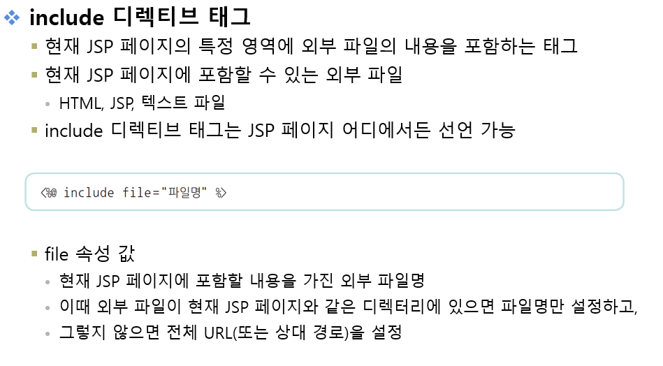

# 1교시

## 연습문제 풀이

JSP가 어떻게 라이프사이클대로 흘러가는지 알아야 한다.(생명주기에 대해서 알고 있어야 함)

# 2교시




### [include01.jsp] 소스

```html
<%@ page language="java" contentType="text/html; charset=UTF-8"
    pageEncoding="UTF-8"%>
<!DOCTYPE html>
<html class="no-js" lang="zxx">
<head>
    <meta charset="utf-8" />
    <meta http-equiv="x-ua-compatible" content="ie=edge" />
    <title>About Us - ClassiGrids Classified Ads and Listing Website Template</title>
    <meta name="description" content="" />
    <meta name="viewport" content="width=device-width, initial-scale=1" />
    <link rel="shortcut icon" type="image/x-icon" href="assets/images/favicon.svg" />
    <link href="https://fonts.googleapis.com/css2?family=Jost:ital,wght@0,100;0,200;0,300;0,400;0,500;0,600;0,700;0,800;0,900;1,100;1,200;1,300;1,400;1,500;1,600;1,700;1,800;1,900&display=swap" rel="stylesheet">
    <link href="https://fonts.googleapis.com/css2?family=Lato&display=swap" rel="stylesheet">
    <link rel="stylesheet" href="/resources/assets/css/bootstrap.min.css" />
    <link rel="stylesheet" href="/resources/assets/css/LineIcons.2.0.css" />
    <link rel="stylesheet" href="/resources/assets/css/animate.css" />
    <link rel="stylesheet" href="/resources/assets/css/tiny-slider.css" />
    <link rel="stylesheet" href="/resources/assets/css/glightbox.min.css" />
    <link rel="stylesheet" href="/resources/assets/css/main.css" />
</head>

<body>
    <div class="preloader">
        <div class="preloader-inner">
            <div class="preloader-icon">
                <span></span>
                <span></span>
            </div>
        </div>
    </div>

    <div class="breadcrumbs" style="padding-top:40px;">
        <div class="container">
            <div class="row align-items-center">
                <div class="col-lg-6 col-md-6 col-12">
                    <div class="breadcrumbs-content">
                        <h1 class="page-title">디렉티브 태그</h1>
                    </div>
                </div>
                <div class="col-lg-6 col-md-6 col-12">
                    <ul class="breadcrumb-nav">
                        <li><a href="index.html">INDEX</a></li>
                        <li>CH03</li>
                    </ul>
                </div>
            </div>
        </div>
    </div>

    <section class="about-us section">
        <div class="container">
            <div class="row align-items-center justify-content-center">
                <div class="col-lg-12 col-md-12 col-12">
                    <div class="content-left wow fadeInLeft" data-wow-delay=".3s">
                    	<%@ include file="include01_header.jsp" %>
                    	<h4>■■■■■■■■■■■■■■■■■■■■■■■</h4>
                    	<h4>■■■■■■■■■■■■■■■■■■■■■■■■■■■■■</h4>
                    </div>
                </div>
            </div>
        </div>
    </section>

    <footer class="footer">
        <div class="footer-bottom">
            <div class="container">
                <div class="inner">
                    <div class="row">
                        <div class="col-12">
                            <div class="content">
                                <p class="copyright-text">대덕인재개발원 JSP</a>
                                </p>
                            </div>
                        </div>
                    </div>
                </div>
            </div>
        </div>
        <!-- End Footer Middle -->
    </footer>

    <a href="#" class="scroll-top btn-hover">
        <i class="lni lni-chevron-up"></i>
    </a>

    <script src="/resources/assets/js/bootstrap.min.js"></script>
    <script src="/resources/assets/js/wow.min.js"></script>
    <script src="/resources/assets/js/tiny-slider.js"></script>
    <script src="/resources/assets/js/glightbox.min.js"></script>
    <script src="/resources/assets/js/count-up.min.js"></script>
    <script src="/resources/assets/js/main.js"></script>
    <script type="text/javascript">
        tns({
            container: '.client-logo-carousel',
            slideBy: 'page',
            autoplay: true,
            autoplayButtonOutput: false,
            mouseDrag: true,
            gutter: 15,
            nav: false,
            controls: false,
            responsive: {
                0: {
                    items: 1,
                },
                540: {
                    items: 3,
                },
                768: {
                    items: 4,
                },
                992: {
                    items: 4,
                },
                1170: {
                    items: 6,
                }
            }
        });
    </script>
</body>
</html>
```

### [include01_header.jsp] 소스

```html
<%@ page language="java" contentType="text/html; charset=UTF-8"
    pageEncoding="UTF-8"%>
<!DOCTYPE html>
<html>
<head>
<meta charset="UTF-8">
<title>Insert title here</title>
</head>
<body>
	<h4>■■■■■■■■■■■■■■■■■■■■■■■■■■■■■</h4>
	<h4>■■■■■■■■■■■■■■■■■■■■■■■</h4>
</body>
</html>
```


### 잘못된 모듈화 예시


페이지 모듈화할 때 `html태그`, `body태그`를 제외하고 작성해야 함 ⇒ 웹 표준에 어긋난다.

### include01_header.jsp 소스

```html
<%@ page language="java" contentType="text/html; charset=UTF-8"
    pageEncoding="UTF-8"%>
<h4>■■■■■■■■■■■■■■■■■■■■■■■■■■■■■</h4>
<h4>■■■■■■■■■■■■■■■■■■■■■■■</h4>
```


### [include02.jsp] 소스

```html
<%@ page language="java" contentType="text/html; charset=UTF-8"
    pageEncoding="UTF-8"%>
<!DOCTYPE html>
<html class="no-js" lang="zxx">
<head>
    <meta charset="utf-8" />
    <meta http-equiv="x-ua-compatible" content="ie=edge" />
    <title>About Us - ClassiGrids Classified Ads and Listing Website Template</title>
    <meta name="description" content="" />
    <meta name="viewport" content="width=device-width, initial-scale=1" />
    <link rel="shortcut icon" type="image/x-icon" href="assets/images/favicon.svg" />
    <link href="https://fonts.googleapis.com/css2?family=Jost:ital,wght@0,100;0,200;0,300;0,400;0,500;0,600;0,700;0,800;0,900;1,100;1,200;1,300;1,400;1,500;1,600;1,700;1,800;1,900&display=swap" rel="stylesheet">
    <link href="https://fonts.googleapis.com/css2?family=Lato&display=swap" rel="stylesheet">
    <link rel="stylesheet" href="/resources/assets/css/bootstrap.min.css" />
    <link rel="stylesheet" href="/resources/assets/css/LineIcons.2.0.css" />
    <link rel="stylesheet" href="/resources/assets/css/animate.css" />
    <link rel="stylesheet" href="/resources/assets/css/tiny-slider.css" />
    <link rel="stylesheet" href="/resources/assets/css/glightbox.min.css" />
    <link rel="stylesheet" href="/resources/assets/css/main.css" />
</head>

<body>
    <div class="preloader">
        <div class="preloader-inner">
            <div class="preloader-icon">
                <span></span>
                <span></span>
            </div>
        </div>
    </div>

    <div class="breadcrumbs" style="padding-top:40px;">
        <div class="container">
            <div class="row align-items-center">
                <div class="col-lg-6 col-md-6 col-12">
                    <div class="breadcrumbs-content">
                        <h1 class="page-title">디렉티브 태그</h1>
                    </div>
                </div>
                <div class="col-lg-6 col-md-6 col-12">
                    <ul class="breadcrumb-nav">
                        <li><a href="index.html">INDEX</a></li>
                        <li>CH03</li>
                    </ul>
                </div>
            </div>
        </div>
    </div>

    <section class="about-us section">
        <div class="container">
            <div class="row align-items-center justify-content-center">
                <div class="col-lg-12 col-md-12 col-12">
                    <div class="content-left wow fadeInLeft" data-wow-delay=".3s">
                    	<%@ include file="include02_header.jsp" %>
                    	<marquee>
                    		<h5>방문해주셔서 감사합니다.</h5>
                    	</marquee>
                    	<%@ include file="include02_footer.jsp" %>
                    </div>
                </div>
            </div>
        </div>
    </section>

    <footer class="footer">
        <div class="footer-bottom">
            <div class="container">
                <div class="inner">
                    <div class="row">
                        <div class="col-12">
                            <div class="content">
                                <p class="copyright-text">대덕인재개발원 JSP</a>
                                </p>
                            </div>
                        </div>
                    </div>
                </div>
            </div>
        </div>
        <!-- End Footer Middle -->
    </footer>

    <a href="#" class="scroll-top btn-hover">
        <i class="lni lni-chevron-up"></i>
    </a>

    <script src="/resources/assets/js/bootstrap.min.js"></script>
    <script src="/resources/assets/js/wow.min.js"></script>
    <script src="/resources/assets/js/tiny-slider.js"></script>
    <script src="/resources/assets/js/glightbox.min.js"></script>
    <script src="/resources/assets/js/count-up.min.js"></script>
    <script src="/resources/assets/js/main.js"></script>
    <script type="text/javascript">
        tns({
            container: '.client-logo-carousel',
            slideBy: 'page',
            autoplay: true,
            autoplayButtonOutput: false,
            mouseDrag: true,
            gutter: 15,
            nav: false,
            controls: false,
            responsive: {
                0: {
                    items: 1,
                },
                540: {
                    items: 3,
                },
                768: {
                    items: 4,
                },
                992: {
                    items: 4,
                },
                1170: {
                    items: 6,
                }
            }
        });
    </script>
</body>
</html>
```

### [include02_header.jsp] 소스

```html
<%@ page language="java" contentType="text/html; charset=UTF-8"
    pageEncoding="UTF-8"%>
<h4>■■■■■■■■■■■■■■■■■■■■■■■</h4>
<h4>■■■■■■■■■■■■■■■■■■■■■■■■■■■■■</h4>
```

### [include02_footer.jsp] 소스

```html
<%@ page language="java" contentType="text/html; charset=UTF-8"
    pageEncoding="UTF-8"%>
<h4>■■■■■■■■■■■■■■■■■■■■■■■■■■■■■</h4>
<h4>■■■■■■■■■■■■■■■■■■■■■■■</h4>
```


## 라이브러리 추가 - jstl-1.2 라이브러리 등등


jsp로 시작하는 **jstl 라이브러리**를 사용해야 함

### [taglib.jsp] 소스

```html
<%@ page language="java" contentType="text/html; charset=UTF-8"
    pageEncoding="UTF-8"%>
<%@ taglib uri="http://java.sun.com/jsp/jstl/core"  prefix="c"%>
<!DOCTYPE html>
<html class="no-js" lang="zxx">
<head>
    <meta charset="utf-8" />
    <meta http-equiv="x-ua-compatible" content="ie=edge" />
    <title>About Us - ClassiGrids Classified Ads and Listing Website Template</title>
    <meta name="description" content="" />
    <meta name="viewport" content="width=device-width, initial-scale=1" />
    <link rel="shortcut icon" type="image/x-icon" href="assets/images/favicon.svg" />
    <link href="https://fonts.googleapis.com/css2?family=Jost:ital,wght@0,100;0,200;0,300;0,400;0,500;0,600;0,700;0,800;0,900;1,100;1,200;1,300;1,400;1,500;1,600;1,700;1,800;1,900&display=swap" rel="stylesheet">
    <link href="https://fonts.googleapis.com/css2?family=Lato&display=swap" rel="stylesheet">
    <link rel="stylesheet" href="/resources/assets/css/bootstrap.min.css" />
    <link rel="stylesheet" href="/resources/assets/css/LineIcons.2.0.css" />
    <link rel="stylesheet" href="/resources/assets/css/animate.css" />
    <link rel="stylesheet" href="/resources/assets/css/tiny-slider.css" />
    <link rel="stylesheet" href="/resources/assets/css/glightbox.min.css" />
    <link rel="stylesheet" href="/resources/assets/css/main.css" />
</head>

<body>
    <div class="preloader">
        <div class="preloader-inner">
            <div class="preloader-icon">
                <span></span>
                <span></span>
            </div>
        </div>
    </div>

    <div class="breadcrumbs" style="padding-top:40px;">
        <div class="container">
            <div class="row align-items-center">
                <div class="col-lg-6 col-md-6 col-12">
                    <div class="breadcrumbs-content">
                        <h1 class="page-title">디렉티브 태그</h1>
                    </div>
                </div>
                <div class="col-lg-6 col-md-6 col-12">
                    <ul class="breadcrumb-nav">
                        <li><a href="index.html">INDEX</a></li>
                        <li>CH03</li>
                    </ul>
                </div>
            </div>
        </div>
    </div>

    <section class="about-us section">
        <div class="container">
            <div class="row align-items-center justify-content-center">
                <div class="col-lg-12 col-md-12 col-12">
                    <div class="content-left wow fadeInLeft" data-wow-delay=".3s">
                    	<c:forEach begin="1" end="10" step="1" var="k">
                    		<c:out value="${k }" />
                    	</c:forEach>
                    </div>
                </div>
            </div>
        </div>
    </section>

    <footer class="footer">
        <div class="footer-bottom">
            <div class="container">
                <div class="inner">
                    <div class="row">
                        <div class="col-12">
                            <div class="content">
                                <p class="copyright-text">대덕인재개발원 JSP</a>
                                </p>
                            </div>
                        </div>
                    </div>
                </div>
            </div>
        </div>
        <!-- End Footer Middle -->
    </footer>

    <a href="#" class="scroll-top btn-hover">
        <i class="lni lni-chevron-up"></i>
    </a>

    <script src="/resources/assets/js/bootstrap.min.js"></script>
    <script src="/resources/assets/js/wow.min.js"></script>
    <script src="/resources/assets/js/tiny-slider.js"></script>
    <script src="/resources/assets/js/glightbox.min.js"></script>
    <script src="/resources/assets/js/count-up.min.js"></script>
    <script src="/resources/assets/js/main.js"></script>
    <script type="text/javascript">
        tns({
            container: '.client-logo-carousel',
            slideBy: 'page',
            autoplay: true,
            autoplayButtonOutput: false,
            mouseDrag: true,
            gutter: 15,
            nav: false,
            controls: false,
            responsive: {
                0: {
                    items: 1,
                },
                540: {
                    items: 3,
                },
                768: {
                    items: 4,
                },
                992: {
                    items: 4,
                },
                1170: {
                    items: 6,
                }
            }
        });
    </script>
</body>
</html>
```


### [taglib.jsp] 소스

```html
<%@ page language="java" contentType="text/html; charset=UTF-8"
    pageEncoding="UTF-8"%>
<%@ taglib uri="http://java.sun.com/jsp/jstl/core"  prefix="c"%>
<!DOCTYPE html>
<html class="no-js" lang="zxx">
<head>
    <meta charset="utf-8" />
    <meta http-equiv="x-ua-compatible" content="ie=edge" />
    <title>About Us - ClassiGrids Classified Ads and Listing Website Template</title>
    <meta name="description" content="" />
    <meta name="viewport" content="width=device-width, initial-scale=1" />
    <link rel="shortcut icon" type="image/x-icon" href="assets/images/favicon.svg" />
    <link href="https://fonts.googleapis.com/css2?family=Jost:ital,wght@0,100;0,200;0,300;0,400;0,500;0,600;0,700;0,800;0,900;1,100;1,200;1,300;1,400;1,500;1,600;1,700;1,800;1,900&display=swap" rel="stylesheet">
    <link href="https://fonts.googleapis.com/css2?family=Lato&display=swap" rel="stylesheet">
    <link rel="stylesheet" href="/resources/assets/css/bootstrap.min.css" />
    <link rel="stylesheet" href="/resources/assets/css/LineIcons.2.0.css" />
    <link rel="stylesheet" href="/resources/assets/css/animate.css" />
    <link rel="stylesheet" href="/resources/assets/css/tiny-slider.css" />
    <link rel="stylesheet" href="/resources/assets/css/glightbox.min.css" />
    <link rel="stylesheet" href="/resources/assets/css/main.css" />
</head>

<body>
    <div class="preloader">
        <div class="preloader-inner">
            <div class="preloader-icon">
                <span></span>
                <span></span>
            </div>
        </div>
    </div>

    <div class="breadcrumbs" style="padding-top:40px;">
        <div class="container">
            <div class="row align-items-center">
                <div class="col-lg-6 col-md-6 col-12">
                    <div class="breadcrumbs-content">
                        <h1 class="page-title">디렉티브 태그</h1>
                    </div>
                </div>
                <div class="col-lg-6 col-md-6 col-12">
                    <ul class="breadcrumb-nav">
                        <li><a href="index.html">INDEX</a></li>
                        <li>CH03</li>
                    </ul>
                </div>
            </div>
        </div>
    </div>

    <section class="about-us section">
        <div class="container">
            <div class="row">
                <div class="col-lg-6 col-md-12 col-12">
                    <div class="content-left wow fadeInLeft" data-wow-delay=".3s">
                    	<div class="card card-primary">
                    		<div class="card-header">
                    			<h6>변수 k가 1부터 10까지 1씩 증가하도록 JSTL의 Core태그 반복문을 작성</h6>
                    		</div>
                    		<div class="card-body">
		                    	<c:forEach begin="1" end="10" step="1" var="k">
		                    		<c:out value="${k }" />
		                    	</c:forEach>
                    		</div>
                    	</div>
                    </div>
                </div>
                <div class="col-lg-6 col-md-12 col-12">
                    <div class="content-left wow fadeInLeft" data-wow-delay=".3s">
                    	<div class="card card-primary">
                    		<div class="card-header">
                    			<h6>
                    				변수 k가 1부터 10까지 1씩 증가하도록 JSTL의 Core태그 반복문을 작성 <br/>
                    				<font color="red">(짝수일 때만 출력)</font>
                    			</h6>
                    		</div>
                    		<div class="card-body">
		                    	<c:forEach begin="1" end="10" step="1" var="k">
		                    		<c:if test="${k % 2 == 0}">
			                    		<c:out value="${k }" />
		                    		</c:if>
		                    	</c:forEach>
                    		</div>
                    	</div>
                    </div>
                </div>                
            </div>
        </div>
    </section>

    <footer class="footer">
        <div class="footer-bottom">
            <div class="container">
                <div class="inner">
                    <div class="row">
                        <div class="col-12">
                            <div class="content">
                                <p class="copyright-text">대덕인재개발원 JSP</a>
                                </p>
                            </div>
                        </div>
                    </div>
                </div>
            </div>
        </div>
        <!-- End Footer Middle -->
    </footer>

    <a href="#" class="scroll-top btn-hover">
        <i class="lni lni-chevron-up"></i>
    </a>

    <script src="/resources/assets/js/bootstrap.min.js"></script>
    <script src="/resources/assets/js/wow.min.js"></script>
    <script src="/resources/assets/js/tiny-slider.js"></script>
    <script src="/resources/assets/js/glightbox.min.js"></script>
    <script src="/resources/assets/js/count-up.min.js"></script>
    <script src="/resources/assets/js/main.js"></script>
    <script type="text/javascript">
        tns({
            container: '.client-logo-carousel',
            slideBy: 'page',
            autoplay: true,
            autoplayButtonOutput: false,
            mouseDrag: true,
            gutter: 15,
            nav: false,
            controls: false,
            responsive: {
                0: {
                    items: 1,
                },
                540: {
                    items: 3,
                },
                768: {
                    items: 4,
                },
                992: {
                    items: 4,
                },
                1170: {
                    items: 6,
                }
            }
        });
    </script>
</body>
</html>
```


### [taglib.jsp] 소스

```html
<%@ page language="java" contentType="text/html; charset=UTF-8"
    pageEncoding="UTF-8"%>
<%@ taglib uri="http://java.sun.com/jsp/jstl/core"  prefix="c"%>
<!DOCTYPE html>
<html class="no-js" lang="zxx">
<head>
    <meta charset="utf-8" />
    <meta http-equiv="x-ua-compatible" content="ie=edge" />
    <title>About Us - ClassiGrids Classified Ads and Listing Website Template</title>
    <meta name="description" content="" />
    <meta name="viewport" content="width=device-width, initial-scale=1" />
    <link rel="shortcut icon" type="image/x-icon" href="assets/images/favicon.svg" />
    <link href="https://fonts.googleapis.com/css2?family=Jost:ital,wght@0,100;0,200;0,300;0,400;0,500;0,600;0,700;0,800;0,900;1,100;1,200;1,300;1,400;1,500;1,600;1,700;1,800;1,900&display=swap" rel="stylesheet">
    <link href="https://fonts.googleapis.com/css2?family=Lato&display=swap" rel="stylesheet">
    <link rel="stylesheet" href="/resources/assets/css/bootstrap.min.css" />
    <link rel="stylesheet" href="/resources/assets/css/LineIcons.2.0.css" />
    <link rel="stylesheet" href="/resources/assets/css/animate.css" />
    <link rel="stylesheet" href="/resources/assets/css/tiny-slider.css" />
    <link rel="stylesheet" href="/resources/assets/css/glightbox.min.css" />
    <link rel="stylesheet" href="/resources/assets/css/main.css" />
</head>

<body>
    <div class="preloader">
        <div class="preloader-inner">
            <div class="preloader-icon">
                <span></span>
                <span></span>
            </div>
        </div>
    </div>

    <div class="breadcrumbs" style="padding-top:40px;">
        <div class="container">
            <div class="row align-items-center">
                <div class="col-lg-6 col-md-6 col-12">
                    <div class="breadcrumbs-content">
                        <h1 class="page-title">디렉티브 태그</h1>
                    </div>
                </div>
                <div class="col-lg-6 col-md-6 col-12">
                    <ul class="breadcrumb-nav">
                        <li><a href="index.html">INDEX</a></li>
                        <li>CH03</li>
                    </ul>
                </div>
            </div>
        </div>
    </div>

    <section class="about-us section">
        <div class="container">
            <div class="row">
                <div class="col-lg-6 col-md-12 col-12">
                    <div class="content-left wow fadeInLeft" data-wow-delay=".3s">
                    	<div class="card card-primary">
                    		<div class="card-header">
                    			<h6>변수 k가 1부터 10까지 1씩 증가하도록 JSTL의 Core태그 반복문을 작성</h6>
                    		</div>
                    		<div class="card-body">
		                    	<c:forEach begin="1" end="10" step="1" var="k">
		                    		<c:out value="${k }" />
		                    	</c:forEach>
                    		</div>
                    	</div>
                    </div>
                </div>
                <div class="col-lg-6 col-md-12 col-12">
                    <div class="content-left wow fadeInLeft" data-wow-delay=".3s">
                    	<div class="card card-primary">
                    		<div class="card-header">
                    			<h6>
                    				변수 k가 1부터 10까지 1씩 증가하도록 JSTL의 Core태그 반복문을 작성 <br/>
                    				<font color="red">(짝수일 때만 출력)</font>
                    			</h6>
                    		</div>
                    		<div class="card-body">
		                    	<c:forEach begin="1" end="10" step="1" var="k">
		                    		<c:if test="${k % 2 == 0}">
			                    		<c:out value="${k }" />
		                    		</c:if>
		                    	</c:forEach>
                    		</div>
                    	</div>
                    </div>
                </div>                
                <div class="col-lg-6 col-md-12 col-12">
                    <div class="content-left wow fadeInLeft" data-wow-delay=".3s">
                    	<div class="card card-primary">
                    		<div class="card-header">
                    			<h6>
                    				스크립틀릿과 표현문/JSTL을 통해 str 출력 <br />
                    				<font color="red">(스크립틀릿으로 선언)</font>
                    			</h6>
                    		</div>
                    		<div class="card-body">
                    			<%
                    				String str = "스크립틀릿으로 선언한 개똥이";
                    			%>
                    			<%= str %>
                    		</div>
                    	</div>
                    </div>
                </div>                
            </div>
        </div>
    </section>

    <footer class="footer">
        <div class="footer-bottom">
            <div class="container">
                <div class="inner">
                    <div class="row">
                        <div class="col-12">
                            <div class="content">
                                <p class="copyright-text">대덕인재개발원 JSP</a>
                                </p>
                            </div>
                        </div>
                    </div>
                </div>
            </div>
        </div>
        <!-- End Footer Middle -->
    </footer>

    <a href="#" class="scroll-top btn-hover">
        <i class="lni lni-chevron-up"></i>
    </a>

    <script src="/resources/assets/js/bootstrap.min.js"></script>
    <script src="/resources/assets/js/wow.min.js"></script>
    <script src="/resources/assets/js/tiny-slider.js"></script>
    <script src="/resources/assets/js/glightbox.min.js"></script>
    <script src="/resources/assets/js/count-up.min.js"></script>
    <script src="/resources/assets/js/main.js"></script>
    <script type="text/javascript">
        tns({
            container: '.client-logo-carousel',
            slideBy: 'page',
            autoplay: true,
            autoplayButtonOutput: false,
            mouseDrag: true,
            gutter: 15,
            nav: false,
            controls: false,
            responsive: {
                0: {
                    items: 1,
                },
                540: {
                    items: 3,
                },
                768: {
                    items: 4,
                },
                992: {
                    items: 4,
                },
                1170: {
                    items: 6,
                }
            }
        });
    </script>
</body>
</html>
```


### [taglib.jsp] 소스

```html
<%@ page language="java" contentType="text/html; charset=UTF-8"
    pageEncoding="UTF-8"%>
<%@ taglib uri="http://java.sun.com/jsp/jstl/core"  prefix="c"%>
<!DOCTYPE html>
<html class="no-js" lang="zxx">
<head>
    <meta charset="utf-8" />
    <meta http-equiv="x-ua-compatible" content="ie=edge" />
    <title>About Us - ClassiGrids Classified Ads and Listing Website Template</title>
    <meta name="description" content="" />
    <meta name="viewport" content="width=device-width, initial-scale=1" />
    <link rel="shortcut icon" type="image/x-icon" href="assets/images/favicon.svg" />
    <link href="https://fonts.googleapis.com/css2?family=Jost:ital,wght@0,100;0,200;0,300;0,400;0,500;0,600;0,700;0,800;0,900;1,100;1,200;1,300;1,400;1,500;1,600;1,700;1,800;1,900&display=swap" rel="stylesheet">
    <link href="https://fonts.googleapis.com/css2?family=Lato&display=swap" rel="stylesheet">
    <link rel="stylesheet" href="/resources/assets/css/bootstrap.min.css" />
    <link rel="stylesheet" href="/resources/assets/css/LineIcons.2.0.css" />
    <link rel="stylesheet" href="/resources/assets/css/animate.css" />
    <link rel="stylesheet" href="/resources/assets/css/tiny-slider.css" />
    <link rel="stylesheet" href="/resources/assets/css/glightbox.min.css" />
    <link rel="stylesheet" href="/resources/assets/css/main.css" />
</head>

<body>
    <div class="preloader">
        <div class="preloader-inner">
            <div class="preloader-icon">
                <span></span>
                <span></span>
            </div>
        </div>
    </div>

    <div class="breadcrumbs" style="padding-top:40px;">
        <div class="container">
            <div class="row align-items-center">
                <div class="col-lg-6 col-md-6 col-12">
                    <div class="breadcrumbs-content">
                        <h1 class="page-title">디렉티브 태그</h1>
                    </div>
                </div>
                <div class="col-lg-6 col-md-6 col-12">
                    <ul class="breadcrumb-nav">
                        <li><a href="index.html">INDEX</a></li>
                        <li>CH03</li>
                    </ul>
                </div>
            </div>
        </div>
    </div>

    <section class="about-us section">
        <div class="container">
            <div class="row">
                <div class="col-lg-6 col-md-12 col-12">
                    <div class="content-left wow fadeInLeft" data-wow-delay=".3s">
                    	<div class="card card-primary">
                    		<div class="card-header">
                    			<h6>변수 k가 1부터 10까지 1씩 증가하도록 JSTL의 Core태그 반복문을 작성</h6>
                    		</div>
                    		<div class="card-body">
		                    	<c:forEach begin="1" end="10" step="1" var="k">
		                    		<c:out value="${k }" />
		                    	</c:forEach>
                    		</div>
                    	</div>
                    </div>
                </div>
                <div class="col-lg-6 col-md-12 col-12">
                    <div class="content-left wow fadeInLeft" data-wow-delay=".3s">
                    	<div class="card card-primary">
                    		<div class="card-header">
                    			<h6>
                    				변수 k가 1부터 10까지 1씩 증가하도록 JSTL의 Core태그 반복문을 작성 <br/>
                    				<font color="red">(짝수일 때만 출력)</font>
                    			</h6>
                    		</div>
                    		<div class="card-body">
		                    	<c:forEach begin="1" end="10" step="1" var="k">
		                    		<c:if test="${k % 2 == 0}">
			                    		<c:out value="${k }" />
		                    		</c:if>
		                    	</c:forEach>
                    		</div>
                    	</div>
                    </div>
                </div>                
                <div class="col-lg-6 col-md-12 col-12">
                    <div class="content-left wow fadeInLeft" data-wow-delay=".3s">
                    	<div class="card card-primary">
                    		<div class="card-header">
                    			<h6>
                    				스크립틀릿과 표현문/JSTL을 통해 str 출력 <br />
                    				<font color="red">(스크립틀릿으로 선언)</font>
                    			</h6>
                    		</div>
                    		<div class="card-body">
                    			<%
                    				String str = "스크립틀릿으로 선언한 개똥이";
                    			%>
                    			<%= str %>
                    		</div>
                    	</div>
                    </div>
                </div>                
                <div class="col-lg-6 col-md-12 col-12">
                    <div class="content-left wow fadeInLeft" data-wow-delay=".3s">
                    	<div class="card card-primary">
                    		<div class="card-header">
                    			<h6>
                    				스크립틀릿과 표현문/JSTL을 통해 str 출력 <br />
                    				<font color="red">(JSTL의 Core태그 out으로 선언)</font>
                    			</h6>
                    		</div>
                    		<div class="card-body">
                    			<!-- 변수 str에 문자열을 넣고 JSTL의 Core 태그로 setter 작성 -->
                    			<c:set value="core태그로 선언한 개똥이" var="str" />
                    			<!-- Core 태그 setter로 넣은 변수 str을 Core 태그 out으로 출력 값에 EL언어로 출력 -->
                    			<c:out value="${str }"/>
                    		</div>
                    	</div>
                    </div>
                </div>                
            </div>
        </div>
    </section>

    <footer class="footer">
        <div class="footer-bottom">
            <div class="container">
                <div class="inner">
                    <div class="row">
                        <div class="col-12">
                            <div class="content">
                                <p class="copyright-text">대덕인재개발원 JSP</a>
                                </p>
                            </div>
                        </div>
                    </div>
                </div>
            </div>
        </div>
        <!-- End Footer Middle -->
    </footer>

    <a href="#" class="scroll-top btn-hover">
        <i class="lni lni-chevron-up"></i>
    </a>

    <script src="/resources/assets/js/bootstrap.min.js"></script>
    <script src="/resources/assets/js/wow.min.js"></script>
    <script src="/resources/assets/js/tiny-slider.js"></script>
    <script src="/resources/assets/js/glightbox.min.js"></script>
    <script src="/resources/assets/js/count-up.min.js"></script>
    <script src="/resources/assets/js/main.js"></script>
    <script type="text/javascript">
        tns({
            container: '.client-logo-carousel',
            slideBy: 'page',
            autoplay: true,
            autoplayButtonOutput: false,
            mouseDrag: true,
            gutter: 15,
            nav: false,
            controls: false,
            responsive: {
                0: {
                    items: 1,
                },
                540: {
                    items: 3,
                },
                768: {
                    items: 4,
                },
                992: {
                    items: 4,
                },
                1170: {
                    items: 6,
                }
            }
        });
    </script>
</body>
</html>
```


### [taglib.jsp] 소스

```html
<%@page import="java.util.ArrayList"%>
<%@page import="java.util.List"%>
<%@ page language="java" contentType="text/html; charset=UTF-8"
    pageEncoding="UTF-8"%>
<%@ taglib uri="http://java.sun.com/jsp/jstl/core"  prefix="c"%>
<!DOCTYPE html>
<html class="no-js" lang="zxx">
<head>
    <meta charset="utf-8" />
    <meta http-equiv="x-ua-compatible" content="ie=edge" />
    <title>About Us - ClassiGrids Classified Ads and Listing Website Template</title>
    <meta name="description" content="" />
    <meta name="viewport" content="width=device-width, initial-scale=1" />
    <link rel="shortcut icon" type="image/x-icon" href="assets/images/favicon.svg" />
    <link href="https://fonts.googleapis.com/css2?family=Jost:ital,wght@0,100;0,200;0,300;0,400;0,500;0,600;0,700;0,800;0,900;1,100;1,200;1,300;1,400;1,500;1,600;1,700;1,800;1,900&display=swap" rel="stylesheet">
    <link href="https://fonts.googleapis.com/css2?family=Lato&display=swap" rel="stylesheet">
    <link rel="stylesheet" href="/resources/assets/css/bootstrap.min.css" />
    <link rel="stylesheet" href="/resources/assets/css/LineIcons.2.0.css" />
    <link rel="stylesheet" href="/resources/assets/css/animate.css" />
    <link rel="stylesheet" href="/resources/assets/css/tiny-slider.css" />
    <link rel="stylesheet" href="/resources/assets/css/glightbox.min.css" />
    <link rel="stylesheet" href="/resources/assets/css/main.css" />
</head>

<body>
    <div class="preloader">
        <div class="preloader-inner">
            <div class="preloader-icon">
                <span></span>
                <span></span>
            </div>
        </div>
    </div>

    <div class="breadcrumbs" style="padding-top:40px;">
        <div class="container">
            <div class="row align-items-center">
                <div class="col-lg-6 col-md-6 col-12">
                    <div class="breadcrumbs-content">
                        <h1 class="page-title">디렉티브 태그</h1>
                    </div>
                </div>
                <div class="col-lg-6 col-md-6 col-12">
                    <ul class="breadcrumb-nav">
                        <li><a href="index.html">INDEX</a></li>
                        <li>CH03</li>
                    </ul>
                </div>
            </div>
        </div>
    </div>

    <section class="about-us section">
        <div class="container">
            <div class="row">
                <div class="col-lg-6 col-md-12 col-12">
                    <div class="content-left wow fadeInLeft" data-wow-delay=".3s">
                    	<div class="card card-primary">
                    		<div class="card-header">
                    			<h6>변수 k가 1부터 10까지 1씩 증가하도록 JSTL의 Core태그 반복문을 작성</h6>
                    		</div>
                    		<div class="card-body">
		                    	<c:forEach begin="1" end="10" step="1" var="k">
		                    		<c:out value="${k }" />
		                    	</c:forEach>
                    		</div>
                    	</div>
                    </div>
                </div>
                <div class="col-lg-6 col-md-12 col-12">
                    <div class="content-left wow fadeInLeft" data-wow-delay=".3s">
                    	<div class="card card-primary">
                    		<div class="card-header">
                    			<h6>
                    				변수 k가 1부터 10까지 1씩 증가하도록 JSTL의 Core태그 반복문을 작성 <br/>
                    				<font color="red">(짝수일 때만 출력)</font>
                    			</h6>
                    		</div>
                    		<div class="card-body">
		                    	<c:forEach begin="1" end="10" step="1" var="k">
		                    		<c:if test="${k % 2 == 0}">
			                    		<c:out value="${k }" />
		                    		</c:if>
		                    	</c:forEach>
                    		</div>
                    	</div>
                    </div>
                </div>                
                <div class="col-lg-6 col-md-12 col-12">
                    <div class="content-left wow fadeInLeft" data-wow-delay=".3s">
                    	<div class="card card-primary">
                    		<div class="card-header">
                    			<h6>
                    				스크립틀릿과 표현문/JSTL을 통해 str 출력 <br />
                    				<font color="red">(스크립틀릿으로 선언)</font>
                    			</h6>
                    		</div>
                    		<div class="card-body">
                    			<%
                    				String str = "스크립틀릿으로 선언한 개똥이";
                    			%>
                    			<%= str %>
                    		</div>
                    	</div>
                    </div>
                </div>                
                <div class="col-lg-6 col-md-12 col-12">
                    <div class="content-left wow fadeInLeft" data-wow-delay=".3s">
                    	<div class="card card-primary">
                    		<div class="card-header">
                    			<h6>
                    				스크립틀릿과 표현문/JSTL을 통해 str 출력 <br />
                    				<font color="red">(JSTL의 Core태그 out으로 선언)</font>
                    			</h6>
                    		</div>
                    		<div class="card-body">
                    			<!-- 변수 str에 문자열을 넣고 JSTL의 Core 태그로 setter 작성 -->
                    			<c:set value="core태그로 선언한 개똥이" var="str" />
                    			<!-- Core 태그 setter로 넣은 변수 str을 Core 태그 out으로 출력 값에 EL언어로 출력 -->
                    			<c:out value="${str }"/>
                    		</div>
                    	</div>
                    </div>
                </div>                
                <div class="col-lg-6 col-md-12 col-12">
                    <div class="content-left wow fadeInLeft" data-wow-delay=".3s">
                    	<div class="card card-primary">
                    		<div class="card-header">
                    			<h6>
                    				스크립틀릿과 표현문/JSTL을 통해 Collection 출력 <br />
                    				<font color="red">(스크립틀릿으로 선언)</font>
                    			</h6>
                    		</div>
                    		<div class="card-body">
                    			<%
                    				List<String> list = new ArrayList<String>();
                    				list.add("개똥이");
                    				list.add("김철수");
                    				list.add("메뚜기");
                    			%>
                    			<%= list %>
                    		</div>
                    	</div>
                    </div>
                </div>                
            </div>
        </div>
    </section>

    <footer class="footer">
        <div class="footer-bottom">
            <div class="container">
                <div class="inner">
                    <div class="row">
                        <div class="col-12">
                            <div class="content">
                                <p class="copyright-text">대덕인재개발원 JSP</a>
                                </p>
                            </div>
                        </div>
                    </div>
                </div>
            </div>
        </div>
        <!-- End Footer Middle -->
    </footer>

    <a href="#" class="scroll-top btn-hover">
        <i class="lni lni-chevron-up"></i>
    </a>

    <script src="/resources/assets/js/bootstrap.min.js"></script>
    <script src="/resources/assets/js/wow.min.js"></script>
    <script src="/resources/assets/js/tiny-slider.js"></script>
    <script src="/resources/assets/js/glightbox.min.js"></script>
    <script src="/resources/assets/js/count-up.min.js"></script>
    <script src="/resources/assets/js/main.js"></script>
    <script type="text/javascript">
        tns({
            container: '.client-logo-carousel',
            slideBy: 'page',
            autoplay: true,
            autoplayButtonOutput: false,
            mouseDrag: true,
            gutter: 15,
            nav: false,
            controls: false,
            responsive: {
                0: {
                    items: 1,
                },
                540: {
                    items: 3,
                },
                768: {
                    items: 4,
                },
                992: {
                    items: 4,
                },
                1170: {
                    items: 6,
                }
            }
        });
    </script>
</body>
</html>
```


### [taglib.jsp] 소스

```html
<%@page import="java.util.ArrayList"%>
<%@page import="java.util.List"%>
<%@ page language="java" contentType="text/html; charset=UTF-8"
    pageEncoding="UTF-8"%>
<%@ taglib uri="http://java.sun.com/jsp/jstl/core"  prefix="c"%>
<!DOCTYPE html>
<html class="no-js" lang="zxx">
<head>
    <meta charset="utf-8" />
    <meta http-equiv="x-ua-compatible" content="ie=edge" />
    <title>About Us - ClassiGrids Classified Ads and Listing Website Template</title>
    <meta name="description" content="" />
    <meta name="viewport" content="width=device-width, initial-scale=1" />
    <link rel="shortcut icon" type="image/x-icon" href="assets/images/favicon.svg" />
    <link href="https://fonts.googleapis.com/css2?family=Jost:ital,wght@0,100;0,200;0,300;0,400;0,500;0,600;0,700;0,800;0,900;1,100;1,200;1,300;1,400;1,500;1,600;1,700;1,800;1,900&display=swap" rel="stylesheet">
    <link href="https://fonts.googleapis.com/css2?family=Lato&display=swap" rel="stylesheet">
    <link rel="stylesheet" href="/resources/assets/css/bootstrap.min.css" />
    <link rel="stylesheet" href="/resources/assets/css/LineIcons.2.0.css" />
    <link rel="stylesheet" href="/resources/assets/css/animate.css" />
    <link rel="stylesheet" href="/resources/assets/css/tiny-slider.css" />
    <link rel="stylesheet" href="/resources/assets/css/glightbox.min.css" />
    <link rel="stylesheet" href="/resources/assets/css/main.css" />
</head>

<body>
    <div class="preloader">
        <div class="preloader-inner">
            <div class="preloader-icon">
                <span></span>
                <span></span>
            </div>
        </div>
    </div>

    <div class="breadcrumbs" style="padding-top:40px;">
        <div class="container">
            <div class="row align-items-center">
                <div class="col-lg-6 col-md-6 col-12">
                    <div class="breadcrumbs-content">
                        <h1 class="page-title">디렉티브 태그</h1>
                    </div>
                </div>
                <div class="col-lg-6 col-md-6 col-12">
                    <ul class="breadcrumb-nav">
                        <li><a href="index.html">INDEX</a></li>
                        <li>CH03</li>
                    </ul>
                </div>
            </div>
        </div>
    </div>

    <section class="about-us section">
        <div class="container">
            <div class="row">
                <div class="col-lg-6 col-md-12 col-12">
                    <div class="content-left wow fadeInLeft" data-wow-delay=".3s">
                    	<div class="card card-primary">
                    		<div class="card-header">
                    			<h6>변수 k가 1부터 10까지 1씩 증가하도록 JSTL의 Core태그 반복문을 작성</h6>
                    		</div>
                    		<div class="card-body">
		                    	<c:forEach begin="1" end="10" step="1" var="k">
		                    		<c:out value="${k }" />
		                    	</c:forEach>
                    		</div>
                    	</div>
                    </div>
                </div>
                <div class="col-lg-6 col-md-12 col-12">
                    <div class="content-left wow fadeInLeft" data-wow-delay=".3s">
                    	<div class="card card-primary">
                    		<div class="card-header">
                    			<h6>
                    				변수 k가 1부터 10까지 1씩 증가하도록 JSTL의 Core태그 반복문을 작성 <br/>
                    				<font color="red">(짝수일 때만 출력)</font>
                    			</h6>
                    		</div>
                    		<div class="card-body">
		                    	<c:forEach begin="1" end="10" step="1" var="k">
		                    		<c:if test="${k % 2 == 0}">
			                    		<c:out value="${k }" />
		                    		</c:if>
		                    	</c:forEach>
                    		</div>
                    	</div>
                    </div>
                </div>                
                <div class="col-lg-6 col-md-12 col-12">
                    <div class="content-left wow fadeInLeft" data-wow-delay=".3s">
                    	<div class="card card-primary">
                    		<div class="card-header">
                    			<h6>
                    				스크립틀릿과 표현문/JSTL을 통해 str 출력 <br />
                    				<font color="red">(스크립틀릿으로 선언)</font>
                    			</h6>
                    		</div>
                    		<div class="card-body">
                    			<%
                    				String str = "스크립틀릿으로 선언한 개똥이";
                    			%>
                    			<%= str %>
                    		</div>
                    	</div>
                    </div>
                </div>                
                <div class="col-lg-6 col-md-12 col-12">
                    <div class="content-left wow fadeInLeft" data-wow-delay=".3s">
                    	<div class="card card-primary">
                    		<div class="card-header">
                    			<h6>
                    				스크립틀릿과 표현문/JSTL을 통해 str 출력 <br />
                    				<font color="red">(JSTL의 Core태그 out으로 선언)</font>
                    			</h6>
                    		</div>
                    		<div class="card-body">
                    			<!-- 변수 str에 문자열을 넣고 JSTL의 Core 태그로 setter 작성 -->
                    			<c:set value="core태그로 선언한 개똥이" var="str" />
                    			<!-- Core 태그 setter로 넣은 변수 str을 Core 태그 out으로 출력 값에 EL언어로 출력 -->
                    			<c:out value="${str }"/>
                    		</div>
                    	</div>
                    </div>
                </div>                
                <div class="col-lg-6 col-md-12 col-12">
                    <div class="content-left wow fadeInLeft" data-wow-delay=".3s">
                    	<div class="card card-primary">
                    		<div class="card-header">
                    			<h6>
                    				스크립틀릿과 표현문/JSTL을 통해 Collection 출력 <br />
                    				<font color="red">(스크립틀릿으로 선언)</font>
                    			</h6>
                    		</div>
                    		<div class="card-body">
                    			<%
                    				List<String> list = new ArrayList<String>();
                    				list.add("개똥이");
                    				list.add("김철수");
                    				list.add("메뚜기");
                    			%>
                    			<%= list %>
                    		</div>
                    	</div>
                    </div>
                </div>                
                <div class="col-lg-6 col-md-12 col-12">
                    <div class="content-left wow fadeInLeft" data-wow-delay=".3s">
                    	<div class="card card-primary">
                    		<div class="card-header">
                    			<h6>
                    				스크립틀릿과 표현문/JSTL을 통해 Collection 출력 <br />
                    				<font color="red">(JSTL의 Core태그 forEach를 통해 Collection 출력)</font>
                    			</h6>
                    		</div>
                    		<div class="card-body">
                    			<c:forEach items="<%= list %>" var="item">
                    				<c:out value="${item}" />
                    			</c:forEach>
                    		</div>
                    	</div>
                    </div>
                </div>                
            </div>
        </div>
    </section>

    <footer class="footer">
        <div class="footer-bottom">
            <div class="container">
                <div class="inner">
                    <div class="row">
                        <div class="col-12">
                            <div class="content">
                                <p class="copyright-text">대덕인재개발원 JSP</a>
                                </p>
                            </div>
                        </div>
                    </div>
                </div>
            </div>
        </div>
        <!-- End Footer Middle -->
    </footer>

    <a href="#" class="scroll-top btn-hover">
        <i class="lni lni-chevron-up"></i>
    </a>

    <script src="/resources/assets/js/bootstrap.min.js"></script>
    <script src="/resources/assets/js/wow.min.js"></script>
    <script src="/resources/assets/js/tiny-slider.js"></script>
    <script src="/resources/assets/js/glightbox.min.js"></script>
    <script src="/resources/assets/js/count-up.min.js"></script>
    <script src="/resources/assets/js/main.js"></script>
    <script type="text/javascript">
        tns({
            container: '.client-logo-carousel',
            slideBy: 'page',
            autoplay: true,
            autoplayButtonOutput: false,
            mouseDrag: true,
            gutter: 15,
            nav: false,
            controls: false,
            responsive: {
                0: {
                    items: 1,
                },
                540: {
                    items: 3,
                },
                768: {
                    items: 4,
                },
                992: {
                    items: 4,
                },
                1170: {
                    items: 6,
                }
            }
        });
    </script>
</body>
</html>
```


### taglib.jsp 소스

```html
<%@page import="java.util.ArrayList"%>
<%@page import="java.util.List"%>
<%@ page language="java" contentType="text/html; charset=UTF-8"
    pageEncoding="UTF-8"%>
<%@ taglib uri="http://java.sun.com/jsp/jstl/core"  prefix="c"%>
<!DOCTYPE html>
<html class="no-js" lang="zxx">
<head>
    <meta charset="utf-8" />
    <meta http-equiv="x-ua-compatible" content="ie=edge" />
    <title>About Us - ClassiGrids Classified Ads and Listing Website Template</title>
    <meta name="description" content="" />
    <meta name="viewport" content="width=device-width, initial-scale=1" />
    <link rel="shortcut icon" type="image/x-icon" href="assets/images/favicon.svg" />
    <link href="https://fonts.googleapis.com/css2?family=Jost:ital,wght@0,100;0,200;0,300;0,400;0,500;0,600;0,700;0,800;0,900;1,100;1,200;1,300;1,400;1,500;1,600;1,700;1,800;1,900&display=swap" rel="stylesheet">
    <link href="https://fonts.googleapis.com/css2?family=Lato&display=swap" rel="stylesheet">
    <link rel="stylesheet" href="/resources/assets/css/bootstrap.min.css" />
    <link rel="stylesheet" href="/resources/assets/css/LineIcons.2.0.css" />
    <link rel="stylesheet" href="/resources/assets/css/animate.css" />
    <link rel="stylesheet" href="/resources/assets/css/tiny-slider.css" />
    <link rel="stylesheet" href="/resources/assets/css/glightbox.min.css" />
    <link rel="stylesheet" href="/resources/assets/css/main.css" />
</head>

<body>
    <div class="preloader">
        <div class="preloader-inner">
            <div class="preloader-icon">
                <span></span>
                <span></span>
            </div>
        </div>
    </div>

    <div class="breadcrumbs" style="padding-top:40px;">
        <div class="container">
            <div class="row align-items-center">
                <div class="col-lg-6 col-md-6 col-12">
                    <div class="breadcrumbs-content">
                        <h1 class="page-title">디렉티브 태그</h1>
                    </div>
                </div>
                <div class="col-lg-6 col-md-6 col-12">
                    <ul class="breadcrumb-nav">
                        <li><a href="index.html">INDEX</a></li>
                        <li>CH03</li>
                    </ul>
                </div>
            </div>
        </div>
    </div>

    <section class="about-us section">
        <div class="container">
            <div class="row">
                <div class="col-lg-6 col-md-12 col-12">
                    <div class="content-left wow fadeInLeft" data-wow-delay=".3s">
                    	<div class="card card-primary">
                    		<div class="card-header">
                    			<h6>변수 k가 1부터 10까지 1씩 증가하도록 JSTL의 Core태그 반복문을 작성</h6>
                    		</div>
                    		<div class="card-body">
		                    	<c:forEach begin="1" end="10" step="1" var="k">
		                    		<c:out value="${k }" />
		                    	</c:forEach>
                    		</div>
                    	</div>
                    </div>
                </div>
                <div class="col-lg-6 col-md-12 col-12">
                    <div class="content-left wow fadeInLeft" data-wow-delay=".3s">
                    	<div class="card card-primary">
                    		<div class="card-header">
                    			<h6>
                    				변수 k가 1부터 10까지 1씩 증가하도록 JSTL의 Core태그 반복문을 작성 <br/>
                    				<font color="red">(짝수일 때만 출력)</font>
                    			</h6>
                    		</div>
                    		<div class="card-body">
		                    	<c:forEach begin="1" end="10" step="1" var="k">
		                    		<c:if test="${k % 2 == 0}">
			                    		<c:out value="${k }" />
		                    		</c:if>
		                    	</c:forEach>
                    		</div>
                    	</div>
                    </div>
                </div>                
                <div class="col-lg-6 col-md-12 col-12">
                    <div class="content-left wow fadeInLeft" data-wow-delay=".3s">
                    	<div class="card card-primary">
                    		<div class="card-header">
                    			<h6>
                    				스크립틀릿과 표현문/JSTL을 통해 str 출력 <br />
                    				<font color="red">(스크립틀릿으로 선언)</font>
                    			</h6>
                    		</div>
                    		<div class="card-body">
                    			<%
                    				String str = "스크립틀릿으로 선언한 개똥이";
                    			%>
                    			<%= str %>
                    		</div>
                    	</div>
                    </div>
                </div>                
                <div class="col-lg-6 col-md-12 col-12">
                    <div class="content-left wow fadeInLeft" data-wow-delay=".3s">
                    	<div class="card card-primary">
                    		<div class="card-header">
                    			<h6>
                    				스크립틀릿과 표현문/JSTL을 통해 str 출력 <br />
                    				<font color="red">(JSTL의 Core태그 out으로 선언)</font>
                    			</h6>
                    		</div>
                    		<div class="card-body">
                    			<!-- 변수 str에 문자열을 넣고 JSTL의 Core 태그로 setter 작성 -->
                    			<c:set value="core태그로 선언한 개똥이" var="str" />
                    			<!-- Core 태그 setter로 넣은 변수 str을 Core 태그 out으로 출력 값에 EL언어로 출력 -->
                    			<c:out value="${str }"/>
                    		</div>
                    	</div>
                    </div>
                </div>                
                <div class="col-lg-6 col-md-12 col-12">
                    <div class="content-left wow fadeInLeft" data-wow-delay=".3s">
                    	<div class="card card-primary">
                    		<div class="card-header">
                    			<h6>
                    				스크립틀릿과 표현문/JSTL을 통해 Collection 출력 <br />
                    				<font color="red">(스크립틀릿으로 선언)</font>
                    			</h6>
                    		</div>
                    		<div class="card-body">
                    			<%
                    				List<String> list = new ArrayList<String>();
                    				list.add("개똥이");
                    				list.add("김철수");
                    				list.add("메뚜기");
                    			%>
                    			<%= list %>
                    		</div>
                    	</div>
                    </div>
                </div>                
                <div class="col-lg-6 col-md-12 col-12">
                    <div class="content-left wow fadeInLeft" data-wow-delay=".3s">
                    	<div class="card card-primary">
                    		<div class="card-header">
                    			<h6>
                    				스크립틀릿과 표현문/JSTL을 통해 Collection 출력 <br />
                    				<font color="red">(JSTL의 Core태그 forEach를 통해 Collection 출력)</font>
                    			</h6>
                    		</div>
                    		<div class="card-body">
                    			<c:forEach items="<%= list %>" var="item" varStatus="stat">
                    				index : ${stat.index } | count : ${stat.count } | <c:out value="${item}" /><br/>
                    			</c:forEach>
                    		</div>
                    	</div>
                    </div>
                </div>                
            </div>
        </div>
    </section>

    <footer class="footer">
        <div class="footer-bottom">
            <div class="container">
                <div class="inner">
                    <div class="row">
                        <div class="col-12">
                            <div class="content">
                                <p class="copyright-text">대덕인재개발원 JSP</a>
                                </p>
                            </div>
                        </div>
                    </div>
                </div>
            </div>
        </div>
        <!-- End Footer Middle -->
    </footer>

    <a href="#" class="scroll-top btn-hover">
        <i class="lni lni-chevron-up"></i>
    </a>

    <script src="/resources/assets/js/bootstrap.min.js"></script>
    <script src="/resources/assets/js/wow.min.js"></script>
    <script src="/resources/assets/js/tiny-slider.js"></script>
    <script src="/resources/assets/js/glightbox.min.js"></script>
    <script src="/resources/assets/js/count-up.min.js"></script>
    <script src="/resources/assets/js/main.js"></script>
    <script type="text/javascript">
        tns({
            container: '.client-logo-carousel',
            slideBy: 'page',
            autoplay: true,
            autoplayButtonOutput: false,
            mouseDrag: true,
            gutter: 15,
            nav: false,
            controls: false,
            responsive: {
                0: {
                    items: 1,
                },
                540: {
                    items: 3,
                },
                768: {
                    items: 4,
                },
                992: {
                    items: 4,
                },
                1170: {
                    items: 6,
                }
            }
        });
    </script>
</body>
</html>
```


# 3교시

### [taglib.jsp] 소스

```html
<%@page import="java.util.ArrayList"%>
<%@page import="java.util.List"%>
<%@ page language="java" contentType="text/html; charset=UTF-8"
    pageEncoding="UTF-8"%>
<%@ taglib uri="http://java.sun.com/jsp/jstl/core"  prefix="c"%>
<!DOCTYPE html>
<html class="no-js" lang="zxx">
<head>
    <meta charset="utf-8" />
    <meta http-equiv="x-ua-compatible" content="ie=edge" />
    <title>About Us - ClassiGrids Classified Ads and Listing Website Template</title>
    <meta name="description" content="" />
    <meta name="viewport" content="width=device-width, initial-scale=1" />
    <link rel="shortcut icon" type="image/x-icon" href="assets/images/favicon.svg" />
    <link href="https://fonts.googleapis.com/css2?family=Jost:ital,wght@0,100;0,200;0,300;0,400;0,500;0,600;0,700;0,800;0,900;1,100;1,200;1,300;1,400;1,500;1,600;1,700;1,800;1,900&display=swap" rel="stylesheet">
    <link href="https://fonts.googleapis.com/css2?family=Lato&display=swap" rel="stylesheet">
    <link rel="stylesheet" href="/resources/assets/css/bootstrap.min.css" />
    <link rel="stylesheet" href="/resources/assets/css/LineIcons.2.0.css" />
    <link rel="stylesheet" href="/resources/assets/css/animate.css" />
    <link rel="stylesheet" href="/resources/assets/css/tiny-slider.css" />
    <link rel="stylesheet" href="/resources/assets/css/glightbox.min.css" />
    <link rel="stylesheet" href="/resources/assets/css/main.css" />
</head>

<body>
    <div class="preloader">
        <div class="preloader-inner">
            <div class="preloader-icon">
                <span></span>
                <span></span>
            </div>
        </div>
    </div>

    <div class="breadcrumbs" style="padding-top:40px;">
        <div class="container">
            <div class="row align-items-center">
                <div class="col-lg-6 col-md-6 col-12">
                    <div class="breadcrumbs-content">
                        <h1 class="page-title">디렉티브 태그</h1>
                    </div>
                </div>
                <div class="col-lg-6 col-md-6 col-12">
                    <ul class="breadcrumb-nav">
                        <li><a href="index.html">INDEX</a></li>
                        <li>CH03</li>
                    </ul>
                </div>
            </div>
        </div>
    </div>

    <section class="about-us section">
        <div class="container">
            <div class="row">
                <div class="col-lg-6 col-md-12 col-12">
                    <div class="content-left wow fadeInLeft" data-wow-delay=".3s">
                    	<div class="card card-primary">
                    		<div class="card-header">
                    			<h6>변수 k가 1부터 10까지 1씩 증가하도록 JSTL의 Core태그 반복문을 작성</h6>
                    		</div>
                    		<div class="card-body">
		                    	<c:forEach begin="1" end="10" step="1" var="k">
		                    		<c:out value="${k }" />
		                    	</c:forEach>
                    		</div>
                    	</div>
                    </div>
                </div>
                <div class="col-lg-6 col-md-12 col-12">
                    <div class="content-left wow fadeInLeft" data-wow-delay=".3s">
                    	<div class="card card-primary">
                    		<div class="card-header">
                    			<h6>
                    				변수 k가 1부터 10까지 1씩 증가하도록 JSTL의 Core태그 반복문을 작성 <br/>
                    				<font color="red">(짝수일 때만 출력)</font>
                    			</h6>
                    		</div>
                    		<div class="card-body">
		                    	<c:forEach begin="1" end="10" step="1" var="k">
		                    		<c:if test="${k % 2 == 0}">
			                    		<c:out value="${k }" />
		                    		</c:if>
		                    	</c:forEach>
                    		</div>
                    	</div>
                    </div>
                </div>                
                <div class="col-lg-6 col-md-12 col-12">
                    <div class="content-left wow fadeInLeft" data-wow-delay=".3s">
                    	<div class="card card-primary">
                    		<div class="card-header">
                    			<h6>
                    				스크립틀릿과 표현문/JSTL을 통해 str 출력 <br />
                    				<font color="red">(스크립틀릿으로 선언)</font>
                    			</h6>
                    		</div>
                    		<div class="card-body">
                    			<%
                    				String str = "스크립틀릿으로 선언한 개똥이";
                    			%>
                    			<%= str %>
                    		</div>
                    	</div>
                    </div>
                </div>                
                <div class="col-lg-6 col-md-12 col-12">
                    <div class="content-left wow fadeInLeft" data-wow-delay=".3s">
                    	<div class="card card-primary">
                    		<div class="card-header">
                    			<h6>
                    				스크립틀릿과 표현문/JSTL을 통해 str 출력 <br />
                    				<font color="red">(JSTL의 Core태그 out으로 선언)</font>
                    			</h6>
                    		</div>
                    		<div class="card-body">
                    			<!-- 변수 str에 문자열을 넣고 JSTL의 Core 태그로 setter 작성 -->
                    			<c:set value="core태그로 선언한 개똥이" var="str" />
                    			<!-- Core 태그 setter로 넣은 변수 str을 Core 태그 out으로 출력 값에 EL언어로 출력 -->
                    			<c:out value="${str }"/>
                    		</div>
                    	</div>
                    </div>
                </div>                
                <div class="col-lg-6 col-md-12 col-12">
                    <div class="content-left wow fadeInLeft" data-wow-delay=".3s">
                    	<div class="card card-primary">
                    		<div class="card-header">
                    			<h6>
                    				스크립틀릿과 표현문/JSTL을 통해 Collection 출력 <br />
                    				<font color="red">(스크립틀릿으로 선언)</font>
                    			</h6>
                    		</div>
                    		<div class="card-body">
                    			<%
                    				List<String> list = new ArrayList<String>();
                    				list.add("개똥이");
                    				list.add("김철수");
                    				list.add("메뚜기");
                    			%>
                    			<%= list %>
                    		</div>
                    	</div>
                    </div>
                </div>                
                <div class="col-lg-6 col-md-12 col-12">
                    <div class="content-left wow fadeInLeft" data-wow-delay=".3s">
                    	<div class="card card-primary">
                    		<div class="card-header">
                    			<h6>
                    				스크립틀릿과 표현문/JSTL을 통해 Collection 출력 <br />
                    				<font color="red">(JSTL의 Core태그 forEach를 통해 Collection 출력)</font>
                    			</h6>
                    		</div>
                    		<div class="card-body">
                    			<c:forEach items="<%= list %>" var="item" varStatus="stat">
                    				index : ${stat.index } | count : ${stat.count } | <c:out value="${item}" /><br/>
                    			</c:forEach>
                    		</div>
                    	</div>
                    </div>
                </div>                
                <div class="col-lg-6 col-md-12 col-12">
                    <div class="content-left wow fadeInLeft" data-wow-delay=".3s">
                    	<div class="card card-primary">
                    		<div class="card-header">
                    			<h6>
                    				JSTL을 통해 범위 내 값 출력 <br />
                    				<font color="red">(choose-when/otherwise를 이용)</font>
                    			</h6>
                    		</div>
                    		<div class="card-body">
                    			<c:set value="5000" var="money" />
                    			<p>내가 가진 돈은 ${money }원 입니다.</p>
                    			<c:choose>
                    				<c:when test="${money <= 0 }">
                    					무일푼
                    				</c:when>
                    				<c:when test="${money >= 5000 and money <= 10000}">
                    					커피 한잔의 여유 가능
                    				</c:when>
                    				<c:otherwise>
                    					밥 먹자!
                    				</c:otherwise>
                    			</c:choose>
                    		</div>
                    	</div>
                    </div>
                </div>                
            </div>
        </div>
    </section>

    <footer class="footer">
        <div class="footer-bottom">
            <div class="container">
                <div class="inner">
                    <div class="row">
                        <div class="col-12">
                            <div class="content">
                                <p class="copyright-text">대덕인재개발원 JSP</a>
                                </p>
                            </div>
                        </div>
                    </div>
                </div>
            </div>
        </div>
        <!-- End Footer Middle -->
    </footer>

    <a href="#" class="scroll-top btn-hover">
        <i class="lni lni-chevron-up"></i>
    </a>

    <script src="/resources/assets/js/bootstrap.min.js"></script>
    <script src="/resources/assets/js/wow.min.js"></script>
    <script src="/resources/assets/js/tiny-slider.js"></script>
    <script src="/resources/assets/js/glightbox.min.js"></script>
    <script src="/resources/assets/js/count-up.min.js"></script>
    <script src="/resources/assets/js/main.js"></script>
    <script type="text/javascript">
        tns({
            container: '.client-logo-carousel',
            slideBy: 'page',
            autoplay: true,
            autoplayButtonOutput: false,
            mouseDrag: true,
            gutter: 15,
            nav: false,
            controls: false,
            responsive: {
                0: {
                    items: 1,
                },
                540: {
                    items: 3,
                },
                768: {
                    items: 4,
                },
                992: {
                    items: 4,
                },
                1170: {
                    items: 6,
                }
            }
        });
    </script>
</body>
</html>
```


and 조건, && 둘 다 사용가능

### [taglib.jsp] 소스

```html
<%@page import="java.util.ArrayList"%>
<%@page import="java.util.List"%>
<%@ page language="java" contentType="text/html; charset=UTF-8"
    pageEncoding="UTF-8"%>
<%@ taglib uri="http://java.sun.com/jsp/jstl/core"  prefix="c"%>
<!DOCTYPE html>
<html class="no-js" lang="zxx">
<head>
    <meta charset="utf-8" />
    <meta http-equiv="x-ua-compatible" content="ie=edge" />
    <title>About Us - ClassiGrids Classified Ads and Listing Website Template</title>
    <meta name="description" content="" />
    <meta name="viewport" content="width=device-width, initial-scale=1" />
    <link rel="shortcut icon" type="image/x-icon" href="assets/images/favicon.svg" />
    <link href="https://fonts.googleapis.com/css2?family=Jost:ital,wght@0,100;0,200;0,300;0,400;0,500;0,600;0,700;0,800;0,900;1,100;1,200;1,300;1,400;1,500;1,600;1,700;1,800;1,900&display=swap" rel="stylesheet">
    <link href="https://fonts.googleapis.com/css2?family=Lato&display=swap" rel="stylesheet">
    <link rel="stylesheet" href="/resources/assets/css/bootstrap.min.css" />
    <link rel="stylesheet" href="/resources/assets/css/LineIcons.2.0.css" />
    <link rel="stylesheet" href="/resources/assets/css/animate.css" />
    <link rel="stylesheet" href="/resources/assets/css/tiny-slider.css" />
    <link rel="stylesheet" href="/resources/assets/css/glightbox.min.css" />
    <link rel="stylesheet" href="/resources/assets/css/main.css" />
</head>

<body>
    <div class="preloader">
        <div class="preloader-inner">
            <div class="preloader-icon">
                <span></span>
                <span></span>
            </div>
        </div>
    </div>

    <div class="breadcrumbs" style="padding-top:40px;">
        <div class="container">
            <div class="row align-items-center">
                <div class="col-lg-6 col-md-6 col-12">
                    <div class="breadcrumbs-content">
                        <h1 class="page-title">디렉티브 태그</h1>
                    </div>
                </div>
                <div class="col-lg-6 col-md-6 col-12">
                    <ul class="breadcrumb-nav">
                        <li><a href="index.html">INDEX</a></li>
                        <li>CH03</li>
                    </ul>
                </div>
            </div>
        </div>
    </div>

    <section class="about-us section">
        <div class="container">
            <div class="row">
                <div class="col-lg-6 col-md-12 col-12">
                    <div class="content-left wow fadeInLeft" data-wow-delay=".3s">
                    	<div class="card card-primary">
                    		<div class="card-header">
                    			<h6>변수 k가 1부터 10까지 1씩 증가하도록 JSTL의 Core태그 반복문을 작성</h6>
                    		</div>
                    		<div class="card-body">
		                    	<c:forEach begin="1" end="10" step="1" var="k">
		                    		<c:out value="${k }" />
		                    	</c:forEach>
                    		</div>
                    	</div>
                    </div>
                </div>
                <div class="col-lg-6 col-md-12 col-12">
                    <div class="content-left wow fadeInLeft" data-wow-delay=".3s">
                    	<div class="card card-primary">
                    		<div class="card-header">
                    			<h6>
                    				변수 k가 1부터 10까지 1씩 증가하도록 JSTL의 Core태그 반복문을 작성 <br/>
                    				<font color="red">(짝수일 때만 출력)</font>
                    			</h6>
                    		</div>
                    		<div class="card-body">
		                    	<c:forEach begin="1" end="10" step="1" var="k">
		                    		<c:if test="${k % 2 == 0}">
			                    		<c:out value="${k }" />
		                    		</c:if>
		                    	</c:forEach>
                    		</div>
                    	</div>
                    </div>
                </div>                
                <div class="col-lg-6 col-md-12 col-12">
                    <div class="content-left wow fadeInLeft" data-wow-delay=".3s">
                    	<div class="card card-primary">
                    		<div class="card-header">
                    			<h6>
                    				스크립틀릿과 표현문/JSTL을 통해 str 출력 <br />
                    				<font color="red">(스크립틀릿으로 선언)</font>
                    			</h6>
                    		</div>
                    		<div class="card-body">
                    			<%
                    				String str = "스크립틀릿으로 선언한 개똥이";
                    			%>
                    			<%= str %>
                    		</div>
                    	</div>
                    </div>
                </div>                
                <div class="col-lg-6 col-md-12 col-12">
                    <div class="content-left wow fadeInLeft" data-wow-delay=".3s">
                    	<div class="card card-primary">
                    		<div class="card-header">
                    			<h6>
                    				스크립틀릿과 표현문/JSTL을 통해 str 출력 <br />
                    				<font color="red">(JSTL의 Core태그 out으로 선언)</font>
                    			</h6>
                    		</div>
                    		<div class="card-body">
                    			<!-- 변수 str에 문자열을 넣고 JSTL의 Core 태그로 setter 작성 -->
                    			<c:set value="core태그로 선언한 개똥이" var="str" />
                    			<!-- Core 태그 setter로 넣은 변수 str을 Core 태그 out으로 출력 값에 EL언어로 출력 -->
                    			<c:out value="${str }"/>
                    		</div>
                    	</div>
                    </div>
                </div>                
                <div class="col-lg-6 col-md-12 col-12">
                    <div class="content-left wow fadeInLeft" data-wow-delay=".3s">
                    	<div class="card card-primary">
                    		<div class="card-header">
                    			<h6>
                    				스크립틀릿과 표현문/JSTL을 통해 Collection 출력 <br />
                    				<font color="red">(스크립틀릿으로 선언)</font>
                    			</h6>
                    		</div>
                    		<div class="card-body">
                    			<%
                    				List<String> list = new ArrayList<String>();
                    				list.add("개똥이");
                    				list.add("김철수");
                    				list.add("메뚜기");
                    			%>
                    			<%= list %>
                    		</div>
                    	</div>
                    </div>
                </div>                
                <div class="col-lg-6 col-md-12 col-12">
                    <div class="content-left wow fadeInLeft" data-wow-delay=".3s">
                    	<div class="card card-primary">
                    		<div class="card-header">
                    			<h6>
                    				스크립틀릿과 표현문/JSTL을 통해 Collection 출력 <br />
                    				<font color="red">(JSTL의 Core태그 forEach를 통해 Collection 출력)</font>
                    			</h6>
                    		</div>
                    		<div class="card-body">
                    			<c:forEach items="<%= list %>" var="item" varStatus="stat">
                    				index : ${stat.index } | count : ${stat.count } | <c:out value="${item}" /><br/>
                    			</c:forEach>
                    		</div>
                    	</div>
                    </div>
                </div>                
                <div class="col-lg-6 col-md-12 col-12">
                    <div class="content-left wow fadeInLeft" data-wow-delay=".3s">
                    	<div class="card card-primary">
                    		<div class="card-header">
                    			<h6>
                    				JSTL을 통해 범위 내 값 출력 <br />
                    				<font color="red">(choose-when/otherwise를 이용)</font>
                    			</h6>
                    		</div>
                    		<div class="card-body">
                    			<c:set value="5000" var="money" />
                    			<p>내가 가진 돈은 ${money }원 입니다.</p>
                    			<c:choose>
                    				<c:when test="${money <= 0 }">
                    					무일푼
                    				</c:when>
                    				<c:when test="${money >= 5000 and money <= 10000}">
                    					커피 한잔의 여유 가능
                    				</c:when>
                    				<c:otherwise>
                    					밥 먹자!
                    				</c:otherwise>
                    			</c:choose>
                    		</div>
                    	</div>
                    </div>
                </div>                
                <div class="col-lg-6 col-md-12 col-12">
                    <div class="content-left wow fadeInLeft" data-wow-delay=".3s">
                    	<div class="card card-primary">
                    		<div class="card-header">
                    			<h6>
                    				JSTL을 통해 범위 내 값 출력 <br />
                    				<font color="red">(if를 이용)</font>
                    			</h6>
                    		</div>
                    		<div class="card-body">
                    			<p>내가 가진 돈은 ${money }원 입니다.</p>
                    			<c:if test="${money <= 0 }">
                    				무일푼
                    			</c:if>
                    			<c:if test="${money >= 5000 and money <= 10000 }">
                    				커피 한잔의 여유 가능
                    			</c:if>
                    			<c:if test="${money > 10000 }">
                    				밥 먹자!
                    			</c:if>
                    		</div>
                    	</div>
                    </div>
                </div>                
            </div>
        </div>
    </section>

    <footer class="footer">
        <div class="footer-bottom">
            <div class="container">
                <div class="inner">
                    <div class="row">
                        <div class="col-12">
                            <div class="content">
                                <p class="copyright-text">대덕인재개발원 JSP</a>
                                </p>
                            </div>
                        </div>
                    </div>
                </div>
            </div>
        </div>
        <!-- End Footer Middle -->
    </footer>

    <a href="#" class="scroll-top btn-hover">
        <i class="lni lni-chevron-up"></i>
    </a>

    <script src="/resources/assets/js/bootstrap.min.js"></script>
    <script src="/resources/assets/js/wow.min.js"></script>
    <script src="/resources/assets/js/tiny-slider.js"></script>
    <script src="/resources/assets/js/glightbox.min.js"></script>
    <script src="/resources/assets/js/count-up.min.js"></script>
    <script src="/resources/assets/js/main.js"></script>
    <script type="text/javascript">
        tns({
            container: '.client-logo-carousel',
            slideBy: 'page',
            autoplay: true,
            autoplayButtonOutput: false,
            mouseDrag: true,
            gutter: 15,
            nav: false,
            controls: false,
            responsive: {
                0: {
                    items: 1,
                },
                540: {
                    items: 3,
                },
                768: {
                    items: 4,
                },
                992: {
                    items: 4,
                },
                1170: {
                    items: 6,
                }
            }
        });
    </script>
</body>
</html>
```


# 4교시

### [ch03_test.jsp] 소스

```html
<%@page import="java.util.Arrays"%>
<%@page import="java.util.ArrayList"%>
<%@page import="java.util.List"%>
<%@ page language="java" contentType="text/html; charset=UTF-8"
    pageEncoding="UTF-8"%>
<%@ taglib uri="http://java.sun.com/jsp/jstl/core"  prefix="c"%>
<!DOCTYPE html>
<html class="no-js" lang="zxx">
<head>
    <meta charset="utf-8" />
    <meta http-equiv="x-ua-compatible" content="ie=edge" />
    <title>About Us - ClassiGrids Classified Ads and Listing Website Template</title>
    <meta name="description" content="" />
    <meta name="viewport" content="width=device-width, initial-scale=1" />
    <link rel="shortcut icon" type="image/x-icon" href="assets/images/favicon.svg" />
    <link href="https://fonts.googleapis.com/css2?family=Jost:ital,wght@0,100;0,200;0,300;0,400;0,500;0,600;0,700;0,800;0,900;1,100;1,200;1,300;1,400;1,500;1,600;1,700;1,800;1,900&display=swap" rel="stylesheet">
    <link href="https://fonts.googleapis.com/css2?family=Lato&display=swap" rel="stylesheet">
    <link rel="stylesheet" href="/resources/assets/css/bootstrap.min.css" />
    <link rel="stylesheet" href="/resources/assets/css/LineIcons.2.0.css" />
    <link rel="stylesheet" href="/resources/assets/css/animate.css" />
    <link rel="stylesheet" href="/resources/assets/css/tiny-slider.css" />
    <link rel="stylesheet" href="/resources/assets/css/glightbox.min.css" />
    <link rel="stylesheet" href="/resources/assets/css/main.css" />
</head>

<body>
    <div class="preloader">
        <div class="preloader-inner">
            <div class="preloader-icon">
                <span></span>
                <span></span>
            </div>
        </div>
    </div>

    <div class="breadcrumbs" style="padding-top:40px;">
        <div class="container">
            <div class="row align-items-center">
                <div class="col-lg-6 col-md-6 col-12">
                    <div class="breadcrumbs-content">
                        <h1 class="page-title">디렉티브 태그</h1>
                    </div>
                </div>
                <div class="col-lg-6 col-md-6 col-12">
                    <ul class="breadcrumb-nav">
                        <li><a href="index.html">INDEX</a></li>
                        <li>CH03</li>
                    </ul>
                </div>
            </div>
        </div>
    </div>

    <section class="about-us section">
        <div class="container">
            <div class="row align-items-center justify-content-center">
                <div class="col-lg-12 col-md-12 col-12">
                    <div class="content-left wow fadeInLeft" data-wow-delay=".3s">
                    	<!-- 
                    		JSTL을 활용하여 아래 문제를 작성해주세요.
                    		1) 306호 학생 이름 모두를 Core태그 set에 저장한 후, 전체를 출력해주세요.
                    			- 저장하는 방식은 다양하게
                    		2) 학생 4명씩 끊어서 출력해주세요.
                    			이름 이름 이름 이름
                    			이름 이름 이름 이름
                    			이름 이름 이름 이름
                    			이름 이름 이름 이름
                    		3) 4명씩 끊어서 출력할 때, 본인의 이름은 '본인'으로 출력해주세요.
                    			본인 글자를 출력 시, 굵은 글씨/ 녹색으로 출력해주세요.
                    			
                    	 -->
                  	     <%
                  	     	String[] names = {
                  	     			"유재석", "박명수", "하동훈", "정준하",
                  	     			"조현준", "홍길동", "홍길순", "정형돈",
                  	     			"노홍철", "길성준", "조세호", "남창희",
                  	     			"김용명", "이용진"
                  	     	};
                  	     	List<String> nameList = new ArrayList<String>();
                  	     	for(int i = 0; i < names.length; i++) {
                  	     		nameList.add(names[i]);
                  	     	}
                  	     	out.println("306호 전체 인원<br/>");
                  	     	out.println(Arrays.toString(names));
                  		 %>
                  		<br/>
                  		<font color="red">전체 인원을 4명씩 끊어서 출력하고 자신의 이름을 본인으로 출력한다.</font><br/>
                  		<c:set value="<%=nameList %>" var="names" />
                  		<c:forEach items="${names }" var="name" varStatus="stat">
                  			<c:if test="${name eq '조현준' }">
                				<font color="green"><b>본인</b></font>
                  			</c:if>
                  			<c:if test="${name ne '조현준' }">
                  				<span>${name }</span>
                  			</c:if>
	                  		<c:if test="${(stat.count) % 4 == 0}">
	                  			<br/>
	                  		</c:if>
                    	</c:forEach>
                    </div>
                </div>
            </div>
        </div>
    </section>

    <footer class="footer">
        <div class="footer-bottom">
            <div class="container">
                <div class="inner">
                    <div class="row">
                        <div class="col-12">
                            <div class="content">
                                <p class="copyright-text">대덕인재개발원 JSP</a>
                                </p>
                            </div>
                        </div>
                    </div>
                </div>
            </div>
        </div>
        <!-- End Footer Middle -->
    </footer>

    <a href="#" class="scroll-top btn-hover">
        <i class="lni lni-chevron-up"></i>
    </a>

    <script src="/resources/assets/js/bootstrap.min.js"></script>
    <script src="/resources/assets/js/wow.min.js"></script>
    <script src="/resources/assets/js/tiny-slider.js"></script>
    <script src="/resources/assets/js/glightbox.min.js"></script>
    <script src="/resources/assets/js/count-up.min.js"></script>
    <script src="/resources/assets/js/main.js"></script>
    <script type="text/javascript">
        tns({
            container: '.client-logo-carousel',
            slideBy: 'page',
            autoplay: true,
            autoplayButtonOutput: false,
            mouseDrag: true,
            gutter: 15,
            nav: false,
            controls: false,
            responsive: {
                0: {
                    items: 1,
                },
                540: {
                    items: 3,
                },
                768: {
                    items: 4,
                },
                992: {
                    items: 4,
                },
                1170: {
                    items: 6,
                }
            }
        });
    </script>
</body>
</html>
```


### [menu.jsp] 소스

```html
<%@ page language="java" contentType="text/html; charset=UTF-8"
    pageEncoding="UTF-8"%>
    <nav class="navbar navbar-expand navbar-dark bg-dark">
        <div class="container">
            <div class="navbar-header">
                <a class="navbar-brand" href="./welcome.jsp">Home</a>
            </div>
        </div>
    </nav>
```

### [welcome.jsp] 소스

```html
<%@page import="java.util.Date"%>
<%@ page language="java" contentType="text/html; charset=UTF-8"
    pageEncoding="UTF-8"%>
<!DOCTYPE html>
<html>
<head>
<meta charset="UTF-8">
<title>Insert title here</title>
<link rel="stylesheet" href="/resources/css/bootstrap.min.css">
</head>
<body>
    <%@ include file="menu.jsp" %>
    <%
    	String greeting = "Welcome to Web Shopping Mall";
    	String tagline = "Welcome to WebMarket!!";
    %>
    <div class="jumbotron">
        <div class="container">
            <h1 class="display-3"><%= greeting %></h1>
        </div>
    </div>
    <div class="container">
        <div class="text-center">
            <h3><%= tagline %></h3>
            <%
            	Date day = new Date();
            	String am_pm;
            	int hour = day.getHours();
            	int minute = day.getMinutes();
            	int second = day.getSeconds();
            	
            	if(hour / 12 == 0) {
            		am_pm = "AM";
            	} else {
            		am_pm = "PM";
            		hour = hour - 12;
            	}
            	String CT = hour + ":" + minute + ":" + second + " " + am_pm;
            	out.println("현재 접속 시간 : " + CT + "\n");
            %>
        </div>
        <hr/>
    </div>
    <%@ include file="footer.jsp" %>
</body>
</html>
```

### [footer.jsp] 소스

```html
<%@ page language="java" contentType="text/html; charset=UTF-8"
    pageEncoding="UTF-8"%>
    <footer class="container">
        <p>&copy;WebMarket</p>
    </footer>
```


### [headPart.jsp] 소스 - CSS 설정파일

```html
<%@ page language="java" contentType="text/html; charset=UTF-8"
    pageEncoding="UTF-8"%>
    <link rel="shortcut icon" type="image/x-icon" href="${pageContext.request.contextPath }/resources/assets/images/favicon.svg" />

    <link
        href="https://fonts.googleapis.com/css2?family=Jost:ital,wght@0,100;0,200;0,300;0,400;0,500;0,600;0,700;0,800;0,900;1,100;1,200;1,300;1,400;1,500;1,600;1,700;1,800;1,900&display=swap"
        rel="stylesheet">
    <link href="https://fonts.googleapis.com/css2?family=Lato&display=swap" rel="stylesheet">

    <link rel="stylesheet" href="${pageContext.request.contextPath }/resources/assets/css/bootstrap.min.css" />
    <link rel="stylesheet" href="${pageContext.request.contextPath }/resources/assets/css/LineIcons.2.0.css" />
    <link rel="stylesheet" href="${pageContext.request.contextPath }/resources/assets/css/animate.css" />
    <link rel="stylesheet" href="${pageContext.request.contextPath }/resources/assets/css/tiny-slider.css" />
    <link rel="stylesheet" href="${pageContext.request.contextPath }/resources/assets/css/glightbox.min.css" />
    <link rel="stylesheet" href="${pageContext.request.contextPath }/resources/assets/css/main.css" />
```

### [head.jsp] 소스

```html
<%@ page language="java" contentType="text/html; charset=UTF-8"
    pageEncoding="UTF-8"%>
    <div class="preloader">
        <div class="preloader-inner">
            <div class="preloader-icon">
                <span></span>
                <span></span>
            </div>
        </div>
    </div>
```

### [footer.jsp] 소스

```html
<%@ page language="java" contentType="text/html; charset=UTF-8"
    pageEncoding="UTF-8"%>
    <footer class="footer">
        <div class="footer-bottom">
            <div class="container">
                <div class="inner">
                    <div class="row">
                        <div class="col-12">
                            <div class="content">
                                <p class="copyright-text">대덕인재개발원 JSP</a>
                                </p>
                            </div>
                        </div>
                    </div>
                </div>
            </div>
        </div>
    </footer>

    <a href="#" class="scroll-top btn-hover">
        <i class="lni lni-chevron-up"></i>
    </a>
```

### [footerPart.jsp] 소스 - JS 설정파일

```html
<%@ page language="java" contentType="text/html; charset=UTF-8"
    pageEncoding="UTF-8"%>
    <script src="${pageContext.request.contextPath }/resources/assets/js/bootstrap.min.js"></script>
    <script src="${pageContext.request.contextPath }/resources/assets/js/wow.min.js"></script>
    <script src="${pageContext.request.contextPath }/resources/assets/js/tiny-slider.js"></script>
    <script src="${pageContext.request.contextPath }/resources/assets/js/main.js"></script>
    <script type="text/javascript">
        tns({
            container: '.category-slider',
            items: 3,
            slideBy: 'page',
            autoplay: false,
            mouseDrag: true,
            gutter: 0,
            nav: false,
            controls: true,
            controlsText: ['<i class="lni lni-chevron-left"></i>', '<i class="lni lni-chevron-right"></i>'],
            responsive: {
                0: {
                    items: 1,
                },
                540: {
                    items: 2,
                },
                768: {
                    items: 4,
                },
                992: {
                    items: 5,
                },
                1170: {
                    items: 6,
                }
            }
        });
    </script>
```

### [index.jsp] 소스

```html
<%@page import="kr.or.ddit.index.IndexVO"%>
<%@page import="java.util.List"%>
<%@page import="kr.or.ddit.index.IndexRepository"%>
<%@ page language="java" contentType="text/html; charset=UTF-8"
    pageEncoding="UTF-8"%>
<!DOCTYPE html>
<html class="no-js" lang="zxx">

<head>
    <meta charset="utf-8" />
    <meta http-equiv="x-ua-compatible" content="ie=edge" />
    <title>ClassiGrids - Classified Ads and Listing Website Template.</title>
    <meta name="description" content="" />
    <meta name="viewport" content="width=device-width, initial-scale=1" />
    <%@ include file="/pageModule/headPart.jsp" %>
</head>

<body>
	<%
		// 싱글톤 패턴 적용
		IndexRepository dao = IndexRepository.getInstance();
		List<IndexVO> indexList = dao.getIndexList();
	%>

    <%@ include file="/pageModule/head.jsp" %>

	<section class="hero-area overlay">
		<div class="container">
            <div class="row">
				<div class="col-lg-10 offset-lg-1 col-md-12 col-12">
                    <div class="hero-text text-center">
						<div class="">
                            <h2 class="wow fadeInUp" data-wow-delay=".3s">대덕인재개발원 JSP</h2>
							<p class="wow fadeInUp" data-wow-delay=".5s">ch01 - ch18장까지 공부하면서 JSP에 대해서 자세하게 알아봅시다</p>
                        </div>
                    </div>
                </div>
			</div>
		</div>
	</section>

    <section class="categories">
        <div class="container">
            <div class="cat-inner">
                <div class="row">
                    <div class="col-12 p-0">
                        <div class="category-slider">
                    	<%
                    		for(int i = 0; i < indexList.size(); i++) {
                    			IndexVO index = indexList.get(i);
                    	%>
                            <a href="" class="single-cat">
                                <div class="icon">
                                    
                                </div>
                                <h3><%=index.getChapter() %></h3>
                                <h5 class="total"><%=index.getSourceList().size() %></h5>
                            </a>
                    	<%
                    		}
                    	%>
                        </div>
                    </div>
                </div>
            </div>
        </div>
    </section>

    <section class="items-grid section custom-padding">
        <div class="container">
            <div class="row">
                <div class="col-12">
                    <div class="section-title">
                        <h2 class="wow fadeInUp" data-wow-delay=".4s">INDEX</h2>
                    </div>
                </div>
            </div>
            <div class="single-head">
                <div class="row">
                	<%
                		for(int i = 0; i < indexList.size(); i++) {
                			IndexVO index = indexList.get(i);
                	%>

                    <div class="col-lg-4 col-md-6 col-12">
                        <!-- Start Single Grid -->
                        <div class="single-grid wow fadeInUp" data-wow-delay=".4s">
                            <div class="image">
                                <a href="item-details.html" class="thumbnail"></a>
                                <div class="author">
                                    <div class="author-image">
                                        <a href="javascript:void(0)">
                                            <span>DDIT</span></a>
                                    </div>
                                </div>
                                <p class="item-position"><i class="lni lni-bolt"></i><%=index.getChapter() %></p>
                            </div>
                            <div class="content">
                                <div class="top-content">
                                    <a href="javascript:void(0)" class="tag"><%=index.getChapter() %></a>
                                    <h3 class="title">
                                        <a href="item-details.html"><%=index.getTitle() %></a>
                                    </h3>
                                    <%
                                    	for(int j = 0; j < index.getSourceList().size(); j++) {
                                    		String sourcePage = index.getSourceList().get(j);
                                    %>
                                    <p class="update-time"><%= sourcePage %></p>
                                    <%
                                    	}
                                    %>
                                </div>
                                <div class="bottom-content">
                                    <button class="btn btn-primary" 
                                    onclick="javascript:location.href='<%= request.getContextPath() + index.getChapterMoveUrl() %>'">더보기</button>
                                </div>
                            </div>
                        </div>
                    </div>
                	<%
                		}
                	%>
                </div>
            </div>
        </div>
    </section>

    <%@ include file="/pageModule/footer.jsp" %>

    <%@ include file="/pageModule/footerPart.jsp" %>

</body>

</htm
```


### [뒤로 가기](index.md)