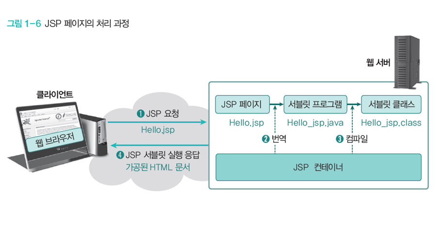

# 1교시

연습문제 풀이 및 단원 정리

```markdown
┌────────────────────────────
│쉽게 배우는 JSP 웹 프로그래밍
│# 연습문제 주관식 정리
│# 요약정리를 기반으로 개념 정리
└────────────────────────────
01장 JSP 개요 : 원리를 이해하고 개발 환경 구축하기
	
	01. 정적 웹 페이지와 동적 웹 페이지의 차이점을 설명하시오.
	
		정적 웹 페이지는 컴퓨터에 저장된 텍스트 파일을 그대로 보는 것이고, 동적 웹 페이지는 저장된 내용을 다른 변수로 가공 처리하여 보는 것이다.
		정적 웹 페이지는 HTML(Hyper Text markup Language)과 같은 웹 언어로 작성하고,
		동적 웹 페이지는 PHP(Personal Home Page), ASP(Active Server Page), JSP와 같은 웹 언어로 작성합니다.
		
		정적 웹 페이지는 미리 만들어놓은 정보만 보여주기 때문에 고객의 취향이나 변화에 적응할 수 없고,
		새로운 것을 추가, 수정, 삭제하는 작업을 모두 수동으로 처리해야 하므로 관리하기가 어렵습니다.
		하지만 동적인 요소가 없기 때문에 데이터베이스도 필요 없고 구축하기 쉬우며, 단순 문서로만 이루어져 있어 서버 간에 통신이 거의 없고 속도가 빠름
		또한 정적 문서로만 이루어져 있기 때문에 모든 호스팅 서버에서도 동작할 수 있다는 장점입니다.
		그러나 기술이 발전함에 따라 사용자의 기호에 맞게 능동적으로 변화하는 웹 페이지가 필요해져서 이를 위해 동적 웹 페이지를 제공하는
		PHP, ASP, JSP와 같은 언어가 개발되었습니다.
		
		현재 우리가 보는 대부분의 웹 페이지는 동적 웹 페이지라고 할 수 있습니다.
		동적 웹 페이지는 사용자가 웹 페이지에 글을 작성하거나 환경 설정 등을 바꾸면 그 내용이 서버에 있는 데이터베이스에 저장되고
		결과가 웹 페이지에 반영되는 형태로 동작합니다.
```

```markdown
		
	02. 웹 프로그래밍 언어 JSP의 특징을 설명하시오.
		
		1) JSP는 서블릿 기술의 확장입니다.
		
			JSP에서는 서블릿의모든 기능을 사용할 수 있습니다.
			즉, 서블릿과 마찬가지로 JDBC, JNDI, EJB 등을 모두 포함하고 있는 강력한 엔터프라이즈 자바 API를 사용할 수 있습니다.
			또한 쉽게 개발할 수 있도록 JSP에서는 내장객체, 미리 정의된 태그, 표현식 언어와 사용자 정의 태그를 사용할 수 있습니다.
			
			*** JNDI란?
			JNDI(Java Naming and Directory Interface)는 Java프로그래밍 언어를 사용하여 작성된 애플리케이션에 이름 지정 및 
			디렉토리 기능을 제공하는 API입니다.
			
			*** EJB란?
			EJB(Enterprise Java Bean)는 분산 애플리케이션을 지원하는 컴포넌트 기반의 규약
			
		2) JSP는 유지 관리가 용이합니다.
			
			서블릿 기술에는 프레젠테이션 로직과 비즈니스 로직이 섞여 있지만 JSP기술의 경우 프레젠테이션 로직과 비즈니스 로직을 분리할 수 있기
			때문에 관리하기가 쉽습니다.
			
		3) JSP는 빠른 개발이 가능합니다.
		
			코드를 수정했을때 서블릿에서는 업데이트를 하고 다시 컴파일 해야합니다. 그러나 JSP의 경우 다시 컴파일하고 프로젝트를 배포할 필요가
			없습니다.
			
		4) JSP로 개발하면 코드 길이를 줄일 수 있습니다.
		
			JSP에서는 다양한 액션태그, JSTL(JavaServer Pages Standard Tag Library), 사용자 정의 태그 등의 다양한 태그와 표현 언어
			, 내장 객체 등을 사용함으로써 서블릿보다 코드를 줄일 수 있습니다.
```

```markdown
03. JSP 페이지의 처리 과정을 설명하시오.
		
		[책 24p 그림 참고] 또는 [ch02 JSP개요 PPT 9p 그림 참고]
		1) 웹 브라우저가 웹 서버에 JSp를 요청합니다.
			웹 서버는 요청된 Hello.jsp에서 jsp확장자를 발견하여 JSP 페이지임을 확인하고 웹 서버에 있는 JSP 컨테이너에 전달합니다.
		2) JSP컨테이너는 JSP페이지를 서블릿 프로그램인 Hello_jsp.java로 변환합니다.
		3) JSP컨테이너는 서블릿 프로그램을 컴파일하여 Hello_jsp.class로 만들고 이를 웹 서버에 전달합니다.
		4) 웹 서버는 정적 웹 페이지처럼 *.class의 실행 결과를 웹 브라우저에 응답으로 전달하므로 웹 브라우저는 새로 가공된 HTML페이지를 동적으로
		처리한 결과를 보여줍니다.
```



```markdown
02장 스크립트 태그 : 시작 페이지 만들기

	01. 스크립트 태그의 세 가지 종류의 대해 간단히 설명하시오.
	
		1) 선언문 태그
		
			선언문 태그에 선언된 변수와 메소드는 JSP페이지 임의의 위치에서 선언할 수 있으며,
			스크립틀릿 태그 보다 나중에 선언해도 스크립틀릿 태그에서 사용할 수 있습니다.
			선언문 태그로 선언된 변수는 전역 변수로 사용되고, 선언문 태그로 선언된 메소드는 전역 변수처럼 전역 메소드로 사용됩니다.
			
		2) 스크립틀릿 태그
		
			스크립틀릿 태그는 out객체를 사용하지 않고도 쉽게 HTML 응답을 만들어낼 수 있습니다.
			가장 일반적으로 사용되며 변수 또는 메소드 선언, 유효식 등 다수를 포함할 수 있습니다.
			모든 텍스트, HTML 또는 JSP 요소는 스크립틀릿 태그 외부에 있어야합니다.
			
		3) 표현문 태그
			
			표현문 태그를 이용하여 선언문 태그 또는 스크립틀릿 태그에서 선언된 변수나 메소드의 반환 값을 외부로 출력할 수 있습니다.
			표현문 태그는 스크립틀릿 태그에서 사용할 수 없으므로 이 경우에는 out.println() 메소드를 사용해야 합니다.
			표현문 태그에 숫자, 문자, 불린 등의 기본 데이터 타입과 자바 객체 타입도 사용 가능합니다.
			그리고 표현문 태그에 작성된 모든 자바 코드의 값은 문자열로 변환되어 웹 브라우저에 출력됩니다.

	02. 선언문 태그와 스크립틀릿 태그의 차이점을 설명하시오.
	
		────────────────────────────────────────────────────────────────────────────────────────
					선언문 태그								|			스크립틀릿 태그
		────────────────────────────────────────────────────────────────────────────────────────
			변수 뿐만 아니라 메소드를 선언할 수 있습니다.				|	메소드 없이 변수만을 선언할 수 있습니다.
			서블릿 프로그램으로 변환될 때, _jspService() 메소드 외부에	|	서블릿 프로그램으로 변환될 때, _jspService()
			배치됩니다.										|	메소드 내부에 배치됩니다.
		────────────────────────────────────────────────────────────────────────────────────────
		
	03. 애플리케이션 실행 결과에는 보이지 않는 JSP 주석 표기법은 무엇인가?
	
		<!-- HTML 주석 처리 내용 -->
		<%-- JSP 주석 처리 내용 --%>
```

```markdown
03장 디렉티브 태그 : 한글 출력 및 페이지 모듈화 하기

	01. 디렉티브 태그의 세 가지 유형에 대해 간단히 설명하시오.

		─────────────────────────────────────────────────────────────────────────────────
			디렉티브 태그	|	형식					|	설명
		─────────────────────────────────────────────────────────────────────────────────
			page		| <%@ page ... %>		| JSP 페이지에 대한 정보를 설정합니다.
			include		| <%@ include ... %>	| JSP 페이지의 특정 영역에 다른 문서를 포함합니다.
			taglib		| <%@ taglib ... %>		| JSP 페이지에서 사용할 태그 라이브러리를 설정합니다.
		─────────────────────────────────────────────────────────────────────────────────
		
	02. JSP 페이지가 사용할 자바 클래스를 설정하기 위한 page 디렉티브 태그의 속성은 무엇인가?
	
		- import
		
	03. JSP 페이지의 특정 영역에 외부 파일의 내용을 포함하는 디렉티브 태그는 무엇인가?
	
		- include
```

# 2교시

## 자바빈즈 = VO(Value Object)

- 데이터를 저장하는 공간
- 저장한 데이터를  `request`/ `response` 두 내장 객체를 이용해 데이터를 주고받을 때의 역할로 활용된다.

### 클래스 필수 3대 요소

1) 멤버변수

2) 생성자

- default 생성자 생략가능
- 매개변수를 포함하는 커스텀 생성자를 생성할 때는 기본 생성자도 만들어야 함

3) 메서드(getter/setter)

## 페이지 이동 방식

- **리다이렉트 - 게시글 등록, 회원가입**
  
    ⇒ 서버에서 데이터를 가용했을 때 사용
    
    - 게시글 등록, 수정, 삭제
    

    
    - HttpServletResponse가 가지고 있는 `sendRedirect()` 메소드를 사용
    - 리다이렉트 방법으로 이동한 페이지는 이전 페이지와 전혀 데이터를 공유하거나 주고받는 것이 없다.
        - **주소가 바뀌면 `request` 내장 객체가 소멸되고 새로운 `request` 내장 객체를 생성한다.**
        - **그래서 `session` 내장 객체에 데이터를 담아서 보내야 함**
    - 실제로 데이터를 공유할 수 없다.
    - 리다이렉트 하게 되면 이동할 페이지로 요청과 응답 객체를 새로 생성하여 전송하기 때문이다.
    - 리다이렉트는 페이지를 재요청하는 것이며, URL을 보면 리다이렉트 시 해당 JSP 파일의 이름으로 변경되어 있을 것이다.
    - 서버는 클라이언트에게 HTTP 상태코드 302로 응답하는데 이때 헤더 내 Location 값에 이동할 URL을 추가한다. 클라이언트는 리다이렉션 응답을 받게 되면 헤더(Location)에 포함된 URL로 재요청을 보내게 된다. 이때 브라우저 주소창은 새 URL로 바뀌게 된다.
    - 클라이언트는 서버로부터 받은 상태 값이 302이면 Location헤더값으로 재요청을 보내게 된다. 이때 브라우저의 주소창은 전송받은 URL로 바뀌게 된다.
        

        
    - 리다이렉트는 `reguest` 객체가 소멸되고 재생성되므로 `session`에다가 데이터를 담아서 요청해야 함
- **포워드 - 게시판 목록 조회(ajax에서 많이 활용)**
  
    ⇒ 페이지만 요청할 때 사용
    
    - 게시판 목록 조회, 상세보기 조회 등등
    

    
    - 현재 페이지의 요청과 응답에 관한 제어권을 URL로 지정된 주소(매개변수)로 영구적으로 넘긴다.
    - 포워드된 페이지의 요청 처리가 종료되면 응답도 종료된다.
    - 리다이렉트처럼 페이지 재요청이 아닌 메소드를 호출하는 것과 같다.
    - **서버가 자동으로 이동 시켜줌으로써 URL이 그대로이며 데이터만 옮겨진다.**

# 3교시

```markdown
04장 액션 태그 : 상품 목록 표시하기

	01. 자바빈즈
	
		JSP 페이지의 주요 기능 중 하나는 데이터를 보여주는 것입니다. 하나의 JSP 페이지에 데이터를 보여주기 위한 자바 코드와 단순히 화면을
		출력하는 HTML 코드를 함께 작성하면 기능을 확장하거나 코드를 재사용하는데 어려움이 있습니다. 따라서 프로그램의 효율을 높이기 위해
		화면을 출력하는 부분과 데이터를 처리하는 로직 부분을 구분하여 작성하며, 로직 부분의 코드에 자바빈즈라는 클래스를 사용합니다.
		
		자바빈즈는 동적 콘텐츠 개발을 위해 자바 코드를 사용하여 자바 클래스로 로직을 작성하는 방법입니다.
		즉, JSP 페이지에서 화면을 표현하기 위한 계산식이나 자료의 처리를 담당하는 자바 코드를 따로 분리하여 작성하는 것이 자바빈즈입니다.
		자바빈즈는 데이터 표현을 목적으로 하는 자바 클래스 이므로 기존의 자바 클래스를 작성하는 방법과 동일하게 작성합니다.
		
		- VO와 같은 데이터를 저장할 클래스 공간에 해당합니다.
		- 추후 스프링에서 데이터를 바인딩할 때 (데이터를 받아낼 때) VO, 즉 자바빈즈 클래스 객체 타입으로 데이터를 바로 받아낼 수 있습니다.
		
	02. 페이지 이동 방식
	
		1) forward(포워드)
		
			예를 들어 게시판 등록 페이지를 요청한다고 가정합시다.
			요청 URL이 http://localhost/board/form.do일 때, 서버로 넘어간 요청(request)에 해당하는 최종 목적지(servlet)
			가 있고 그 안에서 등록 폼에 해당하는 페이지를 요청하는 기능이 실행된다.
			요청 URL에 매핑되는 서버 내 리소스(/WEB-INF/views/board/form.jsp)는 보안 폴더에 해당하는 '/WEB-INF' 안에 있으므로
			서버 안에서 응답으로 나가야할 페이지를 찾아서 결과물을 만들고 응답으로 브라우저쪽으로 던져주는데, 이 과정이 페이지 이동방식 포워드!
			포워드는 서버로 들어온 요청(request)과 요청에 의한 처리가 완료된 후 응답(response)으로 나가는 횟수가 각 1개씩 존재한다.
			만약에 서버로 들어올 때 데이터 1개 또는 2개 이상을 갖고 들어왔을 때 포워드는 새로운 요청이 만들어져 응답으로 나가는 형태가 아니므로
			같은 요청(request)객체를 활용하여 데이터를 담아 응답으로 내보낼 수 있고 처음에 요청으로 들어온 데이터를 응답에서 또한 활용가능!
			
		2) redirect(리다이렉트)
		
			예를 들어 게시판 등록 기능을 요청한다고 가정하시다.
			요청 URL이 http://localhost/board/insert.do일 때, 서버로 넘어간 요청(request)에 해당하는 최종 목적지(servlet)에
			도착한다. 이때, 등록 기능에 대한 데이터 처리 후 페이지 이동방식을 선택하여 응답으로 나가야 하는데, 응답으로 나갈 페이지가 데이터처리
			후 목록 화면이라고 가정 했을 때, 시스템이 알아서 브라우저로 300번대 Ack 신호로 "데이터 처리 끝났고 목록 화면으로 넘어가려고 하는데
			진짜 목록 화면으로 넘어가면 됨?" 이라고 물어본다. 브라우저는 서버가 300번대로 준 신호에 "응! 나 목록 화면 가는 맞고, 그러니까
			내가 다시 목록 화면 요청 할거니까 목록 화면 응답으로 주삼"이라고 하며 서볼 새로운 요청으로 http://localhost/board/list.do
			를 요청하여 목록 화면을 달라고 서버로 요청한다. 서버는 다시 들어온 새로운 요청(request)에 의해 목록 화면을 서버 안에서 찾아 결과의
			리소스를 만들어 응답으로 내보낸다. 이때 최초 요청은 등록 기능을 가진 URL이었지만 응답으로 나가는 건 목록을 요청할 때 사용하는 요청
			URL이 되고 응답 화면은 목록 화면이 나간다.
			
				*** 데이터 처리 후 포워딩을 하면?
				데이터 처리 후 리다이렉트 하지 않고 포워딩을 할 때 문제점은, 포워딩에 특징은 최초 요청 URL이 고정되고 선택된 응답 페이지가
				결과로 나가기 때문에 다시 새로 고침을 할 경우 최초의 요청했던 기능을 담고 있는 URI이 실행된다.
				그렇게되면 반복적인 데이터 처리 요청이 서버로 날라가는 것이기 때문에 요청자가 끝내지 않는 한 무한반복으로 데이터 처리의 대한
				기능이 끝없이 요청될 수 있다. 그러므로 데이터 처리 후라면 페이지 이동방식은 포워딩이 아닌 리다이렉트 처리로 마무리한다!!!
```

## 5장 내장 객체


pageContext → request → session → application 순으로 범위의 크기가 커진다.


### [box.jsp] 소스 - 페이지 모듈화시키기

```html
<%@ page language="java" contentType="text/html; charset=UTF-8"
    pageEncoding="UTF-8"%>
<!DOCTYPE html>
<html class="no-js" lang="zxx">
<head>
    <meta charset="utf-8" />
    <meta http-equiv="x-ua-compatible" content="ie=edge" />
    <title>쉽게 배우는 JSP 웹 프로그래밍</title>
    <meta name="description" content="" />
    <meta name="viewport" content="width=device-width, initial-scale=1" />
   <%@ include file="/pageModule/headPart.jsp" %>
</head>

<body>
    <%@ include file="/pageModule/head.jsp" %>

    <!-- Preloader -->
    <div class="preloader">
        <div class="preloader-inner">
            <div class="preloader-icon">
                <span></span>
                <span></span>
            </div>
        </div>
    </div>

    <div class="breadcrumbs" style="padding-top:40px;">
        <div class="container">
            <div class="row align-items-center">
                <div class="col-lg-6 col-md-6 col-12">
                    <div class="breadcrumbs-content">
                        <h1 class="page-title">JSP 개요</h1>
                    </div>
                </div>
                <div class="col-lg-6 col-md-6 col-12">
                    <ul class="breadcrumb-nav">
                        <li><a href="/">INDEX</a></li>
                        <li>CH01</li>
                    </ul>
                </div>
            </div>
        </div>
    </div>

    <section class="about-us section">
        <div class="container">
            <div class="row align-items-center justify-content-center">
                <div class="col-lg-12 col-md-12 col-12">
                    <div class="content-left wow fadeInLeft" data-wow-delay=".3s">
                    
                    </div>
                </div>
            </div>
        </div>
    </section>

    <%@ include file="/pageModule/footer.jsp" %>

    <%@ include file="/pageModule/footerPart.jsp" %>
</body>

</html>
```

### [request01.jsp] 소스

```html
<%@ page language="java" contentType="text/html; charset=UTF-8"
    pageEncoding="UTF-8"%>
<!DOCTYPE html>
<html class="no-js" lang="zxx">
<head>
    <meta charset="utf-8" />
    <meta http-equiv="x-ua-compatible" content="ie=edge" />
    <title>쉽게 배우는 JSP 웹 프로그래밍</title>
    <meta name="description" content="" />
    <meta name="viewport" content="width=device-width, initial-scale=1" />
   <%@ include file="/pageModule/headPart.jsp" %>
</head>

<body>
    <%@ include file="/pageModule/head.jsp" %>

    <!-- Preloader -->
    <div class="preloader">
        <div class="preloader-inner">
            <div class="preloader-icon">
                <span></span>
                <span></span>
            </div>
        </div>
    </div>

    <div class="breadcrumbs" style="padding-top:40px;">
        <div class="container">
            <div class="row align-items-center">
                <div class="col-lg-6 col-md-6 col-12">
                    <div class="breadcrumbs-content">
                        <h1 class="page-title">내장객체</h1>
                    </div>
                </div>
                <div class="col-lg-6 col-md-6 col-12">
                    <ul class="breadcrumb-nav">
                        <li><a href="/">INDEX</a></li>
                        <li>CH05</li>
                    </ul>
                </div>
            </div>
        </div>
    </div>

    <section class="about-us section">
        <div class="container">
            <div class="row align-items-center justify-content-center">
                <div class="col-lg-12 col-md-12 col-12">
                    <div class="content-left wow fadeInLeft" data-wow-delay=".3s">
                        <form   action="/request01_process.jsp" method="post">
			                            아이디 : <input type="text" name="id"/><br/>
			                            비밀번호 : <input type="text" name="pw"/><br/>
                           <input type="submit" value="전송">
                        </form>
                    </div>
                </div>
            </div>
        </div>
    </section>

    <%@ include file="/pageModule/footer.jsp" %>

    <%@ include file="/pageModule/footerPart.jsp" %>
</body>

</html>
```

### [request01_process.jsp] 소스

```html
<%@ page language="java" contentType="text/html; charset=UTF-8"
    pageEncoding="UTF-8"%>
<!DOCTYPE html>
<html class="no-js" lang="zxx">
<head>
    <meta charset="utf-8" />
    <meta http-equiv="x-ua-compatible" content="ie=edge" />
    <title>쉽게 배우는 JSP 웹 프로그래밍</title>
    <meta name="description" content="" />
    <meta name="viewport" content="width=device-width, initial-scale=1" />
   <%@ include file="/pageModule/headPart.jsp" %>
</head>

<body>
    <%@ include file="/pageModule/head.jsp" %>

    <!-- Preloader -->
    <div class="preloader">
        <div class="preloader-inner">
            <div class="preloader-icon">
                <span></span>
                <span></span>
            </div>
        </div>
    </div>

    <div class="breadcrumbs" style="padding-top:40px;">
        <div class="container">
            <div class="row align-items-center">
                <div class="col-lg-6 col-md-6 col-12">
                    <div class="breadcrumbs-content">
                        <h1 class="page-title">내장객체</h1>
                    </div>
                </div>
                <div class="col-lg-6 col-md-6 col-12">
                    <ul class="breadcrumb-nav">
                        <li><a href="/">INDEX</a></li>
                        <li>CH05</li>
                    </ul>
                </div>
            </div>
        </div>
    </div>

    <section class="about-us section">
        <div class="container">
            <div class="row align-items-center justify-content-center">
                <div class="col-lg-12 col-md-12 col-12">
                    <div class="content-left wow fadeInLeft" data-wow-delay=".3s">
                    	<%
                    		// 폼에서 한글 입력을 정상적으로 처리할 때 필요함.
                    		// Spring 프레임워크에서는 web.xml에서 filter 태그로 처리하여 자동화할 예정
                    		// 폼 페이지에서 입력한 한글을 처리하도록 request 내장 객체의 setCharacterEncoding() 메소드에
                    		// 문자 인코딩 유형을 utf-8로 작성함
                    		request.setCharacterEncoding("UTF-8");
                    		// 입력된 아이디와 비밀번호를 폼 태그로부터 전송받도록
                    		// request 내장 객체의 getParameter() 메소드를 작성함
                    		String id = request.getParameter("id");
                    		String pw = request.getParameter("pw");
                    	%>
                    	<!-- 폼 태그로부터 전송받은 아이디와 비밀번호를 출력하도록 표현문 태그를 작성함 -->
                    	<p>아이디 : <%=id %></p>
                    	<p>비밀번호 : <%=pw %></p>
                    </div>
                </div>
            </div>
        </div>
    </section>

    <%@ include file="/pageModule/footer.jsp" %>

    <%@ include file="/pageModule/footerPart.jsp" %>
</body>

</html>
```


# 4교시


### [request02.jsp] 소스

```html
<%@page import="java.util.Enumeration"%>
<%@ page language="java" contentType="text/html; charset=UTF-8"
    pageEncoding="UTF-8"%>
<!DOCTYPE html>
<html class="no-js" lang="zxx">
<head>
    <meta charset="utf-8" />
    <meta http-equiv="x-ua-compatible" content="ie=edge" />
    <title>쉽게 배우는 JSP 웹 프로그래밍</title>
    <meta name="description" content="" />
    <meta name="viewport" content="width=device-width, initial-scale=1" />
   <%@ include file="/pageModule/headPart.jsp" %>
</head>

<body>
    <%@ include file="/pageModule/head.jsp" %>

    <!-- Preloader -->
    <div class="preloader">
        <div class="preloader-inner">
            <div class="preloader-icon">
                <span></span>
                <span></span>
            </div>
        </div>
    </div>

    <div class="breadcrumbs" style="padding-top:40px;">
        <div class="container">
            <div class="row align-items-center">
                <div class="col-lg-6 col-md-6 col-12">
                    <div class="breadcrumbs-content">
                        <h1 class="page-title">내장객체</h1>
                    </div>
                </div>
                <div class="col-lg-6 col-md-6 col-12">
                    <ul class="breadcrumb-nav">
                        <li><a href="/">INDEX</a></li>
                        <li>CH05</li>
                    </ul>
                </div>
            </div>
        </div>
    </div>

    <section class="about-us section">
        <div class="container">
            <div class="row align-items-center justify-content-center">
                <div class="col-lg-12 col-md-12 col-12">
                    <div class="content-left wow fadeInLeft" data-wow-delay=".3s">
                    	<table class="table table-bordered">
                    		<%
                    			// 모든 헤더 이름을 가져오도록 request 내장 객체의 getHeaderNames() 메소드를 작성하고
                    			// 이를 모두 저장하도록 Enumeration 객체 타입의 변수 en을 작성
                    			Enumeration en = request.getHeaderNames();
                    		
                    			// Enumeration 객체 타입의 변수 en의 hasMoreElements() 메소드를 통해
                    			// 저장된 헤더 이름이 있을 때까지 반복하도록 while문을 작성
                    			while(en.hasMoreElements()) {
                    				// 현재 헤더 이름을 가져오도록 Enumeration 객체 타입의 변수 en의 nextElement() 메소드를 작성함
                    				String headerName = (String) en.nextElement();
                    				// 설정된 헤더 이름의 값을 가져오도록 request 내장 객체의 getHeader() 메소드를 작성함
                    				String headerValue = request.getHeader(headerName);
                    		%>
                    				<!-- 현재 헤더 이름과 값을 출력하도록 표현문 태그를 작성함 -->
                    				<tr>
                    					<td><%=headerName %></td>
                    					<td><%=headerValue %></td>
                    				</tr>
                    		<%
                    			}
                    		%>
                    	</table>
                    </div>
                </div>
            </div>
        </div>
    </section>

    <%@ include file="/pageModule/footer.jsp" %>

    <%@ include file="/pageModule/footerPart.jsp" %>
</body>

</html>
```


### [request03.jsp] 소스

```html
<%@page import="java.util.Enumeration"%>
<%@ page language="java" contentType="text/html; charset=UTF-8"
    pageEncoding="UTF-8"%>
<!DOCTYPE html>
<html class="no-js" lang="zxx">
<head>
    <meta charset="utf-8" />
    <meta http-equiv="x-ua-compatible" content="ie=edge" />
    <title>쉽게 배우는 JSP 웹 프로그래밍</title>
    <meta name="description" content="" />
    <meta name="viewport" content="width=device-width, initial-scale=1" />
   <%@ include file="/pageModule/headPart.jsp" %>
</head>

<body>
    <%@ include file="/pageModule/head.jsp" %>

    <!-- Preloader -->
    <div class="preloader">
        <div class="preloader-inner">
            <div class="preloader-icon">
                <span></span>
                <span></span>
            </div>
        </div>
    </div>

    <div class="breadcrumbs" style="padding-top:40px;">
        <div class="container">
            <div class="row align-items-center">
                <div class="col-lg-6 col-md-6 col-12">
                    <div class="breadcrumbs-content">
                        <h1 class="page-title">내장객체</h1>
                    </div>
                </div>
                <div class="col-lg-6 col-md-6 col-12">
                    <ul class="breadcrumb-nav">
                        <li><a href="/">INDEX</a></li>
                        <li>CH05</li>
                    </ul>
                </div>
            </div>
        </div>
    </div>

    <section class="about-us section">
        <div class="container">
            <div class="row align-items-center justify-content-center">
                <div class="col-lg-12 col-md-12 col-12">
                    <div class="content-left wow fadeInLeft" data-wow-delay=".3s">
                    	<table class="table table-bordered">
                    		<tr>
                    			<th width="20%"></th>
                    			<th width="20%">값</th>
                    			<th width="60%">설명</th>
                    		</tr>
                    		<tr>
                    			<td>클라이언트 IP</td>
                    			<td><%=request.getRemoteAddr() %></td>
                    			<td>웹 브라우저의 IP 주소를 가져옵니다.</td>
                    		</tr>
                    		<tr>
                    			<td>요청 정보 길이</td>
                    			<td><%=request.getContentLength() %></td>
                    			<td>웹 브라우저의 요청 파라미터 길이를 가져옵니다.</td>
                    		</tr>
                    		<tr>
                    			<td>요청 정보 인코딩</td>
                    			<td><%=request.getCharacterEncoding() %></td>
                    			<td>웹 브라우저의 문자 인코딩을 가져옵니다.</td>
                    		</tr>
                    		<tr>
                    			<td>요청 정보 콘텐츠 유형</td>
                    			<td><%=request.getContentType() %></td>
                    			<td>웹 브라우저의 콘텐츠 유형을 가져옵니다.</td>
                    		</tr>
                    		<tr>
                    			<td>요청 정보 프로토콜</td>
                    			<td><%=request.getProtocol() %></td>
                    			<td>웹 브라우저의 요청 프로토콜을 가져옵니다.</td>
                    		</tr>
                    		<tr>
                    			<td>요청 정보 전송방식</td>
                    			<td><%=request.getMethod() %></td>
                    			<td>웹 브라우저의 HTTP 요청 메소드(GET, POST)를 가져옵니다.</td>
                    		</tr>
                    		<tr>
                    			<td>요청 URI</td>
                    			<td><%=request.getRequestURI() %></td>
                    			<td>웹 브라우저가 요청한 URI 경로를 가져옵니다.</td>
                    		</tr>
                    		<tr>
                    			<td>컨텍스트 경로</td>
                    			<td><%=request.getContextPath() %></td>
                    			<td>현재 JSP 페이지의 웹 애플리케이션 컨텍스트 경로를 가져옵니다.</td>
                    		</tr>
                    		<tr>
                    			<td>서버 이름</td>
                    			<td><%=request.getServerName() %></td>
                    			<td>서버 이름을 가져옵니다.</td>
                    		</tr>
                    		<tr>
                    			<td>서버 포트</td>
                    			<td><%=request.getServerPort() %></td>
                    			<td>실행중인 서버 포트 번호를 가져옵니다.</td>
                    		</tr>
                    		<tr>
                    			<td>쿼리문(Query String)</td>
                    			<td><%=request.getQueryString() %></td>
                    			<td>웹 브라우저의 전체 요청 파라미터 문자열[문자열(?) 다음 URL에 할당된 문자열]을 가져옵니다.</td>
                    		</tr>
                    	</table>
                    </div>
                </div>
            </div>
        </div>
    </section>

    <%@ include file="/pageModule/footer.jsp" %>

    <%@ include file="/pageModule/footerPart.jsp" %>
</body>

</html>
```


### [response01.jsp] 소스

```html
<%@ page language="java" contentType="text/html; charset=UTF-8"
    pageEncoding="UTF-8"%>
<!DOCTYPE html>
<html class="no-js" lang="zxx">
<head>
    <meta charset="utf-8" />
    <meta http-equiv="x-ua-compatible" content="ie=edge" />
    <title>쉽게 배우는 JSP 웹 프로그래밍</title>
    <meta name="description" content="" />
    <meta name="viewport" content="width=device-width, initial-scale=1" />
   <%@ include file="/pageModule/headPart.jsp" %>
</head>

<body>
    <%@ include file="/pageModule/head.jsp" %>

    <!-- Preloader -->
    <div class="preloader">
        <div class="preloader-inner">
            <div class="preloader-icon">
                <span></span>
                <span></span>
            </div>
        </div>
    </div>

    <div class="breadcrumbs" style="padding-top:40px;">
        <div class="container">
            <div class="row align-items-center">
                <div class="col-lg-6 col-md-6 col-12">
                    <div class="breadcrumbs-content">
                        <h1 class="page-title">내장객체</h1>
                    </div>
                </div>
                <div class="col-lg-6 col-md-6 col-12">
                    <ul class="breadcrumb-nav">
                        <li><a href="/">INDEX</a></li>
                        <li>CH05</li>
                    </ul>
                </div>
            </div>
        </div>
    </div>

    <section class="about-us section">
        <div class="container">
            <div class="row align-items-center justify-content-center">
                <div class="col-lg-12 col-md-12 col-12">
                    <div class="content-left wow fadeInLeft" data-wow-delay=".3s">
                        <form action="response01_process.jsp" method="post">
			                            아이디 : <input type="text" name="id"/><br/>
			                            비밀번호 : <input type="text" name="pw"/><br/>
                           <input type="submit" value="전송">
                        </form>
                    </div>
                </div>
            </div>
        </div>
    </section>

    <%@ include file="/pageModule/footer.jsp" %>

    <%@ include file="/pageModule/footerPart.jsp" %>
</body>

</html>
```

### [response01_process.jsp] 소스

```html
<%@ page language="java" contentType="text/html; charset=UTF-8"
    pageEncoding="UTF-8"%>
<!DOCTYPE html>
<html class="no-js" lang="zxx">
<head>
    <meta charset="utf-8" />
    <meta http-equiv="x-ua-compatible" content="ie=edge" />
    <title>쉽게 배우는 JSP 웹 프로그래밍</title>
    <meta name="description" content="" />
    <meta name="viewport" content="width=device-width, initial-scale=1" />
   <%@ include file="/pageModule/headPart.jsp" %>
</head>

<body>
    <%@ include file="/pageModule/head.jsp" %>

    <!-- Preloader -->
    <div class="preloader">
        <div class="preloader-inner">
            <div class="preloader-icon">
                <span></span>
                <span></span>
            </div>
        </div>
    </div>

    <div class="breadcrumbs" style="padding-top:40px;">
        <div class="container">
            <div class="row align-items-center">
                <div class="col-lg-6 col-md-6 col-12">
                    <div class="breadcrumbs-content">
                        <h1 class="page-title">내장객체</h1>
                    </div>
                </div>
                <div class="col-lg-6 col-md-6 col-12">
                    <ul class="breadcrumb-nav">
                        <li><a href="/">INDEX</a></li>
                        <li>CH05</li>
                    </ul>
                </div>
            </div>
        </div>
    </div>

    <section class="about-us section">
        <div class="container">
            <div class="row align-items-center justify-content-center">
                <div class="col-lg-12 col-md-12 col-12">
                    <div class="content-left wow fadeInLeft" data-wow-delay=".3s">
                    	<%
                    		// 폼 페이지에서 입력한 한글을 처리하도록 request 내장 객체의 setCharacterEncoding 메소드에
                    		// 문자 인코딩 유형을 utf-8로 작성
                    		request.setCharacterEncoding("UTF-8");
                    		// 입력된 아이디와 비밀번호를 폼 태그로부터 전송받도록
                    		// request 내장 객체의 getParameter() 메소드를 작성
                    		String id = request.getParameter("id");
                    		String pw = request.getParameter("pw");
                    		
                    		// 폼 태그로부터 전송받은 아이디와 비밀번호와 일치하면 response01_success.jsp 페이지로 이동
                    		if(id.equals("admin") && pw.equals("1234")){
                    			response.sendRedirect("response01_success.jsp");
                    		} else {	// 일치하지 않으면 response01_failed.jsp 페이지로 이동
                    			response.sendRedirect("response01_failed.jsp");
                    		}
                    	%>

                    </div>
                </div>
            </div>
        </div>
    </section>

    <%@ include file="/pageModule/footer.jsp" %>

    <%@ include file="/pageModule/footerPart.jsp" %>
</body>

</html>
```

### [response01_success.jsp] 소스

```html
<%@ page language="java" contentType="text/html; charset=UTF-8"
    pageEncoding="UTF-8"%>
<!DOCTYPE html>
<html class="no-js" lang="zxx">
<head>
    <meta charset="utf-8" />
    <meta http-equiv="x-ua-compatible" content="ie=edge" />
    <title>쉽게 배우는 JSP 웹 프로그래밍</title>
    <meta name="description" content="" />
    <meta name="viewport" content="width=device-width, initial-scale=1" />
   <%@ include file="/pageModule/headPart.jsp" %>
</head>

<body>
    <%@ include file="/pageModule/head.jsp" %>

    <!-- Preloader -->
    <div class="preloader">
        <div class="preloader-inner">
            <div class="preloader-icon">
                <span></span>
                <span></span>
            </div>
        </div>
    </div>

    <div class="breadcrumbs" style="padding-top:40px;">
        <div class="container">
            <div class="row align-items-center">
                <div class="col-lg-6 col-md-6 col-12">
                    <div class="breadcrumbs-content">
                        <h1 class="page-title">내장객체</h1>
                    </div>
                </div>
                <div class="col-lg-6 col-md-6 col-12">
                    <ul class="breadcrumb-nav">
                        <li><a href="/">INDEX</a></li>
                        <li>CH05</li>
                    </ul>
                </div>
            </div>
        </div>
    </div>

    <section class="about-us section">
        <div class="container">
            <div class="row align-items-center justify-content-center">
                <div class="col-lg-12 col-md-12 col-12">
                    <div class="content-left wow fadeInLeft" data-wow-delay=".3s">
                    	<h5>로그인을 성공했습니다!!</h5>
                    </div>
                </div>
            </div>
        </div>
    </section>

    <%@ include file="/pageModule/footer.jsp" %>

    <%@ include file="/pageModule/footerPart.jsp" %>
</body>

</html>
```

### [response01_failed.jsp] 소스

```html
<%@ page language="java" contentType="text/html; charset=UTF-8"
    pageEncoding="UTF-8"%>
<!DOCTYPE html>
<html class="no-js" lang="zxx">
<head>
    <meta charset="utf-8" />
    <meta http-equiv="x-ua-compatible" content="ie=edge" />
    <title>쉽게 배우는 JSP 웹 프로그래밍</title>
    <meta name="description" content="" />
    <meta name="viewport" content="width=device-width, initial-scale=1" />
   <%@ include file="/pageModule/headPart.jsp" %>
</head>

<body>
    <%@ include file="/pageModule/head.jsp" %>

    <!-- Preloader -->
    <div class="preloader">
        <div class="preloader-inner">
            <div class="preloader-icon">
                <span></span>
                <span></span>
            </div>
        </div>
    </div>

    <div class="breadcrumbs" style="padding-top:40px;">
        <div class="container">
            <div class="row align-items-center">
                <div class="col-lg-6 col-md-6 col-12">
                    <div class="breadcrumbs-content">
                        <h1 class="page-title">내장객체</h1>
                    </div>
                </div>
                <div class="col-lg-6 col-md-6 col-12">
                    <ul class="breadcrumb-nav">
                        <li><a href="/">INDEX</a></li>
                        <li>CH05</li>
                    </ul>
                </div>
            </div>
        </div>
    </div>

    <section class="about-us section">
        <div class="container">
            <div class="row align-items-center justify-content-center">
                <div class="col-lg-12 col-md-12 col-12">
                    <div class="content-left wow fadeInLeft" data-wow-delay=".3s">
                    	<h5>로그인을 실패했습니다!!</h5>
                    	<a href="response01.jsp" class="btn btn-primary">로그인</a>
                    </div>
                </div>
            </div>
        </div>
    </section>

    <%@ include file="/pageModule/footer.jsp" %>

    <%@ include file="/pageModule/footerPart.jsp" %>
</body>

</html>
```


### [response02.jsp] 소스

```html
<%@ page language="java" contentType="text/html; charset=UTF-8"
    pageEncoding="UTF-8"%>
<!DOCTYPE html>
<html class="no-js" lang="zxx">
<head>
    <meta charset="utf-8" />
    <meta http-equiv="x-ua-compatible" content="ie=edge" />
    <title>쉽게 배우는 JSP 웹 프로그래밍</title>
    <meta name="description" content="" />
    <meta name="viewport" content="width=device-width, initial-scale=1" />
   <%@ include file="/pageModule/headPart.jsp" %>
</head>

<body>
    <%@ include file="/pageModule/head.jsp" %>

    <!-- Preloader -->
    <div class="preloader">
        <div class="preloader-inner">
            <div class="preloader-icon">
                <span></span>
                <span></span>
            </div>
        </div>
    </div>

    <div class="breadcrumbs" style="padding-top:40px;">
        <div class="container">
            <div class="row align-items-center">
                <div class="col-lg-6 col-md-6 col-12">
                    <div class="breadcrumbs-content">
                        <h1 class="page-title">내장객체</h1>
                    </div>
                </div>
                <div class="col-lg-6 col-md-6 col-12">
                    <ul class="breadcrumb-nav">
                        <li><a href="/">INDEX</a></li>
                        <li>CH05</li>
                    </ul>
                </div>
            </div>
        </div>
    </div>

    <section class="about-us section">
        <div class="container">
            <div class="row align-items-center justify-content-center">
                <div class="col-lg-12 col-md-12 col-12">
                    <div class="content-left wow fadeInLeft" data-wow-delay=".3s">
                    	<%
                    		// header 정보 중 , Refresh 헤더를 이용해 5초마다 페이지를 새로고침한다.
                    		response.setIntHeader("Refresh", 5);
                    	%>
                    	<%= new java.util.Date() %>
                    </div>
                </div>
            </div>
        </div>
    </section>

    <%@ include file="/pageModule/footer.jsp" %>

    <%@ include file="/pageModule/footerPart.jsp" %>
</body>

</html>
```


### [response03.jsp] 소스

```html
<%@ page language="java" contentType="text/html; charset=UTF-8"
    pageEncoding="UTF-8"%>
<!DOCTYPE html>
<html class="no-js" lang="zxx">
<head>
    <meta charset="utf-8" />
    <meta http-equiv="x-ua-compatible" content="ie=edge" />
    <title>쉽게 배우는 JSP 웹 프로그래밍</title>
    <meta name="description" content="" />
    <meta name="viewport" content="width=device-width, initial-scale=1" />
   <%@ include file="/pageModule/headPart.jsp" %>
</head>

<body>
    <%@ include file="/pageModule/head.jsp" %>

    <!-- Preloader -->
    <div class="preloader">
        <div class="preloader-inner">
            <div class="preloader-icon">
                <span></span>
                <span></span>
            </div>
        </div>
    </div>

    <div class="breadcrumbs" style="padding-top:40px;">
        <div class="container">
            <div class="row align-items-center">
                <div class="col-lg-6 col-md-6 col-12">
                    <div class="breadcrumbs-content">
                        <h1 class="page-title">내장객체</h1>
                    </div>
                </div>
                <div class="col-lg-6 col-md-6 col-12">
                    <ul class="breadcrumb-nav">
                        <li><a href="/">INDEX</a></li>
                        <li>CH05</li>
                    </ul>
                </div>
            </div>
        </div>
    </div>

    <section class="about-us section">
        <div class="container">
            <div class="row align-items-center justify-content-center">
                <div class="col-lg-12 col-md-12 col-12">
                    <div class="content-left wow fadeInLeft" data-wow-delay=".3s">
                    	<%
                    		response.sendError(404, "요청 페이지를 찾아보니까 진짜 없더라??????");
                    	%>
                    </div>
                </div>
            </div>
        </div>
    </section>

    <%@ include file="/pageModule/footer.jsp" %>

    <%@ include file="/pageModule/footerPart.jsp" %>
</body>

</html>
```


```html
<%@ page language="java" contentType="text/html; charset=UTF-8"
    pageEncoding="UTF-8"%>
<!DOCTYPE html>
<html class="no-js" lang="zxx">
<head>
    <meta charset="utf-8" />
    <meta http-equiv="x-ua-compatible" content="ie=edge" />
    <title>쉽게 배우는 JSP 웹 프로그래밍</title>
    <meta name="description" content="" />
    <meta name="viewport" content="width=device-width, initial-scale=1" />
   <%@ include file="/pageModule/headPart.jsp" %>
</head>

<body>
    <%@ include file="/pageModule/head.jsp" %>

    <!-- Preloader -->
    <div class="preloader">
        <div class="preloader-inner">
            <div class="preloader-icon">
                <span></span>
                <span></span>
            </div>
        </div>
    </div>

    <div class="breadcrumbs" style="padding-top:40px;">
        <div class="container">
            <div class="row align-items-center">
                <div class="col-lg-6 col-md-6 col-12">
                    <div class="breadcrumbs-content">
                        <h1 class="page-title">내장객체</h1>
                    </div>
                </div>
                <div class="col-lg-6 col-md-6 col-12">
                    <ul class="breadcrumb-nav">
                        <li><a href="/">INDEX</a></li>
                        <li>CH05</li>
                    </ul>
                </div>
            </div>
        </div>
    </div>

    <section class="about-us section">
        <div class="container">
            <div class="row align-items-center justify-content-center">
                <div class="col-lg-12 col-md-12 col-12">
                    <div class="content-left wow fadeInLeft" data-wow-delay=".3s">
                    	<%
                    		response.setCharacterEncoding("UTF-8");
                    		response.setContentType("text/html; charset=utf-8");
                    	%>
                    		<p>문자 인코딩 : <%=response.getCharacterEncoding() %></p>
                    		<p>콘텐츠 유형 : <%=response.getContentType() %></p>
                    	<%
                    		// 웹 브라우저에 응답할 오류로 404 코드 및 오류 메시지를 출력하도록
                    		// response 내장 객체의 sendError() 메소드를 작성
                    		// response.sendError(404, "요청 페이지를 찾아보니까 진짜 없더라??????");
                    	%>
                    </div>
                </div>
            </div>
        </div>
    </section>

    <%@ include file="/pageModule/footer.jsp" %>

    <%@ include file="/pageModule/footerPart.jsp" %>
</body>

</html
```


### [뒤로 가기](index.md)
