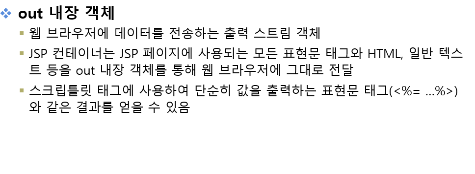

# 1교시

리다이렉트 

- 데이터를 가용할 때 사용

포워드 

- 요청에 따른 페이지 이동할 때 사용




### out01.jsp 소스

```html
<%@page import="java.util.Calendar"%>
<%@ page language="java" contentType="text/html; charset=UTF-8"
    pageEncoding="UTF-8"%>
<!DOCTYPE html>
<html class="no-js" lang="zxx">
<head>
    <meta charset="utf-8" />
    <meta http-equiv="x-ua-compatible" content="ie=edge" />
    <title>쉽게 배우는 JSP 웹 프로그래밍</title>
    <meta name="description" content="" />
    <meta name="viewport" content="width=device-width, initial-scale=1" />
   <%@ include file="/pageModule/headPart.jsp" %>
</head>

<body>
    <%@ include file="/pageModule/head.jsp" %>

    <!-- Preloader -->
    <div class="preloader">
        <div class="preloader-inner">
            <div class="preloader-icon">
                <span></span>
                <span></span>
            </div>
        </div>
    </div>

    <div class="breadcrumbs" style="padding-top:40px;">
        <div class="container">
            <div class="row align-items-center">
                <div class="col-lg-6 col-md-6 col-12">
                    <div class="breadcrumbs-content">
                        <h1 class="page-title">내장객체</h1>
                    </div>
                </div>
                <div class="col-lg-6 col-md-6 col-12">
                    <ul class="breadcrumb-nav">
                        <li><a href="/">INDEX</a></li>
                        <li>CH05</li>
                    </ul>
                </div>
            </div>
        </div>
    </div>

    <section class="about-us section">
        <div class="container">
            <div class="row align-items-center justify-content-center">
                <div class="col-lg-12 col-md-12 col-12">
                    <div class="content-left wow fadeInLeft" data-wow-delay=".3s">
                    	<%
                    		out.println("오늘의 날짜 및 시간 : " + Calendar.getInstance().getTime());
                    	%>
                    </div>
                </div>
            </div>
        </div>
    </section>

    <%@ include file="/pageModule/footer.jsp" %>

    <%@ include file="/pageModule/footerPart.jsp" %>
</body>

</html>
```


### out02.jsp 소스

```html
<%@page import="java.util.Calendar"%>
<%@ page language="java" contentType="text/html; charset=UTF-8"
    pageEncoding="UTF-8"%>
<!DOCTYPE html>
<html class="no-js" lang="zxx">
<head>
    <meta charset="utf-8" />
    <meta http-equiv="x-ua-compatible" content="ie=edge" />
    <title>쉽게 배우는 JSP 웹 프로그래밍</title>
    <meta name="description" content="" />
    <meta name="viewport" content="width=device-width, initial-scale=1" />
   <%@ include file="/pageModule/headPart.jsp" %>
</head>

<body>
    <%@ include file="/pageModule/head.jsp" %>

    <!-- Preloader -->
    <div class="preloader">
        <div class="preloader-inner">
            <div class="preloader-icon">
                <span></span>
                <span></span>
            </div>
        </div>
    </div>

    <div class="breadcrumbs" style="padding-top:40px;">
        <div class="container">
            <div class="row align-items-center">
                <div class="col-lg-6 col-md-6 col-12">
                    <div class="breadcrumbs-content">
                        <h1 class="page-title">내장객체</h1>
                    </div>
                </div>
                <div class="col-lg-6 col-md-6 col-12">
                    <ul class="breadcrumb-nav">
                        <li><a href="/">INDEX</a></li>
                        <li>CH05</li>
                    </ul>
                </div>
            </div>
        </div>
    </div>

    <section class="about-us section">
        <div class="container">
            <div class="row align-items-center justify-content-center">
                <div class="col-lg-12 col-md-12 col-12">
                    <div class="content-left wow fadeInLeft" data-wow-delay=".3s">
                    	<form action="out02_process.jsp" method="post">
                    		아이디 : <input type="text" name="id" /><br/>
                    		비밀번호 : <input type="text" name="pw" /><br/>
                    		<input type="submit" value="전송">
                    	</form>
                    </div>
                </div>
            </div>
        </div>
    </section>

    <%@ include file="/pageModule/footer.jsp" %>

    <%@ include file="/pageModule/footerPart.jsp" %>
</body>

</html>
```


### out02_process.jsp 소스

```html
<%@page import="java.util.Calendar"%>
<%@ page language="java" contentType="text/html; charset=UTF-8"
    pageEncoding="UTF-8"%>
<%@ taglib uri="http://java.sun.com/jsp/jstl/core"  prefix="c"%>
<!DOCTYPE html>
<html class="no-js" lang="zxx">
<head>
    <meta charset="utf-8" />
    <meta http-equiv="x-ua-compatible" content="ie=edge" />
    <title>쉽게 배우는 JSP 웹 프로그래밍</title>
    <meta name="description" content="" />
    <meta name="viewport" content="width=device-width, initial-scale=1" />
   <%@ include file="/pageModule/headPart.jsp" %>
</head>

<body>
    <%@ include file="/pageModule/head.jsp" %>

    <!-- Preloader -->
    <div class="preloader">
        <div class="preloader-inner">
            <div class="preloader-icon">
                <span></span>
                <span></span>
            </div>
        </div>
    </div>

    <div class="breadcrumbs" style="padding-top:40px;">
        <div class="container">
            <div class="row align-items-center">
                <div class="col-lg-6 col-md-6 col-12">
                    <div class="breadcrumbs-content">
                        <h1 class="page-title">내장객체</h1>
                    </div>
                </div>
                <div class="col-lg-6 col-md-6 col-12">
                    <ul class="breadcrumb-nav">
                        <li><a href="/">INDEX</a></li>
                        <li>CH05</li>
                    </ul>
                </div>
            </div>
        </div>
    </div>

    <section class="about-us section">
        <div class="container">
            <div class="row align-items-center justify-content-center">
                <div class="col-lg-12 col-md-12 col-12">
                    <div class="content-left wow fadeInLeft" data-wow-delay=".3s">
                    	<%
                    		request.setCharacterEncoding("UTF-8");
                    		String id = request.getParameter("id");
                    		String pw = request.getParameter("pw");
                    	%>
                    	<p>스크립틀릿/표현문을 이용한 출력</p>
                    	아이디 : <%= id %><br/>
                    	비밀번호 : <%= pw %><br/>
                    	
                    	<hr/>
                    	
                    	<p>JSTL을 이용한 출력</p>
                    	<c:set value="<%=id %>" var="mem_id" />
                    	<c:set value="<%=pw %>" var="mem_pw" />
                    	아이디 : <c:out value="${mem_id }"/>
                    	비밀번호 : <c:out value="${mem_pw }"/>
                    </div>
                </div>
            </div>
        </div>
    </section>

    <%@ include file="/pageModule/footer.jsp" %>

    <%@ include file="/pageModule/footerPart.jsp" %>
</body>

</html>
```


### [ch05_test.jsp] 소스 - 내풀이

```html
<%@page import="java.util.Calendar"%>
<%@ page language="java" contentType="text/html; charset=UTF-8"
    pageEncoding="UTF-8"%>
<!DOCTYPE html>
<html class="no-js" lang="zxx">
<head>
    <meta charset="utf-8" />
    <meta http-equiv="x-ua-compatible" content="ie=edge" />
    <title>쉽게 배우는 JSP 웹 프로그래밍</title>
    <meta name="description" content="" />
    <meta name="viewport" content="width=device-width, initial-scale=1" />
   <%@ include file="/pageModule/headPart.jsp" %>
</head>

<body>
    <%@ include file="/pageModule/head.jsp" %>

    <!-- Preloader -->
    <div class="preloader">
        <div class="preloader-inner">
            <div class="preloader-icon">
                <span></span>
                <span></span>
            </div>
        </div>
    </div>

    <div class="breadcrumbs" style="padding-top:40px;">
        <div class="container">
            <div class="row align-items-center">
                <div class="col-lg-6 col-md-6 col-12">
                    <div class="breadcrumbs-content">
                        <h1 class="page-title">내장객체</h1>
                    </div>
                </div>
                <div class="col-lg-6 col-md-6 col-12">
                    <ul class="breadcrumb-nav">
                        <li><a href="/">INDEX</a></li>
                        <li>CH05</li>
                    </ul>
                </div>
            </div>
        </div>
    </div>

    <section class="about-us section">
        <div class="container">
            <div class="row align-items-center justify-content-center">
                <div class="col-lg-12 col-md-12 col-12">
                    <div class="content-left wow fadeInLeft" data-wow-delay=".3s">
                    	<!-- 
                    		아이디, 비밀번호, 이름, 성별, 핸드폰번호, 주소를 입력 받는 폼 양식을 구성하고
                    		ch05_test_process.jsp로 method방식 post로 전송해주세요.
                    		
                    		작성을 완료했으면 ch05_test_process.jsp로 넘어가 처리를 마무리해주세요.
                    		
                    		아이디는 type="test"
                    		비밀번호는 type="test"
                    		이름은 type="test"
                    		성별은 type="radio"
                    		핸드폰번호 1) type = "select" (첫번째자리)
                    				2) type = "text"   (두번째자리)
                    				3) type = "text"   (세번째자리)
                    		주소 type = "text"
                    		
                    		성별의 value는 한글이 아닌 영문으로 설정 후 데이터를 넘겨주세요.
                    	 -->
						<form action="ch05_test_process.jsp" method="post">
							아이디 : <input type="text" name="id"><br/>
							비밀번호 : <input type="text" name="pw"><br/>
							이름 : <input type="text" name="name"><br/>
							성별 :
							<input type="radio" name="gender" value="m" checked>남자
							<input type="radio" name="gender" value="f">여자
							<br/>							
							핸드폰번호 :
							<select name="phon1">
								<option>010</option>
								<option>02</option>
								<option>031</option>
								<option>051</option>
							</select>
							- <input type="text" name="phon2" size="5">
							- <input type="text" name="phon3" size="5">
							<br/>

							주소 : <input type="text" name="addr" size="50"><br/>
							<input type="submit" value="가입">
							
						</form>
                    </div>
                </div>
            </div>
        </div>
    </section>

    <%@ include file="/pageModule/footer.jsp" %>

    <%@ include file="/pageModule/footerPart.jsp" %>
</body>

</html>
```

### [ch05_test_process.jsp] 소스 - 내풀이

```html
<%@page import="java.util.Calendar"%>
<%@ page language="java" contentType="text/html; charset=UTF-8"
    pageEncoding="UTF-8"%>
<%@ taglib uri="http://java.sun.com/jsp/jstl/core"  prefix="c"%>
<!DOCTYPE html>
<html class="no-js" lang="zxx">
<head>
    <meta charset="utf-8" />
    <meta http-equiv="x-ua-compatible" content="ie=edge" />
    <title>쉽게 배우는 JSP 웹 프로그래밍</title>
    <meta name="description" content="" />
    <meta name="viewport" content="width=device-width, initial-scale=1" />
   <%@ include file="/pageModule/headPart.jsp" %>
</head>

<body>
    <%@ include file="/pageModule/head.jsp" %>

    <!-- Preloader -->
    <div class="preloader">
        <div class="preloader-inner">
            <div class="preloader-icon">
                <span></span>
                <span></span>
            </div>
        </div>
    </div>

    <div class="breadcrumbs" style="padding-top:40px;">
        <div class="container">
            <div class="row align-items-center">
                <div class="col-lg-6 col-md-6 col-12">
                    <div class="breadcrumbs-content">
                        <h1 class="page-title">내장객체</h1>
                    </div>
                </div>
                <div class="col-lg-6 col-md-6 col-12">
                    <ul class="breadcrumb-nav">
                        <li><a href="/">INDEX</a></li>
                        <li>CH05</li>
                    </ul>
                </div>
            </div>
        </div>
    </div>

    <section class="about-us section">
        <div class="container">
            <div class="row align-items-center justify-content-center">
                <div class="col-lg-12 col-md-12 col-12">
                    <div class="content-left wow fadeInLeft" data-wow-delay=".3s">
                    	<!-- 
                    		넘겨받은 데이터를 아래와 같이 출력해주세요.
                    		
                    		아이디 : a001
                    		비밀번호 : 1234
                    		이름 : 홍길동
                    		성별 : 남자
                    		핸드폰 번호 : 010-1234-1234
                    		주소 : 대전광역시 중구 오류동 대덕인재개발원
                    		
                    		데이터 출력은 1) 스크립틀릿과 표현문을 이용한 방식 1개
                    				  2) JSTL을 이용한 방식 1개
                    				  총 2가지 방식으로 출력해주세요.
                    				  
                    		*** 데이터를 출력 후, 5초 뒤에 네이버 홈페이지로 이동시켜주세요.
                    	 -->
                   	 	<%
                    		request.setCharacterEncoding("UTF-8");
                    		String id = request.getParameter("id");
                    		String pw = request.getParameter("pw");
                    		String name = request.getParameter("name");
                    		String phon1 = request.getParameter("phon1");
                    		String phon2 = request.getParameter("phon2");
                    		String phon3 = request.getParameter("phon3");
                    		String gender = request.getParameter("gender");
                    		String gen = "";
                    		if(gender.equals("m")) {
                    			gen = "남자";
                    		} else {
                    			gen = "여자";
                    		}
                    		String addr = request.getParameter("addr");
                    	%>
                    	<p>스크립틀릿/표현문을 이용한 출력</p>
                    	아이디 : <%= id %><br/>
                    	비밀번호 : <%= pw %><br/>
                    	이름 : <%= name %><br/>
                    	성별 : <%= gen %><br/>
                    	핸드폰 : <%= phon1 %> - <%= phon2 %> - <%= phon3 %><br/>
                    	주소: <%= addr %><br/>
                    	
                    	<hr/>
                    	
                     	<p>JSTL을 이용한 출력</p>
                    	<c:set value="<%=id %>" var="mem_id" />
                    	<c:set value="<%=pw %>" var="mem_pw" />
                    	<c:set value="<%=name %>" var="mem_name" />
                    	<c:set value="<%=gender %>" var="mem_gender" />
                    	<c:set value="<%=phon1 %>" var="mem_phon1" />
                    	<c:set value="<%=phon2 %>" var="mem_phon2" />
                    	<c:set value="<%=phon3 %>" var="mem_phon3" />
                    	<c:set value="<%=addr %>" var="mem_addr" />
                    	아이디 : <c:out value="${mem_id }"/> <br/>
                    	비밀번호 : <c:out value="${mem_pw }"/> <br/>                   	
                    	이름 : <c:out value="${mem_name }"/> <br/>                   	
                    	성별 : 
                    	<c:if test="${mem_gender eq 'm' }">
                    		<c:out value="남자"/>
                    	</c:if>
                    	<c:if test="${mem_gender eq 'f' }">
                    		<c:out value="여자"/>
                    	</c:if> <br/>
                    	                   	
                    	핸드폰 : <c:out value="${mem_phon1 }"/> - <c:out value="${mem_phon2 }"/> - <c:out value="${mem_phon3 }"/> <br/>                   	
                    	주소 : <c:out value="${mem_addr }"/> <br/>
                    	<%
                    		//response.setHeader("Refresh", "5; http://www.naver.com");
                    	%>
                    </div>
                </div>
            </div>
        </div>
    </section>

    <%@ include file="/pageModule/footer.jsp" %>

    <%@ include file="/pageModule/footerPart.jsp" %>
    <script>
		setTimeout("location.href='http://www.naver.com'", 5000);
	</script>
</body>

</html>
```

### [ch05_test.jsp] 소스 - 선생님풀이

```html
<%@page import="java.util.Calendar"%>
<%@ page language="java" contentType="text/html; charset=UTF-8"
    pageEncoding="UTF-8"%>
<!DOCTYPE html>
<html class="no-js" lang="zxx">
<head>
    <meta charset="utf-8" />
    <meta http-equiv="x-ua-compatible" content="ie=edge" />
    <title>쉽게 배우는 JSP 웹 프로그래밍</title>
    <meta name="description" content="" />
    <meta name="viewport" content="width=device-width, initial-scale=1" />
    <%@ include file="/pageModule/headPart.jsp" %>
</head>

<body>
    <%@ include file="/pageModule/header.jsp" %>

    <div class="breadcrumbs" style="padding-top:40px;">
        <div class="container">
            <div class="row align-items-center">
                <div class="col-lg-6 col-md-6 col-12">
                    <div class="breadcrumbs-content">
                        <h1 class="page-title">내장객체</h1>
                    </div>
                </div>
                <div class="col-lg-6 col-md-6 col-12">
                    <ul class="breadcrumb-nav">
                        <li><a href="/">INDEX</a></li>
                        <li>CH05</li>
                    </ul>
                </div>
            </div>
        </div>
    </div>

    <section class="about-us section">
        <div class="container">
            <div class="row align-items-center justify-content-center">
                <div class="col-lg-12 col-md-12 col-12">
                    <div class="content-left wow fadeInLeft" data-wow-delay=".3s">
						<!-- 
							아이디, 비밀번호, 이름, 성별, 핸드폰번호, 주소를 입력 받는 폼 양식을 구성하고
							ch05_test_process.jsp로 method방식 post로 전송해주세요.
							
							작성을 완료했으면 ch05_test_process.jsp로 넘어가 처리를 마무리해주세요.
							
							아이디는 type="text"
							비밀번호는 type="text"
							이름은 type="text"
							성별은 type="radio"
							핸드폰번호 1) type="select" (첫번째자리)
									2) type="text"	 (두번째자리)
									3) type="text"	 (세번째자리)
							주소 type="text"
							
							성별의 value는 한글이 아닌 영문으로 설정 후 데이터를 넘겨주세요.
							
						 -->	
						 <form action="ch05_test_process.jsp" method="post">
							<div class="mb-3 row">
								<label for="id" class="col-sm-1 col-form-label">아이디</label>
								<div class="col-sm-10">
									<input type="text" class="form-control" id="id" name="id">
								</div>
							</div>
							<div class="mb-3 row">
								<label for="pw" class="col-sm-1 col-form-label">비밀번호</label>
								<div class="col-sm-10">
									<input type="text" class="form-control" id="pw" name="pw">
								</div>
							</div>
							<div class="mb-3 row">
								<label for="name" class="col-sm-1 col-form-label">이름</label>
								<div class="col-sm-10">
									<input type="text" class="form-control" id="name" name="name">
								</div>
							</div>
							<div class="mb-3 row">
								<label for="gender" class="col-sm-1 col-form-label">성별</label>
								<div class="col-sm-10">
									<div class="form-check form-check-inline">
										<input class="form-check-input" type="radio" name="gender" id="genderM" value="M">
										<label class="form-check-label" for="genderM">남자</label>
									</div>
									<div class="form-check form-check-inline">
										<input class="form-check-input" type="radio" name="gender" id="genderG" value="G">
										<label class="form-check-label" for="genderG">여자</label>
									</div>
								</div>
							</div>
							<div class="mb-3 row">
								<label for="phone" class="col-sm-1 col-form-label">핸드폰번호</label>
								<div class="col-sm-10">
									<input type="text" class="form-control" id="phone" name="phone">
								</div>
							</div>
							<div class="mb-3 row">
								<label for="address" class="col-sm-1 col-form-label">주소</label>
								<div class="col-sm-10">
									<input type="text" class="form-control" id="address" name="address">
								</div>
							</div>
							<input class="btn btn-primary" type="submit" value="전송"/>
						</form>			
                    </div>
                </div>
            </div>
        </div>
    </section>

    <%@ include file="/pageModule/footer.jsp" %>

    <%@ include file="/pageModule/footerPart.jsp" %>
</body>
</html>
```

### [ch05_test_process.jsp] 소스 - 선생님풀이

```html
<%@page import="java.util.Calendar"%>
<%@ page language="java" contentType="text/html; charset=UTF-8"
    pageEncoding="UTF-8"%>
<%@ taglib uri="http://java.sun.com/jsp/jstl/core" prefix="c" %>
<!DOCTYPE html>
<html class="no-js" lang="zxx">
<head>
    <meta charset="utf-8" />
    <meta http-equiv="x-ua-compatible" content="ie=edge" />
    <title>쉽게 배우는 JSP 웹 프로그래밍</title>
    <meta name="description" content="" />
    <meta name="viewport" content="width=device-width, initial-scale=1" />
    <%@ include file="/pageModule/headPart.jsp" %>
</head>

<body>
    <%@ include file="/pageModule/header.jsp" %>

    <div class="breadcrumbs" style="padding-top:40px;">
        <div class="container">
            <div class="row align-items-center">
                <div class="col-lg-6 col-md-6 col-12">
                    <div class="breadcrumbs-content">
                        <h1 class="page-title">내장객체</h1>
                    </div>
                </div>
                <div class="col-lg-6 col-md-6 col-12">
                    <ul class="breadcrumb-nav">
                        <li><a href="/">INDEX</a></li>
                        <li>CH05</li>
                    </ul>
                </div>
            </div>
        </div>
    </div>

    <section class="about-us section">
        <div class="container">
            <div class="row align-items-center justify-content-center">
                <div class="col-lg-12 col-md-12 col-12">
                    <div class="content-left wow fadeInLeft" data-wow-delay=".3s">
						<!-- 
							넘겨받은 데이터를 아래와같이 출력해주세요.
							
							아이디 : a001
							비밀번호 : 1234
							이름 : 홍길동
							성별 : 남자
							핸드폰번호 : 010-1234-1234
							주소 : 대전광역시 중구 오류동 대덕인재개발원
							
							데이터 출력은 1) 스크립틀릿과 표현문을 이용한 방식 1개
									  2) JSTL을 이용한 방식 1개
									  총 2가지 방식으로 출력해주세요.
									  
							*** 데이터를 출력 후, 5초 뒤에 네이버 홈페이지로 이동시켜주세요.
						 -->
						 <%
							request.setCharacterEncoding("utf-8");
							String id = request.getParameter("id");
							String pw = request.getParameter("pw");
							String name = request.getParameter("name");
							String gender = request.getParameter("gender");
							String gen = "";
							if(gender.equals("M")){
								gen = "남자";
							}else{
								gen = "여자";
							}
							String phone = request.getParameter("phone");
							String addr = request.getParameter("address");
						 %>
						 <p>스크립틀릿과 표현문을 이용한 출력</p>
						 아이디 : <%=id %> <br/>
						 비밀번호 : <%=pw %> <br/>
						 이름 : <%=name %> <br/>
						 성별 : <%=gen %> <br/>
						 핸드폰 : <%=phone %> <br/>
						 주소 : <%=addr %> <br/>
						 
						 <br/><hr/>
						 
						<p>JSTL을 이용한 출력</p>
						<c:set value="<%=id %>" var="m_id"/>
						<c:set value="<%=pw %>" var="m_pw"/>
						<c:set value="<%=name %>" var="m_name"/>
						<c:set value="<%=gender %>" var="m_gender"/>
						아이디 : <c:out value="${m_id }"/> <br/>
						 비밀번호 : <c:out value="${m_pw }"/> <br/>
						 이름 : <c:out value="${m_name }"/> <br/>
						 성별 : 
						 <c:if test="${m_gender eq 'M' }">
						 	<c:out value="남자"/>
						 </c:if>
						 <c:if test="${m_gender eq 'G' }">
						 	<c:out value="여자"/>
						 </c:if> <br/>
						 
						<br/>
						<p id="p1"></p>				
                    </div>
                </div>
            </div>
        </div>
    </section>

    <%@ include file="/pageModule/footer.jsp" %>

    <%@ include file="/pageModule/footerPart.jsp" %>
</body>
<script type="text/javascript">
	var a = 0;
	var pTag = document.getElementById("p1");
	
	// [방법 1]
	setInterval(() => {
		a++;
		pTag.innerHTML = a + "초 뒤에 이동합니다!";
		if(a == 5)
			location.href = "https://www.naver.com";
	}, 1000);
	
	// [방법 2]
// 	setTimeout(() => {
// 		location.href = "https://www.naver.com";
// 	}, 5000);
</script>
</html>
```


# 2교시


### [Product.java] 소스

```java
package vo;

public class Product {
	private String productId;		// 상품 아이디
	private String pname;			// 상품명
	private Integer unitPrice;		// 상품 가격
	private String description;		// 상품 설명
	private String menufacturer;	// 제조사
	private String category;		// 카테고리(분류)
	private long unitsInStock;		// 재고수
	private String condition;		// 신상품 or 중고품 or 재생품
	private String filename;		// 이미지 파일명
	private int quantity;			// 장바구니에 담은 개수
	
	
	public Product() {}

	public Product(String productId, String pname, Integer unitPrice) {
		this.productId = productId;
		this.pname = pname;
		this.unitPrice = unitPrice;
	}

	public String getProductId() {
		return productId;
	}

	public void setProductId(String productId) {
		this.productId = productId;
	}

	public String getPname() {
		return pname;
	}

	public void setPname(String pname) {
		this.pname = pname;
	}

	public Integer getUnitPrice() {
		return unitPrice;
	}

	public void setUnitPrice(Integer unitPrice) {
		this.unitPrice = unitPrice;
	}

	public String getDescription() {
		return description;
	}

	public void setDescription(String description) {
		this.description = description;
	}

	public String getMenufacturer() {
		return menufacturer;
	}

	public void setMenufacturer(String menufacturer) {
		this.menufacturer = menufacturer;
	}

	public String getCategory() {
		return category;
	}

	public void setCategory(String category) {
		this.category = category;
	}

	public long getUnitsInStock() {
		return unitsInStock;
	}

	public void setUnitsInStock(long unitsInStock) {
		this.unitsInStock = unitsInStock;
	}

	public String getCondition() {
		return condition;
	}

	public void setCondition(String condition) {
		this.condition = condition;
	}

	public String getFilename() {
		return filename;
	}

	public void setFilename(String filename) {
		this.filename = filename;
	}

	public int getQuantity() {
		return quantity;
	}

	public void setQuantity(int quantity) {
		this.quantity = quantity;
	}
	
	
	
}
```

### [ProductRepository .java] 소스

```java
package dao;

import java.util.ArrayList;

import vo.Product;

public class ProductRepository {
	// 상품 모두를 가지고 있을 리스트
	private ArrayList<Product> listOfProducts = new ArrayList<Product>();

	// 싱글톤 적용
	private static ProductRepository instance = new ProductRepository();
	public static ProductRepository getInstance() {
		return instance;
	}
	
	public ProductRepository() {
		Product phone = new Product("P1234", "iPhone 6s", 800000);
		phone.setDescription("4.7-inch, 1334X750 Renina HD display, 8-megapixel iSight Camera");
		phone.setCategory("Smart Phone");
		phone.setMenufacturer("Apple");
		phone.setUnitsInStock(1000);
		phone.setCondition("New");
		
		Product notebook = new Product("P1235", "LG PC  그램", 1500000);
		notebook.setDescription("13.3-inch, IPS LED display, 5rd Generation Intel Core processors");
		notebook.setCategory("Notebook");
		notebook.setMenufacturer("LG");
		notebook.setUnitsInStock(1000);
		notebook.setCondition("Refurbished");
		
		Product tablet = new Product("P1236", "Galaxy Tab S", 900000);
		tablet.setDescription("21.8*125.6*6.6mm, Super AMOLED display, Octa-Core processors");
		tablet.setCategory("Tablet");
		tablet.setMenufacturer("Samsung");
		tablet.setUnitsInStock(1000);
		tablet.setCondition("Old");
		
		listOfProducts.add(phone);
		listOfProducts.add(notebook);
		listOfProducts.add(tablet);
	}
	
	// 상품 전체 목록 가져오기
	public ArrayList<Product> getAllProducts() {
		return listOfProducts;
	}
	
	// 하나의 상품 가져오기
	public Product getProductById(String productId) {
		Product productById = null;
		
		for(int i = 0; i < listOfProducts.size(); i++) {
			Product product = listOfProducts.get(i);
			if(product != null && product.getProductId() != null && product.getProductId().equals(productId)) {
				productById = product;
				break;
			}
		}
		return productById;
	}
}
```

### [products.jsp] 소스

```html
<%@page import="java.util.ArrayList"%>
<%@page import="vo.Product"%>
<%@page import="java.util.List"%>
<%@page import="dao.ProductRepository"%>
<%@ page language="java" contentType="text/html; charset=UTF-8"
    pageEncoding="UTF-8"%>
<!DOCTYPE html>
<html>
<head>
<meta charset="UTF-8">
<title>Insert title here</title>
<link rel="stylesheet" href="${pageContext.request.contextPath }/resources/css/bootstrap.min.css">
</head>
<body>
	<%@ include file="menu.jsp" %>
	<div class="jumbotron">
		<div class="container">
			<h1 class="display-3">상품 목록</h1>
		</div>
	</div>
	
	<%
		ProductRepository dao = ProductRepository.getInstance();
		ArrayList<Product> listOfProducts = dao.getAllProducts();
	%>
	
	<div class="container">
		<div class="row" align="center">
			<%
				for(int i = 0; i < listOfProducts.size(); i++) {
					Product product = listOfProducts.get(i);
			%>
			<div class="col-md-4">
				<!--
				
				-->
				<h3><%=product.getPname() %></h3>
				<h3><%=product.getDescription() %></h3>
				<h3><%=product.getUnitPrice() %></h3>
				<p>
					<a href="product.jsp?id=<%=product.getProductId() %>" class="btn btn-secondary" role="button">
						상세 정보 &raquo;
					</a>
				</p>
			</div>			
			<% 
				}
			%>
		</div>
		<hr/>
	</div>
	<%@ include file="footer.jsp" %>
</body>
</html>
```


### [product.jsp] 소스

```html
<%@page import="vo.Product"%>
<%@page import="dao.ProductRepository"%>
<%@ page language="java" contentType="text/html; charset=UTF-8"
    pageEncoding="UTF-8" errorPage="exceptionNoProductId.jsp"%>
<!DOCTYPE html>
<html>
<head>
<meta charset="UTF-8">
<title>Insert title here</title>
<link rel="stylesheet" href="${pageContext.request.contextPath }/resources/css/bootstrap.min.css">
</head>
<body>
	<%@ include file="menu.jsp" %>
	<div class="jumbotron">
		<div class="container">
			<h1 class="display-3">상품 정보</h1>
		</div>
	</div>
	<%
		String id = request.getParameter("id");
		ProductRepository dao = ProductRepository.getInstance();
		Product product = dao.getProductById(id);
	%>

	<div class="container">
		<div class="row" align="center">
			<!--
			<div class="col-md-5">
				
			</div>
			-->
			<div class="col-md-6">
				<h3></h3>
				<p></p>
				<p><b>상품 코드 : <%=product.getProductId() %> </b><span class="badge badge-danger"></span></p>
				<p><b>제조사 : <%=product.getMenufacturer() %> </b></p>
				<p><b>분류 :  <%=product.getCategory() %></b></p>
				<p><b>재고수 : <%=product.getUnitsInStock() %></b></p>
				<h4><%=product.getUnitPrice() %>원</h4>
				<form action="addCart.jsp?id=" method="post" name="addForm">
					<p>
						<a href="#" class="btn btn-info">상품 주문 &raquo;</a>
						<a href="cart.jsp" class="btn btn-warning">장바구니 &raquo;</a>
						<a href="products.jsp" class="btn btn-secondary">상품 목록 &raquo;</a>
					</p>
				</form>
			</div>
		</div>
		<hr/>
	</div>
	<%@ include file="footer.jsp" %>
</body>
</html>
```


# 3교시

## 6장 폼태그


**file** 데이터를 보낼 때 enctype 속성값으로 `multipart/form-data` 로 지정해주어야 함


button 태그와 input 태그의 가장 큰 차이점은 button은 스스로 닫지 않는 태그이고, input은 스스로 닫는 태그라는 것이다.

따라서 button은 하위 태그들을 추가할 수 있다. input은 추가할 수 없다.

버튼에 이미지를 추가할 수 있다.

### [form01.jsp] 소스

```html
<%@ page language="java" contentType="text/html; charset=UTF-8"
    pageEncoding="UTF-8"%>
<!DOCTYPE html>
<html class="no-js" lang="zxx">
<head>
    <meta charset="utf-8" />
    <meta http-equiv="x-ua-compatible" content="ie=edge" />
    <title>쉽게 배우는 JSP 웹 프로그래밍</title>
    <meta name="description" content="" />
    <meta name="viewport" content="width=device-width, initial-scale=1" />
   <%@ include file="/pageModule/headPart.jsp" %>
</head>

<body>

    <!-- Preloader -->
    <div class="preloader">
        <div class="preloader-inner">
            <div class="preloader-icon">
                <span></span>
                <span></span>
            </div>
        </div>
    </div>

    <div class="breadcrumbs" style="padding-top:40px;">
        <div class="container">
            <div class="row align-items-center">
                <div class="col-lg-6 col-md-6 col-12">
                    <div class="breadcrumbs-content">
                        <h1 class="page-title">폼 태그</h1>
                    </div>
                </div>
                <div class="col-lg-6 col-md-6 col-12">
                    <ul class="breadcrumb-nav">
                        <li><a href="/">INDEX</a></li>
                        <li>CH06</li>
                    </ul>
                </div>
            </div>
        </div>
    </div>

    <section class="about-us section">
        <div class="container">
            <div class="row align-items-center justify-content-center">
                <div class="col-lg-12 col-md-12 col-12">
                    <div class="content-left wow fadeInLeft" data-wow-delay=".3s">
                    	<form method="post">
                    		아이디 : 	<input type="text" id="id" name="id" />
                    			   	<input type="button" value="중복확인" /><br/>
                    		비밀번호 : <input type="text" id="pw" name="pw" /><br/>
                    		이름 : 	<input type="text" id="name" name="name" /><br/>
                    		연락처 : 	<input type="text" id="phon1" name="phone1" maxlength="3" size="3"/>-
                    				<input type="text" id="phon2" name="phone2" maxlength="4" size="4"/>-
                    				<input type="text" id="phon3" name="phone3" maxlength="4" size="4"/><br/>
                    		성별 :	<input type="radio" id="genderM" name="gender" value="M"/> 남자&nbsp;
                    				<input type="radio" id="genderG" name="gender" value="G"/> 여자<br/>
                    		취미 :	<input type="checkbox" id="hobby1" name="hobby1" /> 독서&nbsp;
                    				<input type="checkbox" id="hobby2" name="hobby2" /> 운동&nbsp;
                    				<input type="checkbox" id="hobby3" name="hobby3" /> 영화&nbsp;<br/>
                    		<input type="submit" value="전송"/>
                    		<input type="reset" value="리셋"/>
                    	</form>
                    </div>
                </div>
            </div>
        </div>
    </section>

    <%@ include file="/pageModule/footer.jsp" %>

    <%@ include file="/pageModule/footerPart.jsp" %>
</body>

</html>
```


### [form02.jsp] 소스

```html
<%@ page language="java" contentType="text/html; charset=UTF-8"
    pageEncoding="UTF-8"%>
<!DOCTYPE html>
<html class="no-js" lang="zxx">
<head>
    <meta charset="utf-8" />
    <meta http-equiv="x-ua-compatible" content="ie=edge" />
    <title>쉽게 배우는 JSP 웹 프로그래밍</title>
    <meta name="description" content="" />
    <meta name="viewport" content="width=device-width, initial-scale=1" />
   <%@ include file="/pageModule/headPart.jsp" %>
</head>

<body>

    <!-- Preloader -->
    <div class="preloader">
        <div class="preloader-inner">
            <div class="preloader-icon">
                <span></span>
                <span></span>
            </div>
        </div>
    </div>

    <div class="breadcrumbs" style="padding-top:40px;">
        <div class="container">
            <div class="row align-items-center">
                <div class="col-lg-6 col-md-6 col-12">
                    <div class="breadcrumbs-content">
                        <h1 class="page-title">폼 태그</h1>
                    </div>
                </div>
                <div class="col-lg-6 col-md-6 col-12">
                    <ul class="breadcrumb-nav">
                        <li><a href="/">INDEX</a></li>
                        <li>CH06</li>
                    </ul>
                </div>
            </div>
        </div>
    </div>

    <section class="about-us section">
        <div class="container">
            <div class="row align-items-center justify-content-center">
                <div class="col-lg-12 col-md-12 col-12">
                    <div class="content-left wow fadeInLeft" data-wow-delay=".3s">
                    	<form method="post">
                    		아이디 : 	<input type="text" id="id" name="id" />
                    			   	<input type="button" value="중복확인" /><br/>
                    		비밀번호 : <input type="text" id="pw" name="pw" /><br/>
                    		이름 : 	<input type="text" id="name" name="name" /><br/>
                    		연락처 :	<select name="phone1">
                    					<option value="010">010</option>
                    					<option value="011">011</option>
                    					<option value="016">016</option>
                    					<option value="017">017</option>
                    					<option value="019">019</option>
                    				</select>
                    				-
                    				<input type="text" id="phon2" name="phone2" maxlength="4" size="4"/>-
                    				<input type="text" id="phon3" name="phone3" maxlength="4" size="4"/><br/>
                    		성별 :	<input type="radio" id="genderM" name="gender" value="M"/> 남자&nbsp;
                    				<input type="radio" id="genderG" name="gender" value="G"/> 여자<br/>
                    		취미 :	<input type="checkbox" id="hobby1" name="hobby1" /> 독서&nbsp;
                    				<input type="checkbox" id="hobby2" name="hobby2" /> 운동&nbsp;
                    				<input type="checkbox" id="hobby3" name="hobby3" /> 영화&nbsp;<br/>
                    		<input type="submit" value="전송"/>
                    		<input type="reset" value="리셋"/>
                    	</form>
                    </div>
                </div>
            </div>
        </div>
    </section>

    <%@ include file="/pageModule/footer.jsp" %>

    <%@ include file="/pageModule/footerPart.jsp" %>
</body>

</html>
```


### [form03.jsp] 소스

```html
<%@ page language="java" contentType="text/html; charset=UTF-8"
    pageEncoding="UTF-8"%>
<!DOCTYPE html>
<html class="no-js" lang="zxx">
<head>
    <meta charset="utf-8" />
    <meta http-equiv="x-ua-compatible" content="ie=edge" />
    <title>쉽게 배우는 JSP 웹 프로그래밍</title>
    <meta name="description" content="" />
    <meta name="viewport" content="width=device-width, initial-scale=1" />
   <%@ include file="/pageModule/headPart.jsp" %>
</head>

<body>

    <!-- Preloader -->
    <div class="preloader">
        <div class="preloader-inner">
            <div class="preloader-icon">
                <span></span>
                <span></span>
            </div>
        </div>
    </div>

    <div class="breadcrumbs" style="padding-top:40px;">
        <div class="container">
            <div class="row align-items-center">
                <div class="col-lg-6 col-md-6 col-12">
                    <div class="breadcrumbs-content">
                        <h1 class="page-title">폼 태그</h1>
                    </div>
                </div>
                <div class="col-lg-6 col-md-6 col-12">
                    <ul class="breadcrumb-nav">
                        <li><a href="/">INDEX</a></li>
                        <li>CH06</li>
                    </ul>
                </div>
            </div>
        </div>
    </div>

    <section class="about-us section">
        <div class="container">
            <div class="row align-items-center justify-content-center">
                <div class="col-lg-12 col-md-12 col-12">
                    <div class="content-left wow fadeInLeft" data-wow-delay=".3s">
                    	<form method="post">
                    		아이디 : 	<input type="text" id="id" name="id" />
                    			   	<input type="button" value="중복확인" /><br/>
                    		비밀번호 : <input type="text" id="pw" name="pw" /><br/>
                    		이름 : 	<input type="text" id="name" name="name" /><br/>
                    		연락처 :	<select name="phone1">
                    					<option value="010">010</option>
                    					<option value="011">011</option>
                    					<option value="016">016</option>
                    					<option value="017">017</option>
                    					<option value="019">019</option>
                    				</select>
                    				-
                    				<input type="text" id="phon2" name="phone2" maxlength="4" size="4"/>-
                    				<input type="text" id="phon3" name="phone3" maxlength="4" size="4"/><br/>
                    		성별 :	<input type="radio" id="genderM" name="gender" value="M"/> 남자&nbsp;
                    				<input type="radio" id="genderG" name="gender" value="G"/> 여자<br/>
                    		취미 :	<input type="checkbox" id="hobby1" name="hobby1" /> 독서&nbsp;
                    				<input type="checkbox" id="hobby2" name="hobby2" /> 운동&nbsp;
                    				<input type="checkbox" id="hobby3" name="hobby3" /> 영화&nbsp;<br/>
                    		가입인사 :	<textarea rows="20" cols="50" name="comment" placeholder="가입 인사를 입력해주세요."></textarea>
                    		<input type="submit" value="전송"/>
                    		<input type="reset" value="리셋"/>
                    	</form>
                    </div>
                </div>
            </div>
        </div>
    </section>

    <%@ include file="/pageModule/footer.jsp" %>

    <%@ include file="/pageModule/footerPart.jsp" %>
</body>

</html>
```


<br/>


<br/>


<br/>

**form 태그에서 action 태그를 지정하지 않으면 현재 보고 있는 URL 주소로 가게 됨**

### [form03_process.jsp] 소스

```html
<%@ page language="java" contentType="text/html; charset=UTF-8"
    pageEncoding="UTF-8"%>
<!DOCTYPE html>
<html class="no-js" lang="zxx">
<head>
    <meta charset="utf-8" />
    <meta http-equiv="x-ua-compatible" content="ie=edge" />
    <title>쉽게 배우는 JSP 웹 프로그래밍</title>
    <meta name="description" content="" />
    <meta name="viewport" content="width=device-width, initial-scale=1" />
   <%@ include file="/pageModule/headPart.jsp" %>
</head>

<body>

    <!-- Preloader -->
    <div class="preloader">
        <div class="preloader-inner">
            <div class="preloader-icon">
                <span></span>
                <span></span>
            </div>
        </div>
    </div>

    <div class="breadcrumbs" style="padding-top:40px;">
        <div class="container">
            <div class="row align-items-center">
                <div class="col-lg-6 col-md-6 col-12">
                    <div class="breadcrumbs-content">
                        <h1 class="page-title">폼 태그</h1>
                    </div>
                </div>
                <div class="col-lg-6 col-md-6 col-12">
                    <ul class="breadcrumb-nav">
                        <li><a href="/">INDEX</a></li>
                        <li>CH06</li>
                    </ul>
                </div>
            </div>
        </div>
    </div>

    <section class="about-us section">
        <div class="container">
            <div class="row align-items-center justify-content-center">
                <div class="col-lg-12 col-md-12 col-12">
                    <div class="content-left wow fadeInLeft" data-wow-delay=".3s">
                    	<%
                    		request.setCharacterEncoding("UTF-8");
                    	
                    		String id = request.getParameter("id");
                    		String pw = request.getParameter("pw");
                    		String name = request.getParameter("name");
                    		String phone1 = request.getParameter("phone1");
                    		String phone2 = request.getParameter("phone2");
                    		String phone3 = request.getParameter("phone3");
                    		String gender = request.getParameter("gender");
                    		String gen = "";						// 성별을 출력할 문자열 변수
                    		String hobby1 = request.getParameter("hobby1");
                    		String hobby2 = request.getParameter("hobby2");
                    		String hobby3 = request.getParameter("hobby3");
                    		String comment = request.getParameter("comment");
                    		
                    		if(gender.equals("M")) {
                    			gen = "남자";
                    		} else {
                    			gen = "여자";
                    		}
                    		
                    		if(hobby1 != null) {
                    			hobby1 = "독서";
                    		}
                    		if(hobby2 != null) {
                    			hobby2 = "운동";
                    		}
                    		if(hobby3 != null) {
                    			hobby3 = "영화";
                    		}
                    	%>
                    	<p>아이디 : <%=id %></p>
                    	<p>비밀번호 : <%=pw %></p>
                    	<p>이름 : <%=name %></p>
                    	<p>연락처 : <%=phone1 %> - <%=phone2 %> - <%=phone3 %></p>
                    	<p>성별 : <%=gen %></p>
                    	<p>취미 : <%=hobby1 %> <%=hobby2 %> <%=hobby3 %></p>
                    	<p>가입인사 : <%=comment %></p>
                    </div>
                </div>
            </div>
        </div>
    </section>

    <%@ include file="/pageModule/footer.jsp" %>

    <%@ include file="/pageModule/footerPart.jsp" %>
</body>

</html>
```


wrap="hard” 속성이 적용되려면 아래처럼 CSS 스타일 적용을 해줘야 함

```html
<p style="white-space: pre-wrap;">가입인사 : <%=comment %></p>
```


### [form03.jsp] 소스

```html
<%@ page language="java" contentType="text/html; charset=UTF-8"
    pageEncoding="UTF-8"%>
<!DOCTYPE html>
<html class="no-js" lang="zxx">
<head>
    <meta charset="utf-8" />
    <meta http-equiv="x-ua-compatible" content="ie=edge" />
    <title>쉽게 배우는 JSP 웹 프로그래밍</title>
    <meta name="description" content="" />
    <meta name="viewport" content="width=device-width, initial-scale=1" />
   <%@ include file="/pageModule/headPart.jsp" %>
</head>

<body>

    <!-- Preloader -->
    <div class="preloader">
        <div class="preloader-inner">
            <div class="preloader-icon">
                <span></span>
                <span></span>
            </div>
        </div>
    </div>

    <div class="breadcrumbs" style="padding-top:40px;">
        <div class="container">
            <div class="row align-items-center">
                <div class="col-lg-6 col-md-6 col-12">
                    <div class="breadcrumbs-content">
                        <h1 class="page-title">폼 태그</h1>
                    </div>
                </div>
                <div class="col-lg-6 col-md-6 col-12">
                    <ul class="breadcrumb-nav">
                        <li><a href="/">INDEX</a></li>
                        <li>CH06</li>
                    </ul>
                </div>
            </div>
        </div>
    </div>

    <section class="about-us section">
        <div class="container">
            <div class="row align-items-center justify-content-center">
                <div class="col-lg-12 col-md-12 col-12">
                    <div class="content-left wow fadeInLeft" data-wow-delay=".3s">
                    	<form action="form03_process.jsp" method="post">
                    		아이디 : 	<input type="text" id="id" name="id" />
                    			   	<input type="button" value="중복확인" /><br/>
                    		비밀번호 : <input type="text" id="pw" name="pw" /><br/>
                    		이름 : 	<input type="text" id="name" name="name" /><br/>
                    		연락처 :	<select name="phone1">
                    					<option value="010">010</option>
                    					<option value="011">011</option>
                    					<option value="016">016</option>
                    					<option value="017">017</option>
                    					<option value="019">019</option>
                    				</select>
                    				-
                    				<input type="text" id="phon2" name="phone2" maxlength="4" size="4"/>-
                    				<input type="text" id="phon3" name="phone3" maxlength="4" size="4"/><br/>
                    		성별 :	<input type="radio" id="genderM" name="gender" value="M"/> 남자&nbsp;
                    				<input type="radio" id="genderG" name="gender" value="G"/> 여자<br/>
                    		취미 :	<input type="checkbox" id="hobby1" name="hobby1" /> 독서&nbsp;
                    				<input type="checkbox" id="hobby2" name="hobby2" /> 운동&nbsp;
                    				<input type="checkbox" id="hobby3" name="hobby3" /> 영화&nbsp;<br/>
                    		가입인사 :	<textarea rows="20" cols="50" name="comment" wrap="hard" placeholder="가입 인사를 입력해주세요."></textarea>
                    		<input type="submit" value="전송"/>
                    		<input type="reset" value="리셋"/>
                    		<!-- 
                    			textarea wrap 속성
                    			wrap = "off" 	: 줄바꿈 안함
                    			wrap = "soft" 	: 자동 줄바꿈
                    			wrap = "hard" 	: 자동 줄바꿈 포함 / 서버 전송 시 캐리지 리턴(엔터문자) 문자를 전달
                    			
                    			해당 속성은 html5에서 새롭게 추가된 기능입니다.
                    			wrap="hard" 속성을 사용 시, cols 속성이 꼭 명시되어 있어야 한다.
                    			
                    			wrap 속성의 hard로 설정 시, textarea 설정 크기 안에서 Enter를 치지 않고 텍스트를 입력해 나갈 때
                    			textarea 가로 길이 오른쪽 맨 끝에 다다를때 자동으로 아래줄로 넘어가 작성이 되는데 이때 Enter를 직접
                    			치지는 않았지만 아래줄로 내려가 작성되기 때문에 그 부분에 개행문자가 부여될 수 있게 해준다.
                    			
                    			wrap이라는 속성은 데이터를 입력받는 페이지 내 textarea에서 설정한다고 하여 속성에 따른 값이
                    			제대로 설정되지 않는다. 스타일 요소와 함께 작성되어야 결과를 확인할 수 있다.
                    			style="white-space: pre-wrap;" 설정이 함께 있어야 결과를 확인할 수 있다.
                    			
                    			hard 설정은 개행문자가 포함되서 넘어간다고 공식문서에서도 설명하고 있지만,
                    			실제 데이터베이스를 연동 후 데이터를 넘겨보면 개행문자가 포함되서 넘어오지 않는 경우가 발생한다.
                    			이 마저도 사실 정확한지는 불분명하다. (공식 문서에서 제공하는 내용이 설명 부족일 수 있음..)
                    		 -->
                    	</form>
                    </div>
                </div>
            </div>
        </div>
    </section>

    <%@ include file="/pageModule/footer.jsp" %>

    <%@ include file="/pageModule/footerPart.jsp" %>
</body>

</html>
```

### [form03_process.jsp] 소스

```html
<%@ page language="java" contentType="text/html; charset=UTF-8"
    pageEncoding="UTF-8"%>
<!DOCTYPE html>
<html class="no-js" lang="zxx">
<head>
    <meta charset="utf-8" />
    <meta http-equiv="x-ua-compatible" content="ie=edge" />
    <title>쉽게 배우는 JSP 웹 프로그래밍</title>
    <meta name="description" content="" />
    <meta name="viewport" content="width=device-width, initial-scale=1" />
   <%@ include file="/pageModule/headPart.jsp" %>
</head>

<body>

    <!-- Preloader -->
    <div class="preloader">
        <div class="preloader-inner">
            <div class="preloader-icon">
                <span></span>
                <span></span>
            </div>
        </div>
    </div>

    <div class="breadcrumbs" style="padding-top:40px;">
        <div class="container">
            <div class="row align-items-center">
                <div class="col-lg-6 col-md-6 col-12">
                    <div class="breadcrumbs-content">
                        <h1 class="page-title">폼 태그</h1>
                    </div>
                </div>
                <div class="col-lg-6 col-md-6 col-12">
                    <ul class="breadcrumb-nav">
                        <li><a href="/">INDEX</a></li>
                        <li>CH06</li>
                    </ul>
                </div>
            </div>
        </div>
    </div>

    <section class="about-us section">
        <div class="container">
            <div class="row align-items-center justify-content-center">
                <div class="col-lg-12 col-md-12 col-12">
                    <div class="content-left wow fadeInLeft" data-wow-delay=".3s">
                    	<%
                    		request.setCharacterEncoding("UTF-8");
                    	
                    		String id = request.getParameter("id");
                    		String pw = request.getParameter("pw");
                    		String name = request.getParameter("name");
                    		String phone1 = request.getParameter("phone1");
                    		String phone2 = request.getParameter("phone2");
                    		String phone3 = request.getParameter("phone3");
                    		String gender = request.getParameter("gender");
                    		String gen = "";						// 성별을 출력할 문자열 변수
                    		String hobby1 = request.getParameter("hobby1");
                    		String hobby2 = request.getParameter("hobby2");
                    		String hobby3 = request.getParameter("hobby3");
                    		String comment = request.getParameter("comment");
                    		
                    		if(gender.equals("M")) {
                    			gen = "남자";
                    		} else {
                    			gen = "여자";
                    		}
                    		
                    		if(hobby1 != null) {
                    			hobby1 = "독서";
                    		}
                    		if(hobby2 != null) {
                    			hobby2 = "운동";
                    		}
                    		if(hobby3 != null) {
                    			hobby3 = "영화";
                    		}
                    	%>
                    	<p>아이디 : <%=id %></p>
                    	<p>비밀번호 : <%=pw %></p>
                    	<p>이름 : <%=name %></p>
                    	<p>연락처 : <%=phone1 %> - <%=phone2 %> - <%=phone3 %></p>
                    	<p>성별 : <%=gen %></p>
                    	<p>취미 : <%=hobby1 %> <%=hobby2 %> <%=hobby3 %></p>
                    	<!-- 
                    		브라우저 스펙에 따라서 wrap="hard" 속성에 따른 출력이 제대로 적용되지 않을 수 있다.
                    		그래서 css를 설정해준다.
                    	 -->
                    	<p style="white-space: pre-wrap;">가입인사 : <%=comment %></p>
                    </div>
                </div>
            </div>
        </div>
    </section>

    <%@ include file="/pageModule/footer.jsp" %>

    <%@ include file="/pageModule/footerPart.jsp" %>
</body>

</html>
```

# 4교시

### [form04.jsp] 소스

```html
<%@ page language="java" contentType="text/html; charset=UTF-8"
    pageEncoding="UTF-8"%>
<!DOCTYPE html>
<html class="no-js" lang="zxx">
<head>
    <meta charset="utf-8" />
    <meta http-equiv="x-ua-compatible" content="ie=edge" />
    <title>쉽게 배우는 JSP 웹 프로그래밍</title>
    <meta name="description" content="" />
    <meta name="viewport" content="width=device-width, initial-scale=1" />
   <%@ include file="/pageModule/headPart.jsp" %>
</head>

<body>

    <!-- Preloader -->
    <div class="preloader">
        <div class="preloader-inner">
            <div class="preloader-icon">
                <span></span>
                <span></span>
            </div>
        </div>
    </div>

    <div class="breadcrumbs" style="padding-top:40px;">
        <div class="container">
            <div class="row align-items-center">
                <div class="col-lg-6 col-md-6 col-12">
                    <div class="breadcrumbs-content">
                        <h1 class="page-title">폼 태그</h1>
                    </div>
                </div>
                <div class="col-lg-6 col-md-6 col-12">
                    <ul class="breadcrumb-nav">
                        <li><a href="/">INDEX</a></li>
                        <li>CH06</li>
                    </ul>
                </div>
            </div>
        </div>
    </div>

    <section class="about-us section">
        <div class="container">
            <div class="row align-items-center justify-content-center">
                <div class="col-lg-12 col-md-12 col-12">
                    <div class="content-left wow fadeInLeft" data-wow-delay=".3s">
                    	<form action="form04_process.jsp" method="post">
                    		아이디 : 	<input type="text" id="id" name="id" />
                    			   	<input type="button" value="중복확인" /><br/>
                    		비밀번호 : <input type="text" id="pw" name="pw" /><br/>
                    		이름 : 	<input type="text" id="name" name="name" /><br/>
                    		연락처 :	<select name="phone1">
                    					<option value="010">010</option>
                    					<option value="011">011</option>
                    					<option value="016">016</option>
                    					<option value="017">017</option>
                    					<option value="019">019</option>
                    				</select>
                    				-
                    				<input type="text" id="phon2" name="phone2" maxlength="4" size="4"/>-
                    				<input type="text" id="phon3" name="phone3" maxlength="4" size="4"/><br/>
                    		성별 :	<input type="radio" id="genderM" name="gender" value="M"/> 남자&nbsp;
                    				<input type="radio" id="genderG" name="gender" value="G"/> 여자<br/>
                    		취미 :	<input type="checkbox" id="hobby1" name="hobby" value="독서"/> 독서&nbsp;
                    				<input type="checkbox" id="hobby2" name="hobby" value="운동"/> 운동&nbsp;
                    				<input type="checkbox" id="hobby3" name="hobby" value="영화"/> 영화&nbsp;<br/>
                    		가입인사 :	<textarea rows="20" cols="50" name="comment" wrap="hard" placeholder="가입 인사를 입력해주세요."></textarea>
                    		<input type="submit" value="전송"/>
                    		<input type="reset" value="리셋"/>
                    		<!-- 
                    			textarea wrap 속성
                    			wrap = "off" 	: 줄바꿈 안함
                    			wrap = "soft" 	: 자동 줄바꿈
                    			wrap = "hard" 	: 자동 줄바꿈 포함 / 서버 전송 시 캐리지 리턴(엔터문자) 문자를 전달
                    			
                    			해당 속성은 html5에서 새롭게 추가된 기능입니다.
                    			wrap="hard" 속성을 사용 시, cols 속성이 꼭 명시되어 있어야 한다.
                    			
                    			wrap 속성의 hard로 설정 시, textarea 설정 크기 안에서 Enter를 치지 않고 텍스트를 입력해 나갈 때
                    			textarea 가로 길이 오른쪽 맨 끝에 다다를때 자동으로 아래줄로 넘어가 작성이 되는데 이때 Enter를 직접
                    			치지는 않았지만 아래줄로 내려가 작성되기 때문에 그 부분에 개행문자가 부여될 수 있게 해준다.
                    			
                    			wrap이라는 속성은 데이터를 입력받는 페이지 내 textarea에서 설정한다고 하여 속성에 따른 값이
                    			제대로 설정되지 않는다. 스타일 요소와 함께 작성되어야 결과를 확인할 수 있다.
                    			style="white-space: pre-wrap;" 설정이 함께 있어야 결과를 확인할 수 있다.
                    			
                    			hard 설정은 개행문자가 포함되서 넘어간다고 공식문서에서도 설명하고 있지만,
                    			실제 데이터베이스를 연동 후 데이터를 넘겨보면 개행문자가 포함되서 넘어오지 않는 경우가 발생한다.
                    			이 마저도 사실 정확한지는 불분명하다. (공식 문서에서 제공하는 내용이 설명 부족일 수 있음..)
                    		 -->
                    	</form>
                    </div>
                </div>
            </div>
        </div>
    </section>

    <%@ include file="/pageModule/footer.jsp" %>

    <%@ include file="/pageModule/footerPart.jsp" %>
</body>

</html>
```

### [form04_process.jsp] 소스

```html
<%@ page language="java" contentType="text/html; charset=UTF-8"
    pageEncoding="UTF-8"%>
<!DOCTYPE html>
<html class="no-js" lang="zxx">
<head>
    <meta charset="utf-8" />
    <meta http-equiv="x-ua-compatible" content="ie=edge" />
    <title>쉽게 배우는 JSP 웹 프로그래밍</title>
    <meta name="description" content="" />
    <meta name="viewport" content="width=device-width, initial-scale=1" />
   <%@ include file="/pageModule/headPart.jsp" %>
</head>

<body>

    <!-- Preloader -->
    <div class="preloader">
        <div class="preloader-inner">
            <div class="preloader-icon">
                <span></span>
                <span></span>
            </div>
        </div>
    </div>

    <div class="breadcrumbs" style="padding-top:40px;">
        <div class="container">
            <div class="row align-items-center">
                <div class="col-lg-6 col-md-6 col-12">
                    <div class="breadcrumbs-content">
                        <h1 class="page-title">폼 태그</h1>
                    </div>
                </div>
                <div class="col-lg-6 col-md-6 col-12">
                    <ul class="breadcrumb-nav">
                        <li><a href="/">INDEX</a></li>
                        <li>CH06</li>
                    </ul>
                </div>
            </div>
        </div>
    </div>

    <section class="about-us section">
        <div class="container">
            <div class="row align-items-center justify-content-center">
                <div class="col-lg-12 col-md-12 col-12">
                    <div class="content-left wow fadeInLeft" data-wow-delay=".3s">
                    	<%
                    		request.setCharacterEncoding("UTF-8");
                    	
                    		String id = request.getParameter("id");
                    		String pw = request.getParameter("pw");
                    		String name = request.getParameter("name");
                    		String phone1 = request.getParameter("phone1");
                    		String phone2 = request.getParameter("phone2");
                    		String phone3 = request.getParameter("phone3");
                    		String gender = request.getParameter("gender");
                    		String gen = "";						// 성별을 출력할 문자열 변수
                    		String hobby[] = request.getParameterValues("hobby");
                    		String comment = request.getParameter("comment");
                    		
                    		if(gender.equals("M")) {
                    			gen = "남자";
                    		} else {
                    			gen = "여자";
                    		}
                    	%>
                    	<p>아이디 : <%=id %></p>
                    	<p>비밀번호 : <%=pw %></p>
                    	<p>이름 : <%=name %></p>
                    	<p>연락처 : <%=phone1 %> - <%=phone2 %> - <%=phone3 %></p>
                    	<p>성별 : <%=gen %></p>
                    	<p>취미 : 
                    		<%
                    			if(hobby != null) {
                    				for(int i = 0; i < hobby.length; i++) {
                    					out.println(" " + hobby[i]); 
                    				}
                    			}
                    		%>
                    	</p>
                    	<!-- 
                    		브라우저 스펙에 따라서 wrap="hard" 속성에 따른 출력이 제대로 적용되지 않을 수 있다.
                    		그래서 css를 설정해준다.
                    	 -->
                    	<p style="white-space: pre-wrap;">가입인사 : <%=comment %></p>
                    </div>
                </div>
            </div>
        </div>
    </section>

    <%@ include file="/pageModule/footer.jsp" %>

    <%@ include file="/pageModule/footerPart.jsp" %>
</body>

</html>
```


### [form05.jsp] 소스

```html
<%@ page language="java" contentType="text/html; charset=UTF-8"
    pageEncoding="UTF-8"%>
<!DOCTYPE html>
<html class="no-js" lang="zxx">
<head>
    <meta charset="utf-8" />
    <meta http-equiv="x-ua-compatible" content="ie=edge" />
    <title>쉽게 배우는 JSP 웹 프로그래밍</title>
    <meta name="description" content="" />
    <meta name="viewport" content="width=device-width, initial-scale=1" />
   <%@ include file="/pageModule/headPart.jsp" %>
</head>

<body>

    <!-- Preloader -->
    <div class="preloader">
        <div class="preloader-inner">
            <div class="preloader-icon">
                <span></span>
                <span></span>
            </div>
        </div>
    </div>

    <div class="breadcrumbs" style="padding-top:40px;">
        <div class="container">
            <div class="row align-items-center">
                <div class="col-lg-6 col-md-6 col-12">
                    <div class="breadcrumbs-content">
                        <h1 class="page-title">폼 태그</h1>
                    </div>
                </div>
                <div class="col-lg-6 col-md-6 col-12">
                    <ul class="breadcrumb-nav">
                        <li><a href="/">INDEX</a></li>
                        <li>CH06</li>
                    </ul>
                </div>
            </div>
        </div>
    </div>

    <section class="about-us section">
        <div class="container">
            <div class="row align-items-center justify-content-center">
                <div class="col-lg-12 col-md-12 col-12">
                    <div class="content-left wow fadeInLeft" data-wow-delay=".3s">
                    	<form action="form05_process.jsp" method="post">
                    		아이디 : 	<input type="text" id="id" name="id" />
                    			   	<input type="button" value="중복확인" /><br/>
                    		비밀번호 : <input type="text" id="pw" name="pw" /><br/>
                    		이름 : 	<input type="text" id="name" name="name" /><br/>
                    		연락처 :	<select name="phone1">
                    					<option value="010">010</option>
                    					<option value="011">011</option>
                    					<option value="016">016</option>
                    					<option value="017">017</option>
                    					<option value="019">019</option>
                    				</select>
                    				-
                    				<input type="text" id="phon2" name="phone2" maxlength="4" size="4"/>-
                    				<input type="text" id="phon3" name="phone3" maxlength="4" size="4"/><br/>
                    		성별 :	<input type="radio" id="genderM" name="gender" value="M"/> 남자&nbsp;
                    				<input type="radio" id="genderG" name="gender" value="G"/> 여자<br/>
                    		취미 :	<input type="checkbox" id="hobby1" name="hobby" value="독서"/> 독서&nbsp;
                    				<input type="checkbox" id="hobby2" name="hobby" value="운동"/> 운동&nbsp;
                    				<input type="checkbox" id="hobby3" name="hobby" value="영화"/> 영화&nbsp;<br/>
                    		가입인사 :	<textarea rows="20" cols="50" name="comment" wrap="hard" placeholder="가입 인사를 입력해주세요."></textarea>
                    		<input type="submit" value="전송"/>
                    		<input type="reset" value="리셋"/>
                    		<!-- 
                    			textarea wrap 속성
                    			wrap = "off" 	: 줄바꿈 안함
                    			wrap = "soft" 	: 자동 줄바꿈
                    			wrap = "hard" 	: 자동 줄바꿈 포함 / 서버 전송 시 캐리지 리턴(엔터문자) 문자를 전달
                    			
                    			해당 속성은 html5에서 새롭게 추가된 기능입니다.
                    			wrap="hard" 속성을 사용 시, cols 속성이 꼭 명시되어 있어야 한다.
                    			
                    			wrap 속성의 hard로 설정 시, textarea 설정 크기 안에서 Enter를 치지 않고 텍스트를 입력해 나갈 때
                    			textarea 가로 길이 오른쪽 맨 끝에 다다를때 자동으로 아래줄로 넘어가 작성이 되는데 이때 Enter를 직접
                    			치지는 않았지만 아래줄로 내려가 작성되기 때문에 그 부분에 개행문자가 부여될 수 있게 해준다.
                    			
                    			wrap이라는 속성은 데이터를 입력받는 페이지 내 textarea에서 설정한다고 하여 속성에 따른 값이
                    			제대로 설정되지 않는다. 스타일 요소와 함께 작성되어야 결과를 확인할 수 있다.
                    			style="white-space: pre-wrap;" 설정이 함께 있어야 결과를 확인할 수 있다.
                    			
                    			hard 설정은 개행문자가 포함되서 넘어간다고 공식문서에서도 설명하고 있지만,
                    			실제 데이터베이스를 연동 후 데이터를 넘겨보면 개행문자가 포함되서 넘어오지 않는 경우가 발생한다.
                    			이 마저도 사실 정확한지는 불분명하다. (공식 문서에서 제공하는 내용이 설명 부족일 수 있음..)
                    		 -->
                    	</form>
                    </div>
                </div>
            </div>
        </div>
    </section>

    <%@ include file="/pageModule/footer.jsp" %>

    <%@ include file="/pageModule/footerPart.jsp" %>
</body>

</html>
```

### [form05_process.jsp] 소스

```html
<%@page import="java.util.Enumeration"%>
<%@ page language="java" contentType="text/html; charset=UTF-8"
    pageEncoding="UTF-8"%>
<!DOCTYPE html>
<html class="no-js" lang="zxx">
<head>
    <meta charset="utf-8" />
    <meta http-equiv="x-ua-compatible" content="ie=edge" />
    <title>쉽게 배우는 JSP 웹 프로그래밍</title>
    <meta name="description" content="" />
    <meta name="viewport" content="width=device-width, initial-scale=1" />
   <%@ include file="/pageModule/headPart.jsp" %>
</head>

<body>

    <!-- Preloader -->
    <div class="preloader">
        <div class="preloader-inner">
            <div class="preloader-icon">
                <span></span>
                <span></span>
            </div>
        </div>
    </div>

    <div class="breadcrumbs" style="padding-top:40px;">
        <div class="container">
            <div class="row align-items-center">
                <div class="col-lg-6 col-md-6 col-12">
                    <div class="breadcrumbs-content">
                        <h1 class="page-title">폼 태그</h1>
                    </div>
                </div>
                <div class="col-lg-6 col-md-6 col-12">
                    <ul class="breadcrumb-nav">
                        <li><a href="/">INDEX</a></li>
                        <li>CH06</li>
                    </ul>
                </div>
            </div>
        </div>
    </div>

    <section class="about-us section">
        <div class="container">
            <div class="row align-items-center justify-content-center">
                <div class="col-lg-12 col-md-12 col-12">
                    <div class="content-left wow fadeInLeft" data-wow-delay=".3s">
                    	<table>
                    		<tr>
                    			<th>요청 파라미터 이름</th>
                    			<th>요청 파라미터 값</th>
                    		</tr>
                    	<%
                    		request.setCharacterEncoding("UTF-8");
                    	
                    		// getParameterNames()
                    		// 모든 입력 양식의 요청 파라미터 이름을 순서에 상관없이 Enumeration(열거형) 형태로 전달받음
                    		Enumeration en = request.getParameterNames();
                    		// hasMoreElements()
                    		// Enumeration(열거형) 요소가 있으면 true를 반환하고, 그렇지 않으면 false를 반환
                    		// 전송된 요청 파라미터가 없을 때까지 반복
       						while(en.hasMoreElements()) {
       							// nextElement()
       							// Enumeration(열거형) 요소를 반환함
       							// 폼 페이지에서 전송된 요청 파라미터의 이름을 가져옴
       							String name = (String) en.nextElement();
       							out.println("<tr><td>" + name + "</td>\n");
       							
       							// 폼 페이지에서 전송된 요청 파라미터 값을 얻어옴
       							String value = request.getParameter(name);
       							if(name.equals("hobby")) {
       								value = "";
       								String[] hobbyArr = request.getParameterValues(name);
       								for(int i = 0; i < hobbyArr.length; i++) {
       									value += hobbyArr[i] + " ";
       								}
       							}
       							out.println("<td>" + value + "</td></tr>\n");		
       						}
                    	%>
                    	</table>
                    </div>
                </div>
            </div>
        </div>
    </section>

    <%@ include file="/pageModule/footer.jsp" %>

    <%@ include file="/pageModule/footerPart.jsp" %>
</body>

</html>
```


### [ch06_test.jsp] 소스 - 내풀이

```html
<%@ page language="java" contentType="text/html; charset=UTF-8"
    pageEncoding="UTF-8"%>
<!DOCTYPE html>
<html class="no-js" lang="zxx">
<head>
    <meta charset="utf-8" />
    <meta http-equiv="x-ua-compatible" content="ie=edge" />
    <title>쉽게 배우는 JSP 웹 프로그래밍</title>
    <meta name="description" content="" />
    <meta name="viewport" content="width=device-width, initial-scale=1" />
   <%@ include file="/pageModule/headPart.jsp" %>
</head>

<body>

    <!-- Preloader -->
    <div class="preloader">
        <div class="preloader-inner">
            <div class="preloader-icon">
                <span></span>
                <span></span>
            </div>
        </div>
    </div>

    <div class="breadcrumbs" style="padding-top:40px;">
        <div class="container">
            <div class="row align-items-center">
                <div class="col-lg-6 col-md-6 col-12">
                    <div class="breadcrumbs-content">
                        <h1 class="page-title">폼 태그</h1>
                    </div>
                </div>
                <div class="col-lg-6 col-md-6 col-12">
                    <ul class="breadcrumb-nav">
                        <li><a href="/">INDEX</a></li>
                        <li>CH06</li>
                    </ul>
                </div>
            </div>
        </div>
    </div>

    <section class="about-us section">
        <div class="container">
            <div class="row align-items-center justify-content-center">
                <div class="col-lg-12 col-md-12 col-12">
                    <div class="content-left wow fadeInLeft" data-wow-delay=".3s">
                    	<!-- 
                    		아이디, 비밀번호, 이름, 연락처, 성별, 취미, 소개를 입력받는 폼을 작성해주세요.
                    		- 연락처는 selectbox를 활용해서 작성
                    		- 취미는 checkbox를 활용해서 작성
                    		- 소개는 textarea의 wrap 속성을 hard로 설정 후 활용
                    		
                    		입력받은 데이터는 모두 영문으로 설정합니다.
                    		- 성별, 취미 모두 영문 value로 설정
                    		- 성별 : 남자(M), 여자(G)
                    		- 취미 : 독서(book), 운동(power), 영화(movie), 음악(music), 여행(trip)
                    		
                    		ch06_test_process.jsp로 데이터를 전송 후 해당 페이지에서 마무리 해주세요.
                    	 -->
                    	<form method="post" action="ch06_test_process.jsp">
                    		아이디 : 	<input type="text" id="id" name="id" />
                    			   	<input type="button" value="중복확인" /><br/>
                    		비밀번호 : <input type="text" id="pw" name="pw" /><br/>
                    		이름 : 	<input type="text" id="name" name="name" /><br/>
                    		연락처 :	<select name="phone1">
                    					<option value="010">010</option>
                    					<option value="011">011</option>
                    					<option value="016">016</option>
                    					<option value="017">017</option>
                    					<option value="019">019</option>
                    				</select>
                    				-
                    				<input type="text" id="phon2" name="phone2" maxlength="4" size="4"/>-
                    				<input type="text" id="phon3" name="phone3" maxlength="4" size="4"/><br/>
                    		성별 :	<input type="radio" id="genderM" name="gender" value="M"/> 남성&nbsp;
                    				<input type="radio" id="genderG" name="gender" value="G"/> 여성<br/>
                    		취미 :	<input type="checkbox" id="hobby1" name="hobby" value="book"/> 독서&nbsp;
                    				<input type="checkbox" id="hobby2" name="hobby" value="power"/> 운동&nbsp;
                    				<input type="checkbox" id="hobby3" name="hobby" value="movie"/> 영화&nbsp;
                    				<input type="checkbox" id="hobby4" name="hobby" value="music"/> 음악&nbsp;
                    				<input type="checkbox" id="hobby5" name="hobby" value="trip"/>  여행&nbsp;<br/>
                    		<span style="vertical-align: top;">가입인사</span> : <textarea rows="20" cols="50" name="comment" wrap="hard" placeholder="가입 인사를 입력해주세요."></textarea>
                    		<br/>
                    		<input type="submit" value="전송"/>
                    		<input type="reset" value="리셋"/>
                    	</form>
                    </div>
                </div>
            </div>
        </div>
    </section>

    <%@ include file="/pageModule/footer.jsp" %>

    <%@ include file="/pageModule/footerPart.jsp" %>
</body>

</html>
```

### [ch06_test_process.jsp] 소스

```html
<%@ page language="java" contentType="text/html; charset=UTF-8"
    pageEncoding="UTF-8"%>
<%@ taglib uri="http://java.sun.com/jsp/jstl/core"  prefix="c"%>
<!DOCTYPE html>
<html class="no-js" lang="zxx">
<head>
    <meta charset="utf-8" />
    <meta http-equiv="x-ua-compatible" content="ie=edge" />
    <title>쉽게 배우는 JSP 웹 프로그래밍</title>
    <meta name="description" content="" />
    <meta name="viewport" content="width=device-width, initial-scale=1" />
   <%@ include file="/pageModule/headPart.jsp" %>
</head>

<body>

    <!-- Preloader -->
    <div class="preloader">
        <div class="preloader-inner">
            <div class="preloader-icon">
                <span></span>
                <span></span>
            </div>
        </div>
    </div>

    <div class="breadcrumbs" style="padding-top:40px;">
        <div class="container">
            <div class="row align-items-center">
                <div class="col-lg-6 col-md-6 col-12">
                    <div class="breadcrumbs-content">
                        <h1 class="page-title">폼 태그</h1>
                    </div>
                </div>
                <div class="col-lg-6 col-md-6 col-12">
                    <ul class="breadcrumb-nav">
                        <li><a href="/">INDEX</a></li>
                        <li>CH06</li>
                    </ul>
                </div>
            </div>
        </div>
    </div>

    <section class="about-us section">
        <div class="container">
            <div class="row align-items-center justify-content-center">
                <div class="col-lg-12 col-md-12 col-12">
                    <div class="content-left wow fadeInLeft" data-wow-delay=".3s">
                    	<!-- 
                    		아이디 : a001
                    		비밀번호 : 12345
                    		이름 : 홍길동
                    		연락처 : 010-1234-1234
                    		성별 : 남자
                    		취미 : 운동 독서 영화 여행
                    		소개 : 안녕하세요! 반갑습니다!
                    		저는 홍길동이라고 합니다. 
                    	 -->
                    	 <%
                 			request.setCharacterEncoding("UTF-8");
                     	
	                 		String id = request.getParameter("id");
	                 		String pw = request.getParameter("pw");
	                 		String name = request.getParameter("name");
	                 		String gender = request.getParameter("gender");
	                 		String phone1 = request.getParameter("phone1");
	                 		String phone2 = request.getParameter("phone2");
	                 		String phone3 = request.getParameter("phone3");
	                 		String[] hobby = request.getParameterValues("hobby");
	                 		String comment = request.getParameter("comment");
                    	 %>
                	    <c:set value="<%=id %>" var="mem_id" />
                    	<c:set value="<%=pw %>" var="mem_pw" />
                    	<c:set value="<%=name %>" var="mem_name" />
                    	<c:set value="<%=gender %>" var="mem_gender" />
                    	<c:set value="<%=phone1 %>" var="mem_phon1" />
                    	<c:set value="<%=phone2 %>" var="mem_phon2" />
                    	<c:set value="<%=phone3 %>" var="mem_phon3" />
                    	<c:set value="<%=hobby %>" var="mem_hobby" />
                    	<c:set value="<%=comment %>" var="mem_comment" />
                    	 
                    	아이디 : <c:out value="${mem_id }"/> <br/>
                    	비밀번호 : <c:out value="${mem_pw }"/> <br/>                   	
                    	이름 : <c:out value="${mem_name }"/> <br/>                   	
                    	연락처 : <c:out value="${mem_phon1 }"/> - <c:out value="${mem_phon2 }"/> - <c:out value="${mem_phon3 }"/> <br/>                   	
                    	성별 :
                    	<c:if test="${mem_gender ne null }">
	                    	<c:if test="${mem_gender eq 'M' }">
	                    		<c:out value="남성"/>
	                    	</c:if>
	                    	<c:if test="${mem_gender eq 'G' }">
	                    		<c:out value="여성"/>
	                    	</c:if> 
                    	</c:if> 
                    	<br/>
                    	<p>취미 : 
                    		<c:if test="${mem_hobby ne null }">
                    			<c:forEach var="hobbArr" items="${mem_hobby}">
                    				<c:choose>
                    					<c:when test="${hobbArr eq 'book'}">
                    						<c:set value="독서" var="hobbyA" />
                    					</c:when>
                    					<c:when test="${hobbArr eq 'power'}">
                    						<c:set value="운동" var="hobbyA" />
                    					</c:when>
                    					<c:when test="${hobbArr eq 'movie'}">
                    						<c:set value="영화" var="hobbyA" />
                    					</c:when>
                    					<c:when test="${hobbArr eq 'music'}">
                    						<c:set value="음악" var="hobbyA" />
                    					</c:when>
                    					<c:when test="${hobbArr eq 'trip'}">
                    						<c:set value="여행" var="hobbyA" />
                    					</c:when>
                    				</c:choose>
                    				<c:out value="${hobbyA }" escapeXml="falase"/>
                    			</c:forEach>
                    		</c:if>
                    	</p>                    	                   	
                    	<p style="white-space: pre-wrap;">가입인사 : <c:out value="${mem_comment}"/> </p>
                    </div>
                </div>
            </div>
        </div>
    </section>

    <%@ include file="/pageModule/footer.jsp" %>

    <%@ include file="/pageModule/footerPart.jsp" %>
</body>

</html>
```


### [뒤로 가기](index.md)