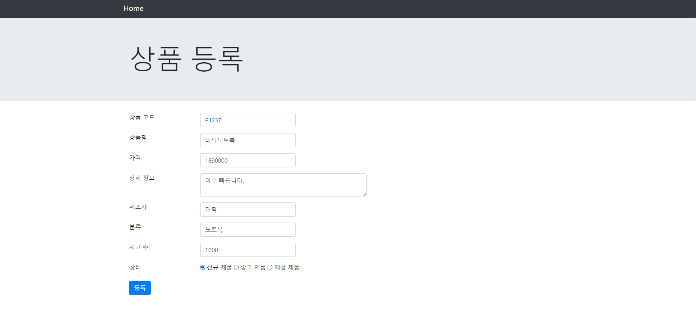

# 1교시

연습문제 풀이

# 2교시

### [addProduct.jsp] 소스

```html
<%@ page pageEncoding="UTF-8"%>
<html>
<head>
<link rel="stylesheet" 	href="https://maxcdn.bootstrapcdn.com/bootstrap/4.0.0/css/bootstrap.min.css">
<title>상품 등록</title>
</head>
<body>
	<%@ include file="menu.jsp" %>	
	<div class="jumbotron">
		<div class="container">
			<h1 class="display-3">상품 등록</h1>
		</div>
	</div>
	<div class="container">
		<form name="newProduct" action="processAddProduct.jsp" class="form-horizontal" method="post">
			<div class="form-group row">
				<label class="col-sm-2">상품 코드</label>
				<div class="col-sm-3">
					<input type="text" name="productId" id="productId" class="form-control" >
				</div>
			</div>
			<div class="form-group row">
				<label class="col-sm-2">상품명</label>
				<div class="col-sm-3">
					<input type="text" name="name" id="name" class="form-control" >
				</div>
			</div>
			<div class="form-group row">
				<label class="col-sm-2">가격</label>
				<div class="col-sm-3">
					<input type="text" name="unitPrice" id="unitPrice" class="form-control" >
				</div>
			</div>
			<div class="form-group row">
				<label class="col-sm-2">상세 정보</label>
				<div class="col-sm-5">
					<textarea name="description" cols="50" rows="2"
						class="form-control"></textarea>
				</div>
			</div>
			<div class="form-group row">
				<label class="col-sm-2">제조사</label>
				<div class="col-sm-3">
					<input type="text" name="manufacturer" class="form-control">
				</div>
			</div>
			<div class="form-group row">
				<label class="col-sm-2">분류</label>
				<div class="col-sm-3">
					<input type="text" name="category" class="form-control" >
				</div>
			</div>
			<div class="form-group row">
				<label class="col-sm-2">재고 수</label>
				<div class="col-sm-3">
					<input type="text" name="unitsInStock" id="unitsInStock" class="form-control" >
				</div>
			</div>
			<div class="form-group row">
				<label class="col-sm-2">상태</label>
				<div class="col-sm-5">
					<input type="radio" name="condition" value="New"> 신규 제품 
					<input type="radio" name="condition" value="Old"> 중고 제품 
					<input type="radio" name="condition" value="Refurbished"> 재생 제품
				</div>
			</div>
			<!--
			<div class="form-group row">
				<label class="col-sm-2">이미지</label>
				<div class="col-sm-5">
					<input type="file" name="productImage" class="form-control">
				</div>
			</div>
			-->
			<div class="form-group row">
				<div class="col-sm-offset-2 col-sm-10 ">
					<input type="submit" class="btn btn-primary" value="등록">
				</div>
			</div>
		</form>
	</div>
</body>
</html>
```

### [processAddProduct.jsp] 소스

```java
<%@page import="dao.ProductRepository"%>
<%@ page language="java" contentType="text/html; charset=UTF-8"
    pageEncoding="UTF-8"%>
<%
	request.setCharacterEncoding("UTF-8");

	String productId = request.getParameter("productId");
	String name = request.getParameter("name");
	String unitPrice = request.getParameter("unitPrice");
	String description = request.getParameter("description");
	String manufacturer = request.getParameter("manufacturer");
	String category = request.getParameter("category");
	String unitsInStock = request.getParameter("unitsInStock");
	String condition = request.getParameter("condition");
	
	// 가격을 문자에서 숫자로 변경
	Integer price = 0;
	if(unitPrice.isEmpty()) {
		price = 0;
	} else {
		price = Integer.valueOf(unitPrice);
	}
	
	// 재고수를 문자에서 숫자로 변경
	long stock = 0;
	if(unitsInStock.isEmpty()) {
		stock = 0;
	} else {
		stock = Long.valueOf(unitsInStock);
	}
	
	ProductRepository dao = ProductRepository.getInstance();

%>
```

### [ProductRepository .java] 소스

```java
package dao;

import java.util.ArrayList;

import vo.Product;

public class ProductRepository {
	// 상품 모두를 가지고 있을 리스트
	private ArrayList<Product> listOfProducts = new ArrayList<Product>();

	// 싱글톤 적용
	private static ProductRepository instance = new ProductRepository();
	public static ProductRepository getInstance() {
		return instance;
	}
	
	public ProductRepository() {
		Product phone = new Product("P1234", "iPhone 6s", 800000);
		phone.setDescription("4.7-inch, 1334X750 Renina HD display, 8-megapixel iSight Camera");
		phone.setCategory("Smart Phone");
		phone.setMenufacturer("Apple");
		phone.setUnitsInStock(1000);
		phone.setCondition("New");
		
		Product notebook = new Product("P1235", "LG PC  그램", 1500000);
		notebook.setDescription("13.3-inch, IPS LED display, 5rd Generation Intel Core processors");
		notebook.setCategory("Notebook");
		notebook.setMenufacturer("LG");
		notebook.setUnitsInStock(1000);
		notebook.setCondition("Refurbished");
		
		Product tablet = new Product("P1236", "Galaxy Tab S", 900000);
		tablet.setDescription("21.8*125.6*6.6mm, Super AMOLED display, Octa-Core processors");
		tablet.setCategory("Tablet");
		tablet.setMenufacturer("Samsung");
		tablet.setUnitsInStock(1000);
		tablet.setCondition("Old");
		
		listOfProducts.add(phone);
		listOfProducts.add(notebook);
		listOfProducts.add(tablet);
	}
	
	// 상품 전체 목록 가져오기
	public ArrayList<Product> getAllProducts() {
		return listOfProducts;
	}
	
	// 하나의 상품 가져오기
	public Product getProductById(String productId) {
		Product productById = null;
		
		for(int i = 0; i < listOfProducts.size(); i++) {
			Product product = listOfProducts.get(i);
			if(product != null && product.getProductId() != null && product.getProductId().equals(productId)) {
				productById = product;
				break;
			}
		}
		return productById;
	}
	
	// 상품 등록
	public void addProduct(Product product) {
		listOfProducts.add(product);
	}
}
```

### [processAddProduct.jsp] 소스

```java
<%@page import="vo.Product"%>
<%@page import="dao.ProductRepository"%>
<%@ page language="java" contentType="text/html; charset=UTF-8"
    pageEncoding="UTF-8"%>
<%
	request.setCharacterEncoding("UTF-8");

	String productId = request.getParameter("productId");
	String name = request.getParameter("name");
	String unitPrice = request.getParameter("unitPrice");
	String description = request.getParameter("description");
	String manufacturer = request.getParameter("manufacturer");
	String category = request.getParameter("category");
	String unitsInStock = request.getParameter("unitsInStock");
	String condition = request.getParameter("condition");
	
	// 가격을 문자에서 숫자로 변경
	Integer price = 0;
	if(unitPrice.isEmpty()) {
		price = 0;
	} else {
		price = Integer.valueOf(unitPrice);
	}
	
	// 재고수를 문자에서 숫자로 변경
	long stock = 0;
	if(unitsInStock.isEmpty()) {
		stock = 0;
	} else {
		stock = Long.valueOf(unitsInStock);
	}
	
	ProductRepository dao = ProductRepository.getInstance();

	Product product = new Product();
	product.setProductId(productId);
	product.setPname(name);
	product.setUnitPrice(price);
	product.setDescription(description);
	product.setManufacturer(manufacturer);
	product.setCategory(category);
	product.setUnitsInStock(stock);
	product.setCondition(condition);
	
	dao.addProduct(product);
	
	response.sendRedirect("products.jsp");
%>
```




## 7장 파일업로드


<br/>

① 필수적으로 선언해줘야 함(파일 업로드 핸들러 생성)

② 파일 데이터들은 list객체로 하나씩 차곡차곡 쌓아서 담는다.

`iterator()`라는 조력자를 통해서 list 안에 있는 값을 하나씩 꺼내준다.

③ `hasNex()` 메소드를 통해 다음 요소에 읽어 올 요소가 없을 때까지 반복한다.

`isFormField()` 메소드를 통해 파일인지 확인한다.

일반 데이터(true)면 일반 데이터 형식으로 꺼내오고,

파일 데이터(false)면 파일 데이터 형식으로 꺼내온다.

`getName()` 으로 가져오게 되면 파일명만 추출되는 것이 아니라, 시스템 내에 있는 **‘경로 + 파일명’**을 가져오기 때문에 `substirng(fileName.lastIndexOf("\\")+1);`을 해서 파일 경로까지 자르고 +1된 문자열부터 가져온다. 


※ 스프링에서도 xml에 설정할 때 1번 ~ 3번까지 똑같이 설정해주어야 한다.

스크립틀릿에서 설정해야 하는 기본 옵션들이다.

서버에 바로 저장하지 않고 임시 파일 tmp를 만들고 데이터가 쌓여지면, 내가 원하는 파일 형태로 변경 후 뿌려준다.

메모리 공간 크기를 설정하기 위해 **setSizeThreshold** 메소드를 사용한다.


### [fileupload03.jsp] 소스

```html
<%@ page language="java" contentType="text/html; charset=UTF-8"
    pageEncoding="UTF-8"%>
<!DOCTYPE html>
<html class="no-js" lang="zxx">
<head>
    <meta charset="utf-8" />
    <meta http-equiv="x-ua-compatible" content="ie=edge" />
    <title>쉽게 배우는 JSP 웹 프로그래밍</title>
    <meta name="description" content="" />
    <meta name="viewport" content="width=device-width, initial-scale=1" />
   <%@ include file="/pageModule/headPart.jsp" %>
</head>

<body>

    <!-- Preloader -->
    <div class="preloader">
        <div class="preloader-inner">
            <div class="preloader-icon">
                <span></span>
                <span></span>
            </div>
        </div>
    </div>

    <div class="breadcrumbs" style="padding-top:40px;">
        <div class="container">
            <div class="row align-items-center">
                <div class="col-lg-6 col-md-6 col-12">
                    <div class="breadcrumbs-content">
                        <h1 class="page-title">파일 업로드</h1>
                    </div>
                </div>
                <div class="col-lg-6 col-md-6 col-12">
                    <ul class="breadcrumb-nav">
                        <li><a href="/">INDEX</a></li>
                        <li>CH07</li>
                    </ul>
                </div>
            </div>
        </div>
    </div>

    <section class="about-us section">
        <div class="container">
            <div class="row align-items-center justify-content-center">
                <div class="col-lg-12 col-md-12 col-12">
                    <div class="content-left wow fadeInLeft" data-wow-delay=".3s">
                    	<form action="fileupload03_process.jsp" method="post" enctype="multipart/form-data">
                    		파일 : <input type="file" name="filename" /> <br/>
                    		<input type="submit" value="전송">
                    	</form>
                    </div>
                </div>
            </div>
        </div>
    </section>

    <%@ include file="/pageModule/footer.jsp" %>

    <%@ include file="/pageModule/footerPart.jsp" %>
</body>

</html>
```

# 3교시

### [fileupload03_process.jsp] 소스

```html
<%@page import="org.apache.commons.fileupload.FileItem"%>
<%@page import="java.util.Iterator"%>
<%@page import="java.util.List"%>
<%@page import="org.apache.commons.fileupload.DiskFileUpload"%>
<%@page import="java.io.File"%>
<%@ page language="java" contentType="text/html; charset=UTF-8"
    pageEncoding="UTF-8"%>
<!DOCTYPE html>
<html class="no-js" lang="zxx">
<head>
    <meta charset="utf-8" />
    <meta http-equiv="x-ua-compatible" content="ie=edge" />
    <title>쉽게 배우는 JSP 웹 프로그래밍</title>
    <meta name="description" content="" />
    <meta name="viewport" content="width=device-width, initial-scale=1" />
   <%@ include file="/pageModule/headPart.jsp" %>
</head>

<body>

    <!-- Preloader -->
    <div class="preloader">
        <div class="preloader-inner">
            <div class="preloader-icon">
                <span></span>
                <span></span>
            </div>
        </div>
    </div>

    <div class="breadcrumbs" style="padding-top:40px;">
        <div class="container">
            <div class="row align-items-center">
                <div class="col-lg-6 col-md-6 col-12">
                    <div class="breadcrumbs-content">
                        <h1 class="page-title">파일 업로드</h1>
                    </div>
                </div>
                <div class="col-lg-6 col-md-6 col-12">
                    <ul class="breadcrumb-nav">
                        <li><a href="/">INDEX</a></li>
                        <li>CH07</li>
                    </ul>
                </div>
            </div>
        </div>
    </div>

    <section class="about-us section">
        <div class="container">
            <div class="row align-items-center justify-content-center">
                <div class="col-lg-12 col-md-12 col-12">
                    <div class="content-left wow fadeInLeft" data-wow-delay=".3s">
                    	<%
                    		// 폼 페이지에서 전송된 파일을 저장할 서버의 경로를 작성
                    		String fileUploadPath = "C:\\upload";
                    		
                    		File file = new File(fileUploadPath);
                    		if(!file.exists()) {	// 설정한 경로에 폴더가 없으면
                    			file.mkdirs();		// 폴더를 만들어주세요.
                    		}
                    		
                    		// Commons-fileupload를 이용하여 파일을 업로드하려면 제일 먼저 common-fileupload 라이브러리가 필요
                    		// 파일 업로드를 위해 패키지에 포함되어 있는 DiskFileUpload 객체를 생성함.
                    		DiskFileUpload upload = new DiskFileUpload();
							// 생성된 객체를 통해 DiskFileUpload 클래스가 제공하는 메소드를 사용하여 웹 브라우저가 전송한
							// multipart/form-data 유형의 요청 파라미터를 가져옴
							// 폼 페이지에서 전송된 요청 파라미터를 전달받도록 DiskFileUpload 객체 타입의 parseRequest() 메소드를 작성
							List items = upload.parseRequest(request);
							// 폼 페이지에서 전송된 요청 파라미터를 Iterator클래스로 변환
							Iterator params = items.iterator();
							
							// 폼 페이지에서 전송된 요청 파라미터가 없을 때까지 반복하도록 Iterator 객체 타입의
							// hasNext() 메소드를 작성
							while(params.hasNext()) {
								FileItem fileItem = (FileItem)params.next();
								
								if(!fileItem.isFormField()) {	// 파일 데이터일 때
									String fileName = fileItem.getName();		// 파일명
						%>
									<p><%=fileName %>이 저장되었습니다!</p>
						<%
									// 이곳으로 업로드가 되겠습니다.
									// C:\\upload\KakaoTalk_20231102_14_56.jpg
									File newFile = new File(fileUploadPath + "/" + fileName);
									fileItem.write(newFile);			// 파일 복사
								}
							}
                    	%>
                    </div>
                </div>
            </div>
        </div>
    </section>

    <%@ include file="/pageModule/footer.jsp" %>

    <%@ include file="/pageModule/footerPart.jsp" %>
</body>

</html>
```


### [fileupload04.jsp] 소스

```html
<%@ page language="java" contentType="text/html; charset=UTF-8"
    pageEncoding="UTF-8"%>
<!DOCTYPE html>
<html class="no-js" lang="zxx">
<head>
    <meta charset="utf-8" />
    <meta http-equiv="x-ua-compatible" content="ie=edge" />
    <title>쉽게 배우는 JSP 웹 프로그래밍</title>
    <meta name="description" content="" />
    <meta name="viewport" content="width=device-width, initial-scale=1" />
   <%@ include file="/pageModule/headPart.jsp" %>
</head>

<body>

    <!-- Preloader -->
    <div class="preloader">
        <div class="preloader-inner">
            <div class="preloader-icon">
                <span></span>
                <span></span>
            </div>
        </div>
    </div>

    <div class="breadcrumbs" style="padding-top:40px;">
        <div class="container">
            <div class="row align-items-center">
                <div class="col-lg-6 col-md-6 col-12">
                    <div class="breadcrumbs-content">
                        <h1 class="page-title">파일 업로드</h1>
                    </div>
                </div>
                <div class="col-lg-6 col-md-6 col-12">
                    <ul class="breadcrumb-nav">
                        <li><a href="/">INDEX</a></li>
                        <li>CH07</li>
                    </ul>
                </div>
            </div>
        </div>
    </div>

    <section class="about-us section">
        <div class="container">
            <div class="row align-items-center justify-content-center">
                <div class="col-lg-12 col-md-12 col-12">
                    <div class="content-left wow fadeInLeft" data-wow-delay=".3s">
                    	<form action="fileupload04_process.jsp" method="post" enctype="multipart/form-data">
                    		이름 : <input type="text" name="name"/><br/>
                    		제목 : <input type="text" name="title"/><br/>
                    		파일 : <input type="file" name="filename" multiple="multiple" /> <br/>
                    		<input type="submit" value="전송">
                    	</form>
                    </div>
                </div>
            </div>
        </div>
    </section>

    <%@ include file="/pageModule/footer.jsp" %>

    <%@ include file="/pageModule/footerPart.jsp" %>
</body>

</html>
```

### [fileupload04_process.jsp] 소스

```html
<%@page import="org.apache.commons.fileupload.FileItem"%>
<%@page import="java.util.Iterator"%>
<%@page import="java.util.List"%>
<%@page import="org.apache.commons.fileupload.DiskFileUpload"%>
<%@page import="java.io.File"%>
<%@ page language="java" contentType="text/html; charset=UTF-8"
    pageEncoding="UTF-8"%>
<!DOCTYPE html>
<html class="no-js" lang="zxx">
<head>
    <meta charset="utf-8" />
    <meta http-equiv="x-ua-compatible" content="ie=edge" />
    <title>쉽게 배우는 JSP 웹 프로그래밍</title>
    <meta name="description" content="" />
    <meta name="viewport" content="width=device-width, initial-scale=1" />
   <%@ include file="/pageModule/headPart.jsp" %>
</head>

<body>

    <!-- Preloader -->
    <div class="preloader">
        <div class="preloader-inner">
            <div class="preloader-icon">
                <span></span>
                <span></span>
            </div>
        </div>
    </div>

    <div class="breadcrumbs" style="padding-top:40px;">
        <div class="container">
            <div class="row align-items-center">
                <div class="col-lg-6 col-md-6 col-12">
                    <div class="breadcrumbs-content">
                        <h1 class="page-title">파일 업로드</h1>
                    </div>
                </div>
                <div class="col-lg-6 col-md-6 col-12">
                    <ul class="breadcrumb-nav">
                        <li><a href="/">INDEX</a></li>
                        <li>CH07</li>
                    </ul>
                </div>
            </div>
        </div>
    </div>

    <section class="about-us section">
        <div class="container">
            <div class="row align-items-center justify-content-center">
                <div class="col-lg-12 col-md-12 col-12">
                    <div class="content-left wow fadeInLeft" data-wow-delay=".3s">
                    	<%
                    		request.setCharacterEncoding("UTF-8");
                    		// 폼 페이지에서 전송된 파일을 저장할 서버의 경로를 작성
                    		String fileUploadPath = "C:\\upload";
                    		
                    		File file = new File(fileUploadPath);
                    		if(!file.exists()) {	// 설정한 경로에 폴더가 없으면
                    			file.mkdirs();		// 폴더를 만들어주세요.
                    		}
                    		
                    		// Commons-fileupload를 이용하여 파일을 업로드하려면 제일 먼저 common-fileupload 라이브러리가 필요
                    		// 파일 업로드를 위해 패키지에 포함되어 있는 DiskFileUpload 객체를 생성함.
                    		DiskFileUpload upload = new DiskFileUpload();
                    		
                    		// 서버로 넘어온 파일에 대한 설정
                    		upload.setSizeMax(5 * 1024 * 1024);			// 업로드 할 파일의 최대 크기(byte)
                    		upload.setSizeThreshold(4 * 1024 * 1024);	// 메모리상에 저장할 최대 크기(byte)
                    		upload.setRepositoryPath(fileUploadPath);	// 업로드된 파일을 임시로 저장할 경로
                    		
							// 생성된 객체를 통해 DiskFileUpload 클래스가 제공하는 메소드를 사용하여 웹 브라우저가 전송한
							// multipart/form-data 유형의 요청 파라미터를 가져옴
							// 폼 페이지에서 전송된 요청 파라미터를 전달받도록 DiskFileUpload 객체 타입의 parseRequest() 메소드를 작성
							List items = upload.parseRequest(request);
							// 폼 페이지에서 전송된 요청 파라미터를 Iterator클래스로 변환
							Iterator params = items.iterator();
							
							// 폼 페이지에서 전송된 요청 파라미터가 없을 때까지 반복하도록 Iterator 객체 타입의
							// hasNext() 메소드를 작성
							int maxSize = 4 * 1024 * 1024;		// 파일 업로드 시 1개의 파일 당 사이즈(최대사이즈)
							while(params.hasNext()) {
								FileItem fileItem = (FileItem)params.next();
								
								if(fileItem.isFormField()) {	// 일반 데이터일 때
									String name = fileItem.getFieldName();		// 파라미터의 이름
									String value = fileItem.getString("UTF-8");	// 파라미터의 값
									out.println(name + " = "  + value + "<br/>");
								} else {						// 파일 데이터일 때
									String fileFieldName = fileItem.getFieldName();		// 요청 파라미터의 이름
									String fileName = fileItem.getName();				// 파일명
									String contentType = fileItem.getContentType();		// 파일 컨텐츠타입(MimeType)
									long fileSize = fileItem.getSize();					// 파일크기
									
									File newFile =new File(fileUploadPath + "/" + fileName);
									
									// 최대크기를 넘어버림(최대사이즈보다 큰 파일이 업로드됨)
									if(maxSize < fileSize) {
										out.println("파일 크기를 초과하였습니다!<br/>");
									} else {
										fileItem.write(newFile);		// 파일 복사
									}
									
									out.println("──────────────────────<br/>");
									out.println("요청 파라미터 이름 : " + fileFieldName + "<br/>");
									out.println("저장 파일이름 : " + fileName + "<br/>");
									out.println("파일 컨텐츠 타입 : " + contentType + "<br/>");
									out.println("파일 크기 : " + fileSize + "<br/>");
								}
							}
                    	%>
                    </div>
                </div>
            </div>
        </div>
    </section>

    <%@ include file="/pageModule/footer.jsp" %>

    <%@ include file="/pageModule/footerPart.jsp" %>
</body>

</html>
```


# 4교시


### [뒤로 가기](index.md)