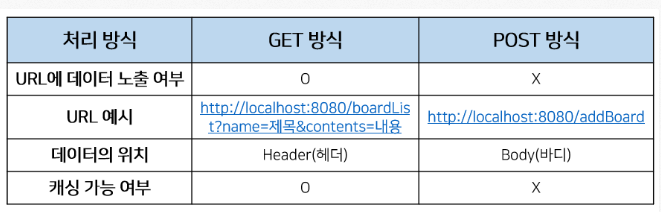

# 1교시

## GET방식, POST방식



기본적으로 브라우저에 요청할 때 **header영역**과 **body영역**으로 나눠져 데이터를 담아서 전송하게 된다. 이 때 **GET방식**으로 보내게 되면 헤더에 Key:Value형태로 담기게 되는데 Key은 쿼리스트링의  id값이고, Value는 input태그의 name값이다. 바디에는 아무 값도 안 담기게 된다.

**POST방식**으로 보내게 되면 헤더에는 쿼리스트링의 ID값이 담기고, 바디에는 내가 보내고자 하는 데이터 값들이 담기게 된다. 보안상의 이유로 POST방식을 사용하게 된다.

### GET방식

- 데이터를 가져오는 것
- URL에 정보가 담겨서 전송된다.
- input태그에 담긴 name값이 header에 담기게 된다.

### POST방식

- 데이터를 가공해서 처리하는 것
- URL 상에 전달한 정보가 표시되지 않는다.
- header의 body에 담겨서 전송된다.

### 데이터 검증 방법

개발자도구에서 내가 요청한 URL 주소를 클릭 후 **Payload**탭에서 데이터 전달 여부 확인

- key : value 형태로 검증하게 됨


### 웹 상에 파일을 저장하는 경로

`C:\upload\파일명.png` ⇒ 내 로컬 PC에서 사용하는 경로지. 서버에 접근할 수 잇는 경로를 아니다.

**톰캣에 파일이 저장되는 경로 찾기(배포된 서버 파일 경로)**

```makefile
E:\A_TeachingMaterial\07_JSP_Spring\workspace\workspace_jsp\.metadata\.plugins\org.eclipse.wst.server.core\tmp0\wtpwebapps\JSPBook\upload
```

`http://localhost/JSPBook/upload/고양이.PNG` 주소를 치면 웹 서버상에 저장된 리소스 파일을 볼 수 있다.

서버에 배포할 때는 다음같이 주소를 지정해주어야 파일을 저장할 수 있다.

`request.getContextPath()` : 배포된 서버 안의 프로젝트 폴더를 가리킨다.

**request.getServletContext().getRealPath()**로 배포된 서버 경로에 접근할 수 있다. 

### Interface ServletContext

- 파일의 MIME유형을 가져오거나 요청을 발송하거나 로그 파일에 쓰기 위해 서블릿이 서블릿 컨테이너와 통신하는데 사용하는 메서드를 정의
- JVM당 웹 어플리케이션당 하나의 컨텍스트가 존재

### **ServletContext.getRealPath(String path)**

- 웹 어플리케이션의 컨텍스트 루트를 기준으로 지정된 경로의 실제 파일 시스템 경로를 반환
- 즉, 웹 어플리케이션에서 사용되는 리소스(ex. 이미지,HTML,CSS 등)의 실제 파일 시스템 경로를 얻을 수 있다
- 웹 어플리케이션의 배포 디렉토리가 변경되더라도 어플리케이션 코드를 수정할 필요 없이 정확한 경로를 얻을 수 있도록 하는데 사용

### ※**getRealPath("/WEB-INF/images/" + fileName)**

- '/WEB-INF/images/' 이란 폴더에 'fileName'이라는 이름의 파일이 위치한 경로: '/WEB-INF/images'의 경로를 얻어오고, 이를 기준으로 파일 경로를 지정

### [ProductRepository.java] 소스

```java
package dao;

import java.util.ArrayList;

import vo.Product;

public class ProductRepository {
	// 상품 모두를 가지고 있을 리스트
	private ArrayList<Product> listOfProducts = new ArrayList<Product>();

	// 싱글톤 적용
	private static ProductRepository instance = new ProductRepository();
	public static ProductRepository getInstance() {
		return instance;
	}
	
	public ProductRepository() {
		Product phone = new Product("P1234", "iPhone 6s", 800000);
		phone.setDescription("4.7-inch, 1334X750 Renina HD display, 8-megapixel iSight Camera");
		phone.setCategory("Smart Phone");
		phone.setManufacturer("Apple");
		phone.setUnitsInStock(1000);
		phone.setCondition("New");
		phone.setFilename("P1234.png");
		
		Product notebook = new Product("P1235", "LG PC  그램", 1500000);
		notebook.setDescription("13.3-inch, IPS LED display, 5rd Generation Intel Core processors");
		notebook.setCategory("Notebook");
		notebook.setManufacturer("LG");
		notebook.setUnitsInStock(1000);
		notebook.setCondition("Refurbished");
		notebook.setFilename("P1235.png");
		
		Product tablet = new Product("P1236", "Galaxy Tab S", 900000);
		tablet.setDescription("21.8*125.6*6.6mm, Super AMOLED display, Octa-Core processors");
		tablet.setCategory("Tablet");
		tablet.setManufacturer("Samsung");
		tablet.setUnitsInStock(1000);
		tablet.setCondition("Old");
		tablet.setFilename("P1236.png");
		
		listOfProducts.add(phone);
		listOfProducts.add(notebook);
		listOfProducts.add(tablet);
	}
	
	// 상품 전체 목록 가져오기
	public ArrayList<Product> getAllProducts() {
		return listOfProducts;
	}
	
	// 하나의 상품 가져오기
	public Product getProductById(String productId) {
		Product productById = null;
		
		for(int i = 0; i < listOfProducts.size(); i++) {
			Product product = listOfProducts.get(i);
			if(product != null && product.getProductId() != null && product.getProductId().equals(productId)) {
				productById = product;
				break;
			}
		}
		return productById;
	}
	
	// 상품 등록
	public void addProduct(Product product) {
		listOfProducts.add(product);
	}
}
```

### [produts.jsp] 소스

```html
<%@page import="java.util.ArrayList"%>
<%@page import="vo.Product"%>
<%@page import="java.util.List"%>
<%@page import="dao.ProductRepository"%>
<%@ page language="java" contentType="text/html; charset=UTF-8"
    pageEncoding="UTF-8"%>
<!DOCTYPE html>
<html>
<head>
<meta charset="UTF-8">
<title>Insert title here</title>
<link rel="stylesheet" href="${pageContext.request.contextPath }/resources/css/bootstrap.min.css">
</head>
<body>
	<%@ include file="menu.jsp" %>
	<div class="jumbotron">
		<div class="container">
			<h1 class="display-3">상품 목록</h1>
		</div>
	</div>
	
	<%
		ProductRepository dao = ProductRepository.getInstance();
		ArrayList<Product> listOfProducts = dao.getAllProducts();
	%>
	
	<div class="container">
		<div class="row" align="center">
			<%
				for(int i = 0; i < listOfProducts.size(); i++) {
					Product product = listOfProducts.get(i);
			%>
			<div class="col-md-4">
				" style="width: 100%"/>
				<h3><%=product.getPname() %></h3>
				<p><%=product.getDescription() %></p>
				<p><%=product.getUnitPrice() %></p>
				<p>
					<a href="product.jsp?id=<%=product.getProductId() %>" class="btn btn-secondary" role="button">
						상세 정보 &raquo;
					</a>
				</p>
			</div>			
			<% 
				}
			%>
		</div>
		<hr/>
	</div>
	<%@ include file="footer.jsp" %>
</body>
</html>
```

### [produt.jsp] 소스

```html
<%@page import="vo.Product"%>
<%@page import="dao.ProductRepository"%>
<%@ page language="java" contentType="text/html; charset=UTF-8"
    pageEncoding="UTF-8" errorPage="exceptionNoProductId.jsp"%>
<!DOCTYPE html>
<html>
<head>
<meta charset="UTF-8">
<title>Insert title here</title>
<link rel="stylesheet" href="${pageContext.request.contextPath }/resources/css/bootstrap.min.css">
</head>
<body>
	<%@ include file="menu.jsp" %>
	<div class="jumbotron">
		<div class="container">
			<h1 class="display-3">상품 정보</h1>
		</div>
	</div>
	<%
		String id = request.getParameter("id");
		ProductRepository dao = ProductRepository.getInstance();
		Product product = dao.getProductById(id);
	%>

	<div class="container">
		<div class="row" align="center">
			<div class="col-md-5">
				" style="width: 100%"/>
			</div>
			<div class="col-md-6">
				<h3></h3>
				<p></p>
				<p><b>상품 코드 : <%=product.getProductId() %> </b><span class="badge badge-danger"></span></p>
				<p><b>제조사 : <%=product.getManufacturer() %> </b></p>
				<p><b>분류 :  <%=product.getCategory() %></b></p>
				<p><b>재고수 : <%=product.getUnitsInStock() %></b></p>
				<h4><%=product.getUnitPrice() %>원</h4>
				<form action="addCart.jsp?id=" method="post" name="addForm">
					<p>
						<a href="#" class="btn btn-info">상품 주문 &raquo;</a>
						<a href="cart.jsp" class="btn btn-warning">장바구니 &raquo;</a>
						<a href="products.jsp" class="btn btn-secondary">상품 목록 &raquo;</a>
					</p>
				</form>
			</div>
		</div>
		<hr/>
	</div>
	<%@ include file="footer.jsp" %>
</body>
</html>
```

### [addProduct.jsp] 소스

```html
<%@ page pageEncoding="UTF-8"%>
<html>
<head>
<link rel="stylesheet" 	href="https://maxcdn.bootstrapcdn.com/bootstrap/4.0.0/css/bootstrap.min.css">
<title>상품 등록</title>
</head>
<body>
	<%@ include file="menu.jsp" %>	
	<div class="jumbotron">
		<div class="container">
			<h1 class="display-3">상품 등록</h1>
		</div>
	</div>
	<div class="container">
		<form name="newProduct" action="processAddProduct.jsp" class="form-horizontal" method="post">
			<div class="form-group row">
				<label class="col-sm-2">상품 코드</label>
				<div class="col-sm-3">
					<input type="text" name="productId" id="productId" class="form-control" >
				</div>
			</div>
			<div class="form-group row">
				<label class="col-sm-2">상품명</label>
				<div class="col-sm-3">
					<input type="text" name="name" id="name" class="form-control" >
				</div>
			</div>
			<div class="form-group row">
				<label class="col-sm-2">가격</label>
				<div class="col-sm-3">
					<input type="text" name="unitPrice" id="unitPrice" class="form-control" >
				</div>
			</div>
			<div class="form-group row">
				<label class="col-sm-2">상세 정보</label>
				<div class="col-sm-5">
					<textarea name="description" cols="50" rows="2"
						class="form-control"></textarea>
				</div>
			</div>
			<div class="form-group row">
				<label class="col-sm-2">제조사</label>
				<div class="col-sm-3">
					<input type="text" name="manufacturer" class="form-control">
				</div>
			</div>
			<div class="form-group row">
				<label class="col-sm-2">분류</label>
				<div class="col-sm-3">
					<input type="text" name="category" class="form-control" >
				</div>
			</div>
			<div class="form-group row">
				<label class="col-sm-2">재고 수</label>
				<div class="col-sm-3">
					<input type="text" name="unitsInStock" id="unitsInStock" class="form-control" >
				</div>
			</div>
			<div class="form-group row">
				<label class="col-sm-2">상태</label>
				<div class="col-sm-5">
					<input type="radio" name="condition" value="New"> 신규 제품 
					<input type="radio" name="condition" value="Old"> 중고 제품 
					<input type="radio" name="condition" value="Refurbished"> 재생 제품
				</div>
			</div>
			<div class="form-group row">
				<label class="col-sm-2">이미지</label>
				<div class="col-sm-5">
					<input type="file" name="productImage" class="form-control">
				</div>
			</div>
			<div class="form-group row">
				<div class="col-sm-offset-2 col-sm-10 ">
					<input type="submit" class="btn btn-primary" value="등록">
				</div>
			</div>
		</form>
	</div>
</body>
</html>
```

# 2교시

**String realFolder = request.getRealPath("/") + "upload";**

유지보수 기간이 끝나서 이방법을 사용하지 않는다.


### [processAddProduct.jsp] 소스

```java
<%@page import="org.apache.commons.fileupload.FileItem"%>
<%@page import="java.util.Iterator"%>
<%@page import="java.util.List"%>
<%@page import="org.apache.commons.fileupload.DiskFileUpload"%>
<%@page import="java.io.File"%>
<%@page import="vo.Product"%>
<%@page import="dao.ProductRepository"%>
<%@ page language="java" contentType="text/html; charset=UTF-8"
    pageEncoding="UTF-8"%>
<%
	request.setCharacterEncoding("UTF-8");

	// String realFolder = request.getRealPath("/") + "upload";
	// 웹 애플리케이션상의 절대 경로
	String realFolder = request.getServletContext().getRealPath("/resources/images");
	String encType = "UTF-8";			// 인코딩 타입
	
	int maxSize = 5 * 1024 * 1024;		// 최대 업로드 될 파일 크기(5MB)

	File folder = new File(realFolder);
	if(!folder.exists()) {
		folder.mkdirs();
	}
	
	DiskFileUpload upload = new DiskFileUpload();
	upload.setSizeMax(1000000);					// 최대 크기
	upload.setSizeThreshold(maxSize);			// 메모리상에 저장할 최대크기(byte)
	upload.setRepositoryPath(realFolder);		// 업로드 된 파일을 임시로 저장할 경로
	
	List items = upload.parseRequest(request);		
	Iterator params = items.iterator();
	
	String productId = "";
	String name = "";
	String unitPrice = "";
	String description = "";
	String manufacturer = "";
	String category = "";
	String unitsInStock = "";
	String condition = "";
	String fileName = "";
	
	// 일반적인 데이터를 저장할 때 사용 방법1
	
	/*
	String productId = request.getParameter("productId");
	String name = request.getParameter("name");
	String unitPrice = request.getParameter("unitPrice");
	String description = request.getParameter("description");
	String manufacturer = request.getParameter("manufacturer");
	String category = request.getParameter("category");
	String unitsInStock = request.getParameter("unitsInStock");
	String condition = request.getParameter("condition");
	*/
	
	while(params.hasNext()) {
		FileItem item = (FileItem) params.next();
		
		if(item.isFormField()) {	// 일반 데이터일 때
			String fieldName = item.getFieldName();
			
			// 일반적인 input 요소로 넘어온 name(key)을 이용하여 값을 할당
			if(fieldName.equals("productId")) {
				productId = item.getString(encType);
			} else if(fieldName.equals("name")) {
				name = item.getString(encType);
			} else if(fieldName.equals("unitPrice")) {
				unitPrice = item.getString(encType);
			} else if(fieldName.equals("description")) {
				description = item.getString(encType);
			} else if(fieldName.equals("manufacturer")) {
				manufacturer = item.getString(encType);
			} else if(fieldName.equals("category")) {
				category = item.getString(encType);
			} else if(fieldName.equals("unitsInStock")) {
				unitsInStock = item.getString(encType);
			} else if(fieldName.equals("condition")) {
				condition = item.getString(encType);
			}
		} else {						// 파일 데이터일 때
			String FileFieldName = item.getFieldName();		// 요청 파라미터 이름
			fileName = item.getName();	// 저장 파일의 이름
			String contentType = item.getContentType();		// 파일 컨텐츠 타입
			long fileSize = item.getSize();		// 파일 크기 정보
			File saveFile = new File(realFolder + "/" + fileName);
			item.write(saveFile);		// 파일 복사
		}
	}
	
	// 가격을 문자에서 숫자로 변경
	Integer price = 0;
	if(unitPrice.isEmpty()) {
		price = 0;
	} else {
		price = Integer.valueOf(unitPrice);
	}
	
	// 재고수를 문자에서 숫자로 변경
	long stock = 0;
	if(unitsInStock.isEmpty()) {
		stock = 0;
	} else {
		stock = Long.valueOf(unitsInStock);
	}
	
	ProductRepository dao = ProductRepository.getInstance();

	Product product = new Product();
	product.setProductId(productId);
	product.setPname(name);
	product.setUnitPrice(price);
	product.setDescription(description);
	product.setManufacturer(manufacturer);
	product.setCategory(category);
	product.setUnitsInStock(stock);
	product.setCondition(condition);
	product.setFilename(fileName);
	
	dao.addProduct(product);
	
	response.sendRedirect("products.jsp");
%>
```

### [addProduct.jsp] 소스

```html
<%@ page pageEncoding="UTF-8"%>
<html>
<head>
<link rel="stylesheet" 	href="https://maxcdn.bootstrapcdn.com/bootstrap/4.0.0/css/bootstrap.min.css">
<title>상품 등록</title>
</head>
<body>
	<%@ include file="menu.jsp" %>	
	<div class="jumbotron">
		<div class="container">
			<h1 class="display-3">상품 등록</h1>
		</div>
	</div>
	<div class="container">
		<form name="newProduct" action="processAddProduct.jsp" class="form-horizontal" method="post" enctype="multipart/form-data">
			<div class="form-group row">
				<label class="col-sm-2">상품 코드</label>
				<div class="col-sm-3">
					<input type="text" name="productId" id="productId" class="form-control" >
				</div>
			</div>
			<div class="form-group row">
				<label class="col-sm-2">상품명</label>
				<div class="col-sm-3">
					<input type="text" name="name" id="name" class="form-control" >
				</div>
			</div>
			<div class="form-group row">
				<label class="col-sm-2">가격</label>
				<div class="col-sm-3">
					<input type="text" name="unitPrice" id="unitPrice" class="form-control" >
				</div>
			</div>
			<div class="form-group row">
				<label class="col-sm-2">상세 정보</label>
				<div class="col-sm-5">
					<textarea name="description" cols="50" rows="2"
						class="form-control"></textarea>
				</div>
			</div>
			<div class="form-group row">
				<label class="col-sm-2">제조사</label>
				<div class="col-sm-3">
					<input type="text" name="manufacturer" class="form-control">
				</div>
			</div>
			<div class="form-group row">
				<label class="col-sm-2">분류</label>
				<div class="col-sm-3">
					<input type="text" name="category" class="form-control" >
				</div>
			</div>
			<div class="form-group row">
				<label class="col-sm-2">재고 수</label>
				<div class="col-sm-3">
					<input type="text" name="unitsInStock" id="unitsInStock" class="form-control" >
				</div>
			</div>
			<div class="form-group row">
				<label class="col-sm-2">상태</label>
				<div class="col-sm-5">
					<input type="radio" name="condition" value="New"> 신규 제품 
					<input type="radio" name="condition" value="Old"> 중고 제품 
					<input type="radio" name="condition" value="Refurbished"> 재생 제품
				</div>
			</div>
			<div class="form-group row">
				<label class="col-sm-2">이미지</label>
				<div class="col-sm-5">
					<input type="file" name="productImage" class="form-control">
				</div>
			</div>
			<div class="form-group row">
				<div class="col-sm-offset-2 col-sm-10 ">
					<input type="submit" class="btn btn-primary" value="등록">
				</div>
			</div>
		</form>
	</div>
</body>
</html>
```


```markdown
05장 내장 객체 : 상품 상세 정보 표시하기

	01. 폼 페이지에서 입력된 데이터를 전달하는 요청 파라미터 값을 JSP 페이지로 가져오는 내장 객체는 무엇인지, 그리고 관련된 메소드에 대해 간단히
	설명하시오.
	
		request 내장 객체
		
		──────────────────────────────────────────────────────────────────────────────────────────────────
		요청 파라미터 관련 메소드				|	형식					|	설명
		──────────────────────────────────────────────────────────────────────────────────────────────────			
		getParameter(String name)		|	String				| 요청 파라미터 이름이 name인 값을 전달받습니다.
		getParameterValues(String name) |	String[]			| 모든 요청 파라미터 이름이 name인 값을 배열 형태로
										|						| 전달받습니다. 요청 파라미터 값이 없으면 null을 반환
		getParameterNames()				|	Enumeration			| 모든 요청 파라미터의 이름과 값을 Enumeration 객체
										|						| 타입으로 전달받습니다.
		getParameterMap()				|						| 모든 요청 파라미터의 이름과 값을 Map 객체 타입으로
										|						| 전달받습니다. (Map 객체 타입은 (파라미터 이름, 값)
										|						| 형식으로 구성됩니다.)		
		──────────────────────────────────────────────────────────────────────────────────────────────────		
	
	02. 서버에서 웹 브라우저에 다른 페이지로 강제 이동하도록 명력하는 내장 객체와 관련된 메소드는 무엇인가?
	
		response 내장 객체
		
		──────────────────────────────────────────────────────────────────────────────────────────────────
		페이지 이동 관련 메소드				|	반환 유형					|	설명
		──────────────────────────────────────────────────────────────────────────────────────────────────	
		sendRedirect(url)				|	void					| 설정한 URL 페이지로 강제 이동합니다.
		──────────────────────────────────────────────────────────────────────────────────────────────────

	03. 스크립트 태그의 표현문과 같이 데이터를 출력하는 내장 객체는 무엇인가?
	
		out 내장 객체
```

## 8장 유효성 검사


# 3교시

### [validation.jsp] 소스

```html
<%@ page language="java" contentType="text/html; charset=UTF-8"
    pageEncoding="UTF-8"%>
<!DOCTYPE html>
<html class="no-js" lang="zxx">
<head>
    <meta charset="utf-8" />
    <meta http-equiv="x-ua-compatible" content="ie=edge" />
    <title>쉽게 배우는 JSP 웹 프로그래밍</title>
    <meta name="description" content="" />
    <meta name="viewport" content="width=device-width, initial-scale=1" />
   <%@ include file="/pageModule/headPart.jsp" %>
</head>

<body>

    <!-- Preloader -->
    <div class="preloader">
        <div class="preloader-inner">
            <div class="preloader-icon">
                <span></span>
                <span></span>
            </div>
        </div>
    </div>

    <div class="breadcrumbs" style="padding-top:40px;">
        <div class="container">
            <div class="row align-items-center">
                <div class="col-lg-6 col-md-6 col-12">
                    <div class="breadcrumbs-content">
                        <h1 class="page-title">유효성 검사</h1>
                    </div>
                </div>
                <div class="col-lg-6 col-md-6 col-12">
                    <ul class="breadcrumb-nav">
                        <li><a href="/">INDEX</a></li>
                        <li>CH08</li>
                    </ul>
                </div>
            </div>
        </div>
    </div>

    <section class="about-us section">
        <div class="container">
            <div class="row align-items-center justify-content-center">
                <div class="col-lg-12 col-md-12 col-12">
                    <div class="content-left wow fadeInLeft" data-wow-delay=".3s">
                    	<!-- 자바스크립트 onsubmit 이벤트 -->
                    	<form name="loginForm" action="process.jsp" method="get">
                    		아이디 : <input type="text" name="id" /><br/>
                    		비밀번호 : <input type="text" name="pw" /><br/>
                    		<input type="submit" value="전송">
                    	</form>
                    	<!-- jQuery form을 이용한 submit 이벤트 -->
                    	<form action="process.jsp" method="get" id="loginForm2">
                	               아이디 : <input type="text" name="id2" id="id2" /><br/>
                    		비밀번호 : <input type="text" name="pw2" id="pw2" /><br/>
                    		<input type="submit" value="전송">
                    	</form>
                    	<!-- jQuery click 이벤트 -->
                    	<form action="process.jsp" method="get" id="loginForm3">
                	               아이디 : <input type="text" name="id2" id="id3" /><br/>
                    		비밀번호 : <input type="text" name="pw2" id="id3" /><br/>
                    		<input type="submit" value="전송">
                    	</form>
                    </div>
                </div>
            </div>
        </div>
    </section>

    <%@ include file="/pageModule/footer.jsp" %>

    <%@ include file="/pageModule/footerPart.jsp" %>
</body>

</html>
```

### [headPart.jsp] 소스

```html
<%@ page language="java" contentType="text/html; charset=UTF-8"
    pageEncoding="UTF-8"%>
    <link rel="shortcut icon" type="image/x-icon" href="assets/images/favicon.svg" />
    <link href="https://fonts.googleapis.com/css2?family=Jost:ital,wght@0,100;0,200;0,300;0,400;0,500;0,600;0,700;0,800;0,900;1,100;1,200;1,300;1,400;1,500;1,600;1,700;1,800;1,900&display=swap" rel="stylesheet">
    <link href="https://fonts.googleapis.com/css2?family=Lato&display=swap" rel="stylesheet">
    <link rel="stylesheet" href="${pageContext.request.contextPath }/resources/assets/css/bootstrap.min.css" />
    <link rel="stylesheet" href="${pageContext.request.contextPath }/resources/assets/css/LineIcons.2.0.css" />
    <link rel="stylesheet" href="${pageContext.request.contextPath }/resources/assets/css/animate.css" />
    <link rel="stylesheet" href="${pageContext.request.contextPath }/resources/assets/css/tiny-slider.css" />
    <link rel="stylesheet" href="${pageContext.request.contextPath }/resources/assets/css/glightbox.min.css" />
    <link rel="stylesheet" href="${pageContext.request.contextPath }/resources/assets/css/main.css" />
    <script src="https://ajax.googleapis.com/ajax/libs/jquery/3.7.1/jquery.min.js"></script>
```


**onsubmit**은 조건에 따라 form을 서버에 전송할 수 있게 한다.

true/false값으로 제어할 수 있다. true일 때 서버에 데이터를 보낼 수 있고, false일 때는 서버에 전송할 수 없다.

### [validation.jsp] 소스

```html
<%@ page language="java" contentType="text/html; charset=UTF-8"
    pageEncoding="UTF-8"%>
<!DOCTYPE html>
<html class="no-js" lang="zxx">
<head>
    <meta charset="utf-8" />
    <meta http-equiv="x-ua-compatible" content="ie=edge" />
    <title>쉽게 배우는 JSP 웹 프로그래밍</title>
    <meta name="description" content="" />
    <meta name="viewport" content="width=device-width, initial-scale=1" />
   <%@ include file="/pageModule/headPart.jsp" %>
</head>

<body>

    <!-- Preloader -->
    <div class="preloader">
        <div class="preloader-inner">
            <div class="preloader-icon">
                <span></span>
                <span></span>
            </div>
        </div>
    </div>

    <div class="breadcrumbs" style="padding-top:40px;">
        <div class="container">
            <div class="row align-items-center">
                <div class="col-lg-6 col-md-6 col-12">
                    <div class="breadcrumbs-content">
                        <h1 class="page-title">유효성 검사</h1>
                    </div>
                </div>
                <div class="col-lg-6 col-md-6 col-12">
                    <ul class="breadcrumb-nav">
                        <li><a href="/">INDEX</a></li>
                        <li>CH08</li>
                    </ul>
                </div>
            </div>
        </div>
    </div>

    <section class="about-us section">
        <div class="container">
            <div class="row align-items-center justify-content-center">
                <div class="col-lg-12 col-md-12 col-12">
                    <div class="content-left wow fadeInLeft" data-wow-delay=".3s">
                    	<!-- 자바스크립트 onsubmit 이벤트 -->
                    	<form name="loginForm" action="process.jsp" method="get" onsubmit="return submitEvent();">
                    		아이디 : <input type="text" name="id" /><br/>
                    		비밀번호 : <input type="text" name="pw" /><br/>
                    		<input type="submit" value="전송">
                    	</form>
                    	
                    	<!-- jQuery form을 이용한 submit 이벤트 -->
                    	<form action="process.jsp" method="get" id="loginForm2">
                	               아이디 : <input type="text" name="id2" id="id2" /><br/>
                    		비밀번호 : <input type="text" name="pw2" id="pw2" /><br/>
                    		<input type="submit" value="전송">
                    	</form>
                    	
                    	<!-- jQuery click 이벤트 -->
                    	<form action="process.jsp" method="get" id="loginForm3">
                	               아이디 : <input type="text" name="id2" id="id3" /><br/>
                    		비밀번호 : <input type="text" name="pw2" id="id3" /><br/>
                    		<input type="submit" value="전송">
                    	</form>
                    </div>
                </div>
            </div>
        </div>
    </section>

    <%@ include file="/pageModule/footer.jsp" %>

    <%@ include file="/pageModule/footerPart.jsp" %>
    <script type="text/javascript">
    	// 자바스크립트 onsubmit 이벤트 처리
    	function submitEvent() {
    		console.log("Submit Event...!");
    		alert("Submit Event...!");
    		
    		var id = document.loginForm.id.value;
    		var pw = document.loginForm.pw.value;
    		
    		if(id == "") {
	    		alert("아이디가 누락되었습니다.");
    			return false;
    		}
    		if(pw == "") {
	    		alert("비밀번호가 누락되었습니다.");
    			return false;
    		}
    	}
    </script>
</body>

</html>
```

### [process.jsp] 소스

```html
<%@ page language="java" contentType="text/html; charset=UTF-8"
    pageEncoding="UTF-8"%>
<!DOCTYPE html>
<html class="no-js" lang="zxx">
<head>
    <meta charset="utf-8" />
    <meta http-equiv="x-ua-compatible" content="ie=edge" />
    <title>쉽게 배우는 JSP 웹 프로그래밍</title>
    <meta name="description" content="" />
    <meta name="viewport" content="width=device-width, initial-scale=1" />
   <%@ include file="/pageModule/headPart.jsp" %>
</head>

<body>

    <!-- Preloader -->
    <div class="preloader">
        <div class="preloader-inner">
            <div class="preloader-icon">
                <span></span>
                <span></span>
            </div>
        </div>
    </div>

    <div class="breadcrumbs" style="padding-top:40px;">
        <div class="container">
            <div class="row align-items-center">
                <div class="col-lg-6 col-md-6 col-12">
                    <div class="breadcrumbs-content">
                        <h1 class="page-title">유효성 검사</h1>
                    </div>
                </div>
                <div class="col-lg-6 col-md-6 col-12">
                    <ul class="breadcrumb-nav">
                        <li><a href="/">INDEX</a></li>
                        <li>CH08</li>
                    </ul>
                </div>
            </div>
        </div>
    </div>

    <section class="about-us section">
        <div class="container">
            <div class="row align-items-center justify-content-center">
                <div class="col-lg-12 col-md-12 col-12">
                    <div class="content-left wow fadeInLeft" data-wow-delay=".3s">
                    	<%
                    		request.setCharacterEncoding("UTF-8");
                    	
                    		String id = request.getParameter("id");
                    		String pw = request.getParameter("pw");
                    		
                    		out.println("아이디 : " + id + "<br/>");
                    		out.println("비밀번호 : " + pw + "<br/>");
                    	%>
                    </div>
                </div>
            </div>
        </div>
    </section>

    <%@ include file="/pageModule/footer.jsp" %>

    <%@ include file="/pageModule/footerPart.jsp" %>
    <script type="text/javascript">
    	// 자바스크립트 onsubmit 이벤트 처리
    	function submitEvent() {
    		console.log("Submit Event...!");
    		alert("Submit Event...!");
    		
    		var id = document.loginForm.id.value;
    		var pw = document.loginForm.pw.value;
    		
    		if(id == "") {
	    		alert("아이디가 누락되었습니다.");
    			return false;
    		}
    		if(pw == "") {
	    		alert("비밀번호가 누락되었습니다.");
    			return false;
    		}
    	}
    </script>
</body>

</html>
```


**loginForm2폼태그**에 대한 주소값을 **loginForm2 변수**에 담는다.

- 메모리 낭비가 될 수 있으므로 이렇게 사용하는 것을 권장한다.

### [validation.jsp] 소스

```html
<%@ page language="java" contentType="text/html; charset=UTF-8"
    pageEncoding="UTF-8"%>
<!DOCTYPE html>
<html class="no-js" lang="zxx">
<head>
    <meta charset="utf-8" />
    <meta http-equiv="x-ua-compatible" content="ie=edge" />
    <title>쉽게 배우는 JSP 웹 프로그래밍</title>
    <meta name="description" content="" />
    <meta name="viewport" content="width=device-width, initial-scale=1" />
   <%@ include file="/pageModule/headPart.jsp" %>
</head>

<body>

    <!-- Preloader -->
    <div class="preloader">
        <div class="preloader-inner">
            <div class="preloader-icon">
                <span></span>
                <span></span>
            </div>
        </div>
    </div>

    <div class="breadcrumbs" style="padding-top:40px;">
        <div class="container">
            <div class="row align-items-center">
                <div class="col-lg-6 col-md-6 col-12">
                    <div class="breadcrumbs-content">
                        <h1 class="page-title">유효성 검사</h1>
                    </div>
                </div>
                <div class="col-lg-6 col-md-6 col-12">
                    <ul class="breadcrumb-nav">
                        <li><a href="/">INDEX</a></li>
                        <li>CH08</li>
                    </ul>
                </div>
            </div>
        </div>
    </div>

    <section class="about-us section">
        <div class="container">
            <div class="row align-items-center justify-content-center">
                <div class="col-lg-12 col-md-12 col-12">
                    <div class="content-left wow fadeInLeft" data-wow-delay=".3s">
                    	<!-- 자바스크립트 onsubmit 이벤트 -->
                    	<form name="loginForm" action="process.jsp" method="get" onsubmit="return submitEvent();">
                    		아이디 : <input type="text" name="id" /><br/>
                    		비밀번호 : <input type="text" name="pw" /><br/>
                    		<input type="submit" value="전송">
                    	</form>
                    	
                    	<!-- jQuery form을 이용한 submit 이벤트 -->
                    	<form action="process.jsp" method="get" id="loginForm2">
                	               아이디 : <input type="text" name="id2" id="id2" /><br/>
                    		비밀번호 : <input type="text" name="pw2" id="pw2" /><br/>
                    		<input type="submit" value="전송">
                    	</form>
                    	
                    	<!-- jQuery click 이벤트 -->
                    	<form action="process.jsp" method="get" id="loginForm3">
                	               아이디 : <input type="text" name="id2" id="id3" /><br/>
                    		비밀번호 : <input type="text" name="pw2" id="id3" /><br/>
                    		<input type="submit" value="전송">
                    	</form>
                    </div>
                </div>
            </div>
        </div>
    </section>

    <%@ include file="/pageModule/footer.jsp" %>

    <%@ include file="/pageModule/footerPart.jsp" %>
    <script type="text/javascript">
    	// 자바스크립트 onsubmit 이벤트 처리
    	function submitEvent() {
    		console.log("Submit Event...!");
    		alert("Submit Event...!");
    		
    		var id = document.loginForm.id.value;
    		var pw = document.loginForm.pw.value;
    		
    		if(id == "") {
	    		alert("아이디가 누락되었습니다.");
    			return false;
    		}
    		if(pw == "") {
	    		alert("비밀번호가 누락되었습니다.");
    			return false;
    		}
    	}
    	// 제이쿼리를 통한 이벤트 처리
    	$(function(){
    		var loginForm2 = $('#loginForm2');
    		
				loginForm2.submit(function(event){
    			event.preventDefault();			// 들어온 이벤트를 block
    			var id = $('#id2').val();
    			var pw = $('#pw2').val();
    			
        		if(id == "") {
    	    		alert("아이디가 누락되었습니다.");
        			return false;
        		}
        		if(pw == "") {
    	    		alert("비밀번호가 누락되었습니다.");
        			return false;
        		}
        		loginForm2.submit();
    		})
    	});
    </script>
</body>

</html>
```

**bubbling**은 특정 요소에서 event가 발생했을 때 상위 요소로 event가 전파되는 것을 의미합니다.

### 이벤트 전파를 중단하는 방법


### [validation.jsp] 소스

```html
<%@ page language="java" contentType="text/html; charset=UTF-8"
    pageEncoding="UTF-8"%>
<!DOCTYPE html>
<html class="no-js" lang="zxx">
<head>
    <meta charset="utf-8" />
    <meta http-equiv="x-ua-compatible" content="ie=edge" />
    <title>쉽게 배우는 JSP 웹 프로그래밍</title>
    <meta name="description" content="" />
    <meta name="viewport" content="width=device-width, initial-scale=1" />
   <%@ include file="/pageModule/headPart.jsp" %>
</head>

<body>

    <!-- Preloader -->
    <div class="preloader">
        <div class="preloader-inner">
            <div class="preloader-icon">
                <span></span>
                <span></span>
            </div>
        </div>
    </div>

    <div class="breadcrumbs" style="padding-top:40px;">
        <div class="container">
            <div class="row align-items-center">
                <div class="col-lg-6 col-md-6 col-12">
                    <div class="breadcrumbs-content">
                        <h1 class="page-title">유효성 검사</h1>
                    </div>
                </div>
                <div class="col-lg-6 col-md-6 col-12">
                    <ul class="breadcrumb-nav">
                        <li><a href="/">INDEX</a></li>
                        <li>CH08</li>
                    </ul>
                </div>
            </div>
        </div>
    </div>

    <section class="about-us section">
        <div class="container">
            <div class="row align-items-center justify-content-center">
                <div class="col-lg-12 col-md-12 col-12">
                    <div class="content-left wow fadeInLeft" data-wow-delay=".3s">
                    	<!-- 자바스크립트 onsubmit 이벤트 -->
                    	<form name="loginForm" action="process.jsp" method="get" onsubmit="return submitEvent();">
                    		아이디 : <input type="text" name="id" /><br/>
                    		비밀번호 : <input type="text" name="pw" /><br/>
                    		<input type="submit" value="전송">
                    	</form>
                    	
                    	<!-- jQuery form을 이용한 submit 이벤트 -->
                    	<form action="process.jsp" method="get" id="loginForm2">
                	               아이디 : <input type="text" name="id2" id="id2" /><br/>
                    		비밀번호 : <input type="text" name="pw2" id="pw2" /><br/>
                    		<input type="submit" value="전송">
                    	</form>
                    	
                    	<!-- jQuery click 이벤트 -->
                    	<form action="process.jsp" method="get" id="loginForm3">
                	               아이디 : <input type="text" name="id2" id="id3" /><br/>
                    		비밀번호 : <input type="text" name="pw3" id="pw3" /><br/>
                    		<input type="button" value="전송" id="loginBtn">
                    	</form>
                    </div>
                </div>
            </div>
        </div>
    </section>

    <%@ include file="/pageModule/footer.jsp" %>

    <%@ include file="/pageModule/footerPart.jsp" %>
    <script type="text/javascript">
    	// 자바스크립트 onsubmit 이벤트 처리
    	function submitEvent() {
    		console.log("Submit Event...!");
    		alert("Submit Event...!");
    		
    		var id = document.loginForm.id.value;
    		var pw = document.loginForm.pw.value;
    		
    		if(id == "") {
	    		alert("아이디가 누락되었습니다.");
    			return false;
    		}
    		if(pw == "") {
	    		alert("비밀번호가 누락되었습니다.");
    			return false;
    		}
    	}
    	// 제이쿼리를 통한 이벤트 처리
    	$(function(){
    		var loginForm2 = $('#loginForm2');

    		var loginForm3 = $('#loginForm3');
    		var loginBtn = $('#loginBtn');
    		
    		loginForm2.submit(function(event){
    			event.preventDefault();			// 들어온 이벤트를 block
    			var id = $('#id2').val();
    			var pw = $('#pw2').val();
    			
        		if(id == "") {
    	    		alert("아이디가 누락되었습니다.");
        			return false;
        		}
        		if(pw == "") {
    	    		alert("비밀번호가 누락되었습니다.");
        			return false;
        		}
        		loginForm2.submit();
    		})
    
    		loginBtn.on("click", function(){
    			var id = $('#id3').val();
    			var pw = $('#pw3').val();
    			
        		if(id == "") {
    	    		alert("아이디가 누락되었습니다.");
        			return false;
        		}
        		if(pw == "") {
    	    		alert("비밀번호가 누락되었습니다.");
        			return false;
        		}
        		loginForm3.submit();
    		})
    	});
    </script>
</body>

</html>
```


# 4교시

```markdown

input type button/submint은 아주 예전부터 익히 사용되어 왔던 대표적인 버튼 Element이다.
브라우저 엔진 버전과 html 버전이 업그레이드 되면서 input type button/submit만이 대체할 수 없는
부분들이 발견되어 새롭게 만들어진 태그가 button태그이다. input type button/submit은 end태그
로서의 활용이 어려워(</input>) CSS를 활용하여 또는 태그들을 활용하여 버튼을 꾸미는데 제약이 많이 걸렸다.
button 태그는 몸체를 꾸밀 수 있다는 장점도 있어 CSS를 활용하는 건 물론 버튼 태그 내에 다양한 태그를 활용하여
버튼을 꾸밀 수 있다.
그리고 input type button에서 제공되는 click, submit 또한 제공된다.

우리가 다양하게 사용하고 있는 버튼 이벤트들 중, submit이라는 이벤트는 기본적으로 form태그 내에 있는
input 요소들의 데이터를 읽어 action에 설정되어 있는 경로로 데이터를 보내주는 역할을 하는데, submit()
이벤트 자체만으로 본다면 브라우저마다의 엔진별 특징이 조금씩 다르다. 그리고 submit() 이벤트 자체에 컨트롤이
생각보다 어려운 것도 사실이다. 대표적으로는 브라우저의 엔진별 로직과 시점이다. 사용자가 사용하는 다양한
환경의 needs를 맞춰 개발하기란 쉽지 않지만 누구나 사용가능한 공통적인 처리 로직을 구현하는건 어렵지 않다.
개발자들 사이에서 관례로 사용되는 내용들이 여기에도 포함된다.
(ex, ServiceImpl에서 Impl은 인터페이스를 implemnets했다는 증거)
- input type submit 버튼에는 onclick 요소를 활용하여 클릭 이벤트를 함께 주지 않는다.
	> click과 submit 이벤트의 시점과 브라우저 버전별, 엔진 처리 로직의 차이 때문
	
	# onsubmit 속성 이벤트 활용
	- onsubmit 이벤트는 모든 브라우저 지원
	- ousubmit = "return 함수명"으로 사용
		> return을 부여하는건 해당 함수가 실행될 때, 정상적으로 처리되면 true, 값의 필터에 의해 처리 결과가
		    비정상적일 땐 false를 리턴한다.
		> 이때, submit 이벤트가 발생하지 않는다.

	# onclick 속성 이벤트 활용
	- input type button의 onclick 속성의 요소를 활용
	- input type button Element에 "click" 이벤트 활용
```


### [validation01.jsp] 소스

```html
<%@ page language="java" contentType="text/html; charset=UTF-8"
    pageEncoding="UTF-8"%>
<!DOCTYPE html>
<html class="no-js" lang="zxx">
<head>
    <meta charset="utf-8" />
    <meta http-equiv="x-ua-compatible" content="ie=edge" />
    <title>쉽게 배우는 JSP 웹 프로그래밍</title>
    <meta name="description" content="" />
    <meta name="viewport" content="width=device-width, initial-scale=1" />
   <%@ include file="/pageModule/headPart.jsp" %>
</head>

<body>

    <!-- Preloader -->
    <div class="preloader">
        <div class="preloader-inner">
            <div class="preloader-icon">
                <span></span>
                <span></span>
            </div>
        </div>
    </div>

    <div class="breadcrumbs" style="padding-top:40px;">
        <div class="container">
            <div class="row align-items-center">
                <div class="col-lg-6 col-md-6 col-12">
                    <div class="breadcrumbs-content">
                        <h1 class="page-title">유효성 검사</h1>
                    </div>
                </div>
                <div class="col-lg-6 col-md-6 col-12">
                    <ul class="breadcrumb-nav">
                        <li><a href="/">INDEX</a></li>
                        <li>CH08</li>
                    </ul>
                </div>
            </div>
        </div>
    </div>

    <section class="about-us section">
        <div class="container">
            <div class="row align-items-center justify-content-center">
                <div class="col-lg-12 col-md-12 col-12">
                    <div class="content-left wow fadeInLeft" data-wow-delay=".3s">
                    	<h3>Javascript 버전</h3>
                    	<form name="loginForm" action="process.jsp">
                    		아이디 : <input type="text" name="id" /><br/>
                    		비밀번호 : <input type="text" name="pw" /><br/>
                    		<input type="button" value="전송" onclick="CheckForm()">
                    	</form>
   
                    	<h3>Jquery 버전</h3>
                    	<form name="loginForm2" action="process.jsp" id="loginForm2">
                    		아이디 : <input type="text" name="id2" id="id2" /><br/>
                    		비밀번호 : <input type="text" name="pw2" id="pw2" /><br/>
                    		<input type="button" value="전송" id="loginBtn">
                    	</form>
                    	
                    </div>
                </div>
            </div>
        </div>
    </section>

    <%@ include file="/pageModule/footer.jsp" %>

    <%@ include file="/pageModule/footerPart.jsp" %>
    <script type="text/javascript">
    	// 자바스크립트 onsubmit 이벤트 처리
    	function CheckForm() {
    		alert("아이디 : " + document.loginForm.id.value + "\n" +
    				"비밀번호 : " + document.loginForm.pw.value	
    		);
    		
    	}
    	// 제이쿼리를 통한 이벤트 처리
    	$(function(){
    		var loginBtn = $('#loginBtn');
    		
    		loginBtn.on("click", function(){
        		alert("아이디 : " + $('#id2').val() + "\n" +
        				"비밀번호 : " + $('#pw2').val()	
        		);
    		})
    		
    	});
    </script>
</body>

</html>
```


!


### [validation02.jsp] 소스

```html
<%@ page language="java" contentType="text/html; charset=UTF-8"
    pageEncoding="UTF-8"%>
<!DOCTYPE html>
<html class="no-js" lang="zxx">
<head>
    <meta charset="utf-8" />
    <meta http-equiv="x-ua-compatible" content="ie=edge" />
    <title>쉽게 배우는 JSP 웹 프로그래밍</title>
    <meta name="description" content="" />
    <meta name="viewport" content="width=device-width, initial-scale=1" />
   <%@ include file="/pageModule/headPart.jsp" %>
</head>

<body>

    <!-- Preloader -->
    <div class="preloader">
        <div class="preloader-inner">
            <div class="preloader-icon">
                <span></span>
                <span></span>
            </div>
        </div>
    </div>

    <div class="breadcrumbs" style="padding-top:40px;">
        <div class="container">
            <div class="row align-items-center">
                <div class="col-lg-6 col-md-6 col-12">
                    <div class="breadcrumbs-content">
                        <h1 class="page-title">유효성 검사</h1>
                    </div>
                </div>
                <div class="col-lg-6 col-md-6 col-12">
                    <ul class="breadcrumb-nav">
                        <li><a href="/">INDEX</a></li>
                        <li>CH08</li>
                    </ul>
                </div>
            </div>
        </div>
    </div>

    <section class="about-us section">
        <div class="container">
            <div class="row align-items-center justify-content-center">
                <div class="col-lg-12 col-md-12 col-12">
                    <div class="content-left wow fadeInLeft" data-wow-delay=".3s">
                    	<h3>Javascript 버전</h3>
                    	<form name="loginForm" action="validation02_process.jsp">
                    		아이디 : <input type="text" name="id" /><br/>
                    		비밀번호 : <input type="text" name="pw" /><br/>
                    		<input type="button" value="전송" onclick="CheckForm()">
                    	</form>
   
                    	<h3>Jquery 버전</h3>
                    	<form name="loginForm2" action="validation02_process.jsp" id="loginForm2">
                    		아이디 : <input type="text" name="id2" id="id2" /><br/>
                    		비밀번호 : <input type="text" name="pw2" id="pw2" /><br/>
                    		<input type="button" value="전송" id="loginBtn">
                    	</form>
                    	
                    </div>
                </div>
            </div>
        </div>
    </section>

    <%@ include file="/pageModule/footer.jsp" %>

    <%@ include file="/pageModule/footerPart.jsp" %>
    <script type="text/javascript">
    	// 자바스크립트 onsubmit 이벤트 처리
    	function CheckForm() {
    		var form = document.loginForm;
    		
    		// 아이디가 입력되었는지 검사한다.
    		// 아이디가 입력되지 않으면 오류 메시지를 출력하고 해당 입력 항목에 커서가 놓인다.
    		if(form.id.value == "") {
    			alert("아이디를 입력해주세요.");
    			form.id.focus();
    			return false;
    		}
    		
    		// 비밀번호가 입력되었는지 검사한다.
    		// 비밀번호가 입력되지 않으면 오류 메시지를 출력하고 해당 입력 항목에 커서가 놓인다.
    		if(form.pw.value == "") {
    			alert("비밀번호를 입력해주세요.");
    			form.pw.focus();
    			return false;
    		}
    		
    		// 폼 페이지에서 입력한 데이터 값을 서버로 전송합니다.
    		form.submit();
    		
    	}
    	// 제이쿼리를 통한 이벤트 처리
    	$(function(){
    		var loginForm2 = $('#loginForm2');
    		var loginBtn = $('#loginBtn');
    		
    		loginBtn.on("click", function(){
    			var id = $('#id2').val();
    			var pw = $('#pw2').val();
    			
    			if(id == null || id == "") {
        			alert("아이디를 입력해주세요.");
        			$('#id2').focus();
        			return false;
    			}
    			
    			if(pw == null || pw == "") {
        			alert("비밀번호를 입력해주세요.");
        			$('#pw2').focus();
        			return false;
    			}
    			
    			loginForm2.submit();
    		})
    	});
    </script>
</body>

</html>
```

### [validation02_process.jsp] 소스

```html
<%@ page language="java" contentType="text/html; charset=UTF-8"
    pageEncoding="UTF-8"%>
<!DOCTYPE html>
<html class="no-js" lang="zxx">
<head>
    <meta charset="utf-8" />
    <meta http-equiv="x-ua-compatible" content="ie=edge" />
    <title>쉽게 배우는 JSP 웹 프로그래밍</title>
    <meta name="description" content="" />
    <meta name="viewport" content="width=device-width, initial-scale=1" />
   <%@ include file="/pageModule/headPart.jsp" %>
</head>

<body>

    <!-- Preloader -->
    <div class="preloader">
        <div class="preloader-inner">
            <div class="preloader-icon">
                <span></span>
                <span></span>
            </div>
        </div>
    </div>

    <div class="breadcrumbs" style="padding-top:40px;">
        <div class="container">
            <div class="row align-items-center">
                <div class="col-lg-6 col-md-6 col-12">
                    <div class="breadcrumbs-content">
                        <h1 class="page-title">유효성 검사</h1>
                    </div>
                </div>
                <div class="col-lg-6 col-md-6 col-12">
                    <ul class="breadcrumb-nav">
                        <li><a href="/">INDEX</a></li>
                        <li>CH08</li>
                    </ul>
                </div>
            </div>
        </div>
    </div>

    <section class="about-us section">
        <div class="container">
            <div class="row align-items-center justify-content-center">
                <div class="col-lg-12 col-md-12 col-12">
                    <div class="content-left wow fadeInLeft" data-wow-delay=".3s">
                    	<%
                    		request.setCharacterEncoding("UTF-8");
                    	
                    		String id = request.getParameter("id");
                    		String pw = request.getParameter("pw");
                    		String id2 = request.getParameter("id2");
                    		String pw2 = request.getParameter("pw2");
                    		
                    		out.println("Javascript 버전<br/>");
                    		out.println("아이디 : " + id + "<br/>");
                    		out.println("비밀번호 : " + pw + "<br/>");
                    		out.println("Jquery 버전<br/>");
                    		out.println("아이디 : " + id2 + "<br/>");
                    		out.println("비밀번호 : " + pw2 + "<br/>");
                    	%>
                    </div>
                </div>
            </div>
        </div>
    </section>

    <%@ include file="/pageModule/footer.jsp" %>

    <%@ include file="/pageModule/footerPart.jsp" %>
    <script type="text/javascript">
    	// 자바스크립트 onsubmit 이벤트 처리
    	function submitEvent() {
    		console.log("Submit Event...!");
    		alert("Submit Event...!");
    		
    		var id = document.loginForm.id.value;
    		var pw = document.loginForm.pw.value;
    		
    		if(id == "") {
	    		alert("아이디가 누락되었습니다.");
    			return false;
    		}
    		if(pw == "") {
	    		alert("비밀번호가 누락되었습니다.");
    			return false;
    		}
    	}
    </script>
</body>

</html>
```


### [뒤로 가기](index.md)
