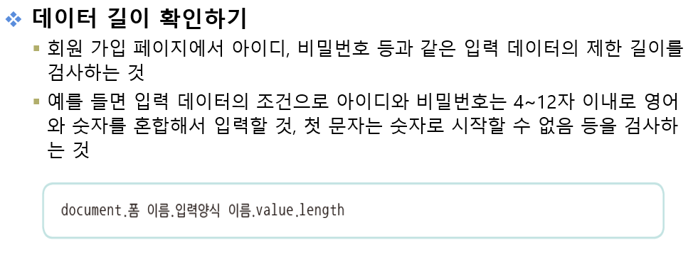

# 1교시

연습문제 풀이

# 2교시

```markdown
06장 폼 태그 : 상품 등록 페이지 만들기

	01. form 태그에 사용하는 속성에 간단히 설명하시오.
	
		───────────────────────────────────────────────────────────────────				
			속성				|		설명
		───────────────────────────────────────────────────────────────────
			action			|	폼 데이터를 받아 처리하는 웹 페이지의 URL을 설정합니다.
			method			|	폼 데이터가 전송되는 HTTP방식을 설정합니다.
			name			|	폼을 식별하기 위한 이름을 설정합니다.
			target			|	폼 처리 결과의 응답을 실행할 프레임을 설정합니다.
			enctype			|	폼을 전송하는 콘텐츠 타입 유형을 설정합니다.
			accept-charset	|	폼 전송에 사용할 문자 인코딩을 설정합니다.			
		───────────────────────────────────────────────────────────────────

	02. form 태그 내에 중첩하여 사용하는 태그를 나열하고 설명하시오.
	
		1) input 태그
		
			input 태그는 사용자가 텍스트 입력이나 선택 등을 다양하게 할 수 있도록 공간을 만드는 태그로, 종료 태그 없이 단독으로 사용할 수 있습니다.
			
		2) select 태그
		
			select 태그는 여러 개의 항목이 나타나는 목록 상자에서 항목을 선택하는 태그입니다.
			시작 태그와 종료 태그가 있으며, 리스트 박스에 여러 항목을 추가 삽입하기 위해 반드시 option 태그를 포함해야 합니다.
			
		3) textarea 태그
			
			textarea 태그는 여러 줄의 텍스트를 입력할 수 있는 태그입니다. 가장 큰 특징은 입력 폼 안에 사용된 태그와 띄어쓰기가 그대로 출력
			된다는 것입니다.
			
		위 3가지의 요소는 input 요소에 해당하는 태그들입니다.
		form태그를 활용함에 있어 가장 중요하고 데이터를 담당할 수 있는 태그에 속합니다.
		
	03. 폼 페이지에서 전송된 데이터를 전달받는 내장 객체와 관련된 메소드는 무엇인가?
	
		request 내장 객체
		
		──────────────────────────────────────────────────────────────────────────────────────────────────
			메소드				|	형식					|	설명
		──────────────────────────────────────────────────────────────────────────────────────────────────			
		getParameterNames()		|	Enumeration			| 모든 입력 양식의 요청 파라미터 이름을 순서에 상관없이 Enumeration
								|						| 형태로 전달받습니다.
		getParameter()			|	String				| input 요소의 name을 key로 문자열 형식의 데이터를 전달받습니다.
		getParameterValues()	|	String[]			| input 요소의 name을 key로 여러 데이터를 배열 형식의 데이터로
								|						| 전달받습니다.
```

```markdown
07장 파일 업로드 : 상품 이미지 등록하기

	01. 파일 업로드를 위한 form 태그 내에 반드시 설정해야 하는 기법은 무엇인가?★★★
	
		1) form 태그의 method 속성은 반드시 'POST'로 설정한다.
		2) form 태그의 enctype	 속성은 반드시 'multipart/form-data'로 설정한다.
		3) form 태그의 action 속성은 파일 업로드를 처리할 JSP 파일로 설정한다. (JSP파일 또는 경로 또는 서버에 해당하는 URL)
		4) 파일 업로드를 위해 input 태그의 type 속성을 file로 설정한다. (여러 파일 설정시 multiple 속성을 부여한다.)
		
	02. 파일을 서버에 업로드하는 처리 기법에 대해 간단히 설명하시오.
	
		** 우리는 Commons를 활용한 파일 업로드를 진행하므로 Cors.jar를 활용한 파일 업로드를 진행하지 않는다.
		
		1) Commons-fileupload를 이용한 파일 업로드
			
			Commons-fileupload를 이용하여 파일을 업로드하려면 먼저 Commons-fileupload패키지에 포함되어 있는
			DiskFileUpload객체를 생성합니다. 생성된 객체를 통해 DiskFileUpload 클래스가 제공하는 메소드를 사용하여 웹 브라우저가
			전송한 multipart/form-data 유형의 요청 파라미터를 가져옵니다. 그러나 FileItem 클래스의 메소드를 사용하여 요청 파라미터가
			일반 데이터인지 파일인지 분석 및 처리하여 파일을 업로드합니다.
```




### [validation03.jsp] 소스

```html
<%@ page language="java" contentType="text/html; charset=UTF-8"
    pageEncoding="UTF-8"%>
<!DOCTYPE html>
<html class="no-js" lang="zxx">
<head>
    <meta charset="utf-8" />
    <meta http-equiv="x-ua-compatible" content="ie=edge" />
    <title>쉽게 배우는 JSP 웹 프로그래밍</title>
    <meta name="description" content="" />
    <meta name="viewport" content="width=device-width, initial-scale=1" />
   <%@ include file="/pageModule/headPart.jsp" %>
</head>

<body>

    <!-- Preloader -->
    <div class="preloader">
        <div class="preloader-inner">
            <div class="preloader-icon">
                <span></span>
                <span></span>
            </div>
        </div>
    </div>

    <div class="breadcrumbs" style="padding-top:40px;">
        <div class="container">
            <div class="row align-items-center">
                <div class="col-lg-6 col-md-6 col-12">
                    <div class="breadcrumbs-content">
                        <h1 class="page-title">유효성 검사</h1>
                    </div>
                </div>
                <div class="col-lg-6 col-md-6 col-12">
                    <ul class="breadcrumb-nav">
                        <li><a href="/">INDEX</a></li>
                        <li>CH08</li>
                    </ul>
                </div>
            </div>
        </div>
    </div>

    <section class="about-us section">
        <div class="container">
            <div class="row align-items-center justify-content-center">
                <div class="col-lg-12 col-md-12 col-12">
                    <div class="content-left wow fadeInLeft" data-wow-delay=".3s">
                    	<h3>Javascript 버전</h3>
                    	<form name="loginForm" action="validation03_process.jsp">
                    		아이디 : <input type="text" name="id" /><br/>
                    		비밀번호 : <input type="text" name="pw" /><br/>
                    		<input type="button" value="전송" onclick="CheckForm()">
                    	</form>
   
                    	<h3>Jquery 버전</h3>
                    	<form name="loginForm2" action="validation02_process.jsp" id="loginForm2">
                    		아이디 : <input type="text" name="id2" id="id2" /><br/>
                    		비밀번호 : <input type="text" name="pw2" id="pw2" /><br/>
                    		<input type="button" value="전송" id="loginBtn">
                    	</form>
                    	
                    </div>
                </div>
            </div>
        </div>
    </section>

    <%@ include file="/pageModule/footer.jsp" %>

    <%@ include file="/pageModule/footerPart.jsp" %>
    <script type="text/javascript">
    	// 자바스크립트 onsubmit 이벤트 처리
    	function CheckForm() {
    		var form = document.loginForm;
    		
    		if(form.id.value.length < 4 || form.id.value.length > 12) {
    			alert("아이디는 4 ~ 12 자 이내로 입력 가능합니다!");
    			form.id.select();
    			return false;
    		}
    		if(form.pw.value.length < 4) {
    			alert("비밀번호는 4자 이상 입력해야 합니다!");
    			form.pw.select();
    			return false;
    		}
    		
    		form.submit();
    		
    	}
    	
    	// 제이쿼리를 통한 이벤트 처리
    	$(function(){
    		var loginBtn = $('#loginBtn');
    		var loginForm2 = $('#loginForm2');
    		
    		loginBtn.on("click", function(){
    			var id = $('#id2').val();
    			var pw = $('#pw2').val();
    			
    			if(id.length < 4 || id.length > 12) {
    				alert("아이디는 4 ~ 12자 이내로 입력 가능합니다!");
    				$("#id2").focus();
    				return false;
    			}
    			
    			if(pw.length < 4 ) {
    				alert("비밀번호는 4자 이상 입력 가능합니다!");
    				$("#pw2").focus();
    				return false;
    			}
    			
    			loginForm2.submit();
    		})
    	});
    </script>
</body>

</html>
```

### [validation03_process.jsp] 소스

```html
<%@ page language="java" contentType="text/html; charset=UTF-8"
    pageEncoding="UTF-8"%>
<!DOCTYPE html>
<html class="no-js" lang="zxx">
<head>
    <meta charset="utf-8" />
    <meta http-equiv="x-ua-compatible" content="ie=edge" />
    <title>쉽게 배우는 JSP 웹 프로그래밍</title>
    <meta name="description" content="" />
    <meta name="viewport" content="width=device-width, initial-scale=1" />
   <%@ include file="/pageModule/headPart.jsp" %>
</head>

<body>

    <!-- Preloader -->
    <div class="preloader">
        <div class="preloader-inner">
            <div class="preloader-icon">
                <span></span>
                <span></span>
            </div>
        </div>
    </div>

    <div class="breadcrumbs" style="padding-top:40px;">
        <div class="container">
            <div class="row align-items-center">
                <div class="col-lg-6 col-md-6 col-12">
                    <div class="breadcrumbs-content">
                        <h1 class="page-title">유효성 검사</h1>
                    </div>
                </div>
                <div class="col-lg-6 col-md-6 col-12">
                    <ul class="breadcrumb-nav">
                        <li><a href="/">INDEX</a></li>
                        <li>CH08</li>
                    </ul>
                </div>
            </div>
        </div>
    </div>

    <section class="about-us section">
        <div class="container">
            <div class="row align-items-center justify-content-center">
                <div class="col-lg-12 col-md-12 col-12">
                    <div class="content-left wow fadeInLeft" data-wow-delay=".3s">
                    	<%
                    		request.setCharacterEncoding("UTF-8");
                    	
                    		String id = request.getParameter("id");
                    		String pw = request.getParameter("pw");
                    		String id2 = request.getParameter("id2");
                    		String pw2 = request.getParameter("pw2");
                    		
                    		out.println("Javascript 버전<br/>");
                    		out.println("아이디 : " + id + "<br/>");
                    		out.println("비밀번호 : " + pw + "<br/>");
                    		out.println("Jquery 버전<br/>");
                    		out.println("아이디 : " + id2 + "<br/>");
                    		out.println("비밀번호 : " + pw2 + "<br/>");
                    	%>
                    </div>
                </div>
            </div>
        </div>
    </section>

    <%@ include file="/pageModule/footer.jsp" %>

    <%@ include file="/pageModule/footerPart.jsp" %>
    <script type="text/javascript">
    	// 자바스크립트 onsubmit 이벤트 처리
    	function submitEvent() {
    		console.log("Submit Event...!");
    		alert("Submit Event...!");
    		
    		var id = document.loginForm.id.value;
    		var pw = document.loginForm.pw.value;
    		
    		if(id == "") {
	    		alert("아이디가 누락되었습니다.");
    			return false;
    		}
    		if(pw == "") {
	    		alert("비밀번호가 누락되었습니다.");
    			return false;
    		}
    	}
    </script>
</body>

</html>
```


### [validation04.jsp] 소스

```html
<%@ page language="java" contentType="text/html; charset=UTF-8"
    pageEncoding="UTF-8"%>
<!DOCTYPE html>
<html class="no-js" lang="zxx">
<head>
    <meta charset="utf-8" />
    <meta http-equiv="x-ua-compatible" content="ie=edge" />
    <title>쉽게 배우는 JSP 웹 프로그래밍</title>
    <meta name="description" content="" />
    <meta name="viewport" content="width=device-width, initial-scale=1" />
   <%@ include file="/pageModule/headPart.jsp" %>
</head>

<body>

    <!-- Preloader -->
    <div class="preloader">
        <div class="preloader-inner">
            <div class="preloader-icon">
                <span></span>
                <span></span>
            </div>
        </div>
    </div>

    <div class="breadcrumbs" style="padding-top:40px;">
        <div class="container">
            <div class="row align-items-center">
                <div class="col-lg-6 col-md-6 col-12">
                    <div class="breadcrumbs-content">
                        <h1 class="page-title">유효성 검사</h1>
                    </div>
                </div>
                <div class="col-lg-6 col-md-6 col-12">
                    <ul class="breadcrumb-nav">
                        <li><a href="/">INDEX</a></li>
                        <li>CH08</li>
                    </ul>
                </div>
            </div>
        </div>
    </div>

    <section class="about-us section">
        <div class="container">
            <div class="row align-items-center justify-content-center">
                <div class="col-lg-12 col-md-12 col-12">
                    <div class="content-left wow fadeInLeft" data-wow-delay=".3s">
                    	<h3>Javascript 버전</h3>
                    	<form name="loginForm" action="validation04_process.jsp">
                    		아이디 : <input type="text" name="id" /><br/>
                    		비밀번호 : <input type="text" name="pw" /><br/>
                    		<input type="button" value="전송" onclick="CheckForm()">
                    	</form>
   
                    	<h3>Jquery 버전</h3>
                    	<form name="loginForm2" action="validation02_process.jsp" id="loginForm2">
                    		아이디 : <input type="text" name="id2" id="id2" /><br/>
                    		비밀번호 : <input type="text" name="pw2" id="pw2" /><br/>
                    		<input type="button" value="전송" id="loginBtn">
                    	</form>
                    	
                    </div>
                </div>
            </div>
        </div>
    </section>

    <%@ include file="/pageModule/footer.jsp" %>

    <%@ include file="/pageModule/footerPart.jsp" %>
    <script type="text/javascript">
    	// 자바스크립트 onsubmit 이벤트 처리
    	function CheckForm() {
    		var form = document.loginForm;
    		
    		for(i = 0; i < form.id.value.length; i++) {
    			var ch = form.id.value.charAt(i);
    			
    			// 0: 52, 9: 61
    			// A: 65, Z: 90
    			// a: 97, z: 122
    			// if 조건은 모든 조건이 참일 때 동작
    			// || 연산 : true, false일 때 true이다. (즉, 하나라도 true면 true)
    			// && 연산 : true, false일 때 false이다. (즉, 모두 true면 true)
    			if((ch < 'a' || ch > 'z') && (ch > 'A' || ch < 'Z') && (ch > '0' || ch < '9')) {
    				alert("아이디는 영문 소문자로만 입력 가능합니다!");
    				form.id.select();
    				return false;
    			}
    		}
    		
    		if(isNaN(form.pw.value)) {
    			alert("비밀번호는 숫자로만 입력 가능합니다!");
    			form.pw.select();
    			return false;
    		}
    		
    		form.submit();
    	}
    	
    	// 제이쿼리를 통한 이벤트 처리
    	$(function(){
    		var loginBtn = $('#loginBtn');
    		var loginForm2 = $('#loginForm2');
    		
    		loginBtn.on("click", function(){
    			var id = $('#id2').val();
    			var pw = $('#pw2').val();
    			
        		for(i = 0; i < id.length; i++) {
        			var ch = id.charAt(i);
        			
        			if((ch < 'a' || ch > 'z') && (ch > 'A' || ch < 'Z') && (ch > '0' || ch < '9')) {
        				alert("아이디는 영문 소문자로만 입력 가능합니다!");
        				$('#id2').select();
        				return false;
        			}
        		}
        		
        		if(isNaN(pw)) {
        			alert("비밀번호는 숫자로만 입력 가능합니다!");
        			$('#pw2').select();
        			return false;
        		}
    			
    			loginForm2.submit();
    		})
    	});
    </script>
</body>

</html>
```

### [validation04_process.jsp] 소스

```html
<%@ page language="java" contentType="text/html; charset=UTF-8"
    pageEncoding="UTF-8"%>
<!DOCTYPE html>
<html class="no-js" lang="zxx">
<head>
    <meta charset="utf-8" />
    <meta http-equiv="x-ua-compatible" content="ie=edge" />
    <title>쉽게 배우는 JSP 웹 프로그래밍</title>
    <meta name="description" content="" />
    <meta name="viewport" content="width=device-width, initial-scale=1" />
   <%@ include file="/pageModule/headPart.jsp" %>
</head>

<body>

    <!-- Preloader -->
    <div class="preloader">
        <div class="preloader-inner">
            <div class="preloader-icon">
                <span></span>
                <span></span>
            </div>
        </div>
    </div>

    <div class="breadcrumbs" style="padding-top:40px;">
        <div class="container">
            <div class="row align-items-center">
                <div class="col-lg-6 col-md-6 col-12">
                    <div class="breadcrumbs-content">
                        <h1 class="page-title">유효성 검사</h1>
                    </div>
                </div>
                <div class="col-lg-6 col-md-6 col-12">
                    <ul class="breadcrumb-nav">
                        <li><a href="/">INDEX</a></li>
                        <li>CH08</li>
                    </ul>
                </div>
            </div>
        </div>
    </div>

    <section class="about-us section">
        <div class="container">
            <div class="row align-items-center justify-content-center">
                <div class="col-lg-12 col-md-12 col-12">
                    <div class="content-left wow fadeInLeft" data-wow-delay=".3s">
                    	<%
                    		request.setCharacterEncoding("UTF-8");
                    	
                    		String id = request.getParameter("id");
                    		String pw = request.getParameter("pw");
                    		String id2 = request.getParameter("id2");
                    		String pw2 = request.getParameter("pw2");
                    		
                    		out.println("Javascript 버전<br/>");
                    		out.println("아이디 : " + id + "<br/>");
                    		out.println("비밀번호 : " + pw + "<br/>");
                    		out.println("Jquery 버전<br/>");
                    		out.println("아이디 : " + id2 + "<br/>");
                    		out.println("비밀번호 : " + pw2 + "<br/>");
                    	%>
                    </div>
                </div>
            </div>
        </div>
    </section>

    <%@ include file="/pageModule/footer.jsp" %>

    <%@ include file="/pageModule/footerPart.jsp" %>
    <script type="text/javascript">
    	// 자바스크립트 onsubmit 이벤트 처리
    	function submitEvent() {
    		console.log("Submit Event...!");
    		alert("Submit Event...!");
    		
    		var id = document.loginForm.id.value;
    		var pw = document.loginForm.pw.value;
    		
    		if(id == "") {
	    		alert("아이디가 누락되었습니다.");
    			return false;
    		}
    		if(pw == "") {
	    		alert("비밀번호가 누락되었습니다.");
    			return false;
    		}
    	}
    </script>
</body>

</html>
```


# 3교시

### [validation05.jsp] 소스

```html
<%@ page language="java" contentType="text/html; charset=UTF-8"
    pageEncoding="UTF-8"%>
<!DOCTYPE html>
<html class="no-js" lang="zxx">
<head>
    <meta charset="utf-8" />
    <meta http-equiv="x-ua-compatible" content="ie=edge" />
    <title>쉽게 배우는 JSP 웹 프로그래밍</title>
    <meta name="description" content="" />
    <meta name="viewport" content="width=device-width, initial-scale=1" />
   <%@ include file="/pageModule/headPart.jsp" %>
</head>

<body>

    <!-- Preloader -->
    <div class="preloader">
        <div class="preloader-inner">
            <div class="preloader-icon">
                <span></span>
                <span></span>
            </div>
        </div>
    </div>

    <div class="breadcrumbs" style="padding-top:40px;">
        <div class="container">
            <div class="row align-items-center">
                <div class="col-lg-6 col-md-6 col-12">
                    <div class="breadcrumbs-content">
                        <h1 class="page-title">유효성 검사</h1>
                    </div>
                </div>
                <div class="col-lg-6 col-md-6 col-12">
                    <ul class="breadcrumb-nav">
                        <li><a href="/">INDEX</a></li>
                        <li>CH08</li>
                    </ul>
                </div>
            </div>
        </div>
    </div>

    <section class="about-us section">
        <div class="container">
            <div class="row align-items-center justify-content-center">
                <div class="col-lg-12 col-md-12 col-12">
                    <div class="content-left wow fadeInLeft" data-wow-delay=".3s">
                    	<h3>Javascript 버전</h3>
                    	<form name="member" action="validation05_process.jsp">
                    		아이디 : <input type="text" name="id" /><br/>
                    		비밀번호 : <input type="text" name="pw" /><br/>
                    		이름 : <input type="text" name="name" /><br/>
                    		연락처 :
                    			<select name="phone1">
                    				<option value="010">010</option>
                    				<option value="011">011</option>
                    				<option value="016">016</option>
                    				<option value="017">017</option>
                    				<option value="019">019</option>
                    			</select>
                    			<input type="text" name="phone2" size="4" maxlength="4"/> -
                    			<input type="text" name="phone3" size="4" maxlength="4"/><br/>
                    		이메일 : <input type="text" name="email"/><br/>
                    		<input type="button" value="가입하기" onclick="CheckMember()"/><br/>
                    	</form>
                    	
                    </div>
                </div>
            </div>
        </div>
    </section>

    <%@ include file="/pageModule/footer.jsp" %>

    <%@ include file="/pageModule/footerPart.jsp" %>
    <script type="text/javascript">
    	// 자바스크립트 onsubmit 이벤트 처리
    	function CheckMember() {
    		// 아이디는 영문 대문자와 소문자, 한글, 한글의 자음과 모음만 검사하도록 정규 포현식 작성
    		var regExpId = /^[a-z|A-Z|ㄱ-ㅎ|ㅏ-ㅣ|가-힣]/;
    		
    		// 비밀번호는 숫자만 검사하도록 정규 표현식을 작성
    		var regExpPw = /^[0-9]*$/;
    		
    		// 이름은 한글만 검사하도록 정규 표현식 작성
    		var regExpName = /^[가-힣]*$/;
    		
    		// 전화번호는 전화번호 형태(숫자)인지 검사하도록 정규 표현식 작성
    		var regExpPhone = /^\d{3}-\d{3,4}-\d{4}/;
    		
    		// 이메일은 이메일 형식인지 검사하도록 정규 표현식 작성
    		// 처음 시작이 숫자, 영소대문자이고 특수문자 -_/. 나올수도 있고 안 나올 수도 있고 그 다음에 숫자, 영소대문자가 0개 이상이 나온다.
    		// @ 이메일 형식과 같은 내용이 이어서 나오게 되는데, \.은 특수문자 /을 표현하기 위해 이스케이프 .이 반드시 나와야 하고 영소대문자 2 ~ 3자리가
    		// 끝에 나타난다.
    		var regExpEmail = /^[0-9a-zA-Z]([-_\.]?[0-9a-zA-Z])*@[0-9a-zA-Z]([-_\.]?[0-9a-zA-Z])*\.[a-zA-Z]{2,3}$/i;
    		
    		var form = document.member;
    		var id = form.id.value;
    		var pw = form.pw.value;
    		var name = form.name.value;
    		var phone = form.phone1.value + "-" + form.phone2.value + "-" + form.phone3.value ;
    		var email = form.email.value;
    		
    		
    		if(!regExpId.test(id)) {
    			alert("아이디는 문자로 시작해주세요!");
    			form.id.select();
    			return false;
    		}

    		if(!regExpPw.test(pw)) {
    			alert("비밀번호는 숫자로 입력해주세요!");
    			form.pw.select();
    			return false;
    		}
  
    		if(!regExpName.test(name)) {
    			alert("이름은 한글로 입력해주세요!");
    			form.name.select();
    			return false;
    		}
  
    		if(!regExpPhone.test(phone)) {
    			alert("연락처 형식에 맞취 입력해주세요!");
    			return false;
    		}
   
    		if(!regExpEmail.test(email)) {
    			alert("이메일 형식에 맞게 입력해주세요!");
    			return false;
    		}
    		
    		form.submit();
    	}
    	
    </script>
</body>

</html>
```

### [validation05_process.jsp] 소스

```html
<%@ page language="java" contentType="text/html; charset=UTF-8"
    pageEncoding="UTF-8"%>
<!DOCTYPE html>
<html class="no-js" lang="zxx">
<head>
    <meta charset="utf-8" />
    <meta http-equiv="x-ua-compatible" content="ie=edge" />
    <title>쉽게 배우는 JSP 웹 프로그래밍</title>
    <meta name="description" content="" />
    <meta name="viewport" content="width=device-width, initial-scale=1" />
   <%@ include file="/pageModule/headPart.jsp" %>
</head>

<body>

    <!-- Preloader -->
    <div class="preloader">
        <div class="preloader-inner">
            <div class="preloader-icon">
                <span></span>
                <span></span>
            </div>
        </div>
    </div>

    <div class="breadcrumbs" style="padding-top:40px;">
        <div class="container">
            <div class="row align-items-center">
                <div class="col-lg-6 col-md-6 col-12">
                    <div class="breadcrumbs-content">
                        <h1 class="page-title">유효성 검사</h1>
                    </div>
                </div>
                <div class="col-lg-6 col-md-6 col-12">
                    <ul class="breadcrumb-nav">
                        <li><a href="/">INDEX</a></li>
                        <li>CH08</li>
                    </ul>
                </div>
            </div>
        </div>
    </div>

    <section class="about-us section">
        <div class="container">
            <div class="row align-items-center justify-content-center">
                <div class="col-lg-12 col-md-12 col-12">
                    <div class="content-left wow fadeInLeft" data-wow-delay=".3s">
                    	<%
                    		request.setCharacterEncoding("UTF-8");
                    	
                    		String id = request.getParameter("id");
                    		String pw = request.getParameter("pw");
                    		String name = request.getParameter("name");
                    		String phone1 = request.getParameter("phone1");
                    		String phone2 = request.getParameter("phone2");
                    		String phone3 = request.getParameter("phone3");
                    		String email = request.getParameter("email");
                    	%>
                    	<p>아이디 : <%=id %></p>
                    	<p>비밀번호 : <%=pw %></p>
                    	<p>이름 : <%=name %></p>
                    	<p>연락처 : <%=phone1 %>-<%=phone2 %>-<%=phone3 %></p>
                    	<p>이메일 : <%=email %></p>
                    </div>
                </div>
            </div>
        </div>
    </section>

    <%@ include file="/pageModule/footer.jsp" %>

    <%@ include file="/pageModule/footerPart.jsp" %>
    <script type="text/javascript">
    	// 자바스크립트 onsubmit 이벤트 처리
    	function submitEvent() {
    		console.log("Submit Event...!");
    		alert("Submit Event...!");
    		
    		var id = document.loginForm.id.value;
    		var pw = document.loginForm.pw.value;
    		
    		if(id == "") {
	    		alert("아이디가 누락되었습니다.");
    			return false;
    		}
    		if(pw == "") {
	    		alert("비밀번호가 누락되었습니다.");
    			return false;
    		}
    	}
    </script>
</body>

</html>
```


### [뒤로 가기](index.md)