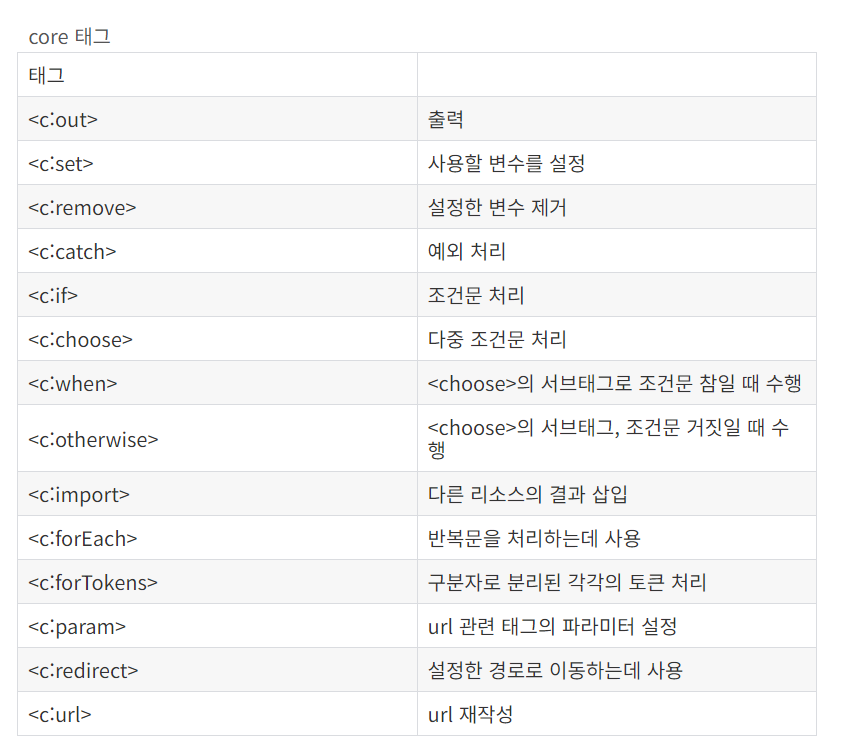

> **대덕인재개발원** 
> 
> *과목* : JSP
>
> *교수* : 조현준
> 
> 2023.10.26 공부시작

-----
</br>

## 이클립스 환경설정 순서

한글깨짐방지을 위한 **인코딩(UTF-8) 설정** → **폰트 변경** → **JDK 변경** → **톰캣 설정**

### 톰캣 설정
- 컨텍스트 PATH 변경
  - 웹서버가 사용하는 포트 번호는 80포트로 정해져 있으며 **URL에서 HTTP 프로토콜로 접속 시 포트번호를 생략하면 자동으로 80포트로 인식**하므로 80포트를 생략할 수 있다. 80포트 이외의 포트 번호를 웹서버에 할당했을 때는 반드시 URL에 명시해주어야 정상으로 접속된다.
- 보통 프로젝트 규모가 클 경우 시작되는 시간이 오래 걸리므로 여유있게 **TIMEOUTS은 120초(2분)로 변경**해준다.
  - 타임아웃은 서버가 시작될 때 몇 초 내에 시작이 안 되면 시작 실패라고 간주하므로 넉넉하게 2분으로 설정해주는거다.

웹 경로는 톰캣이 실행되는 웹 루트 디렉터리를 말한다. 이클립스에서 프로젝트에 톰캣을 연동하면 `/프로젝트 이름` 형식을 기본값으로 연동된다. 대부분의 웹사이트는 / 경로부터 시작하므로 `/프로젝트 이름` 웹 경로를 최상위 경로인 /로 변경해준다.

-----
</br>

## webContent와 WEB-INF 차이점

- **webContent** : 정적으로 관리해야 할 요소들만 넣으면 됨
    - 브라우저를 통해서 접근 가능한 리소스들(미디어파일들, CSS파일)
    - 웹 애플리케이션의 컨텍스트 루트 디렉토리에 해당
- **WEB-INF** : 동적으로 처리하는 페이지들을 넣어두면 됨
    - 브라우저를 통해서 접근이 불가능한 웹 애플리케이션 핵심정보들을 포함하고 있음

-----
</br>

`Alt + Enter` : 프로젝트 기본 환경설정 메뉴가 열림

## 프로젝트 환경 설정 관련

### `Java Build Path` 설정

- JDK 1.8 체크
- 톰캣 8.5 체크
- 메이븐 - 스프링에서 설정


<br/>

### `Deployment Assembly` 설정

- 메이븐 내용이 추가되어있는지 확인


<br/>

### `Java Compiler` 설정

- 자바 1.8인지 확인


<br/>

### `Project Facets` 설정

- 서블릿 버전이 3.1버전인지 확인
- JDK 버전이 1.8인지 확인
- Java 클릭 → `Runtimes탭`에서 `Apache Tomcat 8.5` 체크되어있는지 확인


<br/>

※ 위 설정대로 했는데도 JSP파일에서 빨간줄 오류가 생기면 Project → Clean해주면 됨

# 1 JSP 개요

## JRE와 JDK 차이

*Java로 프로그램을 직접 개발하려면 JDK가 필요하고 Java로 만들어진 프로그램을 실행시키려면 JRE가 필요합니다.*

**JRE** : 개발 환경만 제공, 개발 도구가 없다.

**JDK** : 개발 환경 + 개발 도구

## 1장 요약정리

### 1) 정적 웹 페이지와 동적 웹 페이지의 차이점을 설명하시오.

  정적 웹 페이지는 컴퓨터에 저장된 텍스트 파일을 그대로 보는 것이고, 동적 웹 페이지는 저장된 내용을 다른 변수로 가공 처리하여 보는 것이다.
  정적 웹 페이지는 HTML(Hyper Text markup Language)과 같은 웹 언어로 작성하고,
  동적 웹 페이지는 PHP(Personal Home Page), ASP(Active Server Page), JSP와 같은 웹 언어로 작성합니다.

  정적 웹 페이지는 미리 만들어놓은 정보만 보여주기 때문에 고객의 취향이나 변화에 적응할 수 없고,
  새로운 것을 추가, 수정, 삭제하는 작업을 모두 수동으로 처리해야 하므로 관리하기가 어렵습니다.
  하지만 동적인 요소가 없기 때문에 데이터베이스도 필요 없고 구축하기 쉬우며, 단순 문서로만 이루어져 있어 서버 간에 통신이 거의 없고 속도가 빠름
  또한 정적 문서로만 이루어져 있기 때문에 모든 호스팅 서버에서도 동작할 수 있다는 장점입니다.
  그러나 기술이 발전함에 따라 사용자의 기호에 맞게 능동적으로 변화하는 웹 페이지가 필요해져서 이를 위해 동적 웹 페이지를 제공하는
  PHP, ASP, JSP와 같은 언어가 개발되었습니다.

  현재 우리가 보는 대부분의 웹 페이지는 동적 웹 페이지라고 할 수 있습니다.
  동적 웹 페이지는 사용자가 웹 페이지에 글을 작성하거나 환경 설정 등을 바꾸면 그 내용이 서버에 있는 데이터베이스에 저장되고
  결과가 웹 페이지에 반영되는 형태로 동작합니다.
  
### 02. 웹 프로그래밍 언어 JSP의 특징을 설명하시오.

  1) JSP는 서블릿 기술의 확장입니다.

      JSP에서는 서블릿의모든 기능을 사용할 수 있습니다.
      즉, 서블릿과 마찬가지로 JDBC, JNDI, EJB 등을 모두 포함하고 있는 강력한 엔터프라이즈 자바 API를 사용할 수 있습니다.
      또한 쉽게 개발할 수 있도록 JSP에서는 내장객체, 미리 정의된 태그, 표현식 언어와 사용자 정의 태그를 사용할 수 있습니다. 

      **JNDI란?**

      JNDI(Java Naming and Directory Interface)는 Java프로그래밍 언어를 사용하여 작성된 애플리케이션에 이름 지정 및 
      디렉토리 기능을 제공하는 API입니다. 

      **EJB란?**

      EJB(Enterprise Java Bean)는 분산 애플리케이션을 지원하는 컴포넌트 기반의 규약
			
  2) JSP는 유지 관리가 용이합니다.

      서블릿 기술에는 프레젠테이션 로직과 비즈니스 로직이 섞여 있지만 JSP기술의 경우 프레젠테이션 로직과 비즈니스 로직을 분리할 수 있기
      때문에 관리하기가 쉽습니다.

  3) JSP는 빠른 개발이 가능합니다.

      코드를 수정했을때 서블릿에서는 업데이트를 하고 다시 컴파일 해야합니다. 그러나 JSP의 경우 다시 컴파일하고 프로젝트를 배포할 필요가
      없습니다.

  4) JSP로 개발하면 코드 길이를 줄일 수 있습니다.

      JSP에서는 다양한 액션태그, JSTL(JavaServer Pages Standard Tag Library), 사용자 정의 태그 등의 다양한 태그와 표현 언어
      , 내장 객체 등을 사용함으로써 서블릿보다 코드를 줄일 수 있습니다.    

### 03. JSP 페이지의 처리 과정을 설명하시오.
		
  [책 24p 그림 참고] 또는 [ch02 JSP개요 PPT 9p 그림 참고]

  

  <br/>

  1) 웹 브라우저가 웹 서버에 JSp를 요청합니다.
    웹 서버는 요청된 Hello.jsp에서 jsp확장자를 발견하여 JSP 페이지임을 확인하고 웹 서버에 있는 JSP 컨테이너에 전달합니다.
  2) JSP컨테이너는 JSP페이지를 서블릿 프로그램인 Hello_jsp.java로 변환합니다.
  3) JSP컨테이너는 서블릿 프로그램을 컴파일하여 Hello_jsp.class로 만들고 이를 웹 서버에 전달합니다.
  4) 웹 서버는 정적 웹 페이지처럼 *.class의 실행 결과를 웹 브라우저에 응답으로 전달하므로 웹 브라우저는 새로 가공된 HTML페이지를 동적으로
  처리한 결과를 보여줍니다.
-----
<br/>

# 2장 스크립트 태그
## 스크립트 태그 종류
### 선언 태그


- 해당 JSP 페이지의 모든 스크립트 태그가 참조할 수 있는 **전역변수**가 된다.
    - 해당 JSP 페이지의 어느 위치에서도 참조할 수 있다.
- 각 행은 반드시 세미콜론으로 끝나야 한다.

### 주석 태그


- HTML 주석을 사용하면 그 안에 포함된 표현문 태그와 스크립틀릿 태그가 모두 컴파일된다.
- JSP 주석일 경우 주석문 안에 포함된 코드를 모두 무시한다.

### 스크립틀릿 태그


- 이 태그에 선언된 변수는 **지역변수**가 되므로 스크립틀릿 태그 내에서만 사용할 수 있다.
- 스크립틀릿 태그 내의 마지막 행은 반드시 세미콜론으로 종료해야 한다.

### 표현식


- 모든 자바 코드의 값은 문자열로 변환되어 웹 브라우저에 출력된다.
    - 기본 데이터 타입은 `toString()` 을 통해 출력된다.

## 2장 요약 정리

### 01. 스크립트 태그의 세 가지 종류의 대해 간단히 설명하시오.
	
1) 선언문 태그

    선언문 태그에 선언된 변수와 메소드는 JSP페이지 임의의 위치에서 선언할 수 있으며,
    스크립틀릿 태그 보다 나중에 선언해도 스크립틀릿 태그에서 사용할 수 있습니다.
    선언문 태그로 선언된 변수는 전역 변수로 사용되고, 선언문 태그로 선언된 메소드는 전역 변수처럼 전역 메소드로 사용됩니다.
	
2) 스크립틀릿 태그

	스크립틀릿 태그는 out객체를 사용하지 않고도 쉽게 HTML 응답을 만들어낼 수 있습니다.
	가장 일반적으로 사용되며 변수 또는 메소드 선언, 유효식 등 다수를 포함할 수 있습니다.
	모든 텍스트, HTML 또는 JSP 요소는 스크립틀릿 태그 외부에 있어야합니다.
	
3) 표현문 태그
	
	표현문 태그를 이용하여 선언문 태그 또는 스크립틀릿 태그에서 선언된 변수나 메소드의 반환 값을 외부로 출력할 수 있습니다.
	표현문 태그는 스크립틀릿 태그에서 사용할 수 없으므로 이 경우에는 out.println() 메소드를 사용해야 합니다.
	표현문 태그에 숫자, 문자, 불린 등의 기본 데이터 타입과 자바 객체 타입도 사용 가능합니다.
	그리고 표현문 태그에 작성된 모든 자바 코드의 값은 문자열로 변환되어 웹 브라우저에 출력됩니다.

### 02.  선언문 태그와 스크립틀릿 태그의 차이점을 설명하시오.
	
|선언문 태그|스크립틀릿 태그|
|------|---|
|변수 뿐만 아니라 메소드를 선언할 수 있습니다.|메소드 없이 변수만을 선언할 수 있습니다.|
|서블릿 프로그램으로 변환될 때, `_jspService()` 메소드 외부에 배치됩니다.|	서블릿 프로그램으로 변환될 때, `_jspService()` 메소드 내부에 배치됩니다.|

### 03.  애플리케이션 실행 결과에는 보이지 않는 JSP 주석 표기법은 무엇인가?
	
  `<!-- HTML 주석 처리 내용 -->`

  `<%-- JSP 주석 처리 내용 --%>`

-----
<br/>

# 3장 디렉티브 태그
## 디렉티브 태그의 개요
- JSP 페이지를 어떻게 처리할 것인지를 설정하는 태그


여기에서 taglib가 가장 중요한다.

## page 디렉티브 태그
- 현재 JSP 페이지에 대한 정보를 설정하는 태그
- 일반적으로 JSP 페이지의 최상단에 선언하는 것을 권장함
- 

### page 디렉티브 태그의 속성


### language 속성
- JSP 페이지에서 사용할 프로그래밍 언어를 설정하는 데 사용
- 기본 값은 java

### contentType 속성
- 현재 JSP 페이지의 콘텐츠 유형(MIME-type)을 설정하는 데 사용
- 콘텐츠 유형
  - text/html, text/xml, text/plain 등
  - 기본 값은 text/html
- HTML을 출력하는 JSP 페이지는 contentType을 사용할 필요가 없다.

### pageEncoding 속성
- 현재 JSP 페이지의 문자 인코딩 유형을 설정하는 데 사용
- 문자 인코딩 유형의 기본 값은 ISO-8859-1
- 한글 깨짐 방지를 위해서 UTF-8로 설정해줘야 함

### import 속성
- 현재 JSP 페이지에서 사용할 자바 클래스를 설정하는 데 사용
- 둘 이상의 자바 클래스를 포함하는 경우 쉼표(,)로 구분하여 연속해서 여러 개의 자바 클래스를 설정
- 또는 여러 개의 자바 클래스를 각각 별도로 설정할 수도 있음

### session 속성
- 현재 JSP 페이지의 HTTP 세션 사용 여부를 설정하는 데 사용
- 기본 값 : 세션을 자동으로 사용하는 true
- 만약 session 속성 값을 false로 설정할 경우
  - 해당 JSP 페이지에서 내장 객체인 session 변수를 사용할 수 없다는 의미이므로 해당 페이지에 대해 세션을 유지 관리할 수 없음

### buffer 속성
- 현재 JSP 페이지의 출력 버퍼 크기를 설정하는 데 사용
- 기본 값은 8KB

###  errorPage 속성
- 현재 JSP 페이지에 오류가 발생했을 때 보여줄 오류 페이지를 설정함

### isErrorPage
- 현재 JSP 페이지가오류 페이지인지 여부를 설정

### isELIgnored 
- 현재 JSP 페이지의 EL 태그 지원 여부를 설정

## include 디렉티브 태그
- 현재 JSP 페이지의 특정 영역에 외부 파일의 내용을 포함하는 태그
  - HTML, JSP, 텍스트 파일
- include 디렉티브 태그는 JSP 페이지 어디에서든 선언 가능


페이지 모듈화할 때 html태그, body태그를 제외하고 작성해야 함 ⇒ 웹 표준에 어긋난다.

## taglib 디렉티브 태그
- 현재 JSP 페이지에 표현 언어, JSTL, 사용자 정의 태그(custom tag) 등 태그 라이브러리를 설정하는 태그
- /WEB-INF/lib/ 폴더에 JSTL 태그 라이브러리인 JSTL-1.2.jar 파일 추가


### taglib 디렉티브 태그 속성 종류


### taglib 디렉티브 태그 종류



## 3장 요약 정리
### 01. 디렉티브 태그의 세 가지 유형에 대해 간단히 설명하시오.

|디렉티브 태그|형식|설명|
|------|---|---|
| page | `<%@ page ... %` | JSP 페이지에 대한 정보를 설정합니다. |
| include | `<%@ include ... %>` | JSP 페이지의 특정 영역에 다른 문서를 포함합니다. |
| taglib | `<%@ taglib ... %>` | JSP 페이지에서 사용할 태그 라이브러리를 설정합니다. |

### 02.  JSP 페이지가 사용할 자바 클래스를 설정하기 위한 page 디렉티브 태그의 속성은 무엇인가?

- `import`

### 03. JSP 페이지의 특정 영역에 외부 파일의 내용을 포함하는 디렉티브 태그는 무엇인가?

- `include`

## 🎡 페이지 이동 방식
- **리다이렉트 - 게시글 등록, 회원가입**
    
    ⇒ 서버에서 데이터를 가용했을 때 사용
    
    - 게시글 등록, 수정, 삭제

    

    - HttpServletResponse가 가지고 있는 `sendRedirect()` 메소드를 사용
    - 리다이렉트 방법으로 이동한 페이지는 이전 페이지와 전혀 데이터를 공유하거나 주고받는 것이 없다.
        - **주소가 바뀌면 `request` 내장 객체가 소멸되고 새로운 `request` 내장 객체를 생성한다.**
        - **그래서 `session` 내장 객체에 데이터를 담아서 보내야 함**
    - 실제로 데이터를 공유할 수 없다.
    - 리다이렉트 하게 되면 이동할 페이지로 요청과 응답 객체를 새로 생성하여 전송하기 때문이다.
    - 리다이렉트는 페이지를 재요청하는 것이며, URL을 보면 리다이렉트 시 해당 JSP 파일의 이름으로 변경되어 있을 것이다.
    - 서버는 클라이언트에게 HTTP 상태코드 302로 응답하는데 이때 헤더 내 Location 값에 이동할 URL을 추가한다. 클라이언트는 리다이렉션 응답을 받게 되면 헤더(Location)에 포함된 URL로 재요청을 보내게 된다. 이때 브라우저 주소창은 새 URL로 바뀌게 된다.
    - 클라이언트는 서버로부터 받은 상태 값이 302이면 Location헤더값으로 재요청을 보내게 된다. 이때 브라우저의 주소창은 전송받은 URL로 바뀌게 된다.  

    

    - 리다이렉트는 `reguest` 객체가 소멸되고 재생성되므로 `session`에다가 데이터를 담아서 요청해야 함
  
- **포워드 - 게시판 목록 조회(ajax에서 많이 활용)**
    
    ⇒ 요청에 따른 페이지 이동할 때 사용
    
    - 게시판 목록 조회, 상세보기 조회 등등    

    

    - 현재 페이지의 요청과 응답에 관한 제어권을 URL로 지정된 주소(매개변수)로 영구적으로 넘긴다.
    - 포워드된 페이지의 요청 처리가 종료되면 응답도 종료된다.
    - 리다이렉트처럼 페이지 재요청이 아닌 메소드를 호출하는 것과 같다.
    - **서버가 자동으로 이동 시켜줌으로써 URL이 그대로이며 데이터만 옮겨진다.**

-----
<br/>

# 4장 액션 태그

## 4장 요약 정리

### 01. 자바빈즈

  JSP 페이지의 주요 기능 중 하나는 데이터를 보여주는 것입니다. 하나의 JSP 페이지에 데이터를 보여주기 위한 자바 코드와 단순히 화면을
  출력하는 HTML 코드를 함께 작성하면 기능을 확장하거나 코드를 재사용하는데 어려움이 있습니다. 따라서 프로그램의 효율을 높이기 위해
  화면을 출력하는 부분과 데이터를 처리하는 로직 부분을 구분하여 작성하며, 로직 부분의 코드에 자바빈즈라는 클래스를 사용합니다.

  자바빈즈는 동적 콘텐츠 개발을 위해 자바 코드를 사용하여 자바 클래스로 로직을 작성하는 방법입니다.
  즉, JSP 페이지에서 화면을 표현하기 위한 계산식이나 자료의 처리를 담당하는 자바 코드를 따로 분리하여 작성하는 것이 자바빈즈입니다.
  자바빈즈는 데이터 표현을 목적으로 하는 자바 클래스 이므로 기존의 자바 클래스를 작성하는 방법과 동일하게 작성합니다.

  - VO와 같은 데이터를 저장할 클래스 공간에 해당합니다.
  - 추후 스프링에서 데이터를 바인딩할 때 (데이터를 받아낼 때) VO, 즉 자바빈즈 클래스 객체 타입으로 데이터를 바로 받아낼 수 있습니다.


### 02. 페이지 이동 방식

  **1) forward(포워드)**

  예를 들어 게시판 등록 페이지를 요청한다고 가정합시다.
  요청 URL이 `http://localhost/board/form.do`일 때, 서버로 넘어간 요청(request)에 해당하는 최종 목적지(servlet)
  가 있고 그 안에서 등록 폼에 해당하는 페이지를 요청하는 기능이 실행된다.
  요청 URL에 매핑되는 서버 내 리소스(/WEB-INF/views/board/form.jsp)는 보안 폴더에 해당하는 '/WEB-INF' 안에 있으므로
  서버 안에서 응답으로 나가야할 페이지를 찾아서 결과물을 만들고 응답으로 브라우저쪽으로 던져주는데, 이 과정이 페이지 이동방식 포워드!
  포워드는 서버로 들어온 요청(request)과 요청에 의한 처리가 완료된 후 응답(response)으로 나가는 횟수가 각 1개씩 존재한다.
  만약에 서버로 들어올 때 데이터 1개 또는 2개 이상을 갖고 들어왔을 때 포워드는 새로운 요청이 만들어져 응답으로 나가는 형태가 아니므로
  같은 요청(request)객체를 활용하여 데이터를 담아 응답으로 내보낼 수 있고 처음에 요청으로 들어온 데이터를 응답에서 또한 활용가능!
	
**2) redirect(리다이렉트)**

  예를 들어 게시판 등록 기능을 요청한다고 가정하시다.
  요청 URL이 `http://localhost/board/insert.do`일 때, 서버로 넘어간 요청(request)에 해당하는 최종 목적지(servlet)에
  도착한다. 이때, 등록 기능에 대한 데이터 처리 후 페이지 이동방식을 선택하여 응답으로 나가야 하는데, 응답으로 나갈 페이지가 데이터처리
  후 목록 화면이라고 가정 했을 때, 시스템이 알아서 브라우저로 300번대 Ack 신호로 "데이터 처리 끝났고 목록 화면으로 넘어가려고 하는데
  진짜 목록 화면으로 넘어가면 됨?" 이라고 물어본다. 브라우저는 서버가 300번대로 준 신호에 "응! 나 목록 화면 가는 맞고, 그러니까
  내가 다시 목록 화면 요청 할거니까 목록 화면 응답으로 주삼"이라고 하며 서볼 새로운 요청으로 `http://localhost/board/list.do`
  를 요청하여 목록 화면을 달라고 서버로 요청한다. 서버는 다시 들어온 새로운 요청(request)에 의해 목록 화면을 서버 안에서 찾아 결과의
  리소스를 만들어 응답으로 내보낸다. 이때 최초 요청은 등록 기능을 가진 URL이었지만 응답으로 나가는 건 목록을 요청할 때 사용하는 요청
  URL이 되고 응답 화면은 목록 화면이 나간다.

  **데이터 처리 후 포워딩을 하면?**

  데이터 처리 후 리다이렉트 하지 않고 포워딩을 할 때 문제점은, 포워딩에 특징은 최초 요청 URL이 고정되고 선택된 응답 페이지가
  결과로 나가기 때문에 다시 새로 고침을 할 경우 최초의 요청했던 기능을 담고 있는 URI이 실행된다.
  그렇게되면 반복적인 데이터 처리 요청이 서버로 날라가는 것이기 때문에 요청자가 끝내지 않는 한 무한반복으로 데이터 처리의 대한
  기능이 끝없이 요청될 수 있다. 그러므로 데이터 처리 후라면 페이지 이동방식은 포워딩이 아닌 리다이렉트 처리로 마무리한다!!!

-----
<br/>

# 5장 내장 객체
## 내장 객체의 개요
- JSP 페이지에서 사용할 수 있도록 JSP 컨테이너에 미리 정의된 객체
- JSP 페이지가 서블릿 프로그램으로 번역될 때 JSP 컨테이너가 자동으로 내장 객체를 멤버 변수, 메소드 매개변수 등의 각종 참조 변수(객체)로 포함
- JSP 페이지에 별도의 `import` 문 없이 자유롭게 사용 가능
- 스크립틀릿 태그나 표현문 태그에 선언을 하거나 객체를 생성하지 않고도 직접 호출하여 사용 가능

### 내장 객체의 종류


pageContext → request → session → application 순으로 범위의 크기가 커진다.

### 속성 처리 메소드의 종류


## request 내장 객체
- JSP 페이지에서 가장 많이 사용되는 기본 내장 객체
- 웹 브라우저에서 서버의 JSP 페이지로 전달하는 정보를 저장


getParameterValues : 배열로 요청 파라미터 값을 전달하는 메소드이다.

요청 파라미터는 <name=value> 형식으로 웹 브라우저에서 서버의 JSP 페이지로 전송됨

### 요청 HTTP 헤더 관련 메소드
- 웹 브라우저는 HTTP 헤더에 부가적인 정보를 담아 서버로 전송

### 요청 HTTP 헤더 관련 메소드의 종류


### 웹 브라우저/서버 관련 메소드


## response 내장 객체
- 사용자의 요청을 처리한 결과를 서버에서 웹 브라우저로 전달하는 정보를 저장하고 서버는 응답 헤더와 요청 처리 결과 데이터를 웹 브라우저로 보냄

### 페이지 이동 관련 메소드
- 페이지 이동 = 리다이렉션(redirection)
- 서버는 웹 브라우저에 다른 페이지로 강제 이동하도록 response 내장 객체의 리다이렉션 메소드를 제공
- 페이지 이동 시에는 문자 인코딩을 알맞게 설정해야 함

### 페이지 이동 관련 메소드의 종류


### 응답 HTTP헤더 관련 메소드
- 응답 HTTP 헤더 관련 메소드는 서버가 웹 브라우저에 응답하는 정보에 헤더를 추가하는 기능을 제공
- 헤더 정보에는 주로 서버에 대한 정보가 저장되어 있음


header 정보 중 , Refresh 헤더를 이용해 5초마다 페이지를 새로고침할 수 있다.

### 응답 콘텐츠 관련 메소드
- response 내장 객체는 웹 브라우저로 응답하기 위해 MIME 유형, 문자 인코딩, 오류 메시지, 상태 코드 등을 설정하고 가져오는 응답 콘텐츠 관련 메소드 제공

### 응답 콘텐츠 관련 메소드의 종류


## out 내장 객체
- 웹 브라우저에 데이터를 전송하는 출력 스트림 객체
- JSP 컨테이너는 JSP 페이지에 사용되는 모든 표현문 태그와 HTML, 일반 텍스트 등을 out 내장 객체를 통해 웹 브라우저에 그대로 전달
- 스크립틀릿 태그에 사용하여 단순히 값을 출력하는 표현문 태그(`<%=..%>`)와 같은 결과를 얻을 수 있음

## 5장 요약 정리

### 01. 폼 페이지에서 입력된 데이터를 전달하는 요청 파라미터 값을 JSP 페이지로 가져오는 내장 객체는 무엇인지, 그리고 관련된 메소드에 대해 간단히 설명하시오.

**request 내장 객체**

|요청 파라미터 관련 메소드|형식|설명|
|------|---|---|
| getParameter(String name)	 | String				 | 요청 파라미터 이름이 name인 값을 전달받습니다. |
| getParameterValues(String name) | String[] | 모든 요청 파라미터 이름이 name인 값을 배열 형태로 전달받습니다. 요청 파라미터 값이 없으면 null을 반환  |
| getParameterNames() | Enumeration | 모든 요청 파라미터의 이름과 값을 Enumeration 객체 타입으로 전달받습니다.  |
| getParameterMap() | Map | 모든 요청 파라미터의 이름과 값을 Map 객체 타입으로 전달받습니다. (Map 객체 타입은 (파라미터 이름, 값) 형식으로 구성됩니다.)	   |

### 02. 서버에서 웹 브라우저에 다른 페이지로 강제 이동하도록 명력하는 내장 객체와 관련된 메소드는 무엇인가?

**response 내장 객체**

|페이지 이동 관련 메소드|반환 유형|설명|
|------|---|---|
| sendRedirect(url)	 | void				 | 설정한 URL 페이지로 강제 이동합니다. |

### 03. 스크립트 태그의 표현문과 같이 데이터를 출력하는 내장 객체는 무엇인가?
- out 내장 객체

-----
<br/>

# 6장 폼 태그
## 폼 개요
- 사용자가 웹 브라우저를 통해 입력된 모든 데이터를 한 번에 웹 서버로 전송하는 양식

### 폼 데이터 처리 과정


### 폼을 구성하는 태그의 종류


## form 태그의 기능과 사용법
- 사용자가 다양한 정보를 입력하고 서로 전달할 때 사용하는 태그
- 단독으로 쓰이지 않고 사용자가 다양한 정보를 입력하는 양식을 포함하는 최상위 태그
- 속성을 이용하여 폼 데이터를 전송할 때 어디로 보낼지, 어떤 방식으로 보낼지 설정


**file** 데이터를 보낼 때 enctype 속성값으로 `multipart/form-data` 로 지정해주어야 함


### input 태그


`button` 태그와 `input` 태그의 가장 큰 차이점은 `button`은 스스로 닫지 않는 태그이고, `input`은 스스로 닫는 태그라는 것이다.
따라서 `button`은 하위 태그들을 추가할 수 있다. `input`은 추가할 수 없다.
`button`태그는 이미지를 추가할 수 있다.

### select 태그
- 여러 개의 항목이 나타나는 목록 상자에서 항목을 선택하는 태그
- 시작 태그와 종료 태그가 있으며, 리스트 박스에 여러 항목을 추가 삽입하기 위해 반드시 `option` 태그를 포함해야 함

**select 태그의 속성**


**option 태그의 속성**


### textarea태그
- 여러 줄의 텍스트를 입력할 수 있는 태그
- 기본 값은 `<textarea>`와 `</textarea>` 태그 사이에 설정
- 입력 폼 안에 사용된 태그와 띄어쓰기가 그대로 출력됨

**textarea 태그의 속성**


※ form 태그에서 action 태그에 경로를 따로 지정하지 않으면 현재 JSP 페이지 경로로 지정됨

### 🎐textarea wrap 속성

  `wrap = "off"` 	: 줄바꿈 안함

  `wrap = "soft"` 	: 자동 줄바꿈
 
  `wrap = "hard"` 	: 자동 줄바꿈 포함 / 서버 전송 시 캐리지 리턴(엔터문자) 문자를 전달
  
  해당 속성은 html5에서 새롭게 추가된 기능입니다.
  `wrap="hard"` 속성을 사용 시, `cols` 속성이 꼭 명시되어 있어야 한다.
  
  wrap 속성의 hard로 설정 시, textarea 설정 크기 안에서 Enter를 치지 않고 텍스트를 입력해 나갈 때
  textarea 가로 길이 오른쪽 맨 끝에 다다를때 자동으로 아래줄로 넘어가 작성이 되는데 이때 Enter를 직접
  치지는 않았지만 아래줄로 내려가 작성되기 때문에 그 부분에 개행문자가 부여될 수 있게 해준다.
  
  wrap이라는 속성은 데이터를 입력받는 페이지 내 textarea에서 설정한다고 하여 속성에 따른 값이
  제대로 설정되지 않는다. 스타일 요소와 함께 작성되어야 결과를 확인할 수 있다.
  `style="white-space: pre-wrap;"` 설정이 함께 있어야 결과를 확인할 수 있다.
  
  hard 설정은 개행문자가 포함되서 넘어간다고 공식문서에서도 설명하고 있지만,
  실제 데이터베이스를 연동 후 데이터를 넘겨보면 개행문자가 포함되서 넘어오지 않는 경우가 발생한다.
  이 마저도 사실 정확한지는 불분명하다. (공식 문서에서 제공하는 내용이 설명 부족일 수 있음..)

  브라우저 스펙에 따라서 wrap="hard" 속성에 따른 출력이 제대로 적용되지 않을 수 있다. 그래서 css를 설정해준다.

## 6장 요약 정리

### 01. form 태그에 사용하는 속성에 간단히 설명하시오.

|속성				|설명|
|------|---|
| action	 | 폼 데이터를 받아 처리하는 웹 페이지의 URL을 설정합니다. |
| method				 | 폼 데이터가 전송되는 HTTP방식을 설정합니다. |
| name				 | 폼을 식별하기 위한 이름을 설정합니다. |
| target				 | 폼 처리 결과의 응답을 실행할 프레임을 설정합니다. |
| enctype				 | 폼을 전송하는 콘텐츠 타입 유형을 설정합니다. |
| accept-charset	 | 폼 전송에 사용할 문자 인코딩을 설정합니다. |

### 	02. form 태그 내에 중첩하여 사용하는 태그를 나열하고 설명하시오.

**1) input 태그**

  input 태그는 사용자가 텍스트 입력이나 선택 등을 다양하게 할 수 있도록 공간을 만드는 태그로, 종료 태그 없이 단독으로 사용할 수 있습니다.

**2) select 태그**

select 태그는 여러 개의 항목이 나타나는 목록 상자에서 항목을 선택하는 태그입니다.

시작 태그와 종료 태그가 있으며, 리스트 박스에 여러 항목을 추가 삽입하기 위해 반드시 option 태그를 포함해야 합니다.

**3) textarea 태그**

textarea 태그는 여러 줄의 텍스트를 입력할 수 있는 태그입니다. 가장 큰 특징은 입력 폼 안에 사용된 태그와 띄어쓰기가 그대로 출력
된다는 것입니다.

위 3가지의 요소는 input 요소에 해당하는 태그들입니다.
form태그를 활용함에 있어 가장 중요하고 데이터를 담당할 수 있는 태그에 속합니다.

### 03. 폼 페이지에서 전송된 데이터를 전달받는 내장 객체와 관련된 메소드는 무엇인가?

**request 내장 객체**	

|메소드				|형식					|설명|
|------|---|---|
| 	getParameterNames()	 | Enumeration							 | 모든 입력 양식의 요청 파라미터 이름을 순서에 상관없이 Enumeration 형태로 전달받습니다.  |
| 	getParameter()	 | String											 | input 요소의 name을 key로 문자열 형식의 데이터를 전달받습니다.  |
| 	getParameterValues()	 | String[]							 | input 요소의 name을 key로 여러 데이터를 배열 형식의 데이터로 전달받습니다.   |

-----
<br/>

# 7장 파일 업로드

## 파일 업로드를 위한 JSP 페이지


- form 태그의 method 속성은 반드시 **POST 방식**으로 설정
- form 태그의 enctype 속성은 반드시 **multipart/form-data**로 설정
- form 태그의 action 속성은 **파일 업로드를 처리할 JSP 파일**로 설정
- 파일 업로드를 위해 **input 태그의 type 속성을 file**로 설정
  - 만약 여러 파일을 업로드하려면 2개 이상의 input 태그를 사용하고 name 속성에 서로 다른 값을 설정

## Commons-FileUpload

- 파일 업로드 패키지
- 서버의 메모리상에서 파일 처리가 가능하도록 지원
- 오픈 라이브러리 commons-fileupload.jar, commons-io.jar 파일을 배포 사이트에서 직접 다운로드해서 사용
  - 배포 사이트: `http://commons.apache.org/downloads/`
  - 다운로드 파일: `commons-fileupload-1.3.3-bin.zip`, `commons-io-2.6-bin.zip`
- JSP 페이지에 page 디렉티브 태그의 import 속성을 사용하여 패키지 `org.apache.commons.fileupload.*`를 설정

<br/>


<br/>

① 필수적으로 선언해줘야 함(파일 업로드 핸들러 생성)

② 파일 데이터들은 list객체로 하나씩 차곡차곡 쌓아서 담는다.

`iterator()`라는 조력자를 통해서 list 안에 있는 값을 하나씩 꺼내준다.

③ `hasNex()` 메소드를 통해 다음 요소에 읽어 올 요소가 없을 때까지 반복한다.

`isFormField()` 메소드를 통해 파일인지 확인한다.

일반 데이터(true)면 일반 데이터 형식으로 꺼내오고,

파일 데이터(false)면 파일 데이터 형식으로 꺼내온다.

`getName()` 으로 가져오게 되면 파일명만 추출되는 것이 아니라, 시스템 내에 있는 **‘경로 + 파일명’**을 가져오기 때문에 `substirng(fileName.lastIndexOf("\\")+1);`을 해서 파일 경로까지 자르고 +1된 문자열부터 가져온다.

### DiskFileUpload 클래스의 메소드


### FileItem 클래스의 메소드


🎈 스프링에서도 xml에 설정할 때 1번 ~ 3번까지 똑같이 설정해주어야 한다.

스크립틀릿에서 설정해야 하는 기본 옵션들이다.

서버에 바로 저장하지 않고 임시 파일 tmp를 만들고 데이터가 쌓여지면, 내가 원하는 파일 형태로 변경 후 뿌려준다.

메모리 공간 크기를 설정하기 위해 **setSizeThreshold** 메소드를 사용한다.

🏆JSP에서는 파일업로드를 사용하기 위해서는 아래처럼 라이브러리 2개를 추가해줘야 한다.


## GET 방식, POST 방식


기본적으로 브라우저에 요청할 때 **header영역**과 **body영역**으로 나눠져 데이터를 담아서 전송하게 된다. 이 때 **GET방식**으로 보내게 되면 헤더에 Key:Value형태로 담기게 되는데 Key은 쿼리스트링의  id값이고, Value는 input태그의 name값이다. 바디에는 아무 값도 안 담기게 된다.

**POST방식**으로 보내게 되면 헤더에는 쿼리스트링의 ID값이 담기고, 바디에는 내가 보내고자 하는 데이터 값들이 담기게 된다. 보안상의 이유로 POST방식을 사용하게 된다.

### GET방식

- 데이터를 가져오는 것
- URL에 정보가 담겨서 전송된다.
- input태그에 담긴 name값이 header에 담기게 된다.

### POST방식

- 데이터를 가공해서 처리하는 것
- URL 상에 전달한 정보가 표시되지 않는다.
- header의 body에 담겨서 전송된다.

🥶개발자 도구에서 내가 요청한 URL 주소를 클릭 후 Payload 탭에서 데이터 전달 여부를 확인할 수 있다.


## 웹 상에 파일을 저장하는 경로

`C:\upload\파일명.png` ⇒ 내 로컬 PC에서 사용하는 경로지. 서버에 접근할 수 잇는 경로를 아니다.

### **톰캣에 파일이 저장되는 경로 찾기(배포된 서버 파일 경로)**
`E:\A_TeachingMaterial\07_JSP_Spring\workspace\workspace_jsp\.metadata\.plugins\org.eclipse.wst.server.core\tmp0\wtpwebapps\JSPBook\upload` 

아파치 톰캣에 파일이 저장하게 되면 위 경로처럼 metadata 폴더에 해당 프로젝트에 해당되는 upload 폴더에 저장하게 된다.

`http://localhost/JSPBook/upload/고양이.PNG` 주소를 치면 웹 서버상에 저장된 리소스 파일을 볼 수 있다.

서버에 배포할 때는 다음같이 주소를 지정해주어야 파일을 저장할 수 있다.

`request.getContextPath()` : 배포된 서버 안의 프로젝트 폴더를 가리킨다.

`request.getServletContext().getRealPath()`로 배포된 서버 경로에 접근할 수 있다.

### 🎈 Interface ServletContext

- 파일의 MIME유형을 가져오거나 요청을 발송하거나 로그 파일에 쓰기 위해 서블릿이 서블릿 컨테이너와 통신하는데 사용하는 메서드를 정의
- JVM당 웹 어플리케이션당 하나의 컨텍스트가 존재

### 🎈 ServletContext.getRealPath(String path)

- 웹 어플리케이션의 컨텍스트 루트를 기준으로 지정된 경로의 실제 파일 시스템 경로를 반환
- 즉, 웹 어플리케이션에서 사용되는 리소스(ex. 이미지,HTML,CSS 등)의 실제 파일 시스템 경로를 얻을 수 있다
- 웹 어플리케이션의 배포 디렉토리가 변경되더라도 어플리케이션 코드를 수정할 필요 없이 정확한 경로를 얻을 수 있도록 하는데 사용

### 🎈 getRealPath("/WEB-INF/images/" + fileName)

- `'/WEB-INF/images/'` 이란 폴더에 'fileName'이라는 이름의 파일이 위치한 경로: `'/WEB-INF/images'`의 경로를 얻어오고, 이를 기준으로 파일 경로를 지정

**String realFolder = request.getRealPath("/") + "upload";**

위 코드를 현재 유지보수 기간이 끝나서 이방법을 협업에서는 사용하지 않는다.

## 7장 요약 정리
## 01.  파일 업로드를 위한 form 태그 내에 반드시 설정해야 하는 기법은 무엇인가?

  1) form 태그의 method 속성은 반드시 'POST'로 설정한다.
  2) form 태그의 enctype 속성은 반드시 'multipart/form-data'로 설정한다.
  3) form 태그의 action 속성은 파일 업로드를 처리할 JSP 파일로 설정한다.  (JSP 파일 또는 경로 또는 서버에 해당하는 URL)
  4) 파일 업로드를 위해 input 태그의 type 속성을 file로 설정한다 (여러 파일 설정시 multiple 속성을 부여한다)
    
## 02.  파일을 서버에 업로드하는 처리 기법에 대해 간단히 설명하시오.

  🎈 우리는 Commons 를 활용한 파일 업로드를 진행하므로 `Cors.jar` 를 활용한 파일 업로드를 진행하지 않는다.
    
  1) `Commons-fileupload`를 이용한 파일 업로드
    
  `Commons-fileupload`를 이용하여 파일을 업로드 하려면 먼저 `Commons-fileupload` 패키지에 포함되어 있는 `DiskFileUpload` 객체를 생성한다. 생성된 객체를 통해 `DiskFileUpload` 클래스가 제공하는 메소드를 사용하여 웹 브라우저가 전송한 `multipart/form-data` 유형의 요청 파라미터를 가져온다. 그러나 `FileItem` 클래스의 메소드를 사용하여 요청 파라미터가 일반 데이터인지 파일인지 분석 처리하여 파일을 업로드한다.

-----
<br/>

# 8장 유효성 검사

## 유효성 검사(validation) 
- 사용자가 폼 페이지에서 입력한 데이터 값이 서버로 전송되기 전에 특정 규칙에 맞게 입력되었는지 검증하는 것
- 사용자가 실수로 유효하지 않은 데이터 값을 입력하면 부적합하다고 판단하여 다시 폼 페이지로 되돌려 사용자에게 오류가 있음을 알려줌
- 유효성 검사의 예
  - 폼 페이지에서 나이를 입력할 때 숫자를 인식하는 검사, 회원 가입 시 아이디 중복 검사, 로그인 인증 시 아이디와 비밀번호 검사, IP 패킷 검사 등


**onsubmit**은 조건에 따라 form을 서버에 전송할 수 있게 한다.

true/false값으로 제어할 수 있다. true일 때 서버에 데이터를 보낼 수 있고, false일 때는 서버에 전송할 수 없다.


**loginForm2폼태그**에 대한 주소값을 **loginForm2 변수**에 담는다.

- 메모리 낭비가 될 수 있으므로 이렇게 사용하는 것을 권장한다.

**bubbling**은 특정 요소에서 event가 발생했을 때 상위 요소로 event가 전파되는 것을 의미합니다.

### 이벤트 전파를 중단하는 방법


**input type button/submint**은 아주 예전부터 익히 사용되어 왔던 대표적인 버튼 Element이다.
브라우저 엔진 버전과 html 버전이 업그레이드 되면서 **input type button/submit**만이 대체할 수 없는
부분들이 발견되어 새롭게 만들어진 태그가 button태그이다. **input type button/submit**은 end태그
로서의 활용이 어려워(`</input>`) CSS를 활용하여 또는 태그들을 활용하여 버튼을 꾸미는데 제약이 많이 걸렸다.
**button** 태그는 몸체를 꾸밀 수 있다는 장점도 있어 CSS를 활용하는 건 물론 버튼 태그 내에 다양한 태그를 활용하여
버튼을 꾸밀 수 있다.
그리고 **input type button**에서 제공되는 click, submit 또한 제공된다.

우리가 다양하게 사용하고 있는 버튼 이벤트들 중, submit이라는 이벤트는 기본적으로 form태그 내에 있는
input 요소들의 데이터를 읽어 action에 설정되어 있는 경로로 데이터를 보내주는 역할을 하는데, `submit()``
이벤트 자체만으로 본다면 브라우저마다의 엔진별 특징이 조금씩 다르다. 그리고 `submit()` 이벤트 자체에 컨트롤이
생각보다 어려운 것도 사실이다. 대표적으로는 브라우저의 엔진별 로직과 시점이다. 사용자가 사용하는 다양한
환경의 needs를 맞춰 개발하기란 쉽지 않지만 누구나 사용가능한 공통적인 처리 로직을 구현하는건 어렵지 않다.
개발자들 사이에서 관례로 사용되는 내용들이 여기에도 포함된다.
(ex, ServiceImpl에서 Impl은 인터페이스를 implemnets했다는 증거)
- **input type submit** 버튼에는 onclick 요소를 활용하여 클릭 이벤트를 함께 주지 않는다.
  - click과 submit 이벤트의 시점과 브라우저 버전별, 엔진 처리 로직의 차이 때문
	
🎈 **onsubmit** 속성 이벤트 활용
- **onsubmit** 이벤트는 모든 브라우저 지원
- **ousubmit** = "return 함수명"으로 사용
  - return을 부여하는건 해당 함수가 실행될 때, 정상적으로 처리되면 true, 값의 필터에 의해 처리 결과가
  비정상적일 땐 false를 리턴한다.
  - 이때, **submit** 이벤트가 발생하지 않는다.

🎈 **onclick** 속성 이벤트 활용
- **input type button**의 onclick 속성의 요소를 활용
- **input type button** Element에 "click" 이벤트 활용

## 8장 요약 정리

### 01. 유효성 검사란 무엇인가?
- 유효성 검사는 사용자가 폼 페이지에서 입력한 데이터 값이 서버로 전송되기 전에 특정 규칙에 맞춰 입력되었는지 검증하는 것을 말합니다.

### 02. 유효성 검사를 위한 두 가지 처리 기법을 간단히 설명하시오.
    
  1) 기본 유효성 검사는 사용자가 폼 페이지의 입력 항목에 입력한 데이터 값이 있는지 없는지 확인하고 데이터 길이, 숫자 등 기본적인 것이 맞는지 검사합니다.

  2) 데이터 유효성 검사는 사용자가 폼 페이지의 입력 항목에 입력한 데이터 값이 특정 형태에 적합한지 검사하기 위한 정규 표현식을 사용하는 방법으로
  기본 유효성 검사보다 복잡합니다.

### 03. 유효성 검사를 위한 핸들러 함수와 폼 페이지를 작성하는 기법을 설명하시오.

1) input 태그의 type 속성 값이 submit인 경우 onclick 속성을 이용하여 핸들러 함수를 설정합니다. (위 이벤트는 불가 - 컨트롤 제한 있음)
또는 form 태그의 onsubmit 속성 값에 설정합니다.
     - 우리는 input type 속성 값이 submit인 경우 버튼 내 click 이벤트를 가지고 컨트롤 하지 않는다고 했습니다. 우리가 생각하는 이벤트 컨트롤이 정말 쉽지 않기 때문에 submit 버튼에 클릭 이벤트를 주지 않고 준다 하더라도 form 태그를 활용한 submit 이벤트로 컨트롤 하겠다고 정의했습니다.
      
2) 자바 스크립트를 이용하여 스크립트 태그 내에 핸들러 함수를 작성합니다

3) 폼 페이지에서 입력된 데이터 값을 핸들러 함수로 가져오기 위해 form 태그의 name 속성 또는 forms 객체를 이용합니다.
forms 객체를 이용하는 경우, forms 객체는 배열의 형태이기 때문이 length로 크기를 알 수 있고 배열 값인 index는 form 태그가 나타내는 순서로 0부터 시작합니다.

-----
<br/>

# 10장 시큐리티

- 인증은 유저나 디바이스의 신원을 증명하는 행위입니다.
- 인가는 유저나 디바이스에게 접근권한을 부여하거나 거부하는 행위입니다.
- 인증은 인가 의사결정의 한 요소가 될 수 있습니다.
- 인가 가공물(토큰)로 유저나 디바이스의 신원을 파악하는 방법은 유용하지 않습니다.

## 시큐리티의 개요


## 선언적 시큐리티 처리


`url-patten`은 사용자가 접근해야 할 target이 된다.


톰캣에 설정되어 있는 역할명과 동일해야 함


기본적으로 NONE을 기본값으로 많이 사용하고 나머지 두가지 옵션에 대해서는 잘 사용하지 않는다.


BASIC, FORM을 주로 사용하고, SSL 인증성를 보유하고 있다면 CLENT-CERT도 가끔 사용함


로그인 성공시 `form-login-config`태그에 설정한 URL페이지로 이동, 로그인 실패시 `form-error-page`태그에 설정한 URL페이지로 이동


시큐리티 인증 방식은 개발자가 직접 처리하지 않고, 서버에 등록된 역할 정보 기반으로 사용자 인증을 처리한다.

## 프로그래밍적 시큐리티 처리


`getUserPrinciple()` : 사용자정보가 여기에 담기게 된다.


## 📌JSP 시큐리티 web.xml 설정

### 1. 시큐리티 역할 설정하는 방법
  ```xml
  <security-role>
    <role-name>role1</role-name>		// 역할 이름
  </security-role>
  ```
  
### 2. 시큐리티 제약 사항 설정하기
  ```xml
  <security-constraint>
    <web-resource-collection></web-resource-collection>	// 웹 자원에 대한 접근 설정
    <auth-constraint></auth-constraint>					// 웹 자원에 접근할 수 있는 인증된 사용자 설정
    <user-data-constraint></user-data-constraint>		// 데이터 전송 시 데이터 보호를 설정
  </security-constraint>	
  ```
  
### 2-1 웹 자원에 대한 접근 설정
  ```xml
  <web-resource-collection>
    <web-resource-name>JSPBookProject</web-resource-name>		// 웹 자원의 이름을 설정하며 생략할 수 있다.
    <url-pattern>/ch10/security02.jsp</url-pattern>				// 접근 제한을 요청할 때 URL 목록을 설정
    <http-method>GET</http-method>								// HTTP메소드를 설정(GET, POST)
  </web-resource-collection>
  ```

### 2-2 웹 자원에 접근할 수 있는 인증된 사용자 설정
  - auth-constraint를 설정하지 않으면 웹 서버는 사용자 인증을 요구하지 않고 사용자의 요청을 승인한다.
    ```xml
      <auth-constraint>
        <description></description>			// 설명
        <role-name>role1</role-name>		// 반드시 tomcat-users.xml에 등록된 역할과 사용자여야 한다.
    </auth-constraint>			
    ```

### 2-3 클라이언트와 서버 간에 데이터를 전송할 때 데이터를 보호하는 방법을 설정
  - NONE : 기본 값으로 데이터를 보호하지 않을 때
  - INTEGRAL : 전송 중 데이터가 변경되지 않았음을 보장(데이터 무결성)
  - CONFINENTIAL : 전송 중 데이터를 아무도 훔쳐보지 않았음을 보장(데이터 기밀성)
    ```xml
      <user-data-constraint>
        <transport-guarantee>NONE</transport-guarantee>
      </user-data-constraint>
    ```

### 3. 시큐리티 인증 설정하기
  ```xml
  <login-config>
    <auth-method>FORM</auth-method>				// 웹 자원에 대한 인증 처리 방식 설정
      <realm-name></realm-name>					// 웹 자원에 접근할 수 있는 사용자 설정
    <form-login-config></form-login-config>		// 데이터 전송 시 데이터 보호를 설정
  </login-config>   		  		
  ```
### 3-1 웹 애플리케이션의 인증 처리 기법을 설정하는 요소
  - BASIC : 웹 자원을 보호하는 간단하고 일반적인 방법
  - DIGEST : 암호화 메커니즘을 이용하여 전송 (많이 사용되지 않음)
  - FORM : [대표적] 일반적인 폼 페이지를 이용하여 로그인 정보를 서버에 전송하는 방식
    - 암호화되지 않은 로그인 정보를 그대로 전송
    
    🎈 FORM 기반 인증시에는 별도 form 처리가 필요하다
  - CLIENT-CERT : 클라이언트가 인증서를 가지고 공인 키 인증 방식을 사용하여 로그인하는 방식
        클라이언트가 인증서를 가지고 있어야만 로그인되므로 비즈니스 환경에서만 적용
    ```xml
      <auth-method>FORM</auth-method>
    ```

### 3-2 기본 인증의 영역 이름을 설정
  - FORM 기반 인증이나 다른 인증 방법에 필요하지 않기 때문에 아무런 영향을 미치지 않지만, 데이터를 문서화하는데 일반적으로 사용
    ```xml
    <realm-name>영역 이름</realm-name>
    ```
    
### 3-3 인증 처리를 우히나 로그인 및 오류 페이지를 설정
  - auth-method 요소가 FORM 기반 인증 처리 기법으로 설정되었을 때 사용
    ```xml
    <form-login-config>
      <form-login-page>/ch10/login.jsp</form-login-page>
      <form-error-page>/ch10/login_failed.jsp</form-error-page>
    </form-login-config>
    ```

## 10장 요약 정리
### 01. 시큐리티란 무엇인가?

시큐리티는 허가된 사용자만이 특정 웹 페이지에 접근할 수 있도록 제한하는 보안 기능을 말합니다.

시큐리티는 사용자가 권한이 없는 데이터에 접근하는 것을 막거나 웹 공격자가 전송 데이터를 중간에 가로채는 것을 방지하는 등 중요한 역할을 합니다.

###  02. 시큐리티의 두 가지 기법에 대해 간단히 설명하시오.

**1) 선언적 시큐리티**

  웹 애플리케이션 배포 설명자(`web.xml`)파일에 보안 구성을 작성하여 수행하는 방식입니다.

  web.xml 파일에는 보안 역할, 보안 제약 사항, 인증 처리 등을 설정하여 보안을 구성합니다.

 **2) 프로그래밍적 시큐리티**
 
 웹 애플리케이션의 보안을 위해 코드를 작성하여 사용자의 권한 부여를 처리하는 방식입니다.
        	
선언적 시큐리티의 보안으로 충분하지 않을 때 `request` 내장 객체의 메소드를 사용하여 사용자를 승인하는 방법입니다.

### 03. form 기반 인증 처리 방법으로 로그인 페이지를 작성하는 방법을 설명하시오.            

|속성 이름 				|속성 값|
|------|---|
| form 태그의 action 속성	 | j_security_check |
| 사용자의 name 속성				 | j_username |
| 비밀번호의 name 속성				 | j_password |


### [뒤로 가기](./../../../..)
