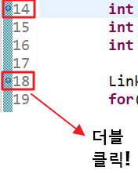
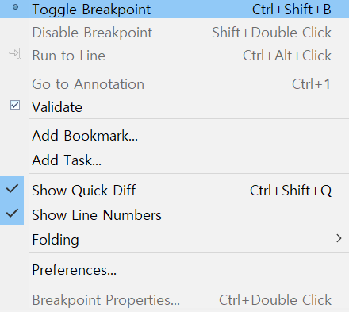
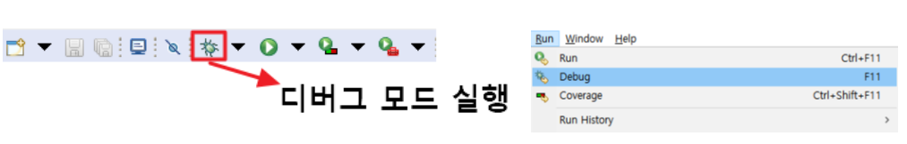
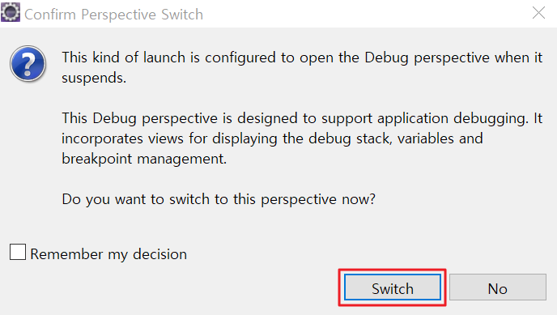
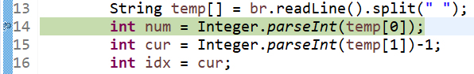
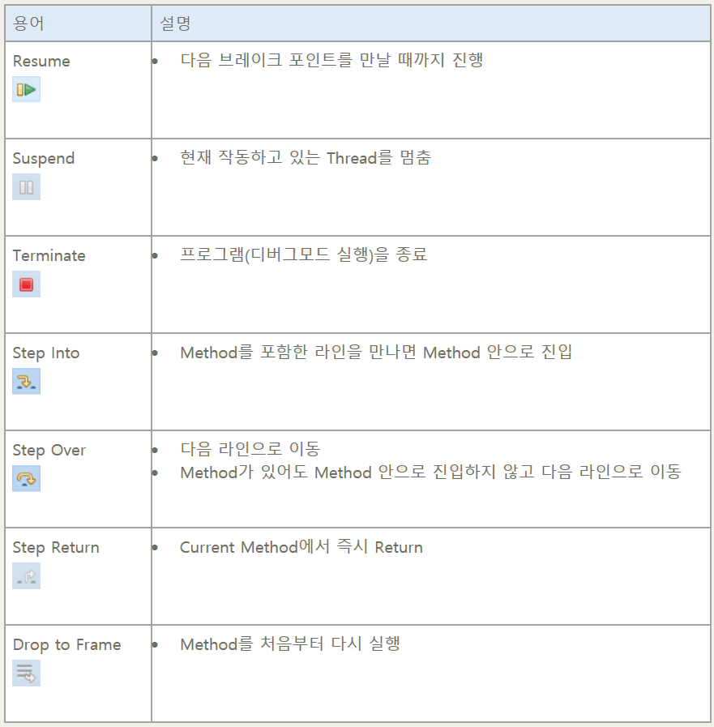
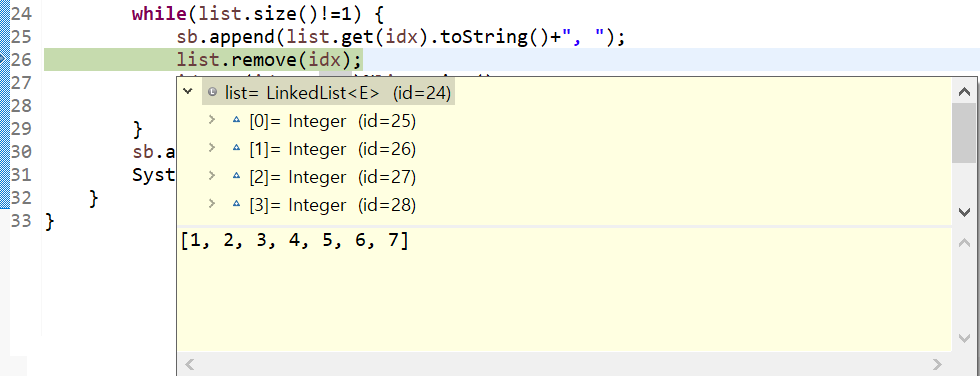
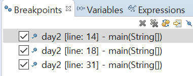
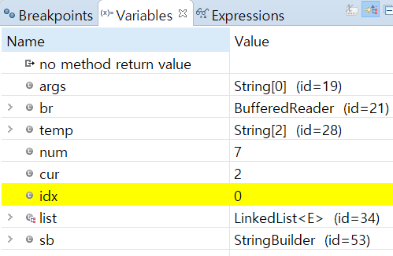
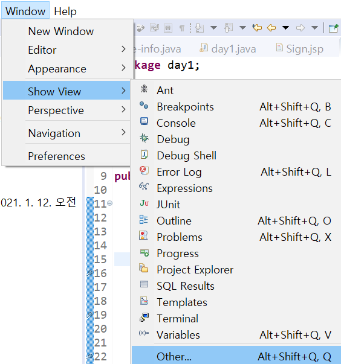

# 이클립스(Eclipse) 디버깅 하는법

> 프로그래밍을 하다 보면 필연적으로 각종 오류에 부딪치게 되고 그 오류를 해결하는 과정에서 디버깅은 필수다. 

## Break Point 지정

|| |
|------|---|
| |  |

디버깅을 진행하기 위해서는 가장 먼저 우선 자신이 조사하고 싶은 시점에 브레이크 포인트를 지정해주어야 한다. 이클립스 좌측 라인에서 오류가 의심가는 부분에 **더블클릭 or 우클릭 -> Toggle Breakpoint**를 누르면 좌측 그림과 같이 조그마한 점이 찍힌다. 이것이 브레이크 포인트다. 반복하면 브레이크 포인트가 해제된다.

## 디버그 모드 실행

디버그 모드를 실행시키려면 상단바에 있는 벌레모양 Debug를 클릭하거나 Run -> Debug를 클릭한다.단축키는 [F11]이다.

디버깅 중 위와 같은 메시지 창이 뜬다면 **Switch**를 눌러 디버깅 모드로 전환하자

## 디버깅 진행

디버깅을 시작하면 위와 같이 브레이크 포인트를 지정한 부분에서 멈추게 된다. 여기서 디버깅을 진행하기 위해서는 자주 사용하는 단축키를 활용하면 도움이 된다.

**Step Into(F5)** : 한 줄씩 진행하되 함수 안이면 함수 안으로 들어갑니다.

**Step Over(F6)** : 한줄씩 진행하되 함수 호출은 건너뜁니다.

**Step Return(F7)** : 현재 함수 끝까지 바로 가서 리턴 후 함수 호출부로 되돌아갑니다.

**Resume(F8)** : 다음 브레이크 포인트까지 건너뜁니다.

### Debug Toolbar 사용법

### 변수의 값

대부분의 사소한 오류들은 자신이 선언해놓은 변수들에 정확한 값이 들어와있는지 검증을 통해 해결이 가능하다. 디버깅 모드를 실행하고 변수에 커서를 가져다 대면 위와 같이 변수에 있는 값들을 확인할 수 있다.

## 디버깅 활용

### 현재 설정되어 있는 Break Point 모두 확인하기

현재 설정되어있는 브레이크 포인트들은 **Breakpoints탭**에서 확인이 가능하다. 어느 프로젝트 어느 라인에 설정이 되어있는지 객관적으로 확인이 가능하다. 주로 가고 싶은 브레이크 포인트를 더블클릭하여 해당 브레이크 포인트로 이동하고 싶을 때 사용하며 체크박스를 해제하여 비활성화도 할 수 있고 우클릭 -> Remove ALL을 눌러 모두 해제할 수도 있다.

### 현재 설정되어있는 변수의 모든 값 확인하기

**Variables탭**에서는 커서가 지나쳐온 모든 변수의 값을 확인하실 수 있다. 마우스 오버로는 하나의 변수밖에 한 번에 확인하실 수 없지만 이 탭에서는 모든 변수들의 값을 확인이 가능하다.

### 특정 변수의 값 확인하기

**Expressions탭**에서는 자신이 확인하고 싶은 특정 변수의 값을 확인할 수 있다. 확인하고 싶은 변수의 값을 추가할 때는 **Add new expression**을 누른 뒤 변수명을 입력하면 된다.

만약 위의 탭이 존재하지 않는다면 **Window -> Show View**에서 활성화시키면 된다.

모든 디버깅은 이 Debug모드에서 하게 된다.

- - -
### [뒤로 가기](./../../..)
