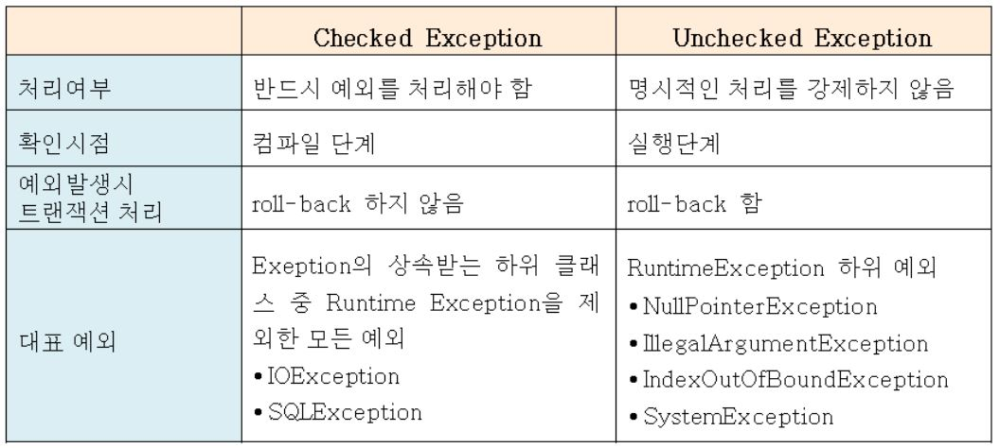
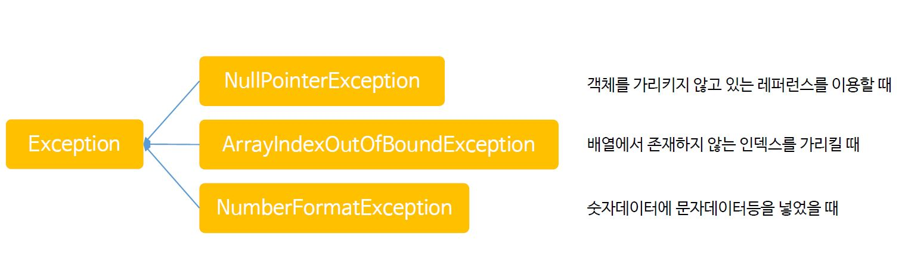

# 자바 프로그래밍 입문 강좌(renew ver.)
> [인프러 강의](https://www.inflearn.com/course/%EC%8B%A4%EC%A0%84-%EC%9E%90%EB%B0%94_java-renew#)를 듣고 내용 정리

> 이 강의는 자바를 입문하기 전에 보면 딱 좋을 강의라고 생각한다.


## 1. JAVA 객체

### 1.1 데이터 은닉

**멤버 변수의 private 설정**

* 멤버 변수(속성)는 주로 private으로 설정해서, 외부로부터 데이터가 변질되는 것을 막는다.

**Setter, Getter**

* 멤버 변수를 외부에서 변경할 수 있도록 하는 메소드 

### 1.2 패키지와 static

**패키지**

* java 프로그램은 많은 클래스로 구성되고, 이러한 클래스를 폴더 형식으로 관리하는 것

**패키지 이름 결정 요령**

* 패키지 이름은 패키지에 속해 있는 클래스가 최대한 다른 클래스와 중복되는 것을 방지하도록 만든다.
* 패키지 이름은 일반적으로 도메인을 거꾸로 이용한다.
* 개발 중에 패키지의 이름과 구조는 변경될 수 있다.
* 패키지 이름만 보고도 해당 패키지 안에 있는 클래스가 어떤 속성과 기능을 가지고 있는 예상이 될 수 있도록 이름을 만든다.

**import**

* 다른 패키지에 있는 클래스를 사용하기 위해 사용하는 키워드

**static**

* 클래스의 속성과 메서드에 **static 키워드**를 사용하면 어디서나 속성과 메서드를 공유할 수 있다.

## 2. JAVA 상속 및 클래스

### 2.1 상속

**상속이란?**

* 부모 클래스를 상속받은 자식(하위) 클래스는 부모(상위) 클래스의 속성과 기능도 이용
* 자바에서는 단일 상속만 지원

**상속의 필요성**

* 기존의 검증된 class를 이용해서 빠르고 쉽게 새로운 class를 만들 수 있다.

**상속 구현**

* `extend키워드`를 이용해서 상속을 구현

**부모 클래스의 private 접근자**

* 자식 클래스는 부모 클래스의 모든 자원을 사용할 수 있지만, private 접근제어자의 속성과 메소드는 사용할 수 없다.

### 2.2 상속 특징

**메서드 오버라이드(override)**

* 부모(상위) 클래스의 기능을 자식(하위) 클래스에서 재정의해서 사용한다.

**자료형(타입)**

* 기본 자료형처럼 클래스도 자료형이다.

**Object 클래스**

* 모든 클래스의 최상위 클래스는 Object 클래스이다.

`ctrl + t` : 상속관계 보기

**super 클래스**

* 상위 클래스를 호출할 때 `super 키워드`를 이용한다.

### 2.3 내부 클래스와 익명 클래스

**내부(inner) 클래스**

* 클래스 안에 또 다른 클래스를 선언하는 것으로 이렇게 하면 두 클래스의 멤버에 쉽게 접근할 수 있다.
* 현재는 실무에서 많이 사용하지 않는 방식이다.

**익명(anonymous) 클래스**

* 이름이 없는 클래스로 주로 메소드를 재정의하는 목적으로 사용된다.
* 익명 클래스는 인터페이스나 추상클래스에서 주로 이용된다.

### 2.4 인터페이스

**인터페이스란?**

* 클래스와 달리 객체를 생성할 수는 없으며, 클래스에서 구현해야 하는 **작업 명세서**

**인터페이스를 사용하는 이유**

* 인터페이스를 사용하는 이유는 많지만, 가장 큰 이유는 객체가 다양한 자료형(타입)을 가질 수 있기 때문이다.

**인터페이스 구현**

* `class` 대신 `interface 키워드`를 사용하며, `extend` 대신 `Implements` 키워드를 이용한다.
* interface를 이용하면 객체가 다양한 자료형(타입)을 가질 수 있다.

### 2.5 추상클래스

**추상클래스란?**

* 클래스의 공통된 부분을 뽑아서 별도의 클래스(추상클래스)로 만들어 놓고, 이것을 상속해서 사용한다.

**abstract 클래스의 특징**

* 멤버변수를 가진다.
* abstract 클래스를 상속하기 위해서는 `extends`를 이용한다.
* abstract 메서드를 가지며, 상속한 클래스에서 반드시 구현해야 한다.
* 일반 메서드도 가질 수 있다.
* 일반 클래스와 마찬가지로 생성자도 있다.

**추상클래스 구현**

* 클래스 상속과 마찬가지로 extends 키워드를 이용해서 상속하고 abstract(추상) 메서드를 구현한다.

**인터페이스 vs 추상클래스**

* 공통점
  * 추상메서드를 가진다.
  * 객체 생성이 불가하여 자료형(타입)으로 사용된다.
* 차이점
  * 인터페이스
    * 상수, 추상메서드만 가진다.
    * 추상 메서드를 구현만 하도록 한다.
    * 다음형을 지원한다.
  * 추상클래스
    * 클래스가 가지는 모든 속성과 기능을 가진다.
    * 추상 메서드 구현 및 상속의 기능을 가진다.
    * 단일 상속만 지원한다.

### 2.6 람다식

**람다식이란?**

* 익명함수(anonymous function)를 이용해서 익명 객체를 생성하기 위한 식이다.

**람다식 구현**

* 람다식은 기본적으로 함수를 만들어 사용한다고 생각하면 된다.

```java
	public static void main(String[] args) {
		
		// 매개변수와 실행문만으로 작성한다.(접근자, 반환형, return 키워드 생략)
		LambdaInterface1 li1 = (String s1, String s2, String s3) -> { System.out.println(s1 + " " + s2 + " " + s3); };
		li1.method("Hello", "java", "World");
		
		System.out.println();
		
		// 매개변수가 1개이거나 타입이 같을 때, 타입을 생략할 수 있다.
		LambdaInterface2 li2 = (s1) -> { System.out.println(s1); };
		li2.method("Hello");
		
		// 실행문이 1개일 때, '{}'를 생략할 수 있다.
		LambdaInterface2 li3 = (s1) -> System.out.println(s1);
		li3.method("Hello");
		
		// 매개변수와 실행문이 1개일 때, '()'와 '{}'를 생략할 수 있다.
		LambdaInterface2 li4 = s1 -> System.out.println(s1);
		li4.method("Hello");
		
		// 매개변수가 없을 때, '()'만 작성한다.		
		LambdaInterface3 li5 = () -> System.out.println("no parameter");
		li5.method();
		
		// 반환값이 있는 경우
		LambdaInterface4 li6 = (x, y) -> {
			int result = x + y;
			return result;
		};
		System.out.printf("li6.method(10, 20) : %d\n", li6.method(10, 20));
		
		li6 = (x, y) -> {
			int result = x * y;
			return result;
		};
		System.out.printf("li6.method(10, 20) : %d\n", li6.method(10, 20));
		
		li6 = (x, y) -> {
			int result = x - y;
			return result;
		};
		System.out.printf("li6.method(10, 20) : %d\n", li6.method(10, 20));
		
	}
```

### 2.7 문자열 클래스

**String 객체와 메모리**

* 문자열을 다루는 String 클래스(객체)는 데이터가 변화하면 메모리상의 변화가 많아 속도가 느리다.
* 문자열이 변경되면 기존의 객체를 버리고, 새로운 객체를 메모리에 생성한다. 이때, 기존 객체는 `GC(가비지컬렉터)`에 의해서 메모리 회수가 이루어진다.

**StringBuffer, StringBuilder**

* String 클래스의 단점을 보완한 클래스로 데이터가 변경되면 메모리에서 기존 객체를 재활용한다.
* 문자열이 변경되면 기존의 객체를 재활용한다.
* 속도는 StringBuilder가 조금 더 빠르며, 데이터 안정성은 StringBuffer가 조금 더 좋다.

```java
	public static void main(String[] args) {
		
		// String
//		String str = "java";
		String str = new String("java");
		str = str + " world";
		System.out.println("str : " + str);
		
		System.out.println();
		
		// StringBuffer
		StringBuffer sf = new StringBuffer("java");
		System.out.println("sf : " + sf);
		
		System.out.println("sf.length() : " + sf.length());	//문자열 길이
		
		sf.append(" world");	//문자열 추가
		System.out.println("sf : " + sf);
		sf.insert(4, "~~~~");	//4번째 문자다음에 삽입
		System.out.println("sf : " + sf);
		sf.insert(sf.length(), "!!"); //문자열끝에 삽입
		System.out.println("sf : " + sf);
		sf.delete(4, 8);	//4번째부터 8번째까지 삭제
		System.out.println("sf : " + sf);
		sf.delete(sf.length()-2, sf.length());	//뒷에서 2번째 문자부터 2글자 삭제
		System.out.println("sf : " + sf);
		sf.deleteCharAt(4);	//4번째 문자 제거
		System.out.println("sf : " + sf);
		
		System.out.println();
		
		// StringBuilder
		StringBuilder sd = new StringBuilder("java");
		sd.append(" world");	//문자열 추가
		System.out.println("sd : " + sd);
		
		System.out.println("sd.length() : " + sd.length());	//문자열 길이
		
		sd.append(" world");	//문자열 추가
		System.out.println("sd : " + sd);
		sd.insert(4, "~~~~"); //4번째 문자다음에 삽입
		System.out.println("sd : " + sd);
		sd.insert(sd.length(), "!!"); //문자열끝에 삽입
		System.out.println("sd : " + sd);
		sd.delete(4, 8); //4번째부터 8번째까지 삭제
		System.out.println("sd : " + sd);
		sd.delete(sd.length()-2, sd.length()); //뒷에서 2번째 문자부터 2글자 삭제
		System.out.println("sd : " + sd);
		sd.deleteCharAt(4); //4번째 문자 제거
		System.out.println("sd : " + sd);
		
		
	}
```

### 2.8 Collections(컬렉션)

**List**

* List는 인터페이스로 이를 구현한 클래스는 인덱스를 이용해서 데이터를 관리한다.
* 인덱스를 이용한다.
* 데이터 중복이 가능하다.

Map

* Map은 인터페이스로 이를 구현한 클래스는 key르 이용해서 데이터를 관리한다.
* key를 이용한다.
* key는 중복될 수 없다.

```java
	public static void main(String[] args) {
		
		// ArrayList 객체 생성
		ArrayList<String> list = new ArrayList<String>();
		
		System.out.println("list.size : " + list.size());
		
		// 데이터 추가
		list.add("Hello");
		list.add("Java");
		list.add("World");
		System.out.println("list.size : " + list.size());
		System.out.println("list : " + list);
		
		list.add(2, "Programing");	// 추가
		System.out.println("list : " + list);
		
		list.set(1, "C");			// 변경
		System.out.println("list : " + list);
		
		// 데이터 추출
		String str = list.get(2);
		System.out.println("list.get(2) : " + str);
		System.out.println("list : " + list);
		
		// 데이터 제거
		str = list.remove(2);
		System.out.println("list.remove(2) : " + str);
		System.out.println("list : " + list);
		
		// 데이터 전체 제거
		list.clear();
		System.out.println("list : " + list);
		
		// 데이터 유무
		boolean b = list.isEmpty();
		System.out.println("list.isEmpty() : " + b);
		
		System.out.println(" ==================================== ");
		
		// HashMap 객체 생성
		HashMap<Integer, String> map = new HashMap<Integer, String>();
		System.out.println("map.size() : " + map.size());
		
		// 데이터 추가
		map.put(5, "Hello");
		map.put(6, "Java");
		map.put(7, "World");
		System.out.println("map : " + map);
		System.out.println("map.size() : " + map.size());
		
		map.put(8, "!!");
		System.out.println("map : " + map);
		
		// 데이터 교체
		map.put(6, "C");
		System.out.println("map : " + map);
		
		// 데이터 추출
		str = map.get(5);
		System.out.println("map.get(5) : " + str);
		
		// 데이터 제거
		map.remove(8);
		System.out.println("map : " + map);
		
		// 특정 데이터 포함 유무
		b = map.containsKey(7);
		System.out.println("map.containsKey(7) : " + b);
		
		b = map.containsValue("World");
		System.out.println("map.containsValue(\"World\") : " + b);
		
		// 데이터 전체 제거
		map.clear();
		System.out.println("map : " + map);
		
		// 데이터 유무
		b = map.isEmpty();
		System.out.println("map.isEmpty() : " + b);
	}
```

## 3. 마무리

### 3.1 예외처리

**예외란?**

* 프로그래밈에 문제가 있는 것을 말하며, 예외로 인해 시스템 동작이 멈추는 것을 막는 것
* 오류(Error) 
  * 시스템에 비정상적인 상황이 생겼을 때 발생(심각한 수준의 오류)
* 예외(Exception) 
  * 개발자가 구현한 로직에서 발생
  * 발생할 상황을 미리 예측하여 처리할 수 있다.
* Checked Exception vs Unchecked(Runtime) Exception  
  * 

* Exception 클래스 하위클래스로 NullPointerException, NumberFormatException 등이 있다.
  * 

**try ~ catch**

* 개발자가 예외처리하기 가장 쉽고, 많이 사용되는 방법
```java
try {
예외가 발생할 수 있는 코드
} catch(Exception e) {
    예외가 발생했을 때 처리할 코드
}
```
* Exception 및 하위 클래스를 이용해서 예외처리를 다양하게 할 수 있다.

**finally**

* 예외 발생 여부에 상관없이 반드시 실행된다.

**throws**

* 예외 발생 시 예외 처리를 직접 하지 않고 호출한 곳으로 넘긴다.

### 3.2 입력과 출력

**입/출력이란?**

* 다른 곳의 데이터를 가져오는 것을 **입력**이라고, 다른 곳으로 데이터를 내보내는 것을 **출력**이라고 한다.
* 입력(Input) : 파일 읽기, 이미지&동영상 불러오기
* 출력(output) : 파일쓰기, 이미지&동영상 내보내기
* 입/출력에 사용되는 기본 클래스는 1byte단위로 데이터를 전송하는 InputStream, OutputStream이 있다.

**FileInputStream/FileOutputStream**

* 파일에 데이터를 읽고/쓰기 위한 클래스로 read(), write() 메서드를 이용한다.
* 파일 입/출력 클래스를 이용해서 파일을 복사할 수 있다.

**DataInputStream, DataOutputStream**

* byte 단위의 입출력을 개선해서 문자열을 좀 더 편리하게 다룰 수 있다.
  
**BufferedReader, BufferedWriter**

* byte 단위의 입출력을 개선해서 문자열을 좀 더 편리하게 다룰 수 있다.

### 3.3 네트워킹

**네트워크 데이터 입력 및 출력**

* 네트워크 대상(객체) 사이에 입/출력(InputStream, OutputStream)를 이용해서 데이터를 입력하고 출력한다.

**소켓**

* 네트워크상에서 데이터를 주고받기 위한 장치
* 서버는 클라이언트를 맞을 준비를 하고 있다가 클라이언트의 요청에 반응한다.
* 클라이언트와 서버는 InputStream, OutputStream을 이용해서 양방향 통신을 할 수 있다.
- - -
### [뒤로 가기](./../../..)

