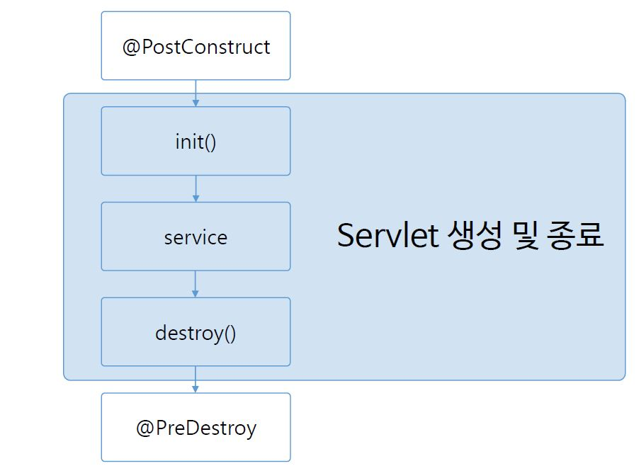
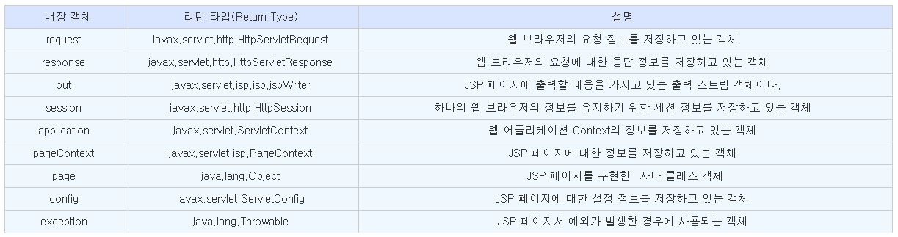
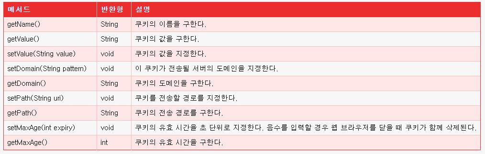
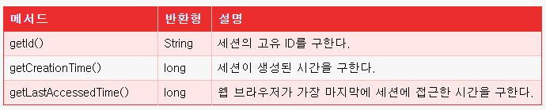

# 실전 JSP(renew ver.)
> [인프런 강의](https://www.inflearn.com/course/%EC%8B%A4%EC%A0%84-jsp_renew#)를 듣고 내용 정리

> 이 강의는 JSP를 입문하기 전에 보면 딱 좋을 강의라고 생각한다.

### 웹프로그램이란?

인터넷 서비스를 이용해서 서로 다른 구성들(PC등)이 통신할 수 있는 프로그램이다.

### 프로토콜이란

* 통신을 하기위한 규약으로 HTTP, FTP, SMTP, POP 등이 있다.
* 

## JSP(Java Server Page)

* HTML 파일 내에 Java 언어를 삽입한 문서
* 동적 웹 어플리케이션 컴포넌트
* .jsp 확장자
* 클라이언트의 요청에 동적으로 작동하고, 응답은 html을 이용
* jsp는 servlet으로 변환되어 실행

### Servlet(Server Applet)

* Java 언어로 이루어진 웹 프로그래밍 문서
* 동적 웹 어플리케이션 컴포넌트
* .java 확장자
* 클라이언트의 요청에 동적으로 동작하고, 응답은 html을 이용
* HttpServlet 클래스를 상속받는다.
  * HttpServlet 클래스 : HTTP 프로토콜의 요청과 응답 처리를 편리하게 한다.

### Context Path

* WAS에서 웹어플리케이션을 구분하기 위한 path
* 이클립스에서 프로젝트를 생성하면, 자동으로 servlet.xml에 추가된다.

### Servlet 처리 과정

* 클라이언트에서 servlet 요청이 들어오면, 서버에서는 servlet 컨테이너를 만들고 요청이 있을 때마다 쓰레드가 생성된다.
* 클라이언트 요청 -> 웹서버 -> WAS -> Servlet Container(쓰레드 생성, 서블릿객체 생성)
* Servlet은 요청이 들어오면 JVM 안에서 쓰레드를 생성하므로 다른 CGI 언어들과 다르게 서버 부하가 적게 발생.(다른 CGI 언어는 요청이 있을 때마다 객체 생성)

### JSP 처리 과정

JSP가 실행되면 컴파일 후 Servlet코드로 변환되어 웹 어플리케이션 서버에서 동작되면서 필요한 기능을 수행한 뒤, 데이터와 웹페이지를 함께 클라이언트로 보여준다.

1. 클라이언트가 어떤 동작을 함으로써 hello.jsp를 요청
2. JSP 컨테이너가 JSP 파일을 읽는다.
3. JSP 컨테이너가 Generete(변환) 작업을 통해 Servlet(.java) 파일을 생성한다.
4. .java 파일은 다시 .class 파일로 컴파일된다.
5. Execute(실행)을 통해 HTML 파일을 생성하여 JSP 컨테이너에게 전달한다.
6. JSP는 HTML 프로토콜을 통해 HTML 페이지를 클라이언트에게 전달한다.

### Servlet 맵핑이란?

* 서블릿의 URL 주소를 보다 쉽고 간결하게 표시하기 위해서 다른 이름을 붙여주는 것

* web.xml 파일 이용

  ```xml
  <web-app xmlns:xsi="http://www.w3.org/2001/XMLSchema-instance" xmlns="http://xmlns.jcp.org/xml/ns/javaee" xsi:schemaLocation="http://xmlns.jcp.org/xml/ns/javaee http://xmlns.jcp.org/xml/ns/javaee/web-app_3_1.xsd" id="WebApp_ID" version="3.1">
    <welcome-file-list>
      <welcome-file>index.html</welcome-file>
      <welcome-file>index.htm</welcome-file>
      <welcome-file>index.jsp</welcome-file>
      <welcome-file>default.html</welcome-file>
      <welcome-file>default.htm</welcome-file>
      <welcome-file>default.jsp</welcome-file>
    </welcome-file-list>
    
    <servlet>
    	<servlet-name>servletEx</servlet-name>
    	<servlet-class>com.servlet.ServletEx</servlet-class>
    </servlet>
    <servlet-mapping>
    	<servlet-name>servletEx</servlet-name>
    	<url-pattern>/SE</url-pattern>
    </servlet-mapping>
     
  </web-app>
  ```

* Java Annotaion을 이용

  ```java
  @WebServlet(name="servletEx", urlPatterns= {"/Hello", "/SE"})
  public class ServletEx extends HttpServlet {
  
  	protected void doGet(HttpServletRequest request, HttpServletResponse response) throws ServletException, IOException {
  		
  		PrintWriter out = response.getWriter();
  		out.print("<html>");
  		out.print("<head><title>ServletEX</title></head>");
  		out.print("<body>");
  		out.print("Hello Servlet~");
  		out.print("</body>");
  		out.print("</html>");
  	}
  
  }
  ```

### Servlet Life-Cycle

* 서블릿은 최초 요청시 객체가 만들어져 메모리에 로딩되고, 그 이후의 요청에는 기존 객체를 재활용한다.
* 
  
  * 서블릿 객체 생성(최초에 한 번)
    * 선처리 할 경우 (@PostConstruct)
  * Init() 호출(최초에 한 번, 초기화 단계)
  * Service(), doGet(), doPost() 호출 (요청 시 매 번, 작업 단계)
  * destroy() 호출(마지막 한 번, 자원해제(servlet수정시, 서버 재가동시), 종료 단계)
    * 후처리 할 경우 (@PreDestrooy)

### form 데이터 처리

* form 태그에서 주요한 속성
  * action : 수신 대상
  * method : 전송 방식
* Get 방식
  * 클라이언트에서 서버로 데이터를 전달할 때, **주소 뒤에 '이름'과 '값'이 결합된 스트링 형태**로 전달
  * 주소창에 쿼리 스트링이 그대로 보여지기 때문에 **보안성이 떨어진다.**
  * 전달되는 데이터가 **255개의 문자**를 초과하면 문제가 발생할 수 있다.
  * **Post방식보다 상대적으로 전송 속도가 빠르다.**
* Post 방식
  * 일정 크기 이상의 데이터를 보내야 할 때 사용한다.
  * 서버로 보내기 전에 인코딩하고, 전송 후 서버에서는 다시 디코딩 작업을 한다.
  * 주소창에 전송하는 데이터의 정보가 노출되지 않아 **Get방식에 비해 보안성이 높다.**
  * 속도가 Get방식보다 느리다.
  * 쿼리스트링(문자열)데이터 뿐만 아니라, 라디오 버튼, 텍스트 박스 같은 **객체들의 값도 전송가능**

### JSP 주요 스크립트

* <%! %> : 선언태그 
  * JSP 페이지에서 Java의 멤버변수 또는 메서드를 선언
* <%-- --%> : 주석태그
  * JSP 주석은 jsp 파일이 서블릿 파일로 변환될 때 제외됨
* <% %> : 스크립트릿태그
  * JSP 페이지에서 Java 코드를 넣기 위한 태그
* <%= %> : 표현식 태그
  * Java의 변수 및 메서드의 반환값을 출력하는 태그
* 지시어 : 서버에서 jsp 페이지를 처리하는 방법에 대한 정의
  * <% page %> : 페이지 기본 설정
  * <% include %> : include file 설정
  * <% taglib %> : 외부라이브러리 태그 설정

### JSP request

* 사용자로부터 데이터를 받아와야 하므로, 보통 form을 사용해서 받아온다.(사용자 -> 서버)

form에서 사용자가 데이터를 입력하고 submit하면, request 객체의 **getParmater 메서드**를 이용해서 form태그의 name값으로 각각 해당하는 데이터를 받아온다.

```html
	<form action="mSignUp.jsp" method="get">
		이름 : <input type="text" name="m_name"> </br>
		비밀번호 : <input type="password" name="m_pass"></br>
		성별 : 남<input type="radio" name="m_gender" value="M" checked="checked">, 여<input type="radio" name="m_gender" value="W"></br>
		취미 : 운동<input type="checkbox" name="m_hobby" value="sport">, 
			  요리<input type="checkbox" name="m_hobby" value="cooking">, 
			  독서<input type="checkbox" name="m_hobby" value="reading">,
			  여행<input type="checkbox" name="m_hobby" value="travel">
			  <input type="submit" value="sign up">
	</form>
```

```jsp
		<%!
			String m_name;
			String m_pass;
			String[] m_hobby;
		%>
		
		<%
			m_name = request.getParameter("m_name");
			m_pass = request.getParameter("m_pass");
			m_hobby = request.getParameterValues("m_hobby");
		%>
		
		m_name : <%= m_name %> </br>
		m_pass : <%= m_pass %> </br>
		m_hobby :
		<%
			for(int i=0; i<m_hobby.length; i++) {
		%>
			<%= m_hobby[i] %>
		<%
			}
		%> 
```

### JSP response

* view 페이지에 응답을 보내주는 역할을 수행(서버 -> 사용자)

**firstPage.jsp**로 접속하면, response 객체의 **sendRedirect 메서드**를 이용하여, **secondPage.jsp**로 이동하게 된다. (요청 -> 응답 처리)

```jsp
    <body>
    
		First Page</br>
		
		<%
			response.sendRedirect("secondPage.jsp");
		%>

    </body>
```

```jsp
    <body>
    
		Second Page

    </body>
```

### JSP 내장객체

* JSP내에서 선언하지 않고 사용할 수 있는 객체
* JSP컨테이너에 의해 Servlet으로 변환시 자동으로 객체가 생성된다.
* 내장 객체의 종류
  * JSP페이지 관련 : page, config
  * 페이지 입출력 관련 : request, response, out
  * 컨텍스트 관련 : session, application, pageContext
  * 에러 관련 : exception


### Servlet 데이터 공유

**Servlet parameter**

```xml
  <servlet>
    <servlet-name>servletEx</servlet-name>
    <servlet-class>com.servlet.ServletEx</servlet-class>
    <init-param>
      <param-name>adminId</param-name>
      <param-value>admin</param-value>
    </init-param>
    <init-param>
      <param-name>adminPw</param-name>
      <param-value>1234</param-value>
    </init-param>
  </servlet>
  <servlet-mapping>
    <servlet-name>servletEx</servlet-name>
    <url-pattern>/se</url-pattern>
  </servlet-mapping>
```

**web.xml**에 초기화할 데이터를 넣어주는 부분은 jsp와 같습니다. 적용할 파일이 Servlet이므로 경로를 패키지명과 클래스명으로 지정해줍니다.

초기화된 데이터를 Servlet의 객체로 가져오면 됩니다.

```java
		String adminId = getServletConfig().getInitParameter("adminId");
		String adminPw = getServletConfig().getInitParameter("adminPw");
		
		PrintWriter out = response.getWriter();
		out.print("<p>adminId : "+ adminId + "</p>");
		out.print("<p>adminPw : "+ adminPw + "</p>");
```

getServletConfig()로 config 객체를 가져온 다음, getInitParmeter()로 초기화한 파라미터를 가져올 수 있다.

**context parameter**

* Servlet 초기화 파라미터와 달리 여러 Servlet에서 특정 데이터를 공유해야할 경우,
* context parameter를 이용해서 **web.xml**에 기술하고 Servlet에서 공유하면서 사용할 수 있다.

```xml
  <context-param>
    <param-name>imgDir</param-name>
    <param-value>/upload/img</param-value>
  </context-param>
  <context-param>
    <param-name>testServerIP</param-name>
    <param-value>127.0.0.1</param-value>
  </context-param>
```

이렇게 설정한 context-param을 Servlet에서 불러오는 객체를 생성하는 방법은 getServletContext()를 호출하면 됩니다. 

```java
String imgDir = getServletContext().getInitParameter("imgDir");
String testServerIP = getServletContext().getInitParameter("testServerIP");
```

그 다음에 getInitParmeter()로 초기화한 파라미터를 가져옵니다.

### Cookie

* 웹 브라우저가 보관하고 있는 데이터로, 웹 서버에 요청을 보낼 때 쿠키를 함께 전송한다.
* 웹 서버는 전송받은 쿠키를 사용하여 필요한 데이터를 읽어올 수 있다.
* 웹 브라우저는 쿠키가 삭제되기 전까지 웹 서버에 쿠키를 전송한다.
* 연결이 끊겼을 때 어떤 정보를 지속적으로 사용하기 위한 수단으로 쿠키 사용
* 쿠키는 서버에서 생성하여 클라이언트 단에 특정 정보를 저장한다.
* 서버에 요청할 때마다 쿠키의 속성값을 참조하거나 변경할 수 있다.
* 쿠키의 용량은 4kb로 제한되며, 300개까지 데이터 정보를 가질 수 있다.


### Cookie 구현

**login.jsp**

```jsp
		<%
			Cookie[] cookies = request.getCookies();
			System.out.println("cookies : " + cookies);
		
			if(cookies != null) {
				for(Cookie c : cookies) {
					if(c.getName().equals("memberId")) {
						response.sendRedirect("loginOk.jsp");
					}
				}
			}
		%>
		
		<form action="loginCon" method="post">
		
			ID : <input type="text" name="mID"></br>
			PW : <input type="password" name="mPW"></br>
			<input type="submit" value="login">
		
		</form>
```

**LoginCon.java**

```java
@WebServlet("/loginCon")
public class LoginCon extends HttpServlet {


	protected void doGet(HttpServletRequest request, HttpServletResponse response) throws ServletException, IOException {
		
		PrintWriter out = response.getWriter();
		
		String mId = request.getParameter("mID");
		String mPw = request.getParameter("mPW");
		
		out.print("mId : " + mId);
		out.print("mPw : " + mPw);
		
		Cookie[] cookies = request.getCookies();
		Cookie cookie = null;
		
		for (Cookie c : cookies) {
			
			System.out.println("c.getName() : " + c.getName() + ", c.getValue() : " + c.getValue());
			
			if(c.getName().equals("memberId")) {
				cookie = c;
			}
		}
		
		if(cookie == null) {
			System.out.println("cookie is null");
			cookie = new Cookie("memberId", mId);
		}
		
		response.addCookie(cookie);
		cookie.setMaxAge(60*60);
		
		response.sendRedirect("loginOk.jsp");
		
	}
```

**loginOk.jsp**

```jsp
		<%
		
			Cookie[] cookies = request.getCookies();
			for(Cookie c : cookies) {
				out.print("name : " + c.getName() + "</br>");
				out.print("value : " + c.getValue() + "</br></br>");
			}
		
		%>
```

### Session

* 쿠키와 달리 웹 브라우저에 정보를 보관하는 것이 아니라, 웹 컨테이너에 정보를 보관할 때 사용
* 오직 서버에서만 생성된다.
* 하나의 웹 브라우저에 하나의 세션을 생성한다.
* 웹 브라우저의 여러 요청을 처리하는 JSP 페이지 사이에서 공유되므로 일 대 일 매핑되는 값을 저장할 때 사용
* 세션이 쿠키보다 보안에 앞서고, 쿠키 설정 여부에 상관없이 사용이 가능하다.
* 브라우저 하나 당 하나의 Session 객체가 생성되고 고유의 id 값이 있다.


### Session 구현

**login.jsp**

```jsp
		<%
			if(session.getAttribute("memberId") != null)
				response.sendRedirect("loginOk.jsp");
		%>
		
		<form action="loginCon" method="post">
		
			ID : <input type="text" name="mID"></br>
			PW : <input type="password" name="mPW"></br>
			<input type="submit" value="login">
		
		</form>
```

**LoginCon.java**

```java
@WebServlet("/loginCon")
public class LoginCon extends HttpServlet {


	protected void doGet(HttpServletRequest request, HttpServletResponse response) throws ServletException, IOException {
		
		PrintWriter out = response.getWriter();
		
		String mId = request.getParameter("mID");
		String mPw = request.getParameter("mPW");
		
		out.print("mId : " + mId);
		out.print("mPw : " + mPw);
		
		HttpSession session = request.getSession();
		session.setAttribute("memberId", mId);
		
		response.sendRedirect("loginOk.jsp");
		
	}
```

**loginOk.jsp**

```jsp
		
		<%
			session = request.getSession();	
			out.print("memberId : " + session.getAttribute("memberId") + "</br>");
		%>
		
		<form action="logoutCon" method="post">
			<input type="submit" value="logout">
		</form>
```

**LogoutCon.java**

```java
@WebServlet("/logoutCon")
public class LogoutCon extends HttpServlet {


	protected void doGet(HttpServletRequest request, HttpServletResponse response) throws ServletException, IOException {
		
		HttpSession session = request.getSession();
		session.invalidate();
		
		response.sendRedirect("login.jsp");
		
	}

```

### 한글처리

JSP에서 한글을 입력할 경우 깨지는 경우가 있는 GET/POST 등 전송 방식에 따라 처리를 해줘야 한다.

* post방식 : 서블릿에 request.setCharacterEncoding("UTF-8");
* get방식 : get : server.xml에 `<Connector URIEncoding="UTF-8"/>` 추가
* 필터 

  * 클라이언트와 서버 사이에서 request와 response객체를 필터가 먼저 받아 사전/사후 작업 등 공통적으로 필요한 부분을 처리

  ```xml
  <filter>
      <filter-name>setCharacterEncodingFilter</filter-name>
      <filter-class>org.apache.catalina.filters.SetCharacterEncodingFilter</filter-class>
      <init-param>
          <param-name>encoding</param-name>
          <param-value>UTF-8</param-value>
      </init-param>
      <async-supported>true</async-supported>
  </filter>
  ```

### JDBC

* Java 프로그램에서 SQL문을 실행하여 데이터를 관리하기 위한 Java API
* 다양한 데이터베이스에 대해서 별도의 프로그램을 만들 필요 없이, JDBC를 이용하면 하나의 프로그램으로 데이터베이스를 관리할 수 있다.

### JDBC 실행 순서

1. JDBC 드라이버 로드 - DriverManager
   * MySQL 드라이버 로딩
     * `Class.forName("com.mysql.jdbc.Driver");`
   * Oracle 드라이버 로딩
     * `Class.forName("oracle.jdbc.driver.OracleDriver");`
2. 데이터베이스 연결 - Connection 객체 생성
   * `DriverManager.getConnection(JDBC URL, 계정아이디, 비밀번호);`
3. SQL문 실행 - Statement 객체 생성
   * sql 쿼리를 생성/실행하며, 반환된 결과를 가져오게 할 작업 영역을 제공한다.
   * `connection.createStatment();`
4. Query 수행
   * Statement 객체가 생성되면 Statement 객체의 `executeQuery()` 메소드나 `executeUpdate()` 메소드를 사용해서 쿼리를 처리
     * `statement.executeQuery()` - SQL문 실행 후 여러 개의 결과값이 나올 때 사용 (select), 반환형은 resultSet
     * `statement.executeUpdate()` - SQL문 실행 후 테이블의 내용만 변경되는 경우 사용 (insert, delete, update), 반환형은 int
5. ResultSet 처리
   * `executeQuery()` 메소드는 결과로 ResultSet을 반환한다. 이 ResultSet으로부터 원하는 데이터를 추출하는 과정이다.
   * ResultSet의 첫 번째 필드는 1부터 시작한다.
   * 한 행이 처리되고 다음 행으로 이동 시 next() 메소드를 사용한다.
6. 데이터베이스 연결 해제 - close();

### PreparedStatement 객체

* 동일한 질의문을 특정 값만 바꾸어서 여러 번 실행해야 할 때, 많은 데이터를 다루기 때문에 질의문을 정리해야 할 필요가 있을 때, 인수가 많아서 질의문을 정리해야 될 필요가 있을 때 사용

```java
try {
			Class.forName(driver);
			
			con = DriverManager.getConnection(url, id, pw);
			String sql = "UPDATE book SET book_loc = ? WHERE book_name = ?";
					
			pstmt = con.prepareStatement(sql);
			pstmt.setString(1, "001-00007123");
			pstmt.setString(2, "book7");
			
			int result = pstmt.executeUpdate();
			
			if(result == 1) {
				out.print("UPDATE success!!");
			} else {
				out.print("UPDATE fail!!");
			}
			
		} catch (Exception e) {
			e.printStackTrace();
		} finally {
			try {
				if(pstmt != null) pstmt.close();
				if(con != null) con.close();
			} catch (Exception e2) {
				e2.printStackTrace();
			}
		}
```

### DAO, DTO란?

* DAO(Data Access Object) 
  * 데이터베이스에 접속해서 데이터 추가, 삭제, 수정 등의 작업을 하는 클래스
* DTO(Data Transfer Object)
  * 데이터베이스에 있는 데이터의 형태와 웹서버의 Java에서 관리하는 데이터의 형태가 다르기 때문에 데이터의 형태를 같게 만들어주는 객체

### DBCP(Data Base Connection Pool)

* 클라이언트에서 다수의 요청이 발생할 경우 데이터베이스에 부하가 발생
* 이러한 문제를 해결하기 위해 미리 커넥션 객체들을 만들어 놓는 커넥션 풀 기법을 사용

### DBCP 사용하기

* tomcat container가 데이터베이스 인증을 하도록 context.xml 파일을 열어 아래의 코드를 추가

```xml
<Resource
          auth = "Container"
          driverClassName = "oracle.jdbc.driver.OracleDriver"
          url = "jdbc:oracle:thin:@localhost:1521:xe"
          username = "scott"
          password = "tiger"
          name = "jdbc/Oracle11g"
          type = "javax.sql.DataSource"
          maxActive = "4"
          maxWait = "10000"
          />
```

* 직접 OracleDriver를 로드하던 방식에서 커넥션 풀을 활용하는 방식으로 사용

  * 직접 driver 로드할 때

    * `Class.forName("oracle.jdbc.driver.OracleDriver");`

  * 커넥션 풀 활용

    ```java
    		try {
    //			Class.forName(driver);
    			Context context = new InitialContext();
    			dataSource = (DataSource)context.lookup("java:comp/env/jdbc/Oracle11g");
                //con = DriverManager.getConnection(url, id, pw);
    			con = dataSource.getConnection();
    		} catch (Exception e) {
    			e.printStackTrace();
    		}
    ```

    

- - -
### [뒤로 가기](./../../..)
